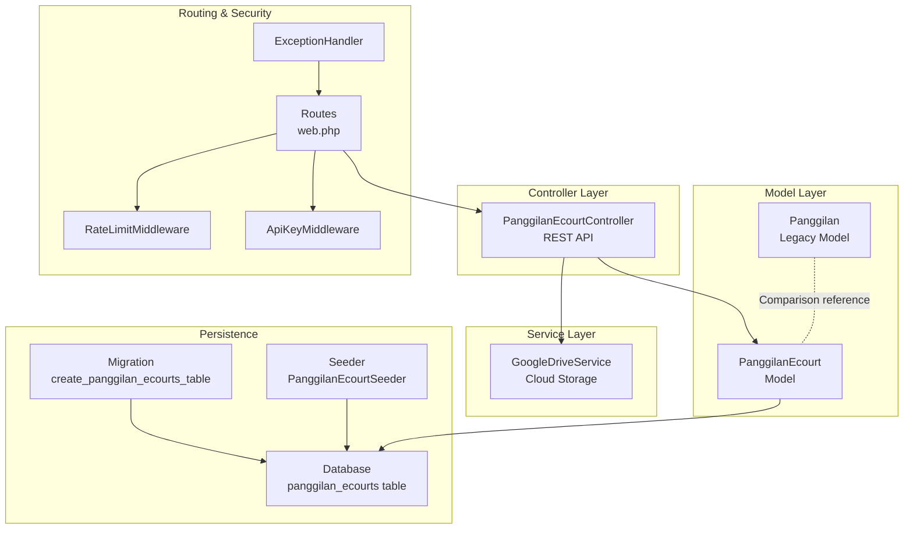
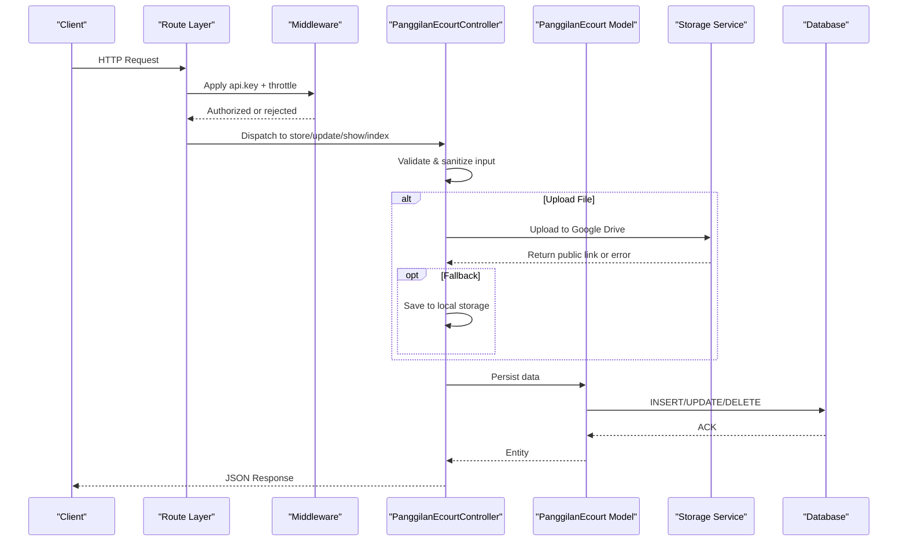
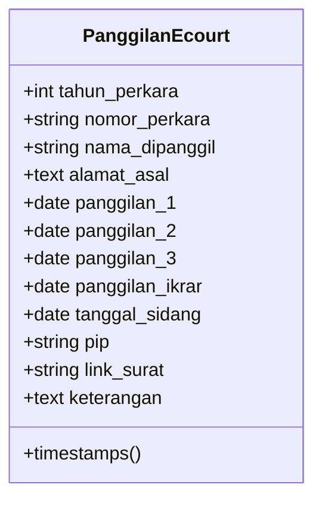
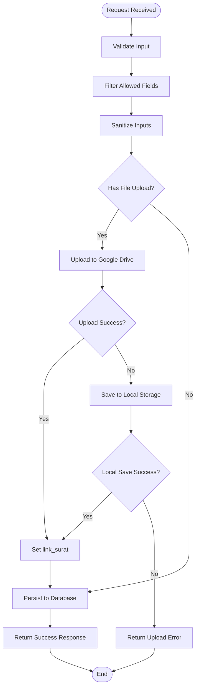
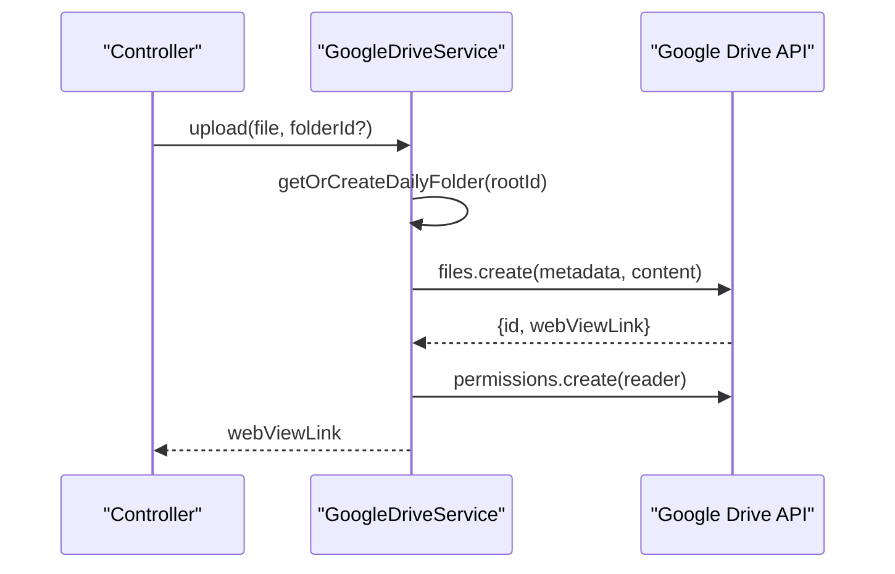
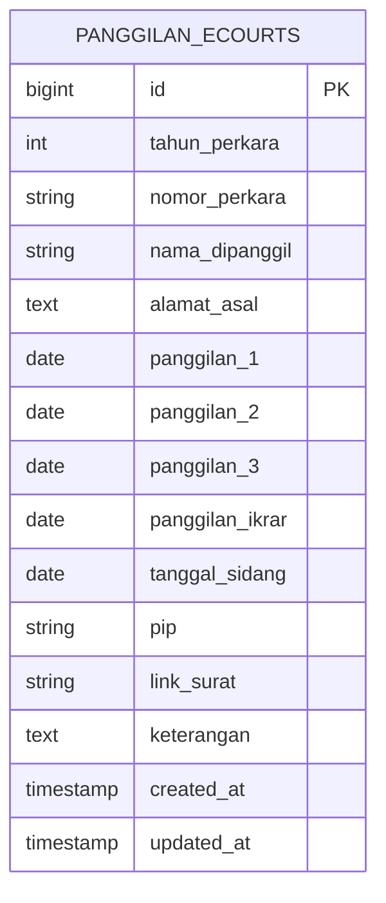
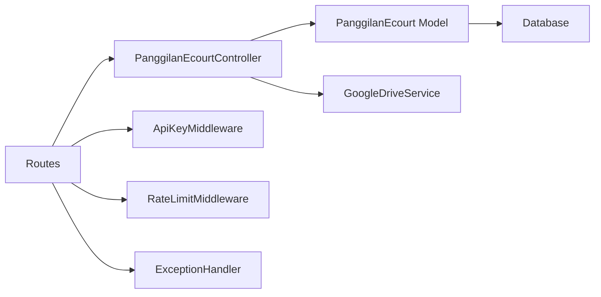

# Panggilan e-Court Model

<cite>
**Referenced Files in This Document**
- [PanggilanEcourt.php](file://app/Models/PanggilanEcourt.php)
- [PanggilanEcourtController.php](file://app/Http/Controllers/PanggilanEcourtController.php)
- [GoogleDriveService.php](file://app/Services/GoogleDriveService.php)
- [2026_01_25_162515_create_panggilan_ecourts_table.php](file://database/migrations/2026_01_25_162515_create_panggilan_ecourts_table.php)
- [PanggilanEcourtSeeder.php](file://database/seeders/PanggilanEcourtSeeder.php)
- [web.php](file://routes/web.php)
- [ApiKeyMiddleware.php](file://app/Http/Middleware/ApiKeyMiddleware.php)
- [RateLimitMiddleware.php](file://app/Http/Middleware/RateLimitMiddleware.php)
- [Handler.php](file://app/Exceptions/Handler.php)
- [Panggilan.php](file://app/Models/Panggilan.php)
</cite>

## Table of Contents
1. [Introduction](#introduction)
2. [Project Structure](#project-structure)
3. [Core Components](#core-components)
4. [Architecture Overview](#architecture-overview)
5. [Detailed Component Analysis](#detailed-component-analysis)
6. [Dependency Analysis](#dependency-analysis)
7. [Performance Considerations](#performance-considerations)
8. [Security and Compliance](#security-and-compliance)
9. [Troubleshooting Guide](#troubleshooting-guide)
10. [Conclusion](#conclusion)

## Introduction
This document describes the Panggilan e-Court model that powers digital case management for online legal proceedings. It covers the model's structure for tracking electronic summonses, managing digital notifications, and integrating with online court systems. The model differs from traditional panggilan records by adding support for digital document storage, flexible scheduling metadata, and e-court-specific fields such as the Petugas Informasi Pengadilan (PIP) indicator and structured case tracking.

Key digital transformation aspects include:
- Electronic case tracking with multiple notification stages (call 1, call 2, call 3, and acknowledgment)
- Digital document handling via cloud storage integration with automatic fallback
- Online scheduling indicators and metadata for court sessions
- Secure APIs with rate limiting, API key protection, and sanitized input validation

## Project Structure
The e-court module is organized around a dedicated model, controller, migration, seeder, and supporting services:

**Diagram sources**
- [PanggilanEcourt.php:1-33](file://app/Models/PanggilanEcourt.php#L1-L33)
- [PanggilanEcourtController.php:1-337](file://app/Http/Controllers/PanggilanEcourtController.php#L1-L337)
- [GoogleDriveService.php:1-117](file://app/Services/GoogleDriveService.php#L1-L117)
- [2026_01_25_162515_create_panggilan_ecourts_table.php:1-39](file://database/migrations/2026_01_25_162515_create_panggilan_ecourts_table.php#L1-L39)
- [PanggilanEcourtSeeder.php:1-362](file://database/seeders/PanggilanEcourtSeeder.php#L1-L362)
- [web.php:1-165](file://routes/web.php#L1-L165)
- [ApiKeyMiddleware.php:1-41](file://app/Http/Middleware/ApiKeyMiddleware.php#L1-L41)
- [RateLimitMiddleware.php:1-49](file://app/Http/Middleware/RateLimitMiddleware.php#L1-L49)
- [Handler.php:1-134](file://app/Exceptions/Handler.php#L1-L134)
- [Panggilan.php:1-55](file://app/Models/Panggilan.php#L1-L55)

**Section sources**
- [PanggilanEcourt.php:1-33](file://app/Models/PanggilanEcourt.php#L1-L33)
- [PanggilanEcourtController.php:1-337](file://app/Http/Controllers/PanggilanEcourtController.php#L1-L337)
- [2026_01_25_162515_create_panggilan_ecourts_table.php:1-39](file://database/migrations/2026_01_25_162515_create_panggilan_ecourts_table.php#L1-L39)
- [PanggilanEcourtSeeder.php:1-362](file://database/seeders/PanggilanEcourtSeeder.php#L1-L362)
- [web.php:1-165](file://routes/web.php#L1-L165)

## Core Components
- Model: Defines fillable attributes, type casting for date fields, and the table mapping for the e-court dataset.
- Controller: Implements CRUD operations with strict validation, sanitization, pagination, and dual-storage upload handling (cloud and fallback).
- Migration: Creates the database schema with indexed year, nullable call dates, and optional metadata fields.
- Seeder: Provides realistic test data including multiple call stages and document links.
- Services: Integrates with Google Drive for document storage with daily folder organization and public link generation.
- Routing & Security: Exposes public read endpoints and protected write endpoints behind API key and rate limiting.

**Section sources**
- [PanggilanEcourt.php:9-31](file://app/Models/PanggilanEcourt.php#L9-L31)
- [PanggilanEcourtController.php:14-27](file://app/Http/Controllers/PanggilanEcourtController.php#L14-L27)
- [2026_01_25_162515_create_panggilan_ecourts_table.php:13-28](file://database/migrations/2026_01_25_162515_create_panggilan_ecourts_table.php#L13-L28)
- [PanggilanEcourtSeeder.php:18-301](file://database/seeders/PanggilanEcourtSeeder.php#L18-L301)
- [GoogleDriveService.php:38-82](file://app/Services/GoogleDriveService.php#L38-L82)
- [web.php:24-96](file://routes/web.php#L24-L96)

## Architecture Overview
The system follows a layered architecture with explicit separation of concerns:

**Diagram sources**
- [web.php:78-96](file://routes/web.php#L78-L96)
- [ApiKeyMiddleware.php:14-39](file://app/Http/Middleware/ApiKeyMiddleware.php#L14-L39)
- [RateLimitMiddleware.php:15-39](file://app/Http/Middleware/RateLimitMiddleware.php#L15-L39)
- [PanggilanEcourtController.php:117-201](file://app/Http/Controllers/PanggilanEcourtController.php#L117-L201)
- [GoogleDriveService.php:38-82](file://app/Services/GoogleDriveService.php#L38-L82)
- [PanggilanEcourt.php:1-33](file://app/Models/PanggilanEcourt.php#L1-L33)

## Detailed Component Analysis

### Model: PanggilanEcourt
The model encapsulates the e-court case record with:
- Integer year field for indexing and filtering
- Case number, defendant name, and address
- Up to three call dates plus acknowledgment date
- Court session date and optional PIP indicator
- Optional document link and free-form notes
- Type casting for consistent date handling

**Diagram sources**
- [PanggilanEcourt.php:9-31](file://app/Models/PanggilanEcourt.php#L9-L31)

**Section sources**
- [PanggilanEcourt.php:9-31](file://app/Models/PanggilanEcourt.php#L9-L31)
- [2026_01_25_162515_create_panggilan_ecourts_table.php:13-28](file://database/migrations/2026_01_25_162515_create_panggilan_ecourts_table.php#L13-L28)

### Controller: PanggilanEcourtController
The controller implements secure CRUD operations:
- Public endpoints for listing, filtering by year, and retrieving single records
- Protected endpoints for creation, updates, and deletion requiring API key
- Strict validation rules for all inputs
- Input sanitization excluding specific fields that require raw values
- Pagination with configurable limits
- Dual-storage upload handling with Google Drive as primary and local fallback
- Comprehensive error handling and logging

**Diagram sources**
- [PanggilanEcourtController.php:117-201](file://app/Http/Controllers/PanggilanEcourtController.php#L117-L201)
- [PanggilanEcourtController.php:206-304](file://app/Http/Controllers/PanggilanEcourtController.php#L206-L304)

**Section sources**
- [PanggilanEcourtController.php:32-59](file://app/Http/Controllers/PanggilanEcourtController.php#L32-L59)
- [PanggilanEcourtController.php:64-84](file://app/Http/Controllers/PanggilanEcourtController.php#L64-L84)
- [PanggilanEcourtController.php:89-112](file://app/Http/Controllers/PanggilanEcourtController.php#L89-L112)
- [PanggilanEcourtController.php:117-201](file://app/Http/Controllers/PanggilanEcourtController.php#L117-L201)
- [PanggilanEcourtController.php:206-304](file://app/Http/Controllers/PanggilanEcourtController.php#L206-L304)
- [PanggilanEcourtController.php:309-334](file://app/Http/Controllers/PanggilanEcourtController.php#L309-L334)

### Storage Integration: GoogleDriveService
The service integrates with Google Drive for document storage:
- Uses configured credentials and refresh tokens
- Creates or finds a daily subfolder under a root folder
- Uploads files with metadata and sets public read permissions
- Returns a web view link for document retrieval
- Includes robust error handling and fallback mechanisms

**Diagram sources**
- [GoogleDriveService.php:38-82](file://app/Services/GoogleDriveService.php#L38-L82)
- [PanggilanEcourtController.php:142-192](file://app/Http/Controllers/PanggilanEcourtController.php#L142-L192)

**Section sources**
- [GoogleDriveService.php:14-22](file://app/Services/GoogleDriveService.php#L14-L22)
- [GoogleDriveService.php:38-82](file://app/Services/GoogleDriveService.php#L38-L82)
- [PanggilanEcourtController.php:142-192](file://app/Http/Controllers/PanggilanEcourtController.php#L142-L192)

### Database Schema: Migration
The migration defines the persistence structure:
- Indexed integer year for efficient filtering
- String case number with length and pattern constraints
- Nullable call dates and acknowledgment date
- Optional PIP indicator and document link
- Free-form notes and timestamps

**Diagram sources**
- [2026_01_25_162515_create_panggilan_ecourts_table.php:13-28](file://database/migrations/2026_01_25_162515_create_panggilan_ecourts_table.php#L13-L28)

**Section sources**
- [2026_01_25_162515_create_panggilan_ecourts_table.php:13-28](file://database/migrations/2026_01_25_162515_create_panggilan_ecourts_table.php#L13-L28)

### Data Seeding: Test Cases
The seeder provides realistic test data:
- Multiple years and case numbers
- Mixed call stage completions
- Document links to external resources
- Notes indicating document types (e.g., "Surat Panggilan", "Relaas Pemberitahuan")

**Section sources**
- [PanggilanEcourtSeeder.php:18-301](file://database/seeders/PanggilanEcourtSeeder.php#L18-L301)

### Routing and Access Control
Public and protected endpoints are clearly separated:
- Public endpoints: GET /api/panggilan-ecourt, GET /api/panggilan-ecourt/{id}, GET /api/panggilan-ecourt/tahun/{tahun}
- Protected endpoints: POST/PUT/DELETE /api/panggilan-ecourt with API key requirement
- Rate limiting applied to all endpoints
- CORS and security headers enforced on all responses

**Section sources**
- [web.php:24-27](file://routes/web.php#L24-L27)
- [web.php:78-96](file://routes/web.php#L78-L96)
- [ApiKeyMiddleware.php:14-39](file://app/Http/Middleware/ApiKeyMiddleware.php#L14-L39)
- [RateLimitMiddleware.php:15-39](file://app/Http/Middleware/RateLimitMiddleware.php#L15-L39)
- [Handler.php:36-56](file://app/Exceptions/Handler.php#L36-L56)

## Dependency Analysis
The e-court module exhibits low coupling and high cohesion:
- Controller depends on Model and Storage Service
- Model depends on Eloquent ORM
- Storage Service depends on Google APIs
- Routes depend on Controller actions
- Middleware enforces cross-cutting security policies

**Diagram sources**
- [web.php:24-96](file://routes/web.php#L24-L96)
- [PanggilanEcourtController.php:1-337](file://app/Http/Controllers/PanggilanEcourtController.php#L1-L337)
- [PanggilanEcourt.php:1-33](file://app/Models/PanggilanEcourt.php#L1-L33)
- [GoogleDriveService.php:1-117](file://app/Services/GoogleDriveService.php#L1-L117)
- [ApiKeyMiddleware.php:1-41](file://app/Http/Middleware/ApiKeyMiddleware.php#L1-L41)
- [RateLimitMiddleware.php:1-49](file://app/Http/Middleware/RateLimitMiddleware.php#L1-L49)
- [Handler.php:1-134](file://app/Exceptions/Handler.php#L1-L134)

**Section sources**
- [web.php:24-96](file://routes/web.php#L24-L96)
- [PanggilanEcourtController.php:1-337](file://app/Http/Controllers/PanggilanEcourtController.php#L1-L337)
- [PanggilanEcourt.php:1-33](file://app/Models/PanggilanEcourt.php#L1-L33)
- [GoogleDriveService.php:1-117](file://app/Services/GoogleDriveService.php#L1-L117)
- [ApiKeyMiddleware.php:1-41](file://app/Http/Middleware/ApiKeyMiddleware.php#L1-L41)
- [RateLimitMiddleware.php:1-49](file://app/Http/Middleware/RateLimitMiddleware.php#L1-L49)
- [Handler.php:1-134](file://app/Exceptions/Handler.php#L1-L134)

## Performance Considerations
- Pagination limits prevent memory exhaustion during bulk queries
- Indexed year field supports efficient filtering
- File upload operations are asynchronous and logged
- Cache-backed rate limiting reduces database overhead
- Type casting ensures consistent date handling and reduces parsing overhead

[No sources needed since this section provides general guidance]

## Security and Compliance
- API key enforcement with timing-safe comparison prevents brute-force attacks
- Rate limiting mitigates abuse and DDoS risks
- Input validation and sanitization protect against injection
- Exception handler strips sensitive details from production responses
- CORS policy restricts origins to trusted domains
- File uploads validated by MIME types and size limits
- Dual-storage fallback ensures resilience while maintaining audit trails

**Section sources**
- [ApiKeyMiddleware.php:14-39](file://app/Http/Middleware/ApiKeyMiddleware.php#L14-L39)
- [RateLimitMiddleware.php:15-39](file://app/Http/Middleware/RateLimitMiddleware.php#L15-L39)
- [PanggilanEcourtController.php:120-133](file://app/Http/Controllers/PanggilanEcourtController.php#L120-L133)
- [Handler.php:36-56](file://app/Exceptions/Handler.php#L36-L56)
- [web.php:48-56](file://routes/web.php#L48-L56)

## Troubleshooting Guide
Common issues and resolutions:
- Unauthorized access: Verify X-API-Key header matches configured value
- Too many requests: Respect Retry-After header and reduce request frequency
- Validation failures: Ensure input matches allowed patterns and sizes
- Upload failures: Check Google Drive credentials and network connectivity; confirm fallback local storage permissions
- Resource not found: Confirm record ID exists and endpoint path is correct

**Section sources**
- [ApiKeyMiddleware.php:14-39](file://app/Http/Middleware/ApiKeyMiddleware.php#L14-L39)
- [RateLimitMiddleware.php:22-28](file://app/Http/Middleware/RateLimitMiddleware.php#L22-L28)
- [PanggilanEcourtController.php:120-133](file://app/Http/Controllers/PanggilanEcourtController.php#L120-L133)
- [PanggilanEcourtController.php:142-192](file://app/Http/Controllers/PanggilanEcourtController.php#L142-L192)
- [Handler.php:72-82](file://app/Exceptions/Handler.php#L72-L82)

## Conclusion
The Panggilan e-Court model modernizes legal case management by introducing digital document handling, structured case tracking, and secure API access. Its design emphasizes security, scalability, and resilience through middleware enforcement, dual storage, and robust error handling. Compared to traditional panggilan records, the e-court model adds flexibility for online scheduling, enhanced metadata, and seamless integration with e-court systems.

[No sources needed since this section summarizes without analyzing specific files]