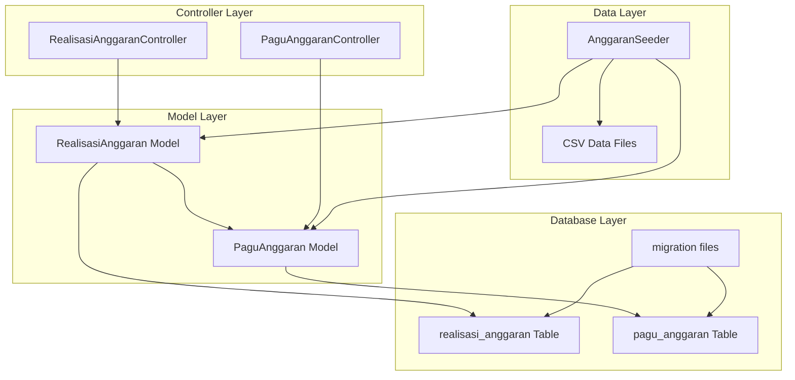
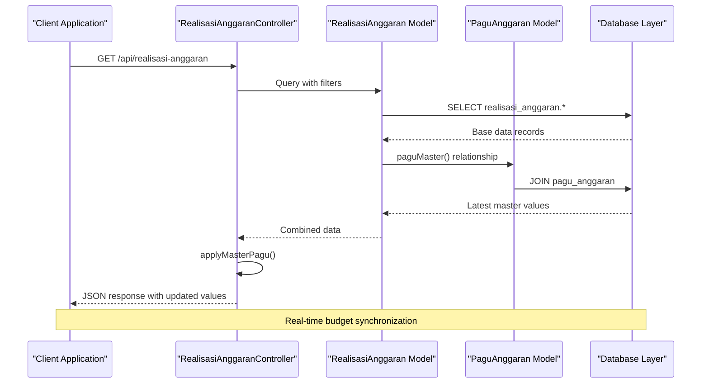
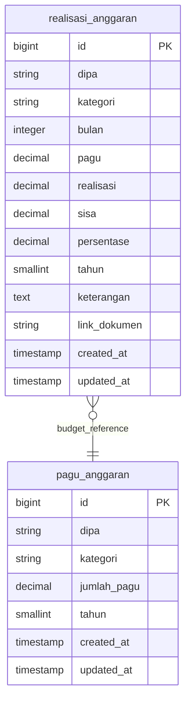
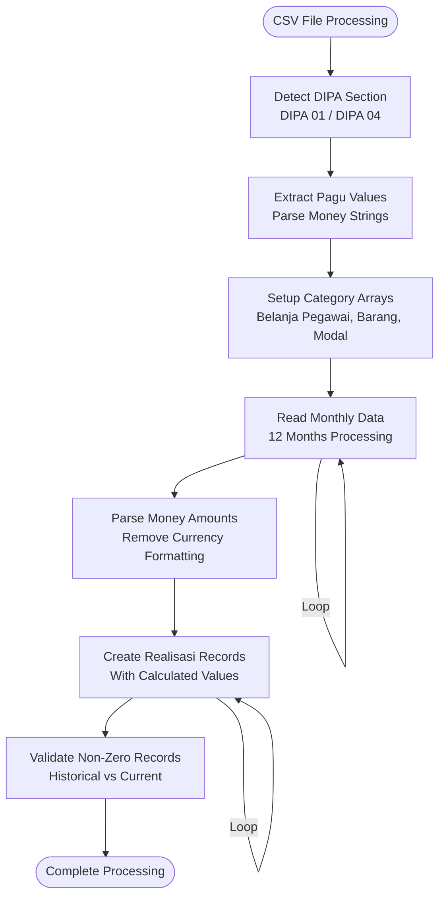
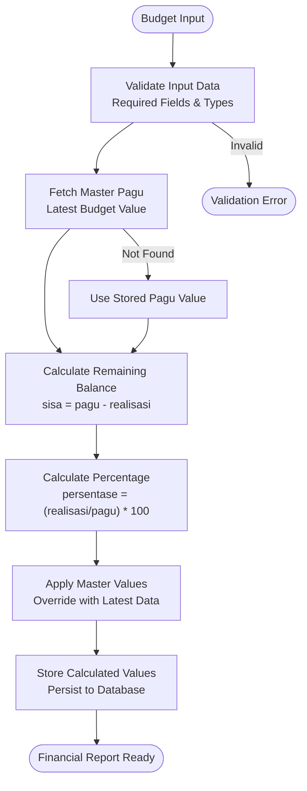
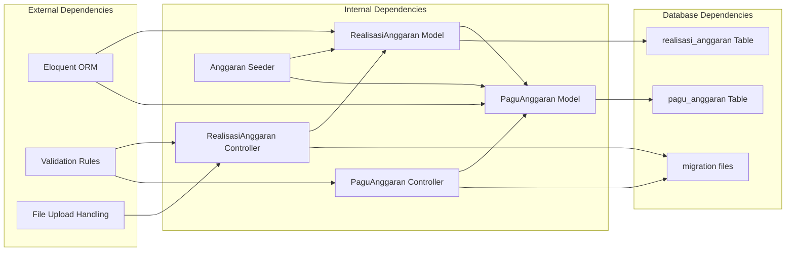

# Realisasi Anggaran Model

<cite>
**Referenced Files in This Document**
- [RealisasiAnggaran.php](file://app/Models/RealisasiAnggaran.php)
- [PaguAnggaran.php](file://app/Models/PaguAnggaran.php)
- [RealisasiAnggaranController.php](file://app/Http/Controllers/RealisasiAnggaranController.php)
- [PaguAnggaranController.php](file://app/Http/Controllers/PaguAnggaranController.php)
- [2026_02_10_000000_create_realisasi_anggaran_table.php](file://database/migrations/2026_02_10_000000_create_realisasi_anggaran_table.php)
- [2026_02_10_000001_update_realisasi_anggaran_add_month.php](file://database/migrations/2026_02_10_000001_update_realisasi_anggaran_add_month.php)
- [2026_02_10_000002_create_pagu_anggaran_table.php](file://database/migrations/2026_02_10_000002_create_pagu_anggaran_table.php)
- [AnggaranSeeder.php](file://database/seeders/AnggaranSeeder.php)
- [Realisasi Anggaran 2025 - Sheet1.csv](file://docs/Realisasi Anggaran 2025 - Sheet1.csv)
- [Anggaran Belanja 2024 - 2024.csv](file://docs/Anggaran Belanja 2024 - 2024.csv)
</cite>

## Table of Contents
1. [Introduction](#introduction)
2. [Project Structure](#project-structure)
3. [Core Components](#core-components)
4. [Architecture Overview](#architecture-overview)
5. [Detailed Component Analysis](#detailed-component-analysis)
6. [Dependency Analysis](#dependency-analysis)
7. [Performance Considerations](#performance-considerations)
8. [Troubleshooting Guide](#troubleshooting-guide)
9. [Conclusion](#conclusion)

## Introduction

The Realisasi Anggaran model serves as the cornerstone of monthly budget execution tracking within the financial management system. This model maintains detailed records of budget allocations, actual expenditures, and performance metrics across different organizational units (DIPA), expense categories, and time periods. The system integrates seamlessly with the pagu_anggaran master table to ensure real-time budget validation and reporting accuracy.

The model's primary function is to track monthly budget realization percentages, maintain accurate amount tracking, and provide comprehensive category-based allocations for financial reporting and budget monitoring workflows. It serves as the bridge between budget planning and execution, enabling stakeholders to monitor spending patterns, identify potential overexpenditures, and make informed financial decisions.

## Project Structure

The Realisasi Anggaran system follows a well-organized Laravel application structure with clear separation of concerns:

**Diagram sources**
- [RealisasiAnggaran.php:1-46](file://app/Models/RealisasiAnggaran.php#L1-L46)
- [PaguAnggaran.php:1-30](file://app/Models/PaguAnggaran.php#L1-L30)
- [RealisasiAnggaranController.php:1-154](file://app/Http/Controllers/RealisasiAnggaranController.php#L1-L154)

**Section sources**
- [RealisasiAnggaran.php:1-46](file://app/Models/RealisasiAnggaran.php#L1-L46)
- [PaguAnggaran.php:1-30](file://app/Models/PaguAnggaran.php#L1-L30)
- [RealisasiAnggaranController.php:1-154](file://app/Http/Controllers/RealisasiAnggaranController.php#L1-L154)

## Core Components

### RealisasiAnggaran Model

The RealisasiAnggaran model extends Laravel's Eloquent ORM to provide sophisticated budget tracking capabilities. The model implements several key features:

**Primary Fields:**
- `dipa`: Identifies the organizational unit (DIPA 01, DIPA 04)
- `kategori`: Expense category (Belanja Barang, Belanja Modal, POSBAKUM, etc.)
- `bulan`: Month identifier (1-12) for temporal tracking
- `tahun`: Year for fiscal period identification
- `pagu`: Budget allocation amount
- `realisasi`: Actual expenditure amount
- `sisa`: Remaining budget balance
- `persentase`: Percentage completion calculation
- `keterangan`: Additional remarks or notes
- `link_dokumen`: Document attachment link

**Relationship Management:**
The model establishes a crucial relationship with the PaguAnggaran master table through a belongsTo relationship that ensures budget values remain synchronized with the latest master data.

**Data Type Casting:**
The model implements precise data type casting for financial calculations:
- Currency values cast to float for mathematical operations
- Integer casting for year and month fields
- Decimal precision maintained for monetary amounts

**Section sources**
- [RealisasiAnggaran.php:9-45](file://app/Models/RealisasiAnggaran.php#L9-L45)

### PaguAnggaran Model

The PaguAnggaran model serves as the master budget configuration table, providing centralized budget management:

**Unique Constraints:**
- Composite unique key on (dipa, kategori, tahun) ensures single budget per category per fiscal year
- Prevents duplicate budget entries for the same organizational unit and category combination

**Data Validation:**
- String-based storage for large monetary values to prevent overflow
- Float accessor for convenient mathematical operations
- Decimal casting with 2-decimal precision for currency representation

**Section sources**
- [PaguAnggaran.php:7-29](file://app/Models/PaguAnggaran.php#L7-L29)

## Architecture Overview

The Realisasi Anggaran system implements a robust three-tier architecture that separates concerns while maintaining data integrity:

**Diagram sources**
- [RealisasiAnggaranController.php:11-53](file://app/Http/Controllers/RealisasiAnggaranController.php#L11-L53)
- [RealisasiAnggaran.php:17-22](file://app/Models/RealisasiAnggaran.php#L17-L22)

The architecture ensures that all budget calculations are performed against the most recent master data, providing accurate and up-to-date financial reporting capabilities.

**Section sources**
- [RealisasiAnggaranController.php:11-53](file://app/Http/Controllers/RealisasiAnggaranController.php#L11-L53)
- [RealisasiAnggaran.php:17-22](file://app/Models/RealisasiAnggaran.php#L17-L22)

## Detailed Component Analysis

### Database Schema Design

The database schema implements a normalized approach to budget tracking with careful consideration for scalability and performance:

**Diagram sources**
- [2026_02_10_000000_create_realisasi_anggaran_table.php:14-25](file://database/migrations/2026_02_10_000000_create_realisasi_anggaran_table.php#L14-L25)
- [2026_02_10_000002_create_pagu_anggaran_table.php:14-22](file://database/migrations/2026_02_10_000002_create_pagu_anggaran_table.php#L14-L22)

### Data Import and Processing Workflow

The system implements automated data ingestion through CSV parsing and seeding mechanisms:

**Diagram sources**
- [AnggaranSeeder.php:37-118](file://database/seeders/AnggaranSeeder.php#L37-L118)

The seeding process handles complex CSV parsing with support for various currency formats, category detection, and automatic record creation with calculated percentage values.

**Section sources**
- [AnggaranSeeder.php:37-118](file://database/seeders/AnggaranSeeder.php#L37-L118)

### Controller Implementation Details

The RealisasiAnggaranController provides comprehensive CRUD operations with advanced filtering and validation:

**Query Filtering Capabilities:**
- Temporal filtering by year and month
- Organizational unit filtering by DIPA
- Category-based searching
- Pagination support with configurable page sizes

**Validation Rules:**
- Required field validation for essential budget data
- Numeric validation for monetary amounts
- Range validation for month values (0-12)
- File upload validation with MIME type restrictions

**Section sources**
- [RealisasiAnggaranController.php:11-53](file://app/Http/Controllers/RealisasiAnggaranController.php#L11-L53)
- [RealisasiAnggaranController.php:55-120](file://app/Http/Controllers/RealisasiAnggaranController.php#L55-L120)

### Financial Calculation Engine

The system implements sophisticated financial calculations with built-in error handling:

**Diagram sources**
- [RealisasiAnggaranController.php:73-84](file://app/Http/Controllers/RealisasiAnggaranController.php#L73-L84)
- [RealisasiAnggaranController.php:143-152](file://app/Http/Controllers/RealisasiAnggaranController.php#L143-L152)

The calculation engine ensures mathematical accuracy while providing fallback mechanisms for edge cases such as zero budget scenarios.

**Section sources**
- [RealisasiAnggaranController.php:73-84](file://app/Http/Controllers/RealisasiAnggaranController.php#L73-L84)
- [RealisasiAnggaranController.php:143-152](file://app/Http/Controllers/RealisasiAnggaranController.php#L143-L152)

## Dependency Analysis

The Realisasi Anggaran system exhibits well-managed dependencies with clear separation of concerns:

**Diagram sources**
- [RealisasiAnggaran.php:5-7](file://app/Models/RealisasiAnggaran.php#L5-L7)
- [PaguAnggaran.php:5](file://app/Models/PaguAnggaran.php#L5)

The dependency graph reveals a clean architecture where models encapsulate business logic, controllers handle HTTP requests, and seeders manage data initialization. The system avoids circular dependencies while maintaining loose coupling between components.

**Section sources**
- [RealisasiAnggaran.php:5-7](file://app/Models/RealisasiAnggaran.php#L5-L7)
- [PaguAnggaran.php:5](file://app/Models/PaguAnggaran.php#L5)

## Performance Considerations

The Realisasi Anggaran system incorporates several performance optimization strategies:

**Database Indexing Strategy:**
- Primary table indexes on frequently queried columns (dipa, kategori, tahun)
- Composite unique constraints for data integrity
- Efficient JOIN operations between realisasi_anggaran and pagu_anggaran tables

**Memory Management:**
- Decimal precision optimized for currency calculations (20,2)
- Efficient pagination implementation to handle large datasets
- Lazy loading of relationship data to minimize memory footprint

**Calculation Efficiency:**
- Pre-computed percentage values stored for quick retrieval
- Batch processing capabilities for bulk data operations
- Optimized query patterns to reduce database round trips

**Section sources**
- [2026_02_10_000000_create_realisasi_anggaran_table.php:16-24](file://database/migrations/2026_02_10_000000_create_realisasi_anggaran_table.php#L16-L24)
- [2026_02_10_000002_create_pagu_anggaran_table.php:16-21](file://database/migrations/2026_02_10_000002_create_pagu_anggaran_table.php#L16-L21)

## Troubleshooting Guide

### Common Issues and Solutions

**Budget Synchronization Problems:**
- **Issue**: Outdated budget values in reports
- **Solution**: Verify master pagu table updates and check relationship implementation
- **Prevention**: Regular maintenance of master budget data

**Data Import Failures:**
- **Issue**: CSV parsing errors during seeding
- **Solution**: Validate CSV format and currency string consistency
- **Prevention**: Implement pre-validation of source data formats

**Calculation Accuracy Issues:**
- **Issue**: Incorrect percentage calculations
- **Solution**: Verify decimal precision handling and division by zero protection
- **Prevention**: Implement comprehensive unit testing for financial calculations

**Performance Degradation:**
- **Issue**: Slow query performance on large datasets
- **Solution**: Review database indexing and optimize query patterns
- **Prevention**: Monitor query execution plans and implement caching strategies

**Section sources**
- [RealisasiAnggaranController.php:143-152](file://app/Http/Controllers/RealisasiAnggaranController.php#L143-L152)
- [AnggaranSeeder.php:123-128](file://database/seeders/AnggaranSeeder.php#L123-L128)

## Conclusion

The Realisasi Anggaran model represents a sophisticated solution for monthly budget execution tracking within the financial management ecosystem. Its robust architecture, comprehensive data validation, and seamless integration with master budget tables provide reliable foundation for financial reporting and budget monitoring workflows.

The system's strength lies in its ability to maintain real-time synchronization between budget allocations and actual expenditures while providing flexible querying capabilities for diverse analytical needs. The implementation demonstrates best practices in database design, controller architecture, and data processing workflows.

Future enhancements could include advanced reporting dashboards, automated budget alert systems, and expanded integration capabilities with external financial systems. The current implementation provides an excellent foundation for these extensions while maintaining system stability and performance.