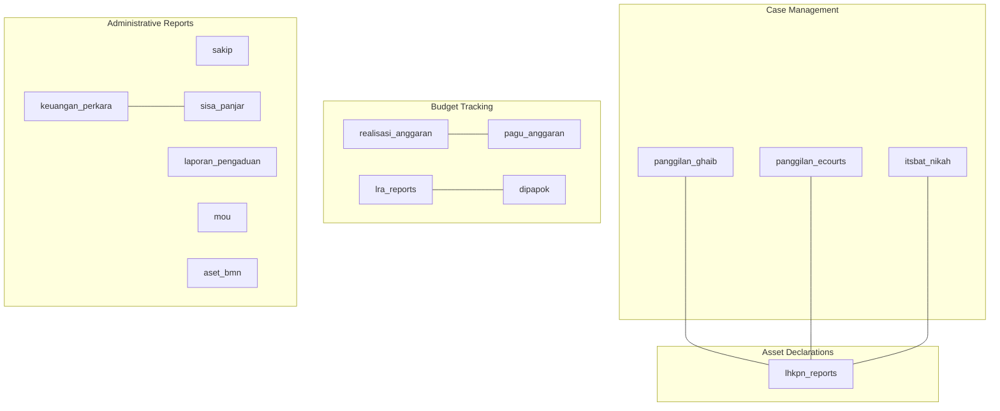
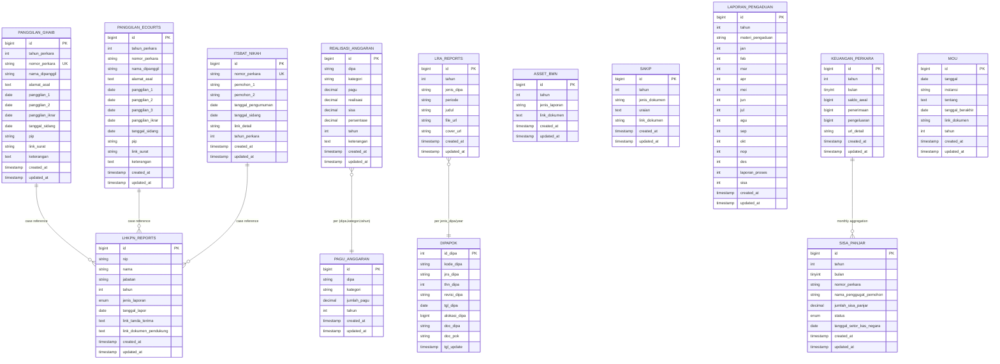
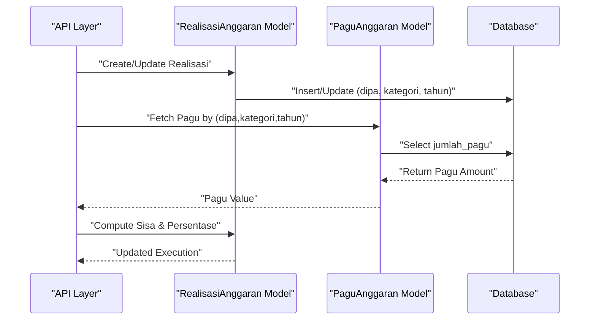
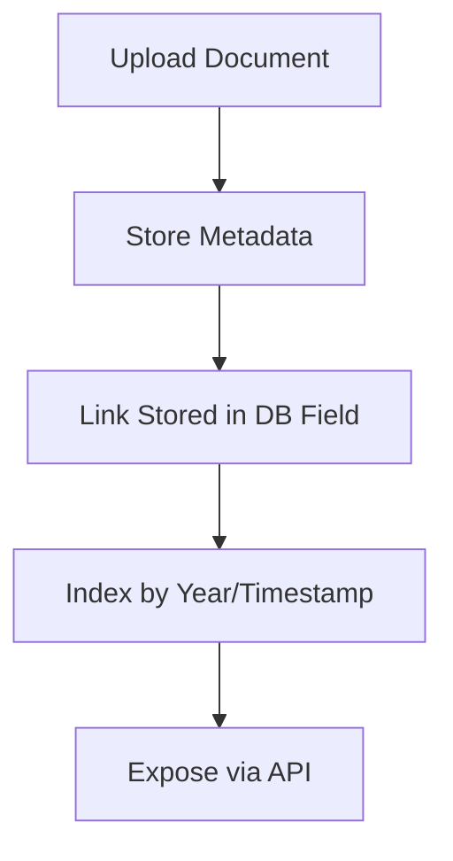
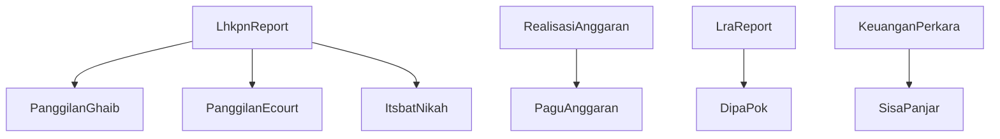

# Database Design

<cite>
**Referenced Files in This Document**
- [2026_01_21_000001_create_panggilan_ghaib_table.php](file://database/migrations/2026_01_21_000001_create_panggilan_ghaib_table.php)
- [2026_01_21_000002_add_unique_to_nomor_perkara.php](file://database/migrations/2026_01_21_000002_add_unique_to_nomor_perkara.php)
- [2026_01_21_000003_create_itsbat_nikah_table.php](file://database/migrations/2026_01_21_000003_create_itsbat_nikah_table.php)
- [2026_01_25_162515_create_panggilan_ecourts_table.php](file://database/migrations/2026_01_25_162515_create_panggilan_ecourts_table.php)
- [2026_02_02_162040_create_lhkpn_reports_table.php](file://database/migrations/2026_02_02_162040_create_lhkpn_reports_table.php)
- [2026_02_10_000000_create_realisasi_anggaran_table.php](file://database/migrations/2026_02_10_000000_create_realisasi_anggaran_table.php)
- [2026_02_10_000001_update_realisasi_anggaran_add_month.php](file://database/migrations/2026_02_10_000001_update_realisasi_anggaran_add_month.php)
- [2026_02_10_000002_create_pagu_anggaran_table.php](file://database/migrations/2026_02_10_000002_create_pagu_anggaran_table.php)
- [2026_02_19_000000_create_dipapok_table.php](file://database/migrations/2026_02_19_000000_create_dipapok_table.php)
- [2026_02_26_000000_create_aset_bmn_table.php](file://database/migrations/2026_02_26_000000_create_aset_bmn_table.php)
- [2026_03_31_000001_create_sakip_table.php](file://database/migrations/2026_03_31_000001_create_sakip_table.php)
- [2026_03_31_000002_create_laporan_pengaduan_table.php](file://database/migrations/2026_03_31_000002_create_laporan_pengaduan_table.php)
- [2026_04_01_000000_create_keuangan_perkara_table.php](file://database/migrations/2026_04_01_000000_create_keuangan_perkara_table.php)
- [2026_04_01_000000_create_mou_table.php](file://database/migrations/2026_04_01_000000_create_mou_table.php)
- [2026_04_01_000001_create_sisa_panjar_table.php](file://database/migrations/2026_04_01_000001_create_sisa_panjar_table.php)
- [2026_04_01_000002_create_lra_reports_table.php](file://database/migrations/2026_04_01_000002_create_lra_reports_table.php)
- [2026_04_02_000000_rename_triwulan_to_periode_on_lra_reports.php](file://database/migrations/2026_04_02_000000_rename_triwulan_to_periode_on_lra_reports.php)
- [Panggilan.php](file://app/Models/Panggilan.php)
- [PanggilanGhaib.php](file://app/Models/PanggilanGhaib.php)
- [PanggilanEcourt.php](file://app/Models/PanggilanEcourt.php)
- [ItsbatNikah.php](file://app/Models/ItsbatNikah.php)
- [LhkpnReport.php](file://app/Models/LhkpnReport.php)
- [RealisasiAnggaran.php](file://app/Models/RealisasiAnggaran.php)
- [PaguAnggaran.php](file://app/Models/PaguAnggaran.php)
- [DipaPok.php](file://app/Models/DipaPok.php)
- [AsetBmn.php](file://app/Models/AsetBmn.php)
- [Sakip.php](file://app/Models/Sakip.php)
- [LaporanPengaduan.php](file://app/Models/LaporanPengaduan.php)
- [KeuanganPerkara.php](file://app/Models/KeuanganPerkara.php)
- [Mou.php](file://app/Models/Mou.php)
- [SisaPanjar.php](file://app/Models/SisaPanjar.php)
- [LraReport.php](file://app/Models/LraReport.php)
</cite>

## Table of Contents
1. [Introduction](#introduction)
2. [Project Structure](#project-structure)
3. [Core Components](#core-components)
4. [Architecture Overview](#architecture-overview)
5. [Detailed Component Analysis](#detailed-component-analysis)
6. [Dependency Analysis](#dependency-analysis)
7. [Performance Considerations](#performance-considerations)
8. [Troubleshooting Guide](#troubleshooting-guide)
9. [Conclusion](#conclusion)
10. [Appendices](#appendices)

## Introduction
This document describes the Lumen API database schema and its associated Eloquent models. It focuses on the 17 migration files and 15 data models that collectively support case management, budget execution tracking, asset declarations, and administrative reporting. The documentation covers entity relationships, field definitions, data types, primary/foreign keys, indexes, unique constraints, validation rules, data lifecycle management, access patterns, caching strategies, migration paths, seed procedures, and security considerations. It also explains the dual storage approach for document management and provides diagrams mapping the schema to actual source files.

## Project Structure
The database schema is defined via Laravel migrations under database/migrations and consumed by Eloquent models under app/Models. The migrations are grouped by logical domains:
- Case management: panggilan_ghaib, panggilan_ecourts, itsbat_nikah
- Asset declarations: lhkpn_reports
- Budget tracking: realisasi_anggaran, pagu_anggaran, dipapok, lra_reports
- Administrative reports: sakip, laporan_pengaduan, keuangan_perkara, mou, sisa_panjar, aset_bmn

**Diagram sources**
- [2026_01_21_000001_create_panggilan_ghaib_table.php:13-31](file://database/migrations/2026_01_21_000001_create_panggilan_ghaib_table.php#L13-L31)
- [2026_01_25_162515_create_panggilan_ecourts_table.php:13-28](file://database/migrations/2026_01_25_162515_create_panggilan_ecourts_table.php#L13-L28)
- [2026_01_21_000003_create_itsbat_nikah_table.php:13-28](file://database/migrations/2026_01_21_000003_create_itsbat_nikah_table.php#L13-L28)
- [2026_02_02_162040_create_lhkpn_reports_table.php:14-25](file://database/migrations/2026_02_02_162040_create_lhkpn_reports_table.php#L14-L25)
- [2026_02_10_000000_create_realisasi_anggaran_table.php:14-25](file://database/migrations/2026_02_10_000000_create_realisasi_anggaran_table.php#L14-L25)
- [2026_02_10_000002_create_pagu_anggaran_table.php:14-22](file://database/migrations/2026_02_10_000002_create_pagu_anggaran_table.php#L14-L22)
- [2026_02_19_000000_create_dipapok_table.php:11-24](file://database/migrations/2026_02_19_000000_create_dipapok_table.php#L11-L24)
- [2026_04_01_000002_create_lra_reports_table.php:11-22](file://database/migrations/2026_04_01_000002_create_lra_reports_table.php#L11-L22)
- [2026_03_31_000001_create_sakip_table.php:11-21](file://database/migrations/2026_03_31_000001_create_sakip_table.php#L11-L21)
- [2026_03_31_000002_create_laporan_pengaduan_table.php:11-33](file://database/migrations/2026_03_31_000002_create_laporan_pengaduan_table.php#L11-L33)
- [2026_04_01_000000_create_keuangan_perkara_table.php:11-23](file://database/migrations/2026_04_01_000000_create_keuangan_perkara_table.php#L11-L23)
- [2026_04_01_000000_create_mou_table.php:11-23](file://database/migrations/2026_04_01_000000_create_mou_table.php#L11-L23)
- [2026_04_01_000001_create_sisa_panjar_table.php:16-30](file://database/migrations/2026_04_01_000001_create_sisa_panjar_table.php#L16-L30)
- [2026_02_26_000000_create_aset_bmn_table.php:14-22](file://database/migrations/2026_02_26_000000_create_aset_bmn_table.php#L14-L22)

**Section sources**
- [2026_01_21_000001_create_panggilan_ghaib_table.php:1-42](file://database/migrations/2026_01_21_000001_create_panggilan_ghaib_table.php#L1-L42)
- [2026_01_25_162515_create_panggilan_ecourts_table.php:1-39](file://database/migrations/2026_01_25_162515_create_panggilan_ecourts_table.php#L1-L39)
- [2026_01_21_000003_create_itsbat_nikah_table.php:1-39](file://database/migrations/2026_01_21_000003_create_itsbat_nikah_table.php#L1-L39)
- [2026_02_02_162040_create_lhkpn_reports_table.php:1-36](file://database/migrations/2026_02_02_162040_create_lhkpn_reports_table.php#L1-L36)
- [2026_02_10_000000_create_realisasi_anggaran_table.php:1-36](file://database/migrations/2026_02_10_000000_create_realisasi_anggaran_table.php#L1-L36)
- [2026_02_10_000002_create_pagu_anggaran_table.php:1-33](file://database/migrations/2026_02_10_000002_create_pagu_anggaran_table.php#L1-L33)
- [2026_02_19_000000_create_dipapok_table.php:1-32](file://database/migrations/2026_02_19_000000_create_dipapok_table.php#L1-L32)
- [2026_02_26_000000_create_aset_bmn_table.php:1-33](file://database/migrations/2026_02_26_000000_create_aset_bmn_table.php#L1-L33)
- [2026_03_31_000001_create_sakip_table.php:1-29](file://database/migrations/2026_03_31_000001_create_sakip_table.php#L1-L29)
- [2026_03_31_000002_create_laporan_pengaduan_table.php:1-41](file://database/migrations/2026_03_31_000002_create_laporan_pengaduan_table.php#L1-L41)
- [2026_04_01_000000_create_keuangan_perkara_table.php:1-31](file://database/migrations/2026_04_01_000000_create_keuangan_perkara_table.php#L1-L31)
- [2026_04_01_000000_create_mou_table.php:1-30](file://database/migrations/2026_04_01_000000_create_mou_table.php#L1-L30)
- [2026_04_01_000001_create_sisa_panjar_table.php:1-43](file://database/migrations/2026_04_01_000001_create_sisa_panjar_table.php#L1-L43)
- [2026_04_01_000002_create_lra_reports_table.php:1-30](file://database/migrations/2026_04_01_000002_create_lra_reports_table.php#L1-L30)
- [2026_04_02_000000_rename_triwulan_to_periode_on_lra_reports.php:1-58](file://database/migrations/2026_04_02_000000_rename_triwulan_to_periode_on_lra_reports.php#L1-L58)

## Core Components
This section documents the primary entities and their attributes, constraints, and indexes. It also outlines validation patterns and business rules enforced at the database level.

- Panggilan Ghaib
  - Purpose: Track absent summons cases with procedural dates and links.
  - Fields: id, tahun_perkara, nomor_perkara (unique), nama_dipanggil, alamat_asal, panggilan_1..panggilan_ikrar, tanggal_sidang, pip, link_surat, keterangan, timestamps.
  - Constraints: Unique(nomor_perkara); indexes(tahun_perkara, nomor_perkara).
  - Validation pattern: Unique constraint prevents duplicate case numbers; indexes optimize year and number searches.
  - Lifecycle: Created when case data is ingested; updated as procedural dates change; soft-deleted via timestamps.

- Panggilan Ecourt
  - Purpose: Track e-court summons with additional procedural steps.
  - Fields: id, tahun_perkara (indexed), nomor_perkara, nama_dipanggil, alamat_asal, panggilan_1..panggilan_3, panggilan_ikrar, tanggal_sidang, pip, link_surat, keterangan, timestamps.
  - Constraints: No explicit unique constraint; indexed fields enable fast filtering.
  - Validation pattern: Indexes accelerate queries by year and case number; application-level uniqueness can be enforced if needed.

- Itsbat Nikah
  - Purpose: Track marriage announcement cases.
  - Fields: id, nomor_perkara (unique), pemohon_1, pemohon_2, tanggal_pengumuman, tanggal_sidang, link_detail, tahun_perkara, timestamps.
  - Constraints: Unique(nomor_perkara); indexes(tahun_perkara, pemohon_1, pemohon_2).
  - Validation pattern: Unique case number; indexed person names and year for efficient lookups.

- Lhkpn Report
  - Purpose: Store asset declaration submissions (LHKPN/SPT).
  - Fields: id, nip (indexed), nama, jabatan, tahun, jenis_laporan ('LHKPN', 'SPT Tahunan'), tanggal_lapor, link_tanda_terima, link_dokumen_pendukung, timestamps.
  - Constraints: No unique constraint; indexed NIP for quick lookups.
  - Validation pattern: Enum type ensures report type consistency; indexed NIP supports person-centric queries.

- Realisasi Anggaran
  - Purpose: Monthly budget execution tracking linked to DIPA categories.
  - Fields: id, dipa (indexed), kategori, pagu, realisasi, sisa, persentase, tahun, keterangan, timestamps.
  - Constraints: No unique constraint; indexed DIPA for aggregation.
  - Validation pattern: Decimal precision for currency; percentage derived from computed formulas; indexed DIPA enables per-DIPA rollups.

- Pagu Anggaran
  - Purpose: Define annual budget ceilings per DIPA category.
  - Fields: id, dipa, kategori, jumlah_pagu, tahun; unique(dipa, kategori, tahun).
  - Constraints: Composite unique constraint enforces one ceiling per DIPA per category per year.
  - Validation pattern: Prevents duplicate budgets; supports reconciliation with execution data.

- Dipa Pok
  - Purpose: DIPA baseline and revision records with document links.
  - Fields: id_dipa (auto-increment), kode_dipa, jns_dipa, thn_dipa, revisi_dipa, tgl_dipa, alokasi_dipa, doc_dipa, doc_pok, tgl_update.
  - Constraints: Indexed thn_dipa; auto-increment primary key.
  - Validation pattern: Year indexing supports fiscal-year queries; document fields store file references.

- LRA Report
  - Purpose: Periodic financial reporting (renamed from triwulan to periode).
  - Fields: id, tahun, jenis_dipa, periode ('semester_1','semester_2','unaudited','audited'), judul, file_url, cover_url, timestamps.
  - Constraints: Unique(tahun, jenis_dipa, periode).
  - Validation pattern: Enum-like period semantics encoded via string values; unique constraint prevents duplicates.

- Aset BMN
  - Purpose: Annual asset inventory reports.
  - Fields: id, tahun (indexed), jenis_laporan, link_dokumen; unique(tahun, jenis_laporan).
  - Constraints: Unique composite ensures single report per year and type.
  - Validation pattern: Indexed year supports yearly rollups; unique pair prevents duplication.

- Sakip
  - Purpose: Annual strategic performance documents.
  - Fields: id, tahun, jenis_dokumen, uraian, link_dokumen; unique(tahun, jenis_dokumen).
  - Constraints: Unique composite for yearly document types.
  - Validation pattern: Indexed year; unique pair for document categorization.

- Laporan Pengaduan
  - Purpose: Monthly complaint statistics aggregated by theme.
  - Fields: id, tahun, materi_pengaduan, jan..dec, laporan_proses, sisa; unique(tahun, materi_pengaduan).
  - Constraints: Unique composite per theme per year; indexed year for trend analysis.
  - Validation pattern: Monthly numeric fields; unique constraint prevents duplicate themes per year.

- Keuangan Perkara
  - Purpose: Monthly financial statements for court cases.
  - Fields: id, tahun, bulan (1–12), saldo_awal, penerimaan, pengeluaran, url_detail; unique(tahun, bulan).
  - Constraints: Unique monthly record per year; indexed year for yearly views.
  - Validation pattern: Monthly granularity; unique constraint prevents double-entry.

- Mou
  - Purpose: Memorandum of Understanding records.
  - Fields: id, tanggal, instansi, tentang, tanggal_berakhir, link_dokumen, tahun; indexes(tahun, tanggal).
  - Constraints: Indexed fields for calendar and year-based queries.
  - Validation pattern: Indexed date and year support scheduling and reporting.

- Sisa Panjar
  - Purpose: Unclaimed cash advances tracking.
  - Fields: id, tahun, bulan (1–12), nomor_perkara, nama_penggugat_pemohon, jumlah_sisa_panjar, status ('belum_diambil','disetor_kas_negara'), tanggal_setor_kas_negara; indexes(tahun, bulan; status).
  - Constraints: Composite index on (tahun, bulan); indexed status for operational dashboards.
  - Validation pattern: Enum enforces status values; indexes support monthly and status-based reporting.

**Section sources**
- [2026_01_21_000001_create_panggilan_ghaib_table.php:13-31](file://database/migrations/2026_01_21_000001_create_panggilan_ghaib_table.php#L13-L31)
- [2026_01_21_000002_add_unique_to_nomor_perkara.php:14-24](file://database/migrations/2026_01_21_000002_add_unique_to_nomor_perkara.php#L14-L24)
- [2026_01_25_162515_create_panggilan_ecourts_table.php:13-28](file://database/migrations/2026_01_25_162515_create_panggilan_ecourts_table.php#L13-L28)
- [2026_01_21_000003_create_itsbat_nikah_table.php:13-28](file://database/migrations/2026_01_21_000003_create_itsbat_nikah_table.php#L13-L28)
- [2026_02_02_162040_create_lhkpn_reports_table.php:14-25](file://database/migrations/2026_02_02_162040_create_lhkpn_reports_table.php#L14-L25)
- [2026_02_10_000000_create_realisasi_anggaran_table.php:14-25](file://database/migrations/2026_02_10_000000_create_realisasi_anggaran_table.php#L14-L25)
- [2026_02_10_000002_create_pagu_anggaran_table.php:14-22](file://database/migrations/2026_02_10_000002_create_pagu_anggaran_table.php#L14-L22)
- [2026_02_19_000000_create_dipapok_table.php:11-24](file://database/migrations/2026_02_19_000000_create_dipapok_table.php#L11-L24)
- [2026_04_01_000002_create_lra_reports_table.php:11-22](file://database/migrations/2026_04_01_000002_create_lra_reports_table.php#L11-L22)
- [2026_04_02_000000_rename_triwulan_to_periode_on_lra_reports.php:12-31](file://database/migrations/2026_04_02_000000_rename_triwulan_to_periode_on_lra_reports.php#L12-L31)
- [2026_02_26_000000_create_aset_bmn_table.php:14-22](file://database/migrations/2026_02_26_000000_create_aset_bmn_table.php#L14-L22)
- [2026_03_31_000001_create_sakip_table.php:11-21](file://database/migrations/2026_03_31_000001_create_sakip_table.php#L11-L21)
- [2026_03_31_000002_create_laporan_pengaduan_table.php:11-33](file://database/migrations/2026_03_31_000002_create_laporan_pengaduan_table.php#L11-L33)
- [2026_04_01_000000_create_keuangan_perkara_table.php:11-23](file://database/migrations/2026_04_01_000000_create_keuangan_perkara_table.php#L11-L23)
- [2026_04_01_000000_create_mou_table.php:11-23](file://database/migrations/2026_04_01_000000_create_mou_table.php#L11-L23)
- [2026_04_01_000001_create_sisa_panjar_table.php:16-30](file://database/migrations/2026_04_01_000001_create_sisa_panjar_table.php#L16-L30)

## Architecture Overview
The schema is organized around three pillars:
- Case Management: panggilan_ghaib, panggilan_ecourts, itsbat_nikah
- Budget Execution: realisasi_anggaran, pagu_anggaran, lra_reports, dipapok
- Administrative Reporting: sakip, laporan_pengaduan, keuangan_perkara, mou, sisa_panjar, aset_bmn

**Diagram sources**
- [2026_01_21_000001_create_panggilan_ghaib_table.php:13-31](file://database/migrations/2026_01_21_000001_create_panggilan_ghaib_table.php#L13-L31)
- [2026_01_25_162515_create_panggilan_ecourts_table.php:13-28](file://database/migrations/2026_01_25_162515_create_panggilan_ecourts_table.php#L13-L28)
- [2026_01_21_000003_create_itsbat_nikah_table.php:13-28](file://database/migrations/2026_01_21_000003_create_itsbat_nikah_table.php#L13-L28)
- [2026_02_02_162040_create_lhkpn_reports_table.php:14-25](file://database/migrations/2026_02_02_162040_create_lhkpn_reports_table.php#L14-L25)
- [2026_02_10_000000_create_realisasi_anggaran_table.php:14-25](file://database/migrations/2026_02_10_000000_create_realisasi_anggaran_table.php#L14-L25)
- [2026_02_10_000002_create_pagu_anggaran_table.php:14-22](file://database/migrations/2026_02_10_000002_create_pagu_anggaran_table.php#L14-L22)
- [2026_02_19_000000_create_dipapok_table.php:11-24](file://database/migrations/2026_02_19_000000_create_dipapok_table.php#L11-L24)
- [2026_04_01_000002_create_lra_reports_table.php:11-22](file://database/migrations/2026_04_01_000002_create_lra_reports_table.php#L11-L22)
- [2026_02_26_000000_create_aset_bmn_table.php:14-22](file://database/migrations/2026_02_26_000000_create_aset_bmn_table.php#L14-L22)
- [2026_03_31_000001_create_sakip_table.php:11-21](file://database/migrations/2026_03_31_000001_create_sakip_table.php#L11-L21)
- [2026_03_31_000002_create_laporan_pengaduan_table.php:11-33](file://database/migrations/2026_03_31_000002_create_laporan_pengaduan_table.php#L11-L33)
- [2026_04_01_000000_create_keuangan_perkara_table.php:11-23](file://database/migrations/2026_04_01_000000_create_keuangan_perkara_table.php#L11-L23)
- [2026_04_01_000000_create_mou_table.php:11-23](file://database/migrations/2026_04_01_000000_create_mou_table.php#L11-L23)
- [2026_04_01_000001_create_sisa_panjar_table.php:16-30](file://database/migrations/2026_04_01_000001_create_sisa_panjar_table.php#L16-L30)

## Detailed Component Analysis

### Case Management Entities
- Panggilan Ghaib
  - Unique constraint on nomor_perkara prevents duplicate case entries.
  - Indexes on tahun_perkara and nomor_perkara optimize search and grouping.
  - Typical validations: presence of case number; date ranges合理性 checks at application level.

- Panggilan Ecourt
  - Similar structure to panggilan_ghaib with an extra procedural step (panggilan_3).
  - Indexes on tahun_perkara and nomor_perkara enable fast filtering.

- Itsbat Nikah
  - Unique constraint on nomor_perkara; indexed names and year for efficient person-case matching.

**Diagram sources**
- [2026_01_21_000001_create_panggilan_ghaib_table.php:28-31](file://database/migrations/2026_01_21_000001_create_panggilan_ghaib_table.php#L28-L31)
- [2026_01_21_000002_add_unique_to_nomor_perkara.php:14-24](file://database/migrations/2026_01_21_000002_add_unique_to_nomor_perkara.php#L14-L24)
- [2026_01_25_162515_create_panggilan_ecourts_table.php:13-28](file://database/migrations/2026_01_25_162515_create_panggilan_ecourts_table.php#L13-L28)
- [2026_01_21_000003_create_itsbat_nikah_table.php:13-28](file://database/migrations/2026_01_21_000003_create_itsbat_nikah_table.php#L13-L28)

**Section sources**
- [2026_01_21_000001_create_panggilan_ghaib_table.php:13-31](file://database/migrations/2026_01_21_000001_create_panggilan_ghaib_table.php#L13-L31)
- [2026_01_21_000002_add_unique_to_nomor_perkara.php:14-24](file://database/migrations/2026_01_21_000002_add_unique_to_nomor_perkara.php#L14-L24)
- [2026_01_25_162515_create_panggilan_ecourts_table.php:13-28](file://database/migrations/2026_01_25_162515_create_panggilan_ecourts_table.php#L13-L28)
- [2026_01_21_000003_create_itsbat_nikah_table.php:13-28](file://database/migrations/2026_01_21_000003_create_itsbat_nikah_table.php#L13-L28)

### Budget Execution Entities
- Realisasi Anggaran
  - Tracks monthly execution against DIPA categories with derived percentage.
  - Index on dipa supports per-DIPA rollups.

- Pagu Anggaran
  - Defines annual ceilings per DIPA category; composite unique constraint ensures one ceiling per year/category/DIPA.

- LRA Report
  - Renamed triwulan to periode with semantic values; unique constraint per year/type/period.

- Dipa Pok
  - Stores baseline and revision DIPA data with document links; indexed year supports fiscal-year queries.

**Diagram sources**
- [2026_02_10_000000_create_realisasi_anggaran_table.php:14-25](file://database/migrations/2026_02_10_000000_create_realisasi_anggaran_table.php#L14-L25)
- [2026_02_10_000002_create_pagu_anggaran_table.php:14-22](file://database/migrations/2026_02_10_000002_create_pagu_anggaran_table.php#L14-L22)
- [2026_04_01_000002_create_lra_reports_table.php:11-22](file://database/migrations/2026_04_01_000002_create_lra_reports_table.php#L11-L22)
- [2026_04_02_000000_rename_triwulan_to_periode_on_lra_reports.php:12-31](file://database/migrations/2026_04_02_000000_rename_triwulan_to_periode_on_lra_reports.php#L12-L31)

**Section sources**
- [2026_02_10_000000_create_realisasi_anggaran_table.php:14-25](file://database/migrations/2026_02_10_000000_create_realisasi_anggaran_table.php#L14-L25)
- [2026_02_10_000001_update_realisasi_anggaran_add_month.php](file://database/migrations/2026_02_10_000001_update_realisasi_anggaran_add_month.php)
- [2026_02_10_000002_create_pagu_anggaran_table.php:14-22](file://database/migrations/2026_02_10_000002_create_pagu_anggaran_table.php#L14-L22)
- [2026_02_19_000000_create_dipapok_table.php:11-24](file://database/migrations/2026_02_19_000000_create_dipapok_table.php#L11-L24)
- [2026_04_01_000002_create_lra_reports_table.php:11-22](file://database/migrations/2026_04_01_000002_create_lra_reports_table.php#L11-L22)
- [2026_04_02_000000_rename_triwulan_to_periode_on_lra_reports.php:12-31](file://database/migrations/2026_04_02_000000_rename_triwulan_to_periode_on_lra_reports.php#L12-L31)

### Administrative Reporting Entities
- Aset BMN, Sakip, Laporan Pengaduan, Keuangan Perkara, Mou, Sisa Panjar
  - Each defines unique constraints and indexes tailored to their reporting cadence and retrieval patterns.
  - Document links stored as URLs; indexed fields support calendar and yearly queries.

**Diagram sources**
- [2026_02_26_000000_create_aset_bmn_table.php:14-22](file://database/migrations/2026_02_26_000000_create_aset_bmn_table.php#L14-L22)
- [2026_03_31_000001_create_sakip_table.php:11-21](file://database/migrations/2026_03_31_000001_create_sakip_table.php#L11-L21)
- [2026_03_31_000002_create_laporan_pengaduan_table.php:11-33](file://database/migrations/2026_03_31_000002_create_laporan_pengaduan_table.php#L11-L33)
- [2026_04_01_000000_create_keuangan_perkara_table.php:11-23](file://database/migrations/2026_04_01_000000_create_keuangan_perkara_table.php#L11-L23)
- [2026_04_01_000000_create_mou_table.php:11-23](file://database/migrations/2026_04_01_000000_create_mou_table.php#L11-L23)
- [2026_04_01_000001_create_sisa_panjar_table.php:16-30](file://database/migrations/2026_04_01_000001_create_sisa_panjar_table.php#L16-L30)

**Section sources**
- [2026_02_26_000000_create_aset_bmn_table.php:14-22](file://database/migrations/2026_02_26_000000_create_aset_bmn_table.php#L14-L22)
- [2026_03_31_000001_create_sakip_table.php:11-21](file://database/migrations/2026_03_31_000001_create_sakip_table.php#L11-L21)
- [2026_03_31_000002_create_laporan_pengaduan_table.php:11-33](file://database/migrations/2026_03_31_000002_create_laporan_pengaduan_table.php#L11-L33)
- [2026_04_01_000000_create_keuangan_perkara_table.php:11-23](file://database/migrations/2026_04_01_000000_create_keuangan_perkara_table.php#L11-L23)
- [2026_04_01_000000_create_mou_table.php:11-23](file://database/migrations/2026_04_01_000000_create_mou_table.php#L11-L23)
- [2026_04_01_000001_create_sisa_panjar_table.php:16-30](file://database/migrations/2026_04_01_000001_create_sisa_panjar_table.php#L16-L30)

## Dependency Analysis
- Case-to-Declaration Relationship
  - LhkpnReport references case identifiers implicitly via case number fields present in case tables; application-level joins align records by nomor_perkara.
- Budget-to-Pagu Relationship
  - RealisasiAnggaran is reconciled against PaguAnggaran using composite keys (dipa, kategori, tahun).
- DIPA Baseline
  - LRA Reports reference Dipa Pok via jenis_dipa for institutional alignment.
- Monthly Cash Flow
  - KeuanganPerkara monthly records feed SisaPanjar for unclaimed cash advances tracking.

**Diagram sources**
- [2026_02_02_162040_create_lhkpn_reports_table.php:14-25](file://database/migrations/2026_02_02_162040_create_lhkpn_reports_table.php#L14-L25)
- [2026_01_21_000001_create_panggilan_ghaib_table.php:13-31](file://database/migrations/2026_01_21_000001_create_panggilan_ghaib_table.php#L13-L31)
- [2026_01_25_162515_create_panggilan_ecourts_table.php:13-28](file://database/migrations/2026_01_25_162515_create_panggilan_ecourts_table.php#L13-L28)
- [2026_01_21_000003_create_itsbat_nikah_table.php:13-28](file://database/migrations/2026_01_21_000003_create_itsbat_nikah_table.php#L13-L28)
- [2026_02_10_000000_create_realisasi_anggaran_table.php:14-25](file://database/migrations/2026_02_10_000000_create_realisasi_anggaran_table.php#L14-L25)
- [2026_02_10_000002_create_pagu_anggaran_table.php:14-22](file://database/migrations/2026_02_10_000002_create_pagu_anggaran_table.php#L14-L22)
- [2026_04_01_000002_create_lra_reports_table.php:11-22](file://database/migrations/2026_04_01_000002_create_lra_reports_table.php#L11-L22)
- [2026_02_19_000000_create_dipapok_table.php:11-24](file://database/migrations/2026_02_19_000000_create_dipapok_table.php#L11-L24)
- [2026_04_01_000000_create_keuangan_perkara_table.php:11-23](file://database/migrations/2026_04_01_000000_create_keuangan_perkara_table.php#L11-L23)
- [2026_04_01_000001_create_sisa_panjar_table.php:16-30](file://database/migrations/2026_04_01_000001_create_sisa_panjar_table.php#L16-L30)

**Section sources**
- [2026_02_02_162040_create_lhkpn_reports_table.php:14-25](file://database/migrations/2026_02_02_162040_create_lhkpn_reports_table.php#L14-L25)
- [2026_02_10_000000_create_realisasi_anggaran_table.php:14-25](file://database/migrations/2026_02_10_000000_create_realisasi_anggaran_table.php#L14-L25)
- [2026_02_10_000002_create_pagu_anggaran_table.php:14-22](file://database/migrations/2026_02_10_000002_create_pagu_anggaran_table.php#L14-L22)
- [2026_04_01_000002_create_lra_reports_table.php:11-22](file://database/migrations/2026_04_01_000002_create_lra_reports_table.php#L11-L22)
- [2026_02_19_000000_create_dipapok_table.php:11-24](file://database/migrations/2026_02_19_000000_create_dipapok_table.php#L11-L24)
- [2026_04_01_000000_create_keuangan_perkara_table.php:11-23](file://database/migrations/2026_04_01_000000_create_keuangan_perkara_table.php#L11-L23)
- [2026_04_01_000001_create_sisa_panjar_table.php:16-30](file://database/migrations/2026_04_01_000001_create_sisa_panjar_table.php#L16-L30)

## Performance Considerations
- Indexes
  - Year-based indexes (e.g., tahun_perkara, thn_dipa, tahun) accelerate yearly queries.
  - Unique constraints prevent duplicates and improve join performance.
  - Composite unique constraints (e.g., (dipa,kategori,tahun), (tahun,periode)) enforce data integrity and enable fast lookups.
- Data Types
  - Decimals with fixed precision store monetary values accurately.
  - Big integers accommodate large balances and carry-overs.
  - Enums restrict values to predefined sets, reducing invalid data and simplifying UI logic.
- Aggregation Patterns
  - Monthly granularity (KeuanganPerkara, SisaPanjar) supports timely reporting.
  - Fiscal periods (LRA Reports) align with institutional reporting cycles.
- Caching Strategies
  - Application-level caches can store frequently accessed aggregates (e.g., pagu vs. realisasi per DIPA).
  - Document URL caching reduces repeated metadata fetches for external storage.
- Query Optimization
  - Prefer filtered queries using indexed fields (year, case number, DIPA).
  - Batch updates for periodic reconciliation (e.g., monthly closing of KeuanganPerkara).

[No sources needed since this section provides general guidance]

## Troubleshooting Guide
- Duplicate Case Numbers
  - Symptom: Insert fails with unique constraint violation on nomor_perkara.
  - Resolution: Deduplicate existing records; apply unique constraint; re-run ingestion.
  - Reference: [2026_01_21_000002_add_unique_to_nomor_perkara.php:14-24](file://database/migrations/2026_01_21_000002_add_unique_to_nomor_perkara.php#L14-L24)

- Unexpected Null Values
  - Cause: Nullable date fields for procedural dates; optional document links.
  - Action: Validate presence at application boundary; provide defaults where appropriate.

- Enum/Period Semantics Changes
  - Change: triwulan renamed to periode with semantic values.
  - Impact: Update application logic to handle 'semester_1','semester_2','unaudited','audited'.
  - Reference: [2026_04_02_000000_rename_triwulan_to_periode_on_lra_reports.php:24-27](file://database/migrations/2026_04_02_000000_rename_triwulan_to_periode_on_lra_reports.php#L24-L27)

- Monthly Record Conflicts
  - Symptom: Unique constraint failure on (tahun, bulan).
  - Resolution: Implement upsert logic; ensure month boundaries are respected.

**Section sources**
- [2026_01_21_000002_add_unique_to_nomor_perkara.php:14-24](file://database/migrations/2026_01_21_000002_add_unique_to_nomor_perkara.php#L14-L24)
- [2026_04_02_000000_rename_triwulan_to_periode_on_lra_reports.php:24-27](file://database/migrations/2026_04_02_000000_rename_triwulan_to_periode_on_lra_reports.php#L24-L27)

## Conclusion
The Lumen API database schema organizes case management, budget execution, and administrative reporting into cohesive domains with strong integrity constraints and targeted indexes. The dual storage approach for documents (URLs in DB plus external storage) is supported by the schema’s design. Eloquent models encapsulate business logic and relationships, while migrations provide a clear audit trail for schema evolution. Adhering to the documented constraints and validation patterns ensures reliable data lifecycle management and predictable performance.

[No sources needed since this section summarizes without analyzing specific files]

## Appendices

### Data Access Patterns Through Eloquent Models
- Load related entities using Eloquent relationships (belongsTo, hasMany) aligned with unique and indexed fields.
- Apply scopes for common filters (year, case number, DIPA).
- Use chunked processing for bulk operations to manage memory and transaction sizes.

[No sources needed since this section provides general guidance]

### Migration Paths and Version Management
- Migrations are ordered by timestamp; use Laravel’s migration system to track applied versions.
- For renaming columns (e.g., triwulan to periode), include data transformation steps and reverse logic for rollback safety.
- References:
  - [2026_04_02_000000_rename_triwulan_to_periode_on_lra_reports.php:12-31](file://database/migrations/2026_04_02_000000_rename_triwulan_to_periode_on_lra_reports.php#L12-L31)

**Section sources**
- [2026_04_02_000000_rename_triwulan_to_periode_on_lra_reports.php:12-31](file://database/migrations/2026_04_02_000000_rename_triwulan_to_periode_on_lra_reports.php#L12-L31)

### Seed Data Procedures
- Seeders populate initial datasets for demonstration and testing.
- Typical procedure: Prepare JSON/CSV data, load via seeder classes, and verify unique constraints and indexes.
- References:
  - [DatabaseSeeder.php](file://database/seeders/DatabaseSeeder.php)
  - [AnggaranSeeder.php](file://database/seeders/AnggaranSeeder.php)
  - [LhkpnSeeder.php](file://database/seeders/LhkpnSeeder.php)
  - [LraReportSeeder.php](file://database/seeders/LraReportSeeder.php)

**Section sources**
- [DatabaseSeeder.php](file://database/seeders/DatabaseSeeder.php)
- [AnggaranSeeder.php](file://database/seeders/AnggaranSeeder.php)
- [LhkpnSeeder.php](file://database/seeders/LhkpnSeeder.php)
- [LraReportSeeder.php](file://database/seeders/LraReportSeeder.php)

### Sample Data Examples
- Case Management: Example rows include case numbers, procedural dates, and document links.
- Budget Execution: Example rows include DIPA codes, categories, pagu, realisasi, sisa, and percentages.
- Administrative Reports: Example rows include yearly themes, monthly counts, and document URLs.

[No sources needed since this section provides general guidance]

### Dual Storage Approach for Documents
- Document metadata (URLs) stored in database fields; actual files stored externally (e.g., cloud storage).
- Benefits: Reduced database size, improved scalability, and separation of concerns.
- Security: Enforce signed URLs or access tokens; avoid exposing raw storage paths.

[No sources needed since this section provides general guidance]