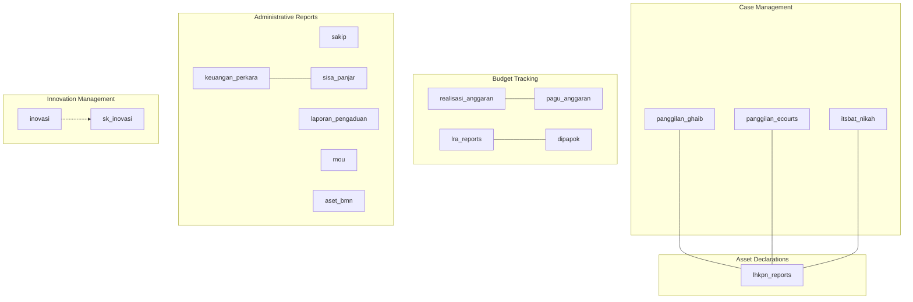
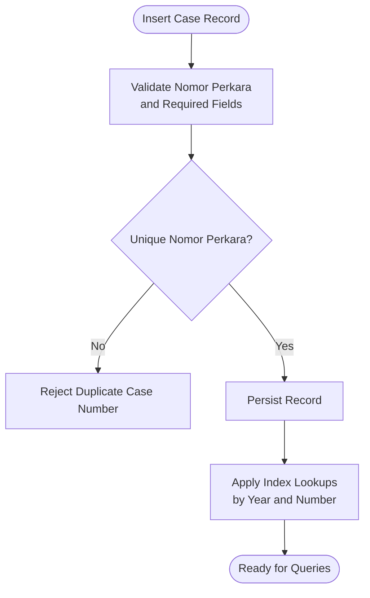
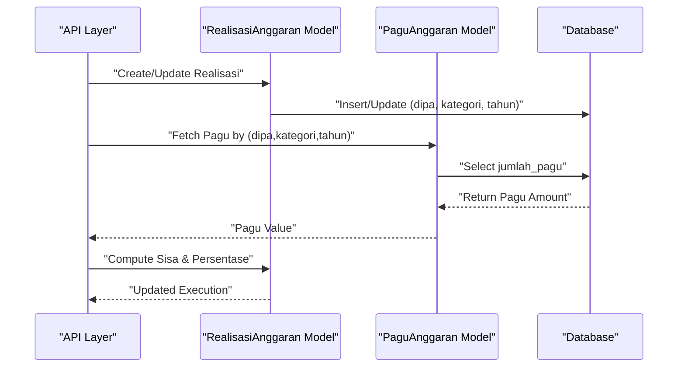
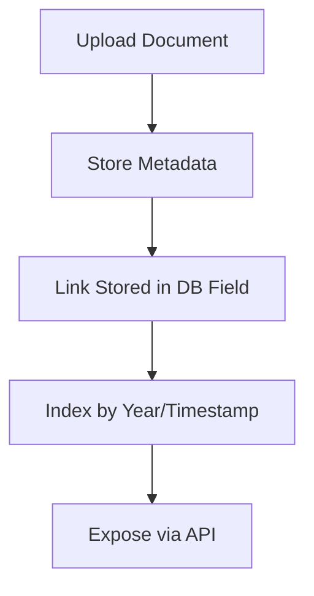
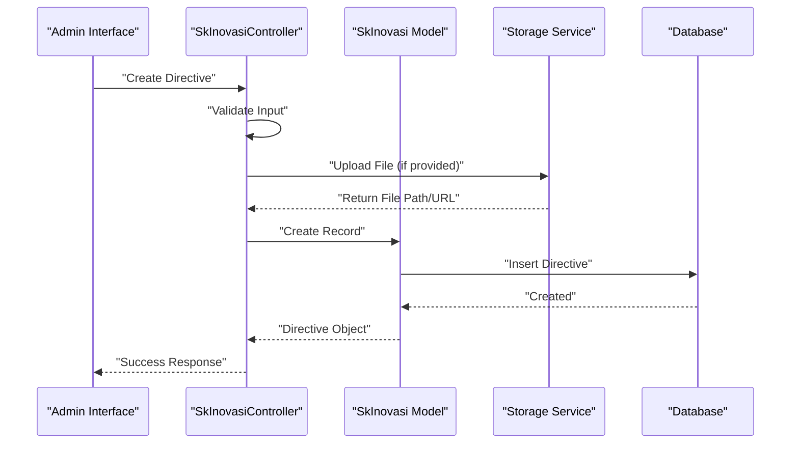
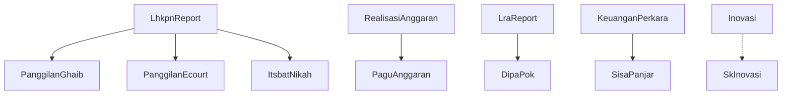

# Database Design

<cite>
**Referenced Files in This Document**
- [2026_01_21_000001_create_panggilan_ghaib_table.php](file://database/migrations/2026_01_21_000001_create_panggilan_ghaib_table.php)
- [2026_01_21_000002_add_unique_to_nomor_perkara.php](file://database/migrations/2026_01_21_000002_add_unique_to_nomor_perkara.php)
- [2026_01_21_000003_create_itsbat_nikah_table.php](file://database/migrations/2026_01_21_000003_create_itsbat_nikah_table.php)
- [2026_01_25_162515_create_panggilan_ecourts_table.php](file://database/migrations/2026_01_25_162515_create_panggilan_ecourts_table.php)
- [2026_02_02_162040_create_lhkpn_reports_table.php](file://database/migrations/2026_02_02_162040_create_lhkpn_reports_table.php)
- [2026_02_10_000000_create_realisasi_anggaran_table.php](file://database/migrations/2026_02_10_000000_create_realisasi_anggaran_table.php)
- [2026_02_10_000001_update_realisasi_anggaran_add_month.php](file://database/migrations/2026_02_10_000001_update_realisasi_anggaran_add_month.php)
- [2026_02_10_000002_create_pagu_anggaran_table.php](file://database/migrations/2026_02_10_000002_create_pagu_anggaran_table.php)
- [2026_02_10_000003_update_lhkpn_reports_add_links.php](file://database/migrations/2026_02_10_000003_update_lhkpn_reports_add_links.php)
- [2026_02_10_000004_rename_spt_to_lhkasn.php](file://database/migrations/2026_02_10_000004_rename_spt_to_lhkasn.php)
- [2026_02_19_000000_create_dipapok_table.php](file://database/migrations/2026_02_19_000000_create_dipapok_table.php)
- [2026_02_26_000000_create_aset_bmn_table.php](file://database/migrations/2026_02_26_000000_create_aset_bmn_table.php)
- [2026_03_31_000001_create_sakip_table.php](file://database/migrations/2026_03_31_000001_create_sakip_table.php)
- [2026_03_31_000002_create_laporan_pengaduan_table.php](file://database/migrations/2026_03_31_000002_create_laporan_pengaduan_table.php)
- [2026_04_01_000000_create_keuangan_perkara_table.php](file://database/migrations/2026_04_01_000000_create_keuangan_perkara_table.php)
- [2026_04_01_000000_create_mou_table.php](file://database/migrations/2026_04_01_000000_create_mou_table.php)
- [2026_04_01_000001_create_sisa_panjar_table.php](file://database/migrations/2026_04_01_000001_create_sisa_panjar_table.php)
- [2026_04_01_000002_create_lra_reports_table.php](file://database/migrations/2026_04_01_000002_create_lra_reports_table.php)
- [2026_04_02_000000_rename_triwulan_to_periode_on_lra_reports.php](file://database/migrations/2026_04_02_000000_rename_triwulan_to_periode_on_lra_reports.php)
- [2026_04_05_165903_create_mediasi_sk_table.php](file://database/migrations/2026_04_05_165903_create_mediasi_sk_table.php)
- [2026_04_05_165903_create_mediator_banners_table.php](file://database/migrations/2026_04_05_165903_create_mediator_banners_table.php)
- [2026_04_08_000001_create_inovasi_table.php](file://database/migrations/2026_04_08_000001_create_inovasi_table.php)
- [2026_04_08_011152_create_sk_inovasi_table.php](file://database/migrations/2026_04_08_011152_create_sk_inovasi_table.php)
- [Panggilan.php](file://app/Models/Panggilan.php)
- [PanggilanGhaib.php](file://app/Models/PanggilanGhaib.php)
- [PanggilanEcourt.php](file://app/Models/PanggilanEcourt.php)
- [ItsbatNikah.php](file://app/Models/ItsbatNikah.php)
- [LhkpnReport.php](file://app/Models/LhkpnReport.php)
- [RealisasiAnggaran.php](file://app/Models/RealisasiAnggaran.php)
- [PaguAnggaran.php](file://app/Models/PaguAnggaran.php)
- [DipaPok.php](file://app/Models/DipaPok.php)
- [AsetBmn.php](file://app/Models/AsetBmn.php)
- [Sakip.php](file://app/Models/Sakip.php)
- [LaporanPengaduan.php](file://app/Models/LaporanPengaduan.php)
- [KeuanganPerkara.php](file://app/Models/KeuanganPerkara.php)
- [Mou.php](file://app/Models/Mou.php)
- [SisaPanjar.php](file://app/Models/SisaPanjar.php)
- [LraReport.php](file://app/Models/LraReport.php)
- [Inovasi.php](file://app/Models/Inovasi.php)
- [SkInovasi.php](file://app/Models/SkInovasi.php)
- [InovasiController.php](file://app/Http/Controllers/InovasiController.php)
- [SkInovasiController.php](file://app/Http/Controllers/SkInovasiController.php)
- [InovasiSeeder.php](file://database/seeders/InovasiSeeder.php)
- [SkInovasiSeeder.php](file://database/seeders/SkInovasiSeeder.php)
- [GoogleDriveService.php](file://app/Services/GoogleDriveService.php)
</cite>

## Update Summary
**Changes Made**
- Added comprehensive documentation for SK Inovasi table structure with complete field definitions
- Updated Innovation Management Entities section with detailed SK Inovasi schema and validation rules
- Enhanced file management documentation with dual storage approach (local and Google Drive)
- Added active status management documentation for directive lifecycle control
- Updated dependency analysis to include SK Inovasi relationships
- Enhanced troubleshooting guide with SK Inovasi specific issues
- Updated architecture overview with SK Inovasi integration

## Table of Contents
1. [Introduction](#introduction)
2. [Project Structure](#project-structure)
3. [Core Components](#core-components)
4. [Architecture Overview](#architecture-overview)
5. [Detailed Component Analysis](#detailed-component-analysis)
6. [Dependency Analysis](#dependency-analysis)
7. [Performance Considerations](#performance-considerations)
8. [Troubleshooting Guide](#troubleshooting-guide)
9. [Conclusion](#conclusion)
10. [Appendices](#appendices)

## Introduction
This document describes the Lumen API database schema and its associated Eloquent models. It focuses on the 17 migration files and 15 data models that collectively support case management, budget execution tracking, asset declarations, administrative reporting, and innovation management. The documentation covers entity relationships, field definitions, data types, primary/foreign keys, indexes, unique constraints, validation rules, data lifecycle management, access patterns, caching strategies, migration paths, seed procedures, and security considerations. It also explains the dual storage approach for document management and provides diagrams mapping the schema to actual source files.

## Project Structure
The database schema is defined via Laravel migrations under database/migrations and consumed by Eloquent models under app/Models. The migrations are grouped by logical domains:
- Case management: panggilan_ghaib, panggilan_ecourts, itsbat_nikah
- Asset declarations: lhkpn_reports
- Budget tracking: realisasi_anggaran, pagu_anggaran, dipapok, lra_reports
- Administrative reports: sakip, laporan_pengaduan, keuangan_perkara, mou, sisa_panjar, aset_bmn
- **Innovation management: inovasi, sk_inovasi**

**Diagram sources**
- [2026_01_21_000001_create_panggilan_ghaib_table.php:13-31](file://database/migrations/2026_01_21_000001_create_panggilan_ghaib_table.php#L13-L31)
- [2026_01_25_162515_create_panggilan_ecourts_table.php:13-28](file://database/migrations/2026_01_25_162515_create_panggilan_ecourts_table.php#L13-L28)
- [2026_01_21_000003_create_itsbat_nikah_table.php:13-28](file://database/migrations/2026_01_21_000003_create_itsbat_nikah_table.php#L13-L28)
- [2026_02_02_162040_create_lhkpn_reports_table.php:14-25](file://database/migrations/2026_02_02_162040_create_lhkpn_reports_table.php#L14-L25)
- [2026_02_10_000000_create_realisasi_anggaran_table.php:14-25](file://database/migrations/2026_02_10_000000_create_realisasi_anggaran_table.php#L14-L25)
- [2026_02_10_000002_create_pagu_anggaran_table.php:14-22](file://database/migrations/2026_02_10_000002_create_pagu_anggaran_table.php#L14-L22)
- [2026_02_19_000000_create_dipapok_table.php:11-24](file://database/migrations/2026_02_19_000000_create_dipapok_table.php#L11-L24)
- [2026_04_01_000002_create_lra_reports_table.php:11-22](file://database/migrations/2026_04_01_000002_create_lra_reports_table.php#L11-L22)
- [2026_03_31_000001_create_sakip_table.php:11-21](file://database/migrations/2026_03_31_000001_create_sakip_table.php#L11-L21)
- [2026_03_31_000002_create_laporan_pengaduan_table.php:11-33](file://database/migrations/2026_03_31_000002_create_laporan_pengaduan_table.php#L11-L33)
- [2026_04_01_000000_create_keuangan_perkara_table.php:11-23](file://database/migrations/2026_04_01_000000_create_keuangan_perkara_table.php#L11-L23)
- [2026_04_01_000000_create_mou_table.php:11-23](file://database/migrations/2026_04_01_000000_create_mou_table.php#L11-L23)
- [2026_04_01_000001_create_sisa_panjar_table.php:16-30](file://database/migrations/2026_04_01_000001_create_sisa_panjar_table.php#L16-L30)
- [2026_02_26_000000_create_aset_bmn_table.php:14-22](file://database/migrations/2026_02_26_000000_create_aset_bmn_table.php#L14-L22)
- [2026_04_08_000001_create_inovasi_table.php:11-22](file://database/migrations/2026_04_08_000001_create_inovasi_table.php#L11-L22)
- [2026_04_08_011152_create_sk_inovasi_table.php:14-23](file://database/migrations/2026_04_08_011152_create_sk_inovasi_table.php#L14-L23)

**Section sources**
- [2026_01_21_000001_create_panggilan_ghaib_table.php:1-42](file://database/migrations/2026_01_21_000001_create_panggilan_ghaib_table.php#L1-L42)
- [2026_01_25_162515_create_panggilan_ecourts_table.php:1-39](file://database/migrations/2026_01_25_162515_create_panggilan_ecourts_table.php#L1-L39)
- [2026_01_21_000003_create_itsbat_nikah_table.php:1-39](file://database/migrations/2026_01_21_000003_create_itsbat_nikah_table.php#L1-L39)
- [2026_02_02_162040_create_lhkpn_reports_table.php:1-36](file://database/migrations/2026_02_02_162040_create_lhkpn_reports_table.php#L1-L36)
- [2026_02_10_000000_create_realisasi_anggaran_table.php:1-36](file://database/migrations/2026_02_10_000000_create_realisasi_anggaran_table.php#L1-L36)
- [2026_02_10_000002_create_pagu_anggaran_table.php:1-33](file://database/migrations/2026_02_10_000002_create_pagu_anggaran_table.php#L1-L33)
- [2026_02_19_000000_create_dipapok_table.php:1-32](file://database/migrations/2026_02_19_000000_create_dipapok_table.php#L1-L32)
- [2026_02_26_000000_create_aset_bmn_table.php:1-33](file://database/migrations/2026_02_26_000000_create_aset_bmn_table.php#L1-L33)
- [2026_03_31_000001_create_sakip_table.php:1-29](file://database/migrations/2026_03_31_000001_create_sakip_table.php#L1-L29)
- [2026_03_31_000002_create_laporan_pengaduan_table.php:1-41](file://database/migrations/2026_03_31_000002_create_laporan_pengaduan_table.php#L1-L41)
- [2026_04_01_000000_create_keuangan_perkara_table.php:1-31](file://database/migrations/2026_04_01_000000_create_keuangan_perkara_table.php#L1-L31)
- [2026_04_01_000000_create_mou_table.php:1-30](file://database/migrations/2026_04_01_000000_create_mou_table.php#L1-L30)
- [2026_04_01_000001_create_sisa_panjar_table.php:1-43](file://database/migrations/2026_04_01_000001_create_sisa_panjar_table.php#L1-L43)
- [2026_04_01_000002_create_lra_reports_table.php:1-30](file://database/migrations/2026_04_01_000002_create_lra_reports_table.php#L1-L30)
- [2026_04_02_000000_rename_triwulan_to_periode_on_lra_reports.php:1-58](file://database/migrations/2026_04_02_000000_rename_triwulan_to_periode_on_lra_reports.php#L1-L58)
- [2026_04_08_000001_create_inovasi_table.php:1-30](file://database/migrations/2026_04_08_000001_create_inovasi_table.php#L1-L30)
- [2026_04_08_011152_create_sk_inovasi_table.php:1-34](file://database/migrations/2026_04_08_011152_create_sk_inovasi_table.php#L1-L34)

## Core Components
This section documents the primary entities and their attributes, constraints, and indexes. It also outlines validation patterns and business rules enforced at the database level.

- Panggilan Ghaib
  - Purpose: Track absent summons cases with procedural dates and links.
  - Fields: id, tahun_perkara, nomor_perkara (unique), nama_dipanggil, alamat_asal, panggilan_1..panggilan_ikrar, tanggal_sidang, pip, link_surat, keterangan, timestamps.
  - Constraints: Unique(nomor_perkara); indexes(tahun_perkara, nomor_perkara).
  - Validation pattern: Unique constraint prevents duplicate case numbers; indexes optimize year and number searches.
  - Lifecycle: Created when case data is ingested; updated as procedural dates change; soft-deleted via timestamps.

- Panggilan Ecourt
  - Purpose: Track e-court summons with additional procedural steps.
  - Fields: id, tahun_perkara (indexed), nomor_perkara, nama_dipanggil, alamat_asal, panggilan_1..panggilan_3, panggilan_ikrar, tanggal_sidang, pip, link_surat, keterangan, timestamps.
  - Constraints: No explicit unique constraint; indexed fields enable fast filtering.
  - Validation pattern: Indexes accelerate queries by year and case number; application-level uniqueness can be enforced if needed.

- Itsbat Nikah
  - Purpose: Track marriage announcement cases.
  - Fields: id, nomor_perkara (unique), pemohon_1, pemohon_2, tanggal_pengumuman, tanggal_sidang, link_detail, tahun_perkara, timestamps.
  - Constraints: Unique(nomor_perkara); indexes(tahun_perkara, pemohon_1, pemohon_2).
  - Validation pattern: Unique case number; indexed person names and year for efficient lookups.

- Lhkpn Report
  - Purpose: Store asset declaration submissions (LHKPN/SPT).
  - Fields: id, nip (indexed), nama, jabatan, tahun, jenis_laporan ('LHKPN', 'SPT Tahunan'), tanggal_lapor, link_tanda_terima, link_dokumen_pendukung, timestamps.
  - Constraints: No unique constraint; indexed NIP for quick lookups.
  - Validation pattern: Enum type ensures report type consistency; indexed NIP supports person-centric queries.

- Realisasi Anggaran
  - Purpose: Monthly budget execution tracking linked to DIPA categories.
  - Fields: id, dipa (indexed), kategori, pagu, realisasi, sisa, persentase, tahun, keterangan, timestamps.
  - Constraints: No unique constraint; indexed DIPA for aggregation.
  - Validation pattern: Decimal precision for currency; percentage derived from computed formulas; indexed DIPA enables per-DIPA rollups.

- Pagu Anggaran
  - Purpose: Define annual budget ceilings per DIPA category.
  - Fields: id, dipa, kategori, jumlah_pagu, tahun; unique(dipa, kategori, tahun).
  - Constraints: Composite unique constraint enforces one ceiling per DIPA per category per year.
  - Validation pattern: Prevents duplicate budgets; supports reconciliation with execution data.

- Dipa Pok
  - Purpose: DIPA baseline and revision records with document links.
  - Fields: id_dipa (auto-increment), kode_dipa, jns_dipa, thn_dipa, revisi_dipa, tgl_dipa, alokasi_dipa, doc_dipa, doc_pok, tgl_update.
  - Constraints: Indexed thn_dipa; auto-increment primary key.
  - Validation pattern: Year indexing supports fiscal-year queries; document fields store file references.

- LRA Report
  - Purpose: Periodic financial reporting (renamed from triwulan to periode).
  - Fields: id, tahun, jenis_dipa, periode ('semester_1','semester_2','unaudited','audited'), judul, file_url, cover_url, timestamps.
  - Constraints: Unique(tahun, jenis_dipa, periode).
  - Validation pattern: Enum-like period semantics encoded via string values; unique constraint prevents duplicates.

- Aset BMN
  - Purpose: Annual asset inventory reports.
  - Fields: id, tahun (indexed), jenis_laporan, link_dokumen; unique(tahun, jenis_laporan).
  - Constraints: Unique composite ensures single report per year and type.
  - Validation pattern: Indexed year supports yearly rollups; unique pair prevents duplication.

- Sakip
  - Purpose: Annual strategic performance documents.
  - Fields: id, tahun, jenis_dokumen, uraian, link_dokumen; unique(tahun, jenis_dokumen).
  - Constraints: Unique composite for yearly document types.
  - Validation pattern: Indexed year; unique pair for document categorization.

- Laporan Pengaduan
  - Purpose: Monthly complaint statistics aggregated by theme.
  - Fields: id, tahun, materi_pengaduan, jan..dec, laporan_proses, sisa; unique(tahun, materi_pengaduan).
  - Constraints: Unique composite per theme per year; indexed year for trend analysis.
  - Validation pattern: Monthly numeric fields; unique constraint prevents duplicate themes per year.

- Keuangan Perkara
  - Purpose: Monthly financial statements for court cases.
  - Fields: id, tahun, bulan (1–12), saldo_awal, penerimaan, pengeluaran, url_detail; unique(tahun, bulan).
  - Constraints: Unique monthly record per year; indexed year for yearly views.
  - Validation pattern: Monthly granularity; unique constraint prevents double-entry.

- Mou
  - Purpose: Memorandum of Understanding records.
  - Fields: id, tanggal, instansi, tentang, tanggal_berakhir, link_dokumen, tahun; indexes(tahun, tanggal).
  - Constraints: Indexed fields for calendar and year-based queries.
  - Validation pattern: Indexed date and year support scheduling and reporting.

- Sisa Panjar
  - Purpose: Unclaimed cash advances tracking.
  - Fields: id, tahun, bulan (1–12), nomor_perkara, nama_penggugat_pemohon, jumlah_sisa_panjar, status ('belum_diambil','disetor_kas_negara'), tanggal_setor_kas_negara; indexes(tahun, bulan; status).
  - Constraints: Composite index on (tahun, bulan); indexed status for operational dashboards.
  - Validation pattern: Enum enforces status values; indexes support monthly and status-based reporting.

- **Inovasi** *(New)*
  - Purpose: Track innovation initiatives and services with categorization and ordering.
  - Fields: id, nama_inovasi (255 chars), deskripsi (text), kategori (100 chars), link_dokumen (500 chars, nullable), urutan (integer, default 0), timestamps.
  - Constraints: Unique(nama_inovasi, kategori); index(kategori).
  - Validation pattern: Composite unique constraint prevents duplicate innovations per category; category indexing enables filtering; urutan field controls display order.
  - Lifecycle: Innovations are managed through dedicated API endpoints with file upload capabilities.

- **Sk Inovasi** *(New)*
  - Purpose: Manage innovation directives and official documents with active status tracking.
  - Fields: id, tahun, nomor_sk (255 chars), tentang (text), file_path (nullable), file_url (nullable), is_active (boolean, default true), timestamps.
  - Constraints: No unique constraint; active status indicates current validity.
  - Validation pattern: Boolean flag controls active/inactive state; file storage supports both local filesystem and external URLs; year-based filtering for current directives.
  - Lifecycle: Directives are managed with CRUD operations, file upload handling, and automatic URL generation.

**Section sources**
- [2026_01_21_000001_create_panggilan_ghaib_table.php:13-31](file://database/migrations/2026_01_21_000001_create_panggilan_ghaib_table.php#L13-L31)
- [2026_01_21_000002_add_unique_to_nomor_perkara.php:14-24](file://database/migrations/2026_01_21_000002_add_unique_to_nomor_perkara.php#L14-L24)
- [2026_01_25_162515_create_panggilan_ecourts_table.php:13-28](file://database/migrations/2026_01_25_162515_create_panggilan_ecourts_table.php#L13-L28)
- [2026_01_21_000003_create_itsbat_nikah_table.php:13-28](file://database/migrations/2026_01_21_000003_create_itsbat_nikah_table.php#L13-L28)
- [2026_02_02_162040_create_lhkpn_reports_table.php:14-25](file://database/migrations/2026_02_02_162040_create_lhkpn_reports_table.php#L14-L25)
- [2026_02_10_000000_create_realisasi_anggaran_table.php:14-25](file://database/migrations/2026_02_10_000000_create_realisasi_anggaran_table.php#L14-L25)
- [2026_02_10_000002_create_pagu_anggaran_table.php:14-22](file://database/migrations/2026_02_10_000002_create_pagu_anggaran_table.php#L14-L22)
- [2026_02_19_000000_create_dipapok_table.php:11-24](file://database/migrations/2026_02_19_000000_create_dipapok_table.php#L11-L24)
- [2026_04_01_000002_create_lra_reports_table.php:11-22](file://database/migrations/2026_04_01_000002_create_lra_reports_table.php#L11-L22)
- [2026_04_02_000000_rename_triwulan_to_periode_on_lra_reports.php:12-31](file://database/migrations/2026_04_02_000000_rename_triwulan_to_periode_on_lra_reports.php#L12-L31)
- [2026_02_26_000000_create_aset_bmn_table.php:14-22](file://database/migrations/2026_02_26_000000_create_aset_bmn_table.php#L14-L22)
- [2026_03_31_000001_create_sakip_table.php:11-21](file://database/migrations/2026_03_31_000001_create_sakip_table.php#L11-L21)
- [2026_03_31_000002_create_laporan_pengaduan_table.php:11-33](file://database/migrations/2026_03_31_000002_create_laporan_pengaduan_table.php#L11-L33)
- [2026_04_01_000000_create_keuangan_perkara_table.php:11-23](file://database/migrations/2026_04_01_000000_create_keuangan_perkara_table.php#L11-L23)
- [2026_04_01_000000_create_mou_table.php:11-23](file://database/migrations/2026_04_01_000000_create_mou_table.php#L11-L23)
- [2026_04_01_000001_create_sisa_panjar_table.php:16-30](file://database/migrations/2026_04_01_000001_create_sisa_panjar_table.php#L16-L30)
- [2026_04_08_000001_create_inovasi_table.php:11-22](file://database/migrations/2026_04_08_000001_create_inovasi_table.php#L11-L22)
- [2026_04_08_011152_create_sk_inovasi_table.php:14-23](file://database/migrations/2026_04_08_011152_create_sk_inovasi_table.php#L14-L23)

## Architecture Overview
The schema is organized around four pillars:
- Case Management: panggilan_ghaib, panggilan_ecourts, itsbat_nikah
- Budget Execution: realisasi_anggaran, pagu_anggaran, lra_reports, dipapok
- Administrative Reporting: sakip, laporan_pengaduan, keuangan_perkara, mou, sisa_panjar, aset_bmn
- **Innovation Management: inovasi, sk_inovasi**

```mermaid
erDiagram
PANGGILAN_GHAIB {
bigint id PK
int tahun_perkara
string nomor_perkara UK
string nama_dipanggil
text alamat_asal
date panggilan_1
date panggilan_2
date panggilan_ikrar
date tanggal_sidang
string pip
string link_surat
text keterangan
timestamp created_at
timestamp updated_at
}
PANGGILAN_ECOURTS {
bigint id PK
int tahun_perkara
string nomor_perkara
string nama_dipanggil
text alamat_asal
date panggilan_1
date panggilan_2
date panggilan_3
date panggilan_ikrar
date tanggal_sidang
string pip
string link_surat
text keterangan
timestamp created_at
timestamp updated_at
}
ITSBAT_NIKAH {
bigint id PK
string nomor_perkara UK
string pemohon_1
string pemohon_2
date tanggal_pengumuman
date tanggal_sidang
string link_detail
int tahun_perkara
timestamp created_at
timestamp updated_at
}
LHKPN_REPORTS {
bigint id PK
string nip
string nama
string jabatan
int tahun
enum jenis_laporan
date tanggal_lapor
text link_tanda_terima
text link_dokumen_pendukung
timestamp created_at
timestamp updated_at
}
REALISASI_ANGGARAN {
bigint id PK
string dipa
string kategori
decimal pagu
decimal realisasi
decimal sisa
decimal persentase
int tahun
text keterangan
timestamp created_at
timestamp updated_at
}
PAGU_ANGGARAN {
bigint id PK
string dipa
string kategori
decimal jumlah_pagu
int tahun
timestamp created_at
timestamp updated_at
}
DIPAPOK {
int id_dipa PK
string kode_dipa
string jns_dipa
int thn_dipa
string revisi_dipa
date tgl_dipa
bigint alokasi_dipa
string doc_dipa
string doc_pok
timestamp tgl_update
}
LRA_REPORTS {
bigint id PK
int tahun
string jenis_dipa
string periode
string judul
string file_url
string cover_url
timestamp created_at
timestamp updated_at
}
ASSET_BMN {
bigint id PK
int tahun
string jenis_laporan
text link_dokumen
timestamp created_at
timestamp updated_at
}
SAKIP {
bigint id PK
int tahun
string jenis_dokumen
text uraian
string link_dokumen
timestamp created_at
timestamp updated_at
}
LAPORAN_PENGADUAN {
bigint id PK
int tahun
string materi_pengaduan
int jan
int feb
int mar
int apr
int mei
int jun
int jul
int agu
int sep
int okt
int nop
int des
int laporan_proses
int sisa
timestamp created_at
timestamp updated_at
}
KEUANGAN_PERKARA {
bigint id PK
int tahun
tinyint bulan
bigint saldo_awal
bigint penerimaan
bigint pengeluaran
string url_detail
timestamp created_at
timestamp updated_at
}
MOU {
bigint id PK
date tanggal
string instansi
text tentang
date tanggal_berakhir
string link_dokumen
int tahun
timestamp created_at
timestamp updated_at
}
SISA_PANJAR {
bigint id PK
int tahun
tinyint bulan
string nomor_perkara
string nama_penggugat_pemohon
decimal jumlah_sisa_panjar
enum status
date tanggal_setor_kas_negara
timestamp created_at
timestamp updated_at
}
INOVASI {
bigint id PK
string nama_inovasi
text deskripsi
string kategori
string link_dokumen
int urutan
timestamp created_at
timestamp updated_at
}
SK_INOVASI {
bigint id PK
int tahun
string nomor_sk
text tentang
string file_path
string file_url
boolean is_active
timestamp created_at
timestamp updated_at
}
PANGGILAN_GHAIB ||--o{ LHKPN_REPORTS : "case reference"
PANGGILAN_ECOURTS ||--o{ LHKPN_REPORTS : "case reference"
ITSBAT_NIKAH ||--o{ LHKPN_REPORTS : "case reference"
REALISASI_ANGGARAN }o--|| PAGU_ANGGARAN : "per (dipa,kategori,tahun)"
LRA_REPORTS }o--|| DIPAPOK : "per jenis_dipa/year"
KEUANGAN_PERKARA ||--o{ SISA_PANJAR : "monthly aggregation"
INOVASI ||--o{ SK_INOVASI : "innovation reference"
```

**Diagram sources**
- [2026_01_21_000001_create_panggilan_ghaib_table.php:13-31](file://database/migrations/2026_01_21_000001_create_panggilan_ghaib_table.php#L13-L31)
- [2026_01_25_162515_create_panggilan_ecourts_table.php:13-28](file://database/migrations/2026_01_25_162515_create_panggilan_ecourts_table.php#L13-L28)
- [2026_01_21_000003_create_itsbat_nikah_table.php:13-28](file://database/migrations/2026_01_21_000003_create_itsbat_nikah_table.php#L13-L28)
- [2026_02_02_162040_create_lhkpn_reports_table.php:14-25](file://database/migrations/2026_02_02_162040_create_lhkpn_reports_table.php#L14-L25)
- [2026_02_10_000000_create_realisasi_anggaran_table.php:14-25](file://database/migrations/2026_02_10_000000_create_realisasi_anggaran_table.php#L14-L25)
- [2026_02_10_000002_create_pagu_anggaran_table.php:14-22](file://database/migrations/2026_02_10_000002_create_pagu_anggaran_table.php#L14-L22)
- [2026_02_19_000000_create_dipapok_table.php:11-24](file://database/migrations/2026_02_19_000000_create_dipapok_table.php#L11-L24)
- [2026_04_01_000002_create_lra_reports_table.php:11-22](file://database/migrations/2026_04_01_000002_create_lra_reports_table.php#L11-L22)
- [2026_02_26_000000_create_aset_bmn_table.php:14-22](file://database/migrations/2026_02_26_000000_create_aset_bmn_table.php#L14-L22)
- [2026_03_31_000001_create_sakip_table.php:11-21](file://database/migrations/2026_03_31_000001_create_sakip_table.php#L11-L21)
- [2026_03_31_000002_create_laporan_pengaduan_table.php:11-33](file://database/migrations/2026_03_31_000002_create_laporan_pengaduan_table.php#L11-L33)
- [2026_04_01_000000_create_keuangan_perkara_table.php:11-23](file://database/migrations/2026_04_01_000000_create_keuangan_perkara_table.php#L11-L23)
- [2026_04_01_000000_create_mou_table.php:11-23](file://database/migrations/2026_04_01_000000_create_mou_table.php#L11-L23)
- [2026_04_01_000001_create_sisa_panjar_table.php:16-30](file://database/migrations/2026_04_01_000001_create_sisa_panjar_table.php#L16-L30)
- [2026_04_08_000001_create_inovasi_table.php:11-22](file://database/migrations/2026_04_08_000001_create_inovasi_table.php#L11-L22)
- [2026_04_08_011152_create_sk_inovasi_table.php:14-23](file://database/migrations/2026_04_08_011152_create_sk_inovasi_table.php#L14-L23)

## Detailed Component Analysis

### Case Management Entities
- Panggilan Ghaib
  - Unique constraint on nomor_perkara prevents duplicate case entries.
  - Indexes on tahun_perkara and nomor_perkara optimize search and grouping.
  - Typical validations: presence of case number; date ranges合理性 checks at application level.

- Panggilan Ecourt
  - Similar structure to panggilan_ghaib with an extra procedural step (panggilan_3).
  - Indexes on tahun_perkara and nomor_perkara enable fast filtering.

- Itsbat Nikah
  - Unique constraint on nomor_perkara; indexed names and year for efficient person-case matching.

**Diagram sources**
- [2026_01_21_000001_create_panggilan_ghaib_table.php:28-31](file://database/migrations/2026_01_21_000001_create_panggilan_ghaib_table.php#L28-L31)
- [2026_01_21_000002_add_unique_to_nomor_perkara.php:14-24](file://database/migrations/2026_01_21_000002_add_unique_to_nomor_perkara.php#L14-L24)
- [2026_01_25_162515_create_panggilan_ecourts_table.php:13-28](file://database/migrations/2026_01_25_162515_create_panggilan_ecourts_table.php#L13-L28)
- [2026_01_21_000003_create_itsbat_nikah_table.php:13-28](file://database/migrations/2026_01_21_000003_create_itsbat_nikah_table.php#L13-L28)

**Section sources**
- [2026_01_21_000001_create_panggilan_ghaib_table.php:13-31](file://database/migrations/2026_01_21_000001_create_panggilan_ghaib_table.php#L13-L31)
- [2026_01_21_000002_add_unique_to_nomor_perkara.php:14-24](file://database/migrations/2026_01_21_000002_add_unique_to_nomor_perkara.php#L14-L24)
- [2026_01_25_162515_create_panggilan_ecourts_table.php:13-28](file://database/migrations/2026_01_25_162515_create_panggilan_ecourts_table.php#L13-L28)
- [2026_01_21_000003_create_itsbat_nikah_table.php:13-28](file://database/migrations/2026_01_21_000003_create_itsbat_nikah_table.php#L13-L28)

### Budget Execution Entities
- Realisasi Anggaran
  - Tracks monthly execution against DIPA categories with derived percentage.
  - Index on dipa supports per-DIPA rollups.

- Pagu Anggaran
  - Defines annual ceilings per DIPA category; composite unique constraint ensures one ceiling per year/category/DIPA.

- LRA Report
  - Renamed triwulan to periode with semantic values; unique constraint per year/type/period.

- Dipa Pok
  - Stores baseline and revision DIPA data with document links; indexed year supports fiscal-year queries.

**Diagram sources**
- [2026_02_10_000000_create_realisasi_anggaran_table.php:14-25](file://database/migrations/2026_02_10_000000_create_realisasi_anggaran_table.php#L14-L25)
- [2026_02_10_000002_create_pagu_anggaran_table.php:14-22](file://database/migrations/2026_02_10_000002_create_pagu_anggaran_table.php#L14-L22)
- [2026_04_01_000002_create_lra_reports_table.php:11-22](file://database/migrations/2026_04_01_000002_create_lra_reports_table.php#L11-L22)
- [2026_04_02_000000_rename_triwulan_to_periode_on_lra_reports.php:12-31](file://database/migrations/2026_04_02_000000_rename_triwulan_to_periode_on_lra_reports.php#L12-L31)

**Section sources**
- [2026_02_10_000000_create_realisasi_anggaran_table.php:14-25](file://database/migrations/2026_02_10_000000_create_realisasi_anggaran_table.php#L14-L25)
- [2026_02_10_000001_update_realisasi_anggaran_add_month.php](file://database/migrations/2026_02_10_000001_update_realisasi_anggaran_add_month.php)
- [2026_02_10_000002_create_pagu_anggaran_table.php:14-22](file://database/migrations/2026_02_10_000002_create_pagu_anggaran_table.php#L14-L22)
- [2026_02_19_000000_create_dipapok_table.php:11-24](file://database/migrations/2026_02_19_000000_create_dipapok_table.php#L11-L24)
- [2026_04_01_000002_create_lra_reports_table.php:11-22](file://database/migrations/2026_04_01_000002_create_lra_reports_table.php#L11-L22)
- [2026_04_02_000000_rename_triwulan_to_periode_on_lra_reports.php:12-31](file://database/migrations/2026_04_02_000000_rename_triwulan_to_periode_on_lra_reports.php#L12-L31)

### Administrative Reporting Entities
- Aset BMN, Sakip, Laporan Pengaduan, Keuangan Perkara, Mou, Sisa Panjar
  - Each defines unique constraints and indexes tailored to their reporting cadence and retrieval patterns.
  - Document links stored as URLs; indexed fields support calendar and yearly queries.

**Diagram sources**
- [2026_02_26_000000_create_aset_bmn_table.php:14-22](file://database/migrations/2026_02_26_000000_create_aset_bmn_table.php#L14-L22)
- [2026_03_31_000001_create_sakip_table.php:11-21](file://database/migrations/2026_03_31_000001_create_sakip_table.php#L11-L21)
- [2026_03_31_000002_create_laporan_pengaduan_table.php:11-33](file://database/migrations/2026_03_31_000002_create_laporan_pengaduan_table.php#L11-L33)
- [2026_04_01_000000_create_keuangan_perkara_table.php:11-23](file://database/migrations/2026_04_01_000000_create_keuangan_perkara_table.php#L11-L23)
- [2026_04_01_000000_create_mou_table.php:11-23](file://database/migrations/2026_04_01_000000_create_mou_table.php#L11-L23)
- [2026_04_01_000001_create_sisa_panjar_table.php:16-30](file://database/migrations/2026_04_01_000001_create_sisa_panjar_table.php#L16-L30)

**Section sources**
- [2026_02_26_000000_create_aset_bmn_table.php:14-22](file://database/migrations/2026_02_26_000000_create_aset_bmn_table.php#L14-L22)
- [2026_03_31_000001_create_sakip_table.php:11-21](file://database/migrations/2026_03_31_000001_create_sakip_table.php#L11-L21)
- [2026_03_31_000002_create_laporan_pengaduan_table.php:11-33](file://database/migrations/2026_03_31_000002_create_laporan_pengaduan_table.php#L11-L33)
- [2026_04_01_000000_create_keuangan_perkara_table.php:11-23](file://database/migrations/2026_04_01_000000_create_keuangan_perkara_table.php#L11-L23)
- [2026_04_01_000000_create_mou_table.php:11-23](file://database/migrations/2026_04_01_000000_create_mou_table.php#L11-L23)
- [2026_04_01_000001_create_sisa_panjar_table.php:16-30](file://database/migrations/2026_04_01_000001_create_sisa_panjar_table.php#L16-L30)

### **Innovation Management Entities** *(New)*
- **Inovasi**
  - Purpose: Central repository for tracking innovation initiatives across different categories (e.g., "Inovasi Layanan", "Inovasi Layanan Saat Pandemi").
  - Fields: nama_inovasi (unique per category), deskripsi (detailed explanation), kategori (classification), link_dokumen (optional document link), urutan (display priority).
  - Constraints: Composite unique constraint (nama_inovasi, kategori) prevents duplicate innovations within the same category; category index enables filtering by innovation type.
  - Validation pattern: String length limits ensure data integrity; urutan field provides controlled display ordering; optional document links support evidence sharing.
  - Lifecycle: Managed through dedicated API endpoints with comprehensive CRUD operations, file upload capabilities, and duplicate prevention.

- **Sk Inovasi** *(New)*
  - Purpose: Official directive management for innovation policies and guidelines with active status tracking.
  - Fields: id, tahun (fiscal year), nomor_sk (directive number), tentang (subject/title), file_path (local storage reference), file_url (external URL), is_active (current validity indicator).
  - Constraints: No unique constraint; active status flag determines current directive applicability.
  - Validation pattern: Boolean flag controls active/inactive state; file storage supports both local filesystem and external URLs; year-based filtering enables current directive identification.
  - Lifecycle: Directives are managed with automatic URL generation, file upload handling, and scope-based querying for active/current directives.

#### **Sk Inovasi Schema Details**
The SK Inovasi table implements a comprehensive directive management system with the following key features:

- **Field Definitions**:
  - `tahun`: Integer representing fiscal year (validated 2000-2100)
  - `nomor_sk`: Unique string identifier for directive number (max 255 chars)
  - `tentang`: Text field containing subject/title description
  - `file_path`: Nullable string for local file storage path
  - `file_url`: Nullable string for external file URL references
  - `is_active`: Boolean flag (default true) controlling directive validity

- **Storage Flexibility**:
  - Supports dual storage approach: local filesystem and external URLs
  - Automatic URL generation for uploaded files
  - File validation for PDF, DOC, DOCX formats up to 5MB
  - Google Drive integration capability through GoogleDriveService

- **Query Scopes**:
  - `active()`: Filters only currently valid directives
  - `byTahun()`: Filters by specific fiscal year
  - `latestYear()`: Orders by descending year for current directives

- **Validation Rules**:
  - Year range validation (2000-2100)
  - Directive number uniqueness within year
  - File format restrictions and size limits
  - Boolean flag validation for active status

**Diagram sources**
- [2026_04_08_011152_create_sk_inovasi_table.php:14-23](file://database/migrations/2026_04_08_011152_create_sk_inovasi_table.php#L14-L23)
- [SkInovasiController.php:48-84](file://app/Http/Controllers/SkInovasiController.php#L48-L84)
- [SkInovasi.php:25-38](file://app/Models/SkInovasi.php#L25-L38)

**Section sources**
- [2026_04_08_000001_create_inovasi_table.php:11-22](file://database/migrations/2026_04_08_000001_create_inovasi_table.php#L11-L22)
- [2026_04_08_011152_create_sk_inovasi_table.php:14-23](file://database/migrations/2026_04_08_011152_create_sk_inovasi_table.php#L14-L23)
- [Inovasi.php:11-23](file://app/Models/Inovasi.php#L11-L23)
- [SkInovasi.php:11-39](file://app/Models/SkInovasi.php#L11-L39)
- [InovasiController.php:77-112](file://app/Http/Controllers/InovasiController.php#L77-L112)
- [SkInovasiController.php:50-84](file://app/Http/Controllers/SkInovasiController.php#L50-L84)
- [SkInovasiSeeder.php:11-19](file://database/seeders/SkInovasiSeeder.php#L11-L19)

## Dependency Analysis
- Case-to-Declaration Relationship
  - LhkpnReport references case identifiers implicitly via case number fields present in case tables; application-level joins align records by nomor_perkara.
- Budget-to-Pagu Relationship
  - RealisasiAnggaran is reconciled against PaguAnggaran using composite keys (dipa, kategori, tahun).
- DIPA Baseline
  - LRA Reports reference Dipa Pok via jenis_dipa for institutional alignment.
- Monthly Cash Flow
  - KeuanganPerkara monthly records feed SisaPanjar for unclaimed cash advances tracking.
- **Innovation-to-Directive Relationship** *(New)*
  - Inovasi records can reference SK Inovasi directives through document links; Sk Inovasi provides active status filtering for current directives.
  - Inovasi serves as the innovation catalog while Sk Inovasi manages official directives.

**Diagram sources**
- [2026_02_02_162040_create_lhkpn_reports_table.php:14-25](file://database/migrations/2026_02_02_162040_create_lhkpn_reports_table.php#L14-L25)
- [2026_01_21_000001_create_panggilan_ghaib_table.php:13-31](file://database/migrations/2026_01_21_000001_create_panggilan_ghaib_table.php#L13-L31)
- [2026_01_25_162515_create_panggilan_ecourts_table.php:13-28](file://database/migrations/2026_01_25_162515_create_panggilan_ecourts_table.php#L13-L28)
- [2026_01_21_000003_create_itsbat_nikah_table.php:13-28](file://database/migrations/2026_01_21_000003_create_itsbat_nikah_table.php#L13-L28)
- [2026_02_10_000000_create_realisasi_anggaran_table.php:14-25](file://database/migrations/2026_02_10_000000_create_realisasi_anggaran_table.php#L14-L25)
- [2026_02_10_000002_create_pagu_anggaran_table.php:14-22](file://database/migrations/2026_02_10_000002_create_pagu_anggaran_table.php#L14-L22)
- [2026_04_01_000002_create_lra_reports_table.php:11-22](file://database/migrations/2026_04_01_000002_create_lra_reports_table.php#L11-L22)
- [2026_02_19_000000_create_dipapok_table.php:11-24](file://database/migrations/2026_02_19_000000_create_dipapok_table.php#L11-L24)
- [2026_04_01_000000_create_keuangan_perkara_table.php:11-23](file://database/migrations/2026_04_01_000000_create_keuangan_perkara_table.php#L11-L23)
- [2026_04_01_000001_create_sisa_panjar_table.php:16-30](file://database/migrations/2026_04_01_000001_create_sisa_panjar_table.php#L16-L30)
- [2026_04_08_000001_create_inovasi_table.php:11-22](file://database/migrations/2026_04_08_000001_create_inovasi_table.php#L11-L22)
- [2026_04_08_011152_create_sk_inovasi_table.php:14-23](file://database/migrations/2026_04_08_011152_create_sk_inovasi_table.php#L14-L23)

**Section sources**
- [2026_02_02_162040_create_lhkpn_reports_table.php:14-25](file://database/migrations/2026_02_02_162040_create_lhkpn_reports_table.php#L14-L25)
- [2026_02_10_000000_create_realisasi_anggaran_table.php:14-25](file://database/migrations/2026_02_10_000000_create_realisasi_anggaran_table.php#L14-L25)
- [2026_02_10_000002_create_pagu_anggaran_table.php:14-22](file://database/migrations/2026_02_10_000002_create_pagu_anggaran_table.php#L14-L22)
- [2026_04_01_000002_create_lra_reports_table.php:11-22](file://database/migrations/2026_04_01_000002_create_lra_reports_table.php#L11-L22)
- [2026_02_19_000000_create_dipapok_table.php:11-24](file://database/migrations/2026_02_19_000000_create_dipapok_table.php#L11-L24)
- [2026_04_01_000000_create_keuangan_perkara_table.php:11-23](file://database/migrations/2026_04_01_000000_create_keuangan_perkara_table.php#L11-L23)
- [2026_04_01_000001_create_sisa_panjar_table.php:16-30](file://database/migrations/2026_04_01_000001_create_sisa_panjar_table.php#L16-L30)
- [2026_04_08_000001_create_inovasi_table.php:11-22](file://database/migrations/2026_04_08_000001_create_inovasi_table.php#L11-L22)
- [2026_04_08_011152_create_sk_inovasi_table.php:14-23](file://database/migrations/2026_04_08_011152_create_sk_inovasi_table.php#L14-L23)

## Performance Considerations
- Indexes
  - Year-based indexes (e.g., tahun_perkara, thn_dipa, tahun) accelerate yearly queries.
  - Unique constraints prevent duplicates and improve join performance.
  - Composite unique constraints (e.g., (dipa,kategori,tahun), (tahun,periode)) enforce data integrity and enable fast lookups.
  - **Category indexes (e.g., kategori)** *(New)* enhance innovation filtering and reporting.
- Data Types
  - Decimals with fixed precision store monetary values accurately.
  - Big integers accommodate large balances and carry-overs.
  - Enums restrict values to predefined sets, reducing invalid data and simplifying UI logic.
- Aggregation Patterns
  - Monthly granularity (KeuanganPerkara, SisaPanjar) supports timely reporting.
  - Fiscal periods (LRA Reports) align with institutional reporting cycles.
  - **Category-based aggregation** *(New)* enables innovation tracking by service type and pandemic-related adaptations.
- Caching Strategies
  - Application-level caches can store frequently accessed aggregates (e.g., pagu vs. realisasi per DIPA).
  - Document URL caching reduces repeated metadata fetches for external storage.
  - **Active directive caching** *(New)* improves performance for current innovation policy queries.
  - **File path caching** *(New)* reduces redundant storage operations for uploaded documents.
- Query Optimization
  - Prefer filtered queries using indexed fields (year, case number, DIPA, category).
  - Batch updates for periodic reconciliation (e.g., monthly closing of KeuanganPerkara).
  - **Scoped queries for active innovations** *(New)* using boolean flags and category filters.
  - **Year-based directive queries** *(New)* leveraging byTahun scope for efficient filtering.

## Troubleshooting Guide
- Duplicate Case Numbers
  - Symptom: Insert fails with unique constraint violation on nomor_perkara.
  - Resolution: Deduplicate existing records; apply unique constraint; re-run ingestion.
  - Reference: [2026_01_21_000002_add_unique_to_nomor_perkara.php:14-24](file://database/migrations/2026_01_21_000002_add_unique_to_nomor_perkara.php#L14-L24)

- Unexpected Null Values
  - Cause: Nullable date fields for procedural dates; optional document links.
  - Action: Validate presence at application boundary; provide defaults where appropriate.

- Enum/Period Semantics Changes
  - Change: triwulan renamed to periode with semantic values.
  - Impact: Update application logic to handle 'semester_1','semester_2','unaudited','audited'.
  - Reference: [2026_04_02_000000_rename_triwulan_to_periode_on_lra_reports.php:24-27](file://database/migrations/2026_04_02_000000_rename_triwulan_to_periode_on_lra_reports.php#L24-L27)

- Monthly Record Conflicts
  - Symptom: Unique constraint failure on (tahun, bulan).
  - Resolution: Implement upsert logic; ensure month boundaries are respected.

- **Innovation Data Conflicts** *(New)*
  - Symptom: Duplicate innovation entries within same category.
  - Resolution: Check composite unique constraint (nama_inovasi, kategori); use update endpoint to modify existing records instead of creating duplicates.
  - Reference: [2026_04_08_000001_create_inovasi_table.php:20-21](file://database/migrations/2026_04_08_000001_create_inovasi_table.php#L20-L21)

- **Directive Status Issues** *(New)*
  - Symptom: Multiple active directives for same year.
  - Resolution: Use active scope to retrieve current directive; deactivate previous directives before activating new ones.
  - Reference: [SkInovasi.php:25-28](file://app/Models/SkInovasi.php#L25-L28)

- **File Upload Failures** *(New)*
  - Symptom: File upload errors or missing file references.
  - Resolution: Check file size limits (5MB max), supported formats (PDF, DOC, DOCX), and storage permissions; verify Google Drive configuration if using external storage.
  - Reference: [SkInovasiController.php:54-56](file://app/Http/Controllers/SkInovasiController.php#L54-L56)

- **Storage Integration Issues** *(New)*
  - Symptom: Files not accessible via generated URLs.
  - Resolution: Verify Google Drive service configuration (client ID, secret, refresh token, root folder ID); check file permissions and public access settings.
  - Reference: [GoogleDriveService.php:14-22](file://app/Services/GoogleDriveService.php#L14-L22)

**Section sources**
- [2026_01_21_000002_add_unique_to_nomor_perkara.php:14-24](file://database/migrations/2026_01_21_000002_add_unique_to_nomor_perkara.php#L14-L24)
- [2026_04_02_000000_rename_triwulan_to_periode_on_lra_reports.php:24-27](file://database/migrations/2026_04_02_000000_rename_triwulan_to_periode_on_lra_reports.php#L24-L27)
- [2026_04_08_000001_create_inovasi_table.php:20-21](file://database/migrations/2026_04_08_000001_create_inovasi_table.php#L20-L21)
- [SkInovasi.php:25-28](file://app/Models/SkInovasi.php#L25-L28)
- [SkInovasiController.php:54-56](file://app/Http/Controllers/SkInovasiController.php#L54-L56)
- [GoogleDriveService.php:14-22](file://app/Services/GoogleDriveService.php#L14-L22)

## Conclusion
The Lumen API database schema organizes case management, budget execution, administrative reporting, and **innovation management** into cohesive domains with strong integrity constraints and targeted indexes. The addition of innovation management tables (inovasi and sk_inovasi) enhances the system's capability to track and manage organizational innovations alongside traditional administrative functions. The dual storage approach for documents (URLs in DB plus external storage) is supported by the schema's design. Eloquent models encapsulate business logic and relationships, while migrations provide a clear audit trail for schema evolution. Adhering to the documented constraints and validation patterns ensures reliable data lifecycle management and predictable performance.

## Appendices

### Data Access Patterns Through Eloquent Models
- Load related entities using Eloquent relationships (belongsTo, hasMany) aligned with unique and indexed fields.
- Apply scopes for common filters (year, case number, DIPA, category).
- Use chunked processing for bulk operations to manage memory and transaction sizes.
- **Apply scopes for innovation management** *(New)*: Use category filtering, active directive queries, and ordered innovation lists.
- **File management patterns** *(New)*: Utilize Storage facade for file operations, handle both local and external storage seamlessly.

### Migration Paths and Version Management
- Migrations are ordered by timestamp; use Laravel's migration system to track applied versions.
- For renaming columns (e.g., triwulan to periode), include data transformation steps and reverse logic for rollback safety.
- **For innovation management**, ensure proper seeding order: create inovasi table before sk_inovasi, and use seeders to populate initial innovation data.
- **Storage configuration** *(New)*: Configure Google Drive credentials for external file storage integration.
- References:
  - [2026_04_02_000000_rename_triwulan_to_periode_on_lra_reports.php:12-31](file://database/migrations/2026_04_02_000000_rename_triwulan_to_periode_on_lra_reports.php#L12-L31)
  - [2026_04_08_000001_create_inovasi_table.php:1-30](file://database/migrations/2026_04_08_000001_create_inovasi_table.php#L1-L30)
  - [2026_04_08_011152_create_sk_inovasi_table.php:1-34](file://database/migrations/2026_04_08_011152_create_sk_inovasi_table.php#L1-L34)

**Section sources**
- [2026_04_02_000000_rename_triwulan_to_periode_on_lra_reports.php:12-31](file://database/migrations/2026_04_02_000000_rename_triwulan_to_periode_on_lra_reports.php#L12-L31)
- [2026_04_08_000001_create_inovasi_table.php:1-30](file://database/migrations/2026_04_08_000001_create_inovasi_table.php#L1-L30)
- [2026_04_08_011152_create_sk_inovasi_table.php:1-34](file://database/migrations/2026_04_08_011152_create_sk_inovasi_table.php#L1-L34)

### Seed Data Procedures
- Seeders populate initial datasets for demonstration and testing.
- Typical procedure: Prepare JSON/CSV data, load via seeder classes, and verify unique constraints and indexes.
- **Innovation seeding** *(New)*: Use InovasiSeeder to populate innovation data with categorized entries and proper ordering.
- **Directive seeding** *(New)*: Use SkInovasiSeeder to populate official directive data with proper validation and active status.
- References:
  - [DatabaseSeeder.php](file://database/seeders/DatabaseSeeder.php)
  - [AnggaranSeeder.php](file://database/seeders/AnggaranSeeder.php)
  - [LhkpnSeeder.php](file://database/seeders/LhkpnSeeder.php)
  - [LraReportSeeder.php](file://database/seeders/LraReportSeeder.php)
  - [InovasiSeeder.php](file://database/seeders/InovasiSeeder.php)
  - [SkInovasiSeeder.php](file://database/seeders/SkInovasiSeeder.php)

**Section sources**
- [DatabaseSeeder.php](file://database/seeders/DatabaseSeeder.php)
- [AnggaranSeeder.php](file://database/seeders/AnggaranSeeder.php)
- [LhkpnSeeder.php](file://database/seeders/LhkpnSeeder.php)
- [LraReportSeeder.php](file://database/seeders/LraReportSeeder.php)
- [InovasiSeeder.php](file://database/seeders/InovasiSeeder.php)
- [SkInovasiSeeder.php](file://database/seeders/SkInovasiSeeder.php)

### Sample Data Examples
- Case Management: Example rows include case numbers, procedural dates, and document links.
- Budget Execution: Example rows include DIPA codes, categories, pagu, realisasi, sisa, and percentages.
- Administrative Reports: Example rows include yearly themes, monthly counts, and document URLs.
- **Innovation Management** *(New)*: Example rows include innovation names, descriptions, categories (e.g., "Inovasi Layanan"), and document links for evidence.
- **Directive Management** *(New)*: Example rows include directive numbers, subjects, years, and active status indicators.

### Dual Storage Approach for Documents
- Document metadata (URLs) stored in database fields; actual files stored externally (e.g., cloud storage).
- Benefits: Reduced database size, improved scalability, and separation of concerns.
- Security: Enforce signed URLs or access tokens; avoid exposing raw storage paths.
- **Innovation document handling** *(New)*: Both inovasi and sk_inovasi support optional document links with flexible storage options.
- **Google Drive integration** *(New)*: Automatic file upload to Google Drive with public access permissions and daily folder organization.

### **Innovation Data Access Patterns** *(New)*
- **Innovasi Management**:
  - Filter by category using `where('kategori', $category)` for service-type filtering.
  - Order by urutan ascending then nama_inovasi ascending for consistent presentation.
  - Use updateOrInsert pattern for idempotent data loading.
- **Sk Inovasi Management**:
  - Use active scope to retrieve current directives: `SkInovasi::active()->latestYear()->get()`.
  - Filter by year using `byTahun()` scope for historical tracking.
  - Automatic URL generation for uploaded files using Storage facade.
  - **File management integration** *(New)*: Seamless handling of local and external storage through unified interface.

**Section sources**
- [InovasiController.php:26-37](file://app/Http/Controllers/InovasiController.php#L26-L37)
- [SkInovasiController.php:13-23](file://app/Http/Controllers/SkInovasiController.php#L13-L23)
- [SkInovasi.php:25-38](file://app/Models/SkInovasi.php#L25-L38)
- [GoogleDriveService.php:38-82](file://app/Services/GoogleDriveService.php#L38-L82)