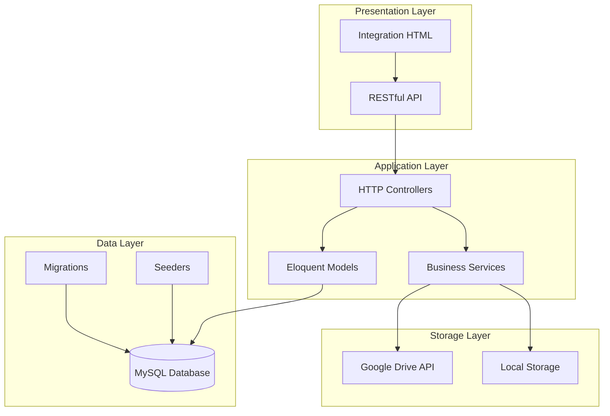
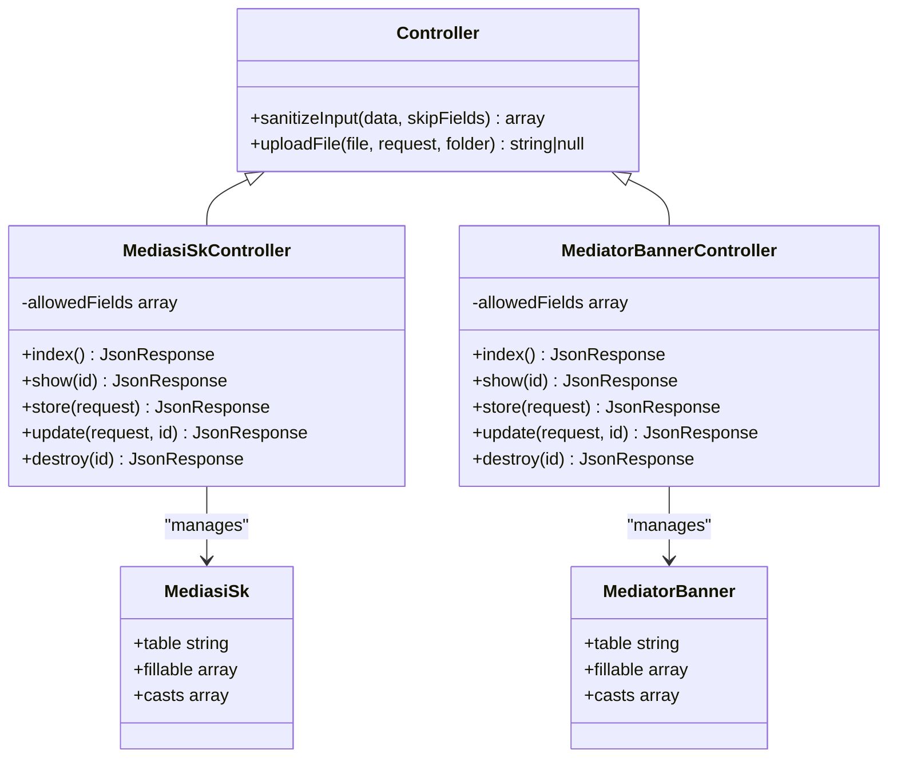
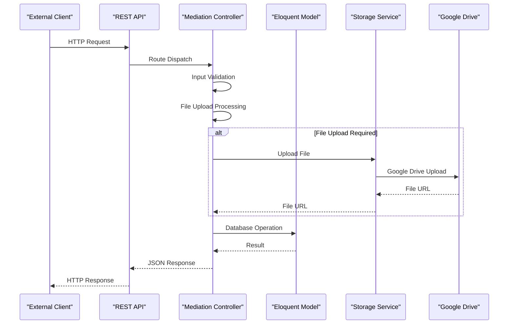
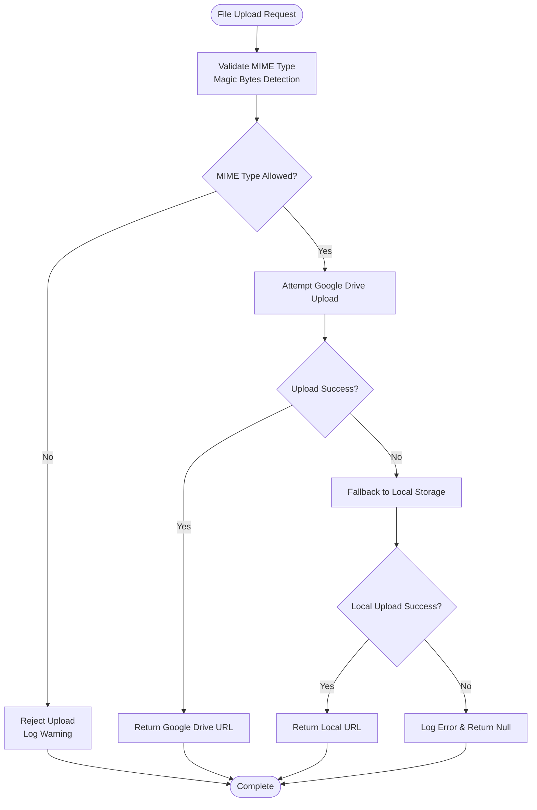
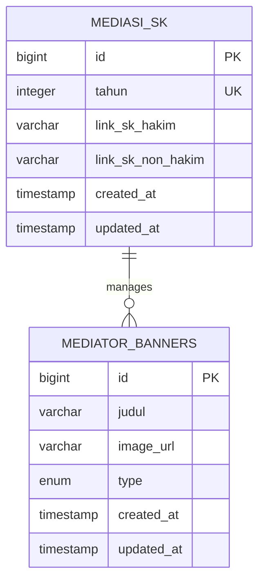
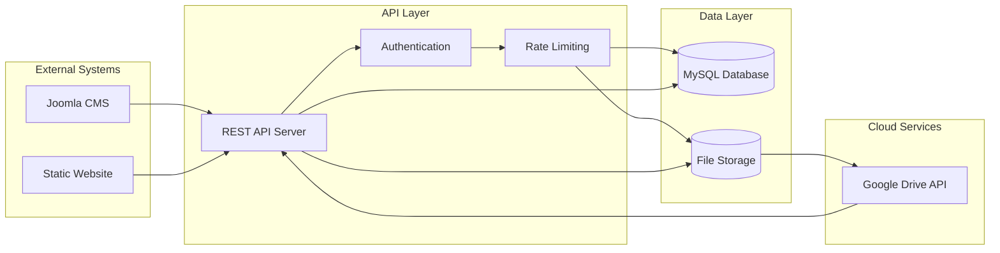

# Mediasi Database Design

<cite>
**Referenced Files in This Document**
- [2026_04_05_165903_create_mediasi_sk_table.php](file://database/migrations/2026_04_05_165903_create_mediasi_sk_table.php)
- [2026_04_05_165903_create_mediator_banners_table.php](file://database/migrations/2026_04_05_165903_create_mediator_banners_table.php)
- [MediasiSk.php](file://app/Models/MediasiSk.php)
- [MediatorBanner.php](file://app/Models/MediatorBanner.php)
- [MediasiSkController.php](file://app/Http/Controllers/MediasiSkController.php)
- [MediatorBannerController.php](file://app/Http/Controllers/MediatorBannerController.php)
- [Controller.php](file://app/Http/Controllers/Controller.php)
- [GoogleDriveService.php](file://app/Services/GoogleDriveService.php)
- [database.php](file://config/database.php)
- [MediasiSeeder.php](file://database/seeders/MediasiSeeder.php)
- [web.php](file://routes/web.php)
- [mediasi-integration.html](file://docs/mediasi-integration.html)
</cite>

## Table of Contents
1. [Introduction](#introduction)
2. [Project Structure](#project-structure)
3. [Core Components](#core-components)
4. [Architecture Overview](#architecture-overview)
5. [Detailed Component Analysis](#detailed-component-analysis)
6. [Database Schema Design](#database-schema-design)
7. [API Endpoint Specifications](#api-endpoint-specifications)
8. [Security and Validation](#security-and-validation)
9. [Integration Patterns](#integration-patterns)
10. [Performance Considerations](#performance-considerations)
11. [Troubleshooting Guide](#troubleshooting-guide)
12. [Conclusion](#conclusion)

## Introduction

The Mediasi Database Design represents a comprehensive content management system for the Mediation Department of the Penajam District Court. This system manages official mediation documents (SK Mediator) and promotional banners for mediator recruitment, integrating seamlessly with both local storage and Google Drive cloud storage solutions.

The design encompasses two primary data entities: **MediasiSK** for official court documents and **MediatorBanners** for promotional materials. The system provides RESTful APIs for content management, robust validation mechanisms, and secure file upload capabilities with automatic cloud synchronization.

## Project Structure

The Mediasi module follows Laravel Lumen's MVC architecture pattern with clear separation of concerns:



**Diagram sources**
- [web.php:77-86](file://routes/web.php#L77-L86)
- [Controller.php:40-95](file://app/Http/Controllers/Controller.php#L40-L95)

**Section sources**
- [web.php:1-192](file://routes/web.php#L1-L192)
- [database.php:1-30](file://config/database.php#L1-L30)

## Core Components

### Database Entities

The system consists of two primary database entities managed through dedicated Eloquent models:

#### MediasiSK Entity
- **Purpose**: Stores official SK (Surat Keputusan) documents for mediators
- **Unique Constraint**: Year-based uniqueness ensures single document per year
- **File Management**: Supports both Hakim and Non-Hakim mediator SK documents

#### MediatorBanner Entity  
- **Purpose**: Manages promotional banners for mediator recruitment
- **Type Classification**: Distinguishes between Hakim and Non-Hakim mediator categories
- **Image Management**: Handles promotional image assets with validation

### Controller Architecture

Both entities utilize a standardized CRUD controller pattern with consistent validation, sanitization, and file upload capabilities:



**Diagram sources**
- [Controller.php:18-95](file://app/Http/Controllers/Controller.php#L18-L95)
- [MediasiSkController.php:9-147](file://app/Http/Controllers/MediasiSkController.php#L9-L147)
- [MediatorBannerController.php:9-134](file://app/Http/Controllers/MediatorBannerController.php#L9-L134)

**Section sources**
- [MediasiSk.php:1-23](file://app/Models/MediasiSk.php#L1-L23)
- [MediatorBanner.php:1-22](file://app/Models/MediatorBanner.php#L1-L22)

## Architecture Overview

The Mediasi system implements a multi-tier architecture with clear separation between presentation, business logic, and data persistence layers:



**Diagram sources**
- [MediasiSkController.php:52-82](file://app/Http/Controllers/MediasiSkController.php#L52-L82)
- [Controller.php:40-95](file://app/Http/Controllers/Controller.php#L40-L95)
- [GoogleDriveService.php:38-82](file://app/Services/GoogleDriveService.php#L38-L82)

## Detailed Component Analysis

### Database Schema Design

#### MediasiSK Table Structure

| Column | Type | Constraints | Description |
|--------|------|-------------|-------------|
| `id` | bigint unsigned | PRIMARY KEY, AUTO_INCREMENT | Unique identifier |
| `tahun` | integer | UNIQUE | Year of SK issuance (unique constraint) |
| `link_sk_hakim` | varchar(500) | NULLABLE | Google Drive link for Hakim mediator SK |
| `link_sk_non_hakim` | varchar(500) | NULLABLE | Google Drive link for Non-Hakim mediator SK |
| `created_at` | timestamp | NULLABLE | Record creation timestamp |
| `updated_at` | timestamp | NULLABLE | Last update timestamp |

#### MediatorBanners Table Structure

| Column | Type | Constraints | Description |
|--------|------|-------------|-------------|
| `id` | bigint unsigned | PRIMARY KEY, AUTO_INCREMENT | Unique identifier |
| `judul` | varchar(100) | NOT NULL | Banner title/description |
| `image_url` | varchar(500) | NULLABLE | Google Drive image URL |
| `type` | enum('hakim','non-hakim') | NOT NULL | Mediator category classification |
| `created_at` | timestamp | NULLABLE | Record creation timestamp |
| `updated_at` | timestamp | NULLABLE | Last update timestamp |

### API Endpoint Specifications

#### MediasiSK Endpoints

| Method | Endpoint | Authentication | Purpose |
|--------|----------|----------------|---------|
| GET | `/api/mediasi-sk` | Public | Retrieve all SK documents (sorted by year desc) |
| GET | `/api/mediasi-sk/{id}` | Public | Fetch specific SK document |
| POST | `/api/mediasi-sk` | API Key Protected | Create new SK document |
| PUT/PATCH | `/api/mediasi-sk/{id}` | API Key Protected | Update existing SK document |
| DELETE | `/api/mediasi-sk/{id}` | API Key Protected | Remove SK document |

#### MediatorBanner Endpoints

| Method | Endpoint | Authentication | Purpose |
|--------|----------|----------------|---------|
| GET | `/api/mediator-banners` | Public | Retrieve all banners (sorted by creation date desc) |
| GET | `/api/mediator-banners/{id}` | Public | Fetch specific banner |
| POST | `/api/mediator-banners` | API Key Protected | Create new banner |
| PUT/PATCH | `/api/mediator-banners/{id}` | API Key Protected | Update existing banner |
| DELETE | `/api/mediator-banners/{id}` | API Key Protected | Remove banner |

### Security and Validation Implementation

#### Input Sanitization
The base Controller implements comprehensive XSS prevention through:
- HTML tag stripping using `strip_tags()`
- String trimming and empty value normalization
- Configurable skip fields for sensitive data

#### File Upload Security
Multi-layered validation ensures file integrity and security:



**Diagram sources**
- [Controller.php:42-60](file://app/Http/Controllers/Controller.php#L42-L60)
- [Controller.php:76-94](file://app/Http/Controllers/Controller.php#L76-L94)

**Section sources**
- [Controller.php:18-29](file://app/Http/Controllers/Controller.php#L18-L29)
- [Controller.php:40-95](file://app/Http/Controllers/Controller.php#L40-L95)

## Database Schema Design

### Entity Relationship Diagram



**Diagram sources**
- [2026_04_05_165903_create_mediasi_sk_table.php:14-20](file://database/migrations/2026_04_05_165903_create_mediasi_sk_table.php#L14-L20)
- [2026_04_05_165903_create_mediator_banners_table.php:14-20](file://database/migrations/2026_04_05_165903_create_mediator_banners_table.php#L14-L20)

### Migration Implementation Details

#### MediasiSK Migration Features
- **Unique Year Constraint**: Ensures single SK document per calendar year
- **Nullable File Links**: Supports partial document availability
- **Standard Timestamps**: Automatic creation and modification tracking

#### MediatorBanners Migration Features  
- **Enum Type Validation**: Restricts banner types to predefined categories
- **String Length Limits**: Prevents data overflow in title fields
- **Flexible Image URLs**: Supports various image hosting solutions

**Section sources**
- [2026_04_05_165903_create_mediasi_sk_table.php:1-31](file://database/migrations/2026_04_05_165903_create_mediasi_sk_table.php#L1-L31)
- [2026_04_05_165903_create_mediator_banners_table.php:1-31](file://database/migrations/2026_04_05_165903_create_mediator_banners_table.php#L1-L31)

## API Endpoint Specifications

### Request/Response Patterns

#### Standard Response Format
All endpoints follow a consistent JSON response structure:
```json
{
  "success": true,
  "data": {},
  "message": "Operation successful"
}
```

#### Error Response Format
Failed requests return structured error responses:
```json
{
  "success": false,
  "message": "Error description"
}
```

### Validation Rules

#### MediasiSK Validation
- **Year**: Required integer, unique across records
- **File Fields**: Optional PDF files with 20MB size limit
- **Dynamic Uniqueness**: Excludes current record ID during updates

#### MediatorBanner Validation
- **Title**: Required string, max 100 characters
- **Image**: Optional JPG/JPEG/PNG files with 5MB size limit
- **Type**: Required enum validation ('hakim' or 'non-hakim')

**Section sources**
- [MediasiSkController.php:54-60](file://app/Http/Controllers/MediasiSkController.php#L54-L60)
- [MediatorBannerController.php:54-59](file://app/Http/Controllers/MediatorBannerController.php#L54-L59)

## Security and Validation

### Access Control Implementation

The system implements tiered authentication:
- **Public Endpoints**: No authentication required (rate limited)
- **Protected Endpoints**: API Key middleware + rate limiting
- **Rate Limiting**: 100 requests per minute for all endpoints

### File Security Measures

#### MIME Type Validation
- Magic byte detection prevents filename extension manipulation
- Supported formats: PDF, DOC, DOCX, XLS, XLSX, JPEG, PNG
- Automatic logging of rejected uploads

#### Cloud Storage Integration
- **Primary**: Google Drive with automatic folder organization
- **Fallback**: Local storage with randomized filenames
- **Public Access**: Configurable permissions for file sharing

**Section sources**
- [Controller.php:42-60](file://app/Http/Controllers/Controller.php#L42-L60)
- [GoogleDriveService.php:38-82](file://app/Services/GoogleDriveService.php#L38-L82)

## Integration Patterns

### Frontend Integration

The system provides seamless integration through:
- **Static Content Loading**: Pre-rendered HTML with dynamic data fetching
- **Responsive Design**: Mobile-first approach with adaptive layouts
- **Error Handling**: Graceful degradation for failed API requests

### Data Flow Integration



**Diagram sources**
- [mediasi-integration.html:207-391](file://docs/mediasi-integration.html#L207-L391)
- [web.php:77-86](file://routes/web.php#L77-L86)

**Section sources**
- [mediasi-integration.html:207-391](file://docs/mediasi-integration.html#L207-L391)

## Performance Considerations

### Database Optimization
- **Indexing Strategy**: Unique constraints on year fields for fast lookups
- **Query Optimization**: Sorted retrieval with appropriate ordering
- **Connection Pooling**: MySQL connection management for concurrent requests

### File Storage Optimization
- **CDN Integration**: Google Drive provides global CDN distribution
- **Lazy Loading**: Images loaded only when visible in viewport
- **Compression**: Automatic optimization for supported image formats

### Caching Strategy
- **API Response Caching**: Public endpoints cacheable for improved performance
- **Static Asset Optimization**: Minimized CSS and JavaScript delivery
- **Browser Caching**: Appropriate cache headers for static resources

## Troubleshooting Guide

### Common Issues and Solutions

#### File Upload Failures
**Symptoms**: Upload requests returning null URLs
**Causes**: 
- Invalid MIME type detection
- Google Drive API quota exceeded
- Network connectivity issues

**Solutions**:
- Verify file format compatibility
- Check Google Drive API credentials
- Monitor network connectivity
- Review application logs for detailed error messages

#### Database Connection Issues
**Symptoms**: API endpoints failing with database errors
**Causes**:
- Incorrect database credentials
- Network connectivity problems
- Database server overload

**Solutions**:
- Validate database configuration in `.env` file
- Check database server status
- Review connection pooling settings
- Monitor database performance metrics

#### Authentication Failures
**Symptoms**: Protected endpoints returning 401 errors
**Causes**:
- Missing or invalid API key
- Expired authentication tokens
- Rate limit exceeded

**Solutions**:
- Verify API key configuration
- Check rate limit quotas
- Implement proper error handling
- Review authentication middleware logs

**Section sources**
- [Controller.php:55-74](file://app/Http/Controllers/Controller.php#L55-L74)
- [GoogleDriveService.php:51-54](file://app/Services/GoogleDriveService.php#L51-L54)

## Conclusion

The Mediasi Database Design represents a robust, scalable solution for managing court mediation documentation and promotional materials. The system's architecture emphasizes security, maintainability, and extensibility while providing seamless integration with external systems.

Key strengths include:
- **Comprehensive Security**: Multi-layered validation and sanitization
- **Flexible Storage**: Hybrid cloud and local storage support
- **RESTful Design**: Consistent API patterns with proper error handling
- **Scalable Architecture**: Clear separation of concerns and modular design
- **Production Ready**: Comprehensive validation, logging, and monitoring capabilities

The implementation demonstrates best practices in modern web application development, providing a solid foundation for future enhancements and extensions to the mediation department's digital infrastructure.