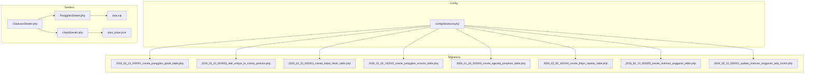
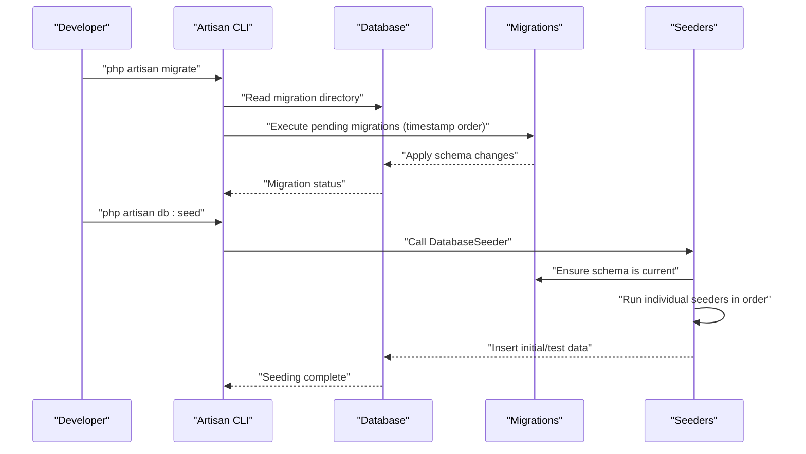
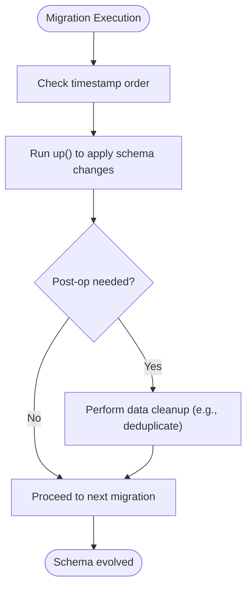
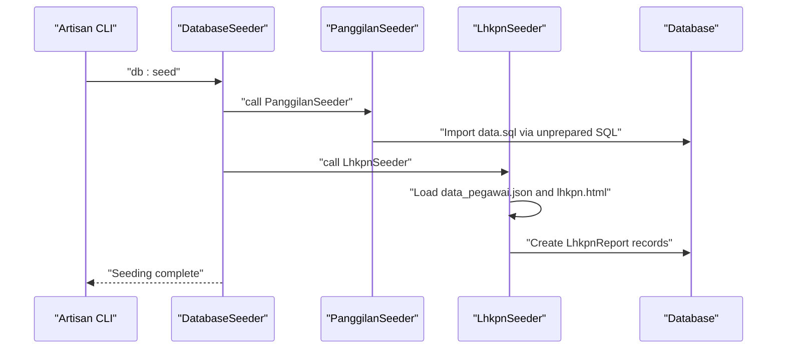
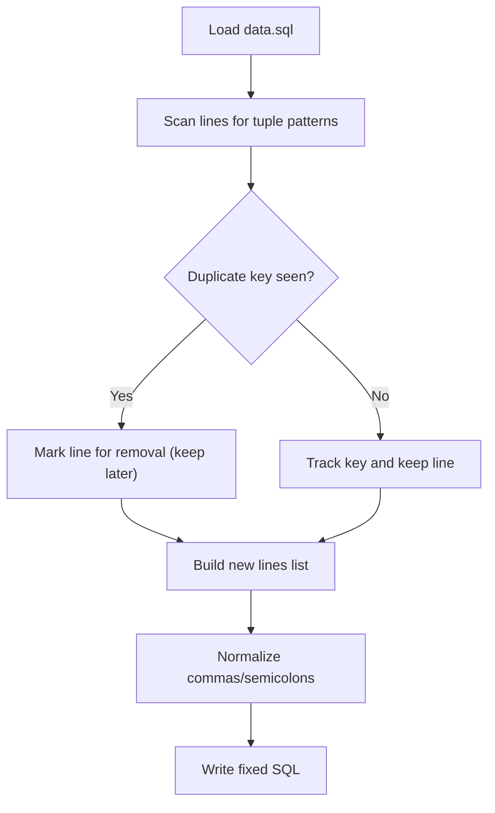
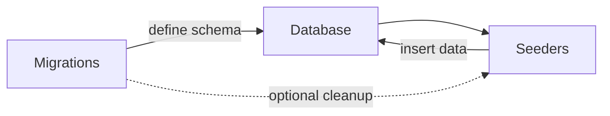
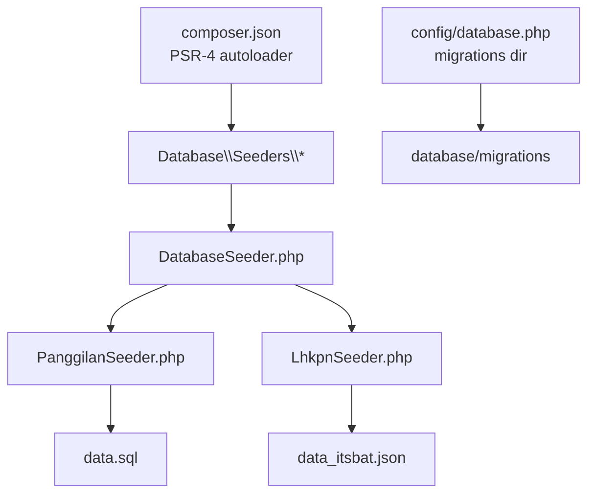

# Migrations and Seeding

<cite>
**Referenced Files in This Document**
- [composer.json](file://composer.json)
- [config/database.php](file://config/database.php)
- [database/migrations/2026_01_21_000001_create_panggilan_ghaib_table.php](file://database/migrations/2026_01_21_000001_create_panggilan_ghaib_table.php)
- [database/migrations/2026_01_21_000002_add_unique_to_nomor_perkara.php](file://database/migrations/2026_01_21_000002_add_unique_to_nomor_perkara.php)
- [database/migrations/2026_01_21_000003_create_itsbat_nikah_table.php](file://database/migrations/2026_01_21_000003_create_itsbat_nikah_table.php)
- [database/migrations/2026_01_25_162515_create_panggilan_ecourts_table.php](file://database/migrations/2026_01_25_162515_create_panggilan_ecourts_table.php)
- [database/migrations/2026_01_26_000000_create_agenda_pimpinan_table.php](file://database/migrations/2026_01_26_000000_create_agenda_pimpinan_table.php)
- [database/migrations/2026_02_02_162040_create_lhkpn_reports_table.php](file://database/migrations/2026_02_02_162040_create_lhkpn_reports_table.php)
- [database/migrations/2026_02_10_000000_create_realisasi_anggaran_table.php](file://database/migrations/2026_02_10_000000_create_realisasi_anggaran_table.php)
- [database/migrations/2026_02_10_000001_update_realisasi_anggaran_add_month.php](file://database/migrations/2026_02_10_000001_update_realisasi_anggaran_add_month.php)
- [database/seeders/DatabaseSeeder.php](file://database/seeders/DatabaseSeeder.php)
- [database/seeders/PanggilanSeeder.php](file://database/seeders/PanggilanSeeder.php)
- [database/seeders/LhkpnSeeder.php](file://database/seeders/LhkpnSeeder.php)
- [database/seeders/data.sql](file://database/seeders/data.sql)
- [database/seeders/data_itsbat.json](file://database/seeders/data_itsbat.json)
- [fix_duplicates.py](file://fix_duplicates.py)
</cite>

## Table of Contents
1. [Introduction](#introduction)
2. [Project Structure](#project-structure)
3. [Core Components](#core-components)
4. [Architecture Overview](#architecture-overview)
5. [Detailed Component Analysis](#detailed-component-analysis)
6. [Dependency Analysis](#dependency-analysis)
7. [Performance Considerations](#performance-considerations)
8. [Troubleshooting Guide](#troubleshooting-guide)
9. [Conclusion](#conclusion)

## Introduction
This document explains the database migration and seeding system used in the project. It covers the migration architecture, version control, rollback procedures, and the data seeding process including initial data population, test data generation, and duplicate handling mechanisms. It also documents the Python script for deduplication and the manual SQL import process, migration best practices, naming conventions, dependency management, and the relationship between migrations and seeders. Practical examples of common migration patterns and data transformation procedures are included, along with troubleshooting guidance for typical migration issues.

## Project Structure
The migration and seeding system is organized under the database directory:
- Migrations live in database/migrations and follow Laravel’s timestamped naming convention.
- Seeders live in database/seeders and are orchestrated by a root DatabaseSeeder.
- Configuration for database connections and migration directory is in config/database.php.
- Composer autoloading maps namespaces to seeder classes.

**Diagram sources**
- [config/database.php:1-30](file://config/database.php#L1-L30)
- [database/migrations/2026_01_21_000001_create_panggilan_ghaib_table.php:1-42](file://database/migrations/2026_01_21_000001_create_panggilan_ghaib_table.php#L1-L42)
- [database/migrations/2026_01_21_000002_add_unique_to_nomor_perkara.php:1-37](file://database/migrations/2026_01_21_000002_add_unique_to_nomor_perkara.php#L1-L37)
- [database/migrations/2026_01_21_000003_create_itsbat_nikah_table.php:1-39](file://database/migrations/2026_01_21_000003_create_itsbat_nikah_table.php#L1-L39)
- [database/migrations/2026_01_25_162515_create_panggilan_ecourts_table.php:1-39](file://database/migrations/2026_01_25_162515_create_panggilan_ecourts_table.php#L1-L39)
- [database/migrations/2026_01_26_000000_create_agenda_pimpinan_table.php:1-29](file://database/migrations/2026_01_26_000000_create_agenda_pimpinan_table.php#L1-L29)
- [database/migrations/2026_02_02_162040_create_lhkpn_reports_table.php:1-36](file://database/migrations/2026_02_02_162040_create_lhkpn_reports_table.php#L1-L36)
- [database/migrations/2026_02_10_000000_create_realisasi_anggaran_table.php:1-36](file://database/migrations/2026_02_10_000000_create_realisasi_anggaran_table.php#L1-L36)
- [database/migrations/2026_02_10_000001_update_realisasi_anggaran_add_month.php:1-30](file://database/migrations/2026_02_10_000001_update_realisasi_anggaran_add_month.php#L1-L30)
- [database/seeders/DatabaseSeeder.php:1-32](file://database/seeders/DatabaseSeeder.php#L1-L32)
- [database/seeders/PanggilanSeeder.php:1-28](file://database/seeders/PanggilanSeeder.php#L1-L28)
- [database/seeders/LhkpnSeeder.php:1-205](file://database/seeders/LhkpnSeeder.php#L1-L205)
- [database/seeders/data.sql:1-175](file://database/seeders/data.sql#L1-L175)
- [database/seeders/data_itsbat.json:1-800](file://database/seeders/data_itsbat.json#L1-L800)

**Section sources**
- [composer.json:1-47](file://composer.json#L1-L47)
- [config/database.php:1-30](file://config/database.php#L1-L30)

## Core Components
- Migrations: Laravel-style migration classes define schema changes and include rollback logic via the down method. They are executed in timestamp order.
- Seeders: Classes populate initial or test data. Some import raw SQL, others parse structured JSON and create model records.
- Root DatabaseSeeder: Orchestrates the execution order of multiple seeder classes.
- Configuration: Database connection settings and migration directory are configured centrally.

Key responsibilities:
- Migrations: Create/alter tables, add indexes/constraints, and manage versioned schema evolution.
- Seeders: Load initial datasets, handle deduplication/preprocessing, and integrate external data sources.
- Orchestration: Run migrations first, then seeders to populate data.

**Section sources**
- [database/migrations/2026_01_21_000001_create_panggilan_ghaib_table.php:1-42](file://database/migrations/2026_01_21_000001_create_panggilan_ghaib_table.php#L1-L42)
- [database/migrations/2026_01_21_000002_add_unique_to_nomor_perkara.php:1-37](file://database/migrations/2026_01_21_000002_add_unique_to_nomor_perkara.php#L1-L37)
- [database/seeders/DatabaseSeeder.php:1-32](file://database/seeders/DatabaseSeeder.php#L1-L32)
- [database/seeders/PanggilanSeeder.php:1-28](file://database/seeders/PanggilanSeeder.php#L1-L28)
- [database/seeders/LhkpnSeeder.php:1-205](file://database/seeders/LhkpnSeeder.php#L1-L205)

## Architecture Overview
The migration and seeding pipeline follows a deterministic order:
- Apply migrations in timestamp order to evolve the schema.
- Run seeders to load data, including deduplication preprocessing for SQL imports.

**Diagram sources**
- [config/database.php:27-27](file://config/database.php#L27-L27)
- [database/seeders/DatabaseSeeder.php:17-29](file://database/seeders/DatabaseSeeder.php#L17-L29)

## Detailed Component Analysis

### Migration System Architecture
- Timestamped filenames ensure deterministic ordering.
- Each migration class defines:
  - up(): applies schema changes (tables, indexes, constraints).
  - down(): reverses changes for rollback.
- Example migrations:
  - Create tables for various modules (e.g., panggilan, itsbat, realisasi anggaran).
  - Add constraints and indexes for performance and integrity.
  - Alter existing tables to add new columns.

Rollback behavior:
- down() removes indexes/constraints and drops tables as needed.
- For data cleanup during schema changes (e.g., removing duplicates before adding uniqueness), the migration performs explicit cleanup in up() and reverts via down().

**Diagram sources**
- [database/migrations/2026_01_21_000002_add_unique_to_nomor_perkara.php:14-24](file://database/migrations/2026_01_21_000002_add_unique_to_nomor_perkara.php#L14-L24)

**Section sources**
- [database/migrations/2026_01_21_000001_create_panggilan_ghaib_table.php:11-40](file://database/migrations/2026_01_21_000001_create_panggilan_ghaib_table.php#L11-L40)
- [database/migrations/2026_01_21_000002_add_unique_to_nomor_perkara.php:12-35](file://database/migrations/2026_01_21_000002_add_unique_to_nomor_perkara.php#L12-L35)
- [database/migrations/2026_01_21_000003_create_itsbat_nikah_table.php:11-37](file://database/migrations/2026_01_21_000003_create_itsbat_nikah_table.php#L11-L37)
- [database/migrations/2026_01_25_162515_create_panggilan_ecourts_table.php:11-36](file://database/migrations/2026_01_25_162515_create_panggilan_ecourts_table.php#L11-L36)
- [database/migrations/2026_01_26_000000_create_agenda_pimpinan_table.php:11-27](file://database/migrations/2026_01_26_000000_create_agenda_pimpinan_table.php#L11-L27)
- [database/migrations/2026_02_02_162040_create_lhkpn_reports_table.php:12-34](file://database/migrations/2026_02_02_162040_create_lhkpn_reports_table.php#L12-L34)
- [database/migrations/2026_02_10_000000_create_realisasi_anggaran_table.php:12-34](file://database/migrations/2026_02_10_000000_create_realisasi_anggaran_table.php#L12-L34)
- [database/migrations/2026_02_10_000001_update_realisasi_anggaran_add_month.php:12-28](file://database/migrations/2026_02_10_000001_update_realisasi_anggaran_add_month.php#L12-L28)

### Data Seeding Strategy
- Root orchestrator: DatabaseSeeder calls multiple specific seeders in a defined order.
- SQL import seeder: Loads preprocessed SQL for initial data.
- Structured JSON seeder: Parses JSON and creates model records, including NIP-to-name matching and link extraction.
- Deduplication: A Python script preprocesses SQL to remove duplicate entries and normalize punctuation.

**Diagram sources**
- [database/seeders/DatabaseSeeder.php:17-29](file://database/seeders/DatabaseSeeder.php#L17-L29)
- [database/seeders/PanggilanSeeder.php:14-26](file://database/seeders/PanggilanSeeder.php#L14-L26)
- [database/seeders/LhkpnSeeder.php:18-203](file://database/seeders/LhkpnSeeder.php#L18-L203)

**Section sources**
- [database/seeders/DatabaseSeeder.php:15-30](file://database/seeders/DatabaseSeeder.php#L15-L30)
- [database/seeders/PanggilanSeeder.php:14-26](file://database/seeders/PanggilanSeeder.php#L14-L26)
- [database/seeders/LhkpnSeeder.php:18-203](file://database/seeders/LhkpnSeeder.php#L18-L203)

### Duplicate Handling Mechanisms
- SQL deduplication: A Python script identifies duplicate entries by extracting identifiers, keeps the last occurrence, and normalizes SQL statement punctuation.
- Migration-level deduplication: A migration cleans duplicates before enforcing uniqueness on a column.

**Diagram sources**
- [fix_duplicates.py:11-67](file://fix_duplicates.py#L11-L67)

**Section sources**
- [fix_duplicates.py:1-70](file://fix_duplicates.py#L1-L70)
- [database/migrations/2026_01_21_000002_add_unique_to_nomor_perkara.php:14-24](file://database/migrations/2026_01_21_000002_add_unique_to_nomor_perkara.php#L14-L24)

### Relationship Between Migrations and Seeders
- Migrations define the schema and integrity rules (indexes, unique constraints).
- Seeders populate data after migrations have been applied.
- When seeders import SQL, migrations may include pre-seeding cleanup (e.g., deduplication) to ensure downstream constraints succeed.

**Diagram sources**
- [database/migrations/2026_01_21_000002_add_unique_to_nomor_perkara.php:14-24](file://database/migrations/2026_01_21_000002_add_unique_to_nomor_perkara.php#L14-L24)
- [database/seeders/PanggilanSeeder.php:16-22](file://database/seeders/PanggilanSeeder.php#L16-L22)

**Section sources**
- [database/migrations/2026_01_21_000002_add_unique_to_nomor_perkara.php:12-35](file://database/migrations/2026_01_21_000002_add_unique_to_nomor_perkara.php#L12-L35)
- [database/seeders/PanggilanSeeder.php:14-26](file://database/seeders/PanggilanSeeder.php#L14-L26)

## Dependency Analysis
- Composer autoload maps namespace Database\Seeders to database/seeders, enabling Artisan to discover and run seeders.
- Database configuration centralizes connection settings and migration directory location.
- Seeders depend on:
  - Filesystem for SQL/JSON inputs.
  - Database connection for inserts/unprepared statements.
  - Model classes for structured insertions (e.g., LhkpnReport).

**Diagram sources**
- [composer.json:22-27](file://composer.json#L22-L27)
- [config/database.php:27-27](file://config/database.php#L27-L27)
- [database/seeders/DatabaseSeeder.php:17-29](file://database/seeders/DatabaseSeeder.php#L17-L29)
- [database/seeders/PanggilanSeeder.php:16-22](file://database/seeders/PanggilanSeeder.php#L16-L22)
- [database/seeders/LhkpnSeeder.php:20-40](file://database/seeders/LhkpnSeeder.php#L20-L40)

**Section sources**
- [composer.json:22-27](file://composer.json#L22-L27)
- [config/database.php:27-27](file://config/database.php#L27-L27)

## Performance Considerations
- Indexes: Migrations add indexes on frequently queried columns (e.g., nomor_perkara, tahun_perkara) to improve lookup performance.
- Constraints: Unique constraints prevent duplicate keys; combined with pre-seeding deduplication, they ensure data integrity.
- Batch imports: Using unprepared SQL for large datasets can be efficient but requires careful deduplication and validation.
- Parsing complexity: JSON/HTML parsing in seeders involves DOM traversal and string matching; caching intermediate results (e.g., name-to-NIP mapping) reduces repeated computation.

[No sources needed since this section provides general guidance]

## Troubleshooting Guide
Common issues and resolutions:
- Duplicate key errors during seeding:
  - Ensure SQL was preprocessed by the deduplication script.
  - Verify migrations that enforce uniqueness ran before seeding.
- Missing or unreadable data files:
  - Confirm file paths and existence for data.sql and JSON/HTML sources.
- Unprepared SQL failures:
  - Validate SQL syntax and punctuation normalization performed by the deduplication script.
- Parsing errors in structured data:
  - Check that HTML/JSON files are present and well-formed; the seeder logs warnings on missing files.

**Section sources**
- [fix_duplicates.py:66-69](file://fix_duplicates.py#L66-L69)
- [database/seeders/PanggilanSeeder.php:19-25](file://database/seeders/PanggilanSeeder.php#L19-L25)
- [database/seeders/LhkpnSeeder.php:22-40](file://database/seeders/LhkpnSeeder.php#L22-L40)

## Conclusion
The project’s migration and seeding system combines timestamped schema evolution with targeted data loading. Migrations define the evolving schema and integrity rules, while seeders populate initial and test data using both raw SQL and structured parsing. A dedicated Python script ensures SQL imports are free of duplicates and properly formatted. Following the documented best practices and procedures helps maintain a reliable, repeatable, and consistent database state across environments.