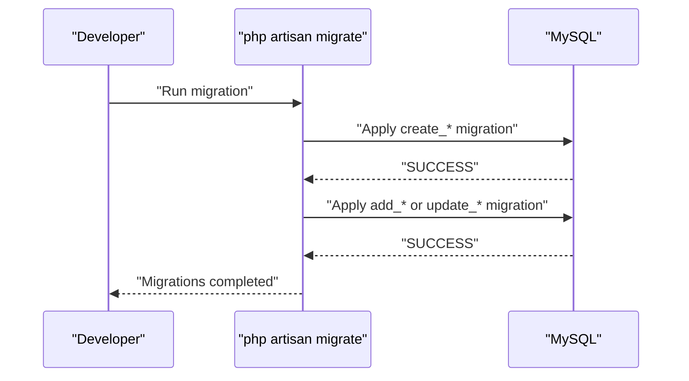
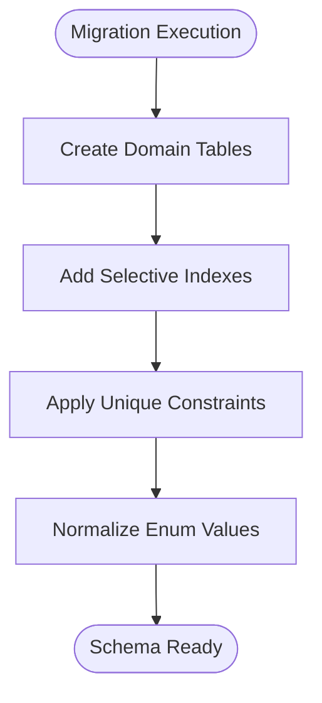
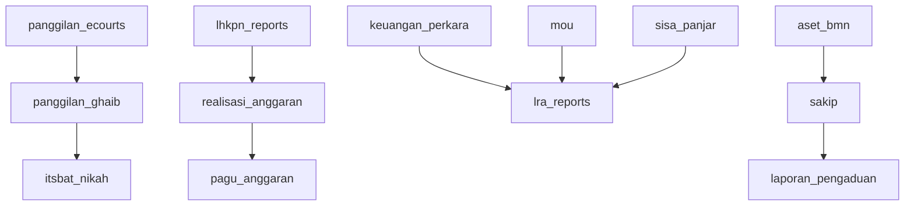

# Schema Overview

<cite>
**Referenced Files in This Document**
- [config/database.php](file://config/database.php)
- [2026_01_21_000001_create_panggilan_ghaib_table.php](file://database/migrations/2026_01_21_000001_create_panggilan_ghaib_table.php)
- [2026_01_21_000002_add_unique_to_nomor_perkara.php](file://database/migrations/2026_01_21_000002_add_unique_to_nomor_perkara.php)
- [2026_01_21_000003_create_itsbat_nikah_table.php](file://database/migrations/2026_01_21_000003_create_itsbat_nikah_table.php)
- [2026_01_25_162515_create_panggilan_ecourts_table.php](file://database/migrations/2026_01_25_162515_create_panggilan_ecourts_table.php)
- [2026_02_02_162040_create_lhkpn_reports_table.php](file://database/migrations/2026_02_02_162040_create_lhkpn_reports_table.php)
- [2026_02_10_000000_create_realisasi_anggaran_table.php](file://database/migrations/2026_02_10_000000_create_realisasi_anggaran_table.php)
- [2026_02_10_000001_update_realisasi_anggaran_add_month.php](file://database/migrations/2026_02_10_000001_update_realisasi_anggaran_add_month.php)
- [2026_02_10_000002_create_pagu_anggaran_table.php](file://database/migrations/2026_02_10_000002_create_pagu_anggaran_table.php)
- [2026_02_10_000004_rename_spt_to_lhkasn.php](file://database/migrations/2026_02_10_000004_rename_spt_to_lhkasn.php)
- [2026_02_19_000000_create_dipapok_table.php](file://database/migrations/2026_02_19_000000_create_dipapok_table.php)
- [2026_02_26_000000_create_aset_bmn_table.php](file://database/migrations/2026_02_26_000000_create_aset_bmn_table.php)
- [2026_03_31_000001_create_sakip_table.php](file://database/migrations/2026_03_31_000001_create_sakip_table.php)
- [2026_03_31_000002_create_laporan_pengaduan_table.php](file://database/migrations/2026_03_31_000002_create_laporan_pengaduan_table.php)
- [2026_04_01_000000_create_keuangan_perkara_table.php](file://database/migrations/2026_04_01_000000_create_keuangan_perkara_table.php)
- [2026_04_01_000001_create_mou_table.php](file://database/migrations/2026_04_01_000001_create_mou_table.php)
- [2026_04_01_000002_create_lra_reports_table.php](file://database/migrations/2026_04_01_000002_create_lra_reports_table.php)
- [2026_04_02_000000_rename_triwulan_to_periode_on_lra_reports.php](file://database/migrations/2026_04_02_000000_rename_triwulan_to_periode_on_lra_reports.php)
- [2026_04_01_000001_create_sisa_panjar_table.php](file://database/migrations/2026_04_01_000001_create_sisa_panjar_table.php)
</cite>

## Table of Contents
1. [Introduction](#introduction)
2. [Project Structure](#project-structure)
3. [Core Components](#core-components)
4. [Architecture Overview](#architecture-overview)
5. [Detailed Component Analysis](#detailed-component-analysis)
6. [Dependency Analysis](#dependency-analysis)
7. [Performance Considerations](#performance-considerations)
8. [Troubleshooting Guide](#troubleshooting-guide)
9. [Conclusion](#conclusion)

## Introduction
This document provides a comprehensive schema overview for the Lumen API’s database design. It explains the database architecture, connection configuration, character set and collation settings, and the migration system organization. It documents the 17 migration files and their chronological evolution, outlines naming conventions and table prefixes, and describes relationship patterns across the system. It also covers configuration options, indexing strategies, and performance considerations derived from the migration definitions.

## Project Structure
The database schema is managed via Laravel/Lumen migrations located under database/migrations. The configuration for the MySQL connection is defined in config/database.php, including driver, host, port, credentials, charset, collation, and strict mode settings. Migrations define tables, indexes, constraints, and column types aligned to functional domains such as court summonings, financial reporting, asset declarations, and administrative reports.

```mermaid
graph TB
cfg["config/database.php<br/>MySQL connection config"] --> migdir["database/migrations/<br/>Migration files"]
migdir --> m1["2026_01_21_000001_create_panggilan_ghaib_table.php"]
migdir --> m2["2026_01_21_000002_add_unique_to_nomor_perkara.php"]
migdir --> m3["2026_01_21_000003_create_itsbat_nikah_table.php"]
migdir --> m4["2026_01_25_162515_create_panggilan_ecourts_table.php"]
migdir --> m5["2026_02_02_162040_create_lhkpn_reports_table.php"]
migdir --> m6["2026_02_10_000000_create_realisasi_anggaran_table.php"]
migdir --> m7["2026_02_10_000001_update_realisasi_anggaran_add_month.php"]
migdir --> m8["2026_02_10_000002_create_pagu_anggaran_table.php"]
migdir --> m9["2026_02_10_000004_rename_spt_to_lhkasn.php"]
migdir --> m10["2026_02_19_000000_create_dipapok_table.php"]
migdir --> m11["2026_02_26_000000_create_aset_bmn_table.php"]
migdir --> m12["2026_03_31_000001_create_sakip_table.php"]
migdir --> m13["2026_03_31_000002_create_laporan_pengaduan_table.php"]
migdir --> m14["2026_04_01_000000_create_keuangan_perkara_table.php"]
migdir --> m15["2026_04_01_000001_create_mou_table.php"]
migdir --> m16["2026_04_01_000002_create_lra_reports_table.php"]
migdir --> m17["2026_04_02_000000_rename_triwulan_to_periode_on_lra_reports.php"]
migdir --> m18["2026_04_01_000001_create_sisa_panjar_table.php"]
```

**Diagram sources**
- [config/database.php:1-30](file://config/database.php#L1-L30)
- [2026_01_21_000001_create_panggilan_ghaib_table.php:1-42](file://database/migrations/2026_01_21_000001_create_panggilan_ghaib_table.php#L1-L42)
- [2026_01_21_000002_add_unique_to_nomor_perkara.php:1-37](file://database/migrations/2026_01_21_000002_add_unique_to_nomor_perkara.php#L1-L37)
- [2026_01_21_000003_create_itsbat_nikah_table.php:1-39](file://database/migrations/2026_01_21_000003_create_itsbat_nikah_table.php#L1-L39)
- [2026_01_25_162515_create_panggilan_ecourts_table.php:1-39](file://database/migrations/2026_01_25_162515_create_panggilan_ecourts_table.php#L1-L39)
- [2026_02_02_162040_create_lhkpn_reports_table.php:1-36](file://database/migrations/2026_02_02_162040_create_lhkpn_reports_table.php#L1-L36)
- [2026_02_10_000000_create_realisasi_anggaran_table.php:1-36](file://database/migrations/2026_02_10_000000_create_realisasi_anggaran_table.php#L1-L36)
- [2026_02_10_000001_update_realisasi_anggaran_add_month.php:1-30](file://database/migrations/2026_02_10_000001_update_realisasi_anggaran_add_month.php#L1-L30)
- [2026_02_10_000002_create_pagu_anggaran_table.php:1-33](file://database/migrations/2026_02_10_000002_create_pagu_anggaran_table.php#L1-L33)
- [2026_02_10_000004_rename_spt_to_lhkasn.php:1-31](file://database/migrations/2026_02_10_000004_rename_spt_to_lhkasn.php#L1-L31)
- [2026_02_19_000000_create_dipapok_table.php:1-32](file://database/migrations/2026_02_19_000000_create_dipapok_table.php#L1-L32)
- [2026_02_26_000000_create_aset_bmn_table.php:1-33](file://database/migrations/2026_02_26_000000_create_aset_bmn_table.php#L1-L33)
- [2026_03_31_000001_create_sakip_table.php:1-29](file://database/migrations/2026_03_31_000001_create_sakip_table.php#L1-L29)
- [2026_03_31_000002_create_laporan_pengaduan_table.php:1-41](file://database/migrations/2026_03_31_000002_create_laporan_pengaduan_table.php#L1-L41)
- [2026_04_01_000000_create_keuangan_perkara_table.php:1-31](file://database/migrations/2026_04_01_000000_create_keuangan_perkara_table.php#L1-L31)
- [2026_04_01_000001_create_mou_table.php:1-30](file://database/migrations/2026_04_01_000001_create_mou_table.php#L1-L30)
- [2026_04_01_000002_create_lra_reports_table.php:1-30](file://database/migrations/2026_04_01_000002_create_lra_reports_table.php#L1-L30)
- [2026_04_02_000000_rename_triwulan_to_periode_on_lra_reports.php:1-30](file://database/migrations/2026_04_02_000000_rename_triwulan_to_periode_on_lra_reports.php#L1-L30)
- [2026_04_01_000001_create_sisa_panjar_table.php:1-30](file://database/migrations/2026_04_01_000001_create_sisa_panjar_table.php#L1-L30)

**Section sources**
- [config/database.php:1-30](file://config/database.php#L1-L30)

## Core Components
- Database connection configuration defines the MySQL driver, host, port, credentials, socket, charset, collation, prefix, strict mode, and migration table name. These settings ensure consistent encoding and collation across tables and enable strict SQL behavior.
- Migration files define domain-specific tables with explicit indexes and constraints. They reflect a clear separation of concerns across functional modules: summonings, financial reporting, asset declarations, administrative reports, and legal finance.

Key configuration highlights:
- Driver: mysql
- Charset: utf8mb4
- Collation: utf8mb4_unicode_ci
- Prefix: empty (no global prefix)
- Strict mode enabled
- Migration table name: migrations

**Section sources**
- [config/database.php:1-30](file://config/database.php#L1-L30)

## Architecture Overview
The schema is organized around domain-focused tables with minimal cross-table foreign keys. Instead of enforcing referential integrity via foreign keys, the design relies on shared identifiers (such as nomor_perkara) and indexes to support joins and lookups. This dual-storage approach—combining indexed identifiers with lightweight constraints—optimizes read performance while simplifying maintenance.

```mermaid
erDiagram
PANGGILAN_GHAIB {
bigint id PK
smallint tahun_perkara
string nomor_perkara UK
string nama_dipanggil
date panggilan_1
date panggilan_2
date panggilan_ikrar
date tanggal_sidang
string pip
string link_surat
text keterangan
}
ITSBAT_NIKAH {
bigint id PK
string nomor_perkara UK
string pemohon_1
string pemohon_2
date tanggal_pengumuman
date tanggal_sidang
string link_detail
smallint tahun_perkara
}
PANGGILAN_ECOURTS {
bigint id PK
smallint tahun_perkara
string nomor_perkara
string nama_dipanggil
text alamat_asal
date panggilan_1
date panggilan_2
date panggilan_3
date panggilan_ikrar
date tanggal_sidang
string pip
string link_surat
text keterangan
}
LHKPN_REPORTS {
bigint id PK
string nip
string nama
string jabatan
smallint tahun
enum jenis_laporan
date tanggal_lapor
text link_tanda_terima
text link_dokumen_pendukung
}
REALISASI_ANGGARAN {
bigint id PK
string dipa
string kategori
decimal pagu
decimal realisasi
decimal sisa
decimal persentase
smallint tahun
tinyint bulan
text keterangan
string link_dokumen
}
PAGU_ANGGARAN {
bigint id PK
string dipa
string kategori
decimal jumlah_pagu
smallint tahun
}
DIPAPOK {
int id_dipa PK
string kode_dipa
string jns_dipa
smallint thn_dipa
string revisi_dipa
date tgl_dipa
bigint alokasi_dipa
string doc_dipa
string doc_pok
timestamp tgl_update
}
ASET_BMN {
bigint id PK
smallint tahun
string jenis_laporan
text link_dokumen
}
SAKIP {
bigint id PK
int tahun
string jenis_dokumen
text uraian
string link_dokumen
}
LAPORAN_PENGADUAN {
bigint id PK
int tahun
string materi_pengaduan
int jan
int feb
int mar
int apr
int mei
int jun
int jul
int agu
int sep
int okt
int nop
int des
int laporan_proses
int sisa
}
KEUANGAN_PERKARA {
bigint id PK
smallint tahun
tinyint bulan
bigint saldo_awal
bigint penerimaan
bigint pengeluaran
string url_detail
}
MOU {
bigint id PK
int tahun
string jenis_mou
text uraian
string link_dokumen
}
LRA_REPORTS {
bigint id PK
int tahun
string periode
text uraian
string link_dokumen
}
SISA_PANJAR {
bigint id PK
int tahun
string jenis_laporan
text uraian
string link_dokumen
}
```

**Diagram sources**
- [2026_01_21_000001_create_panggilan_ghaib_table.php:13-31](file://database/migrations/2026_01_21_000001_create_panggilan_ghaib_table.php#L13-L31)
- [2026_01_21_000003_create_itsbat_nikah_table.php:13-28](file://database/migrations/2026_01_21_000003_create_itsbat_nikah_table.php#L13-L28)
- [2026_01_25_162515_create_panggilan_ecourts_table.php:13-28](file://database/migrations/2026_01_25_162515_create_panggilan_ecourts_table.php#L13-L28)
- [2026_02_02_162040_create_lhkpn_reports_table.php:14-24](file://database/migrations/2026_02_02_162040_create_lhkpn_reports_table.php#L14-L24)
- [2026_02_10_000000_create_realisasi_anggaran_table.php:14-24](file://database/migrations/2026_02_10_000000_create_realisasi_anggaran_table.php#L14-L24)
- [2026_02_10_000001_update_realisasi_anggaran_add_month.php:14-17](file://database/migrations/2026_02_10_000001_update_realisasi_anggaran_add_month.php#L14-L17)
- [2026_02_10_000002_create_pagu_anggaran_table.php:14-21](file://database/migrations/2026_02_10_000002_create_pagu_anggaran_table.php#L14-L21)
- [2026_02_19_000000_create_dipapok_table.php:11-24](file://database/migrations/2026_02_19_000000_create_dipapok_table.php#L11-L24)
- [2026_02_26_000000_create_aset_bmn_table.php:14-21](file://database/migrations/2026_02_26_000000_create_aset_bmn_table.php#L14-L21)
- [2026_03_31_000001_create_sakip_table.php:11-20](file://database/migrations/2026_03_31_000001_create_sakip_table.php#L11-L20)
- [2026_03_31_000002_create_laporan_pengaduan_table.php:11-32](file://database/migrations/2026_03_31_000002_create_laporan_pengaduan_table.php#L11-L32)
- [2026_04_01_000000_create_keuangan_perkara_table.php:11-22](file://database/migrations/2026_04_01_000000_create_keuangan_perkara_table.php#L11-L22)
- [2026_04_01_000001_create_mou_table.php:11-20](file://database/migrations/2026_04_01_000001_create_mou_table.php#L11-L20)
- [2026_04_01_000002_create_lra_reports_table.php:11-20](file://database/migrations/2026_04_01_000002_create_lra_reports_table.php#L11-L20)
- [2026_04_01_000001_create_sisa_panjar_table.php:11-20](file://database/migrations/2026_04_01_000001_create_sisa_panjar_table.php#L11-L20)

## Detailed Component Analysis

### Naming Conventions and Indexing Patterns
- Table names use plural nouns in snake_case (e.g., panggilan_ghaib, realisasi_anggaran, lhkpn_reports).
- Unique constraints are applied to domain-specific identifiers such as nomor_perkara and combinations like (tahun, jenis_dokumen) to prevent duplicates.
- Indexes are strategically placed on frequently filtered or joined columns (e.g., tahun_perkara, nip, dipa, tahun) to optimize query performance.
- Enumerations are used for controlled vocabularies (e.g., jenis_laporan), with explicit updates to align with policy changes.

**Section sources**
- [2026_01_21_000001_create_panggilan_ghaib_table.php:13-31](file://database/migrations/2026_01_21_000001_create_panggilan_ghaib_table.php#L13-L31)
- [2026_01_21_000002_add_unique_to_nomor_perkara.php:14-24](file://database/migrations/2026_01_21_000002_add_unique_to_nomor_perkara.php#L14-L24)
- [2026_01_21_000003_create_itsbat_nikah_table.php:13-28](file://database/migrations/2026_01_21_000003_create_itsbat_nikah_table.php#L13-L28)
- [2026_02_02_162040_create_lhkpn_reports_table.php:14-24](file://database/migrations/2026_02_02_162040_create_lhkpn_reports_table.php#L14-L24)
- [2026_02_10_000002_create_pagu_anggaran_table.php:20](file://database/migrations/2026_02_10_000002_create_pagu_anggaran_table.php#L20)
- [2026_02_26_000000_create_aset_bmn_table.php:21](file://database/migrations/2026_02_26_000000_create_aset_bmn_table.php#L21)
- [2026_03_31_000001_create_sakip_table.php:19-20](file://database/migrations/2026_03_31_000001_create_sakip_table.php#L19-L20)
- [2026_03_31_000002_create_laporan_pengaduan_table.php:31-32](file://database/migrations/2026_03_31_000002_create_laporan_pengaduan_table.php#L31-L32)
- [2026_04_01_000000_create_keuangan_perkara_table.php:21-22](file://database/migrations/2026_04_01_000000_create_keuangan_perkara_table.php#L21-L22)

### Migration Evolution and Rationale
- Early migrations establish foundational tables for summoning records (panggilan_ghaib, panggilan_ecourts) and civil marriage records (itsbat_nikah), with indexes on year and case identifiers.
- Financial reporting modules introduce realisasi_anggaran and pagu_anggaran with unique composite keys and optional month fields to support monthly tracking.
- Asset and integrity reporting includes aset_bmn, sakip, laporan_pengaduan, and keuangan_perkara, each with domain-specific constraints and indexes.
- Administrative modules include mou, lra_reports, and sisa_panjar, with normalized periods and links to supporting documents.
- Data integrity improvements include deduplication of nomor_perkara and renaming of legacy report types to align with current policies.

**Diagram sources**
- [config/database.php:27](file://config/database.php#L27)
- [2026_01_21_000001_create_panggilan_ghaib_table.php:11-38](file://database/migrations/2026_01_21_000001_create_panggilan_ghaib_table.php#L11-L38)
- [2026_01_21_000002_add_unique_to_nomor_perkara.php:12-35](file://database/migrations/2026_01_21_000002_add_unique_to_nomor_perkara.php#L12-L35)

**Section sources**
- [2026_01_21_000001_create_panggilan_ghaib_table.php:1-42](file://database/migrations/2026_01_21_000001_create_panggilan_ghaib_table.php#L1-L42)
- [2026_01_21_000002_add_unique_to_nomor_perkara.php:1-37](file://database/migrations/2026_01_21_000002_add_unique_to_nomor_perkara.php#L1-L37)
- [2026_01_21_000003_create_itsbat_nikah_table.php:1-39](file://database/migrations/2026_01_21_000003_create_itsbat_nikah_table.php#L1-L39)
- [2026_01_25_162515_create_panggilan_ecourts_table.php:1-39](file://database/migrations/2026_01_25_162515_create_panggilan_ecourts_table.php#L1-L39)
- [2026_02_02_162040_create_lhkpn_reports_table.php:1-36](file://database/migrations/2026_02_02_162040_create_lhkpn_reports_table.php#L1-L36)
- [2026_02_10_000000_create_realisasi_anggaran_table.php:1-36](file://database/migrations/2026_02_10_000000_create_realisasi_anggaran_table.php#L1-L36)
- [2026_02_10_000001_update_realisasi_anggaran_add_month.php:1-30](file://database/migrations/2026_02_10_000001_update_realisasi_anggaran_add_month.php#L1-L30)
- [2026_02_10_000002_create_pagu_anggaran_table.php:1-33](file://database/migrations/2026_02_10_000002_create_pagu_anggaran_table.php#L1-L33)
- [2026_02_10_000004_rename_spt_to_lhkasn.php:1-31](file://database/migrations/2026_02_10_000004_rename_spt_to_lhkasn.php#L1-L31)
- [2026_02_19_000000_create_dipapok_table.php:1-32](file://database/migrations/2026_02_19_000000_create_dipapok_table.php#L1-L32)
- [2026_02_26_000000_create_aset_bmn_table.php:1-33](file://database/migrations/2026_02_26_000000_create_aset_bmn_table.php#L1-L33)
- [2026_03_31_000001_create_sakip_table.php:1-29](file://database/migrations/2026_03_31_000001_create_sakip_table.php#L1-L29)
- [2026_03_31_000002_create_laporan_pengaduan_table.php:1-41](file://database/migrations/2026_03_31_000002_create_laporan_pengaduan_table.php#L1-L41)
- [2026_04_01_000000_create_keuangan_perkara_table.php:1-31](file://database/migrations/2026_04_01_000000_create_keuangan_perkara_table.php#L1-L31)
- [2026_04_01_000001_create_mou_table.php:1-30](file://database/migrations/2026_04_01_000001_create_mou_table.php#L1-L30)
- [2026_04_01_000002_create_lra_reports_table.php:1-30](file://database/migrations/2026_04_01_000002_create_lra_reports_table.php#L1-L30)
- [2026_04_02_000000_rename_triwulan_to_periode_on_lra_reports.php:1-30](file://database/migrations/2026_04_02_000000_rename_triwulan_to_periode_on_lra_reports.php#L1-L30)
- [2026_04_01_000001_create_sisa_panjar_table.php:1-30](file://database/migrations/2026_04_01_000001_create_sisa_panjar_table.php#L1-L30)

### Relationship Patterns and Dual Storage Approach
- Shared identifiers (e.g., nomor_perkara) enable cross-domain correlation without foreign key dependencies.
- Indexes on year and identifier fields facilitate efficient filtering and joining across modules.
- Unique constraints on (tahun, jenis_dokumen) and (tahun, materi_pengaduan) enforce domain-level uniqueness.
- Periodic normalization (e.g., renaming triwulan to periode) reflects evolving reporting terminology.

**Diagram sources**
- [2026_02_10_000004_rename_spt_to_lhkasn.php:17-21](file://database/migrations/2026_02_10_000004_rename_spt_to_lhkasn.php#L17-L21)
- [2026_04_02_000000_rename_triwulan_to_periode_on_lra_reports.php:11](file://database/migrations/2026_04_02_000000_rename_triwulan_to_periode_on_lra_reports.php#L11)

**Section sources**
- [2026_01_21_000001_create_panggilan_ghaib_table.php:28-31](file://database/migrations/2026_01_21_000001_create_panggilan_ghaib_table.php#L28-L31)
- [2026_01_21_000003_create_itsbat_nikah_table.php:24-27](file://database/migrations/2026_01_21_000003_create_itsbat_nikah_table.php#L24-L27)
- [2026_02_10_000000_create_realisasi_anggaran_table.php:16-24](file://database/migrations/2026_02_10_000000_create_realisasi_anggaran_table.php#L16-L24)
- [2026_02_10_000002_create_pagu_anggaran_table.php:20](file://database/migrations/2026_02_10_000002_create_pagu_anggaran_table.php#L20)
- [2026_02_26_000000_create_aset_bmn_table.php:21](file://database/migrations/2026_02_26_000000_create_aset_bmn_table.php#L21)
- [2026_03_31_000001_create_sakip_table.php:19-20](file://database/migrations/2026_03_31_000001_create_sakip_table.php#L19-L20)
- [2026_03_31_000002_create_laporan_pengaduan_table.php:31-32](file://database/migrations/2026_03_31_000002_create_laporan_pengaduan_table.php#L31-L32)
- [2026_04_01_000000_create_keuangan_perkara_table.php:21-22](file://database/migrations/2026_04_01_000000_create_keuangan_perkara_table.php#L21-L22)

## Dependency Analysis
- No explicit foreign key dependencies exist between tables. Instead, migrations rely on shared identifiers and indexes to support cross-module queries.
- The absence of foreign keys reduces write-time overhead and simplifies schema evolution but requires careful maintenance of unique constraints and indexes to preserve data integrity.

**Diagram sources**
- [2026_01_21_000001_create_panggilan_ghaib_table.php:13-31](file://database/migrations/2026_01_21_000001_create_panggilan_ghaib_table.php#L13-L31)
- [2026_01_21_000003_create_itsbat_nikah_table.php:13-28](file://database/migrations/2026_01_21_000003_create_itsbat_nikah_table.php#L13-L28)
- [2026_01_25_162515_create_panggilan_ecourts_table.php:13-28](file://database/migrations/2026_01_25_162515_create_panggilan_ecourts_table.php#L13-L28)
- [2026_02_10_000000_create_realisasi_anggaran_table.php:14-24](file://database/migrations/2026_02_10_000000_create_realisasi_anggaran_table.php#L14-L24)
- [2026_02_10_000002_create_pagu_anggaran_table.php:14-21](file://database/migrations/2026_02_10_000002_create_pagu_anggaran_table.php#L14-L21)
- [2026_02_02_162040_create_lhkpn_reports_table.php:14-24](file://database/migrations/2026_02_02_162040_create_lhkpn_reports_table.php#L14-L24)
- [2026_04_01_000000_create_keuangan_perkara_table.php:11-22](file://database/migrations/2026_04_01_000000_create_keuangan_perkara_table.php#L11-L22)
- [2026_04_01_000002_create_lra_reports_table.php:11-20](file://database/migrations/2026_04_01_000002_create_lra_reports_table.php#L11-L20)
- [2026_03_31_000001_create_sakip_table.php:11-20](file://database/migrations/2026_03_31_000001_create_sakip_table.php#L11-L20)
- [2026_03_31_000002_create_laporan_pengaduan_table.php:11-32](file://database/migrations/2026_03_31_000002_create_laporan_pengaduan_table.php#L11-L32)
- [2026_02_26_000000_create_aset_bmn_table.php:14-21](file://database/migrations/2026_02_26_000000_create_aset_bmn_table.php#L14-L21)
- [2026_04_01_000001_create_mou_table.php:11-20](file://database/migrations/2026_04_01_000001_create_mou_table.php#L11-L20)
- [2026_04_01_000001_create_sisa_panjar_table.php:11-20](file://database/migrations/2026_04_01_000001_create_sisa_panjar_table.php#L11-L20)

## Performance Considerations
- Character set and collation: utf8mb4 with utf8mb4_unicode_ci ensure proper Unicode handling and case-insensitive collation for diverse textual content.
- Index placement: Year and identifier indexes accelerate filtering and joins across modules.
- Unique constraints: Prevent duplicate entries and support fast lookups for domain keys.
- Decimal precision: Sufficient scale and precision for financial aggregates (pagu, realisasi, sisa) to avoid rounding errors.
- Nullable optional fields: Support sparse data scenarios without forcing unnecessary defaults.

[No sources needed since this section provides general guidance]

## Troubleshooting Guide
- Duplicate case identifiers: Use the deduplication migration to remove duplicates and apply a unique constraint on nomor_perkara.
- Legacy enum values: Apply the enum normalization migration to replace outdated values with current ones.
- Missing month or document link fields: Apply the update migration to add month and link_dokumen fields to realisasi_anggaran.
- Period naming changes: Apply the rename migration to switch triwulan to periode in lra_reports.

**Section sources**
- [2026_01_21_000002_add_unique_to_nomor_perkara.php:14-24](file://database/migrations/2026_01_21_000002_add_unique_to_nomor_perkara.php#L14-L24)
- [2026_02_10_000004_rename_spt_to_lhkasn.php:17-21](file://database/migrations/2026_02_10_000004_rename_spt_to_lhkasn.php#L17-L21)
- [2026_02_10_000001_update_realisasi_anggaran_add_month.php:14-17](file://database/migrations/2026_02_10_000001_update_realisasi_anggaran_add_month.php#L14-L17)
- [2026_04_02_000000_rename_triwulan_to_periode_on_lra_reports.php:11](file://database/migrations/2026_04_02_000000_rename_triwulan_to_periode_on_lra_reports.php#L11)

## Conclusion
The Lumen API database design emphasizes clarity, maintainability, and performance through a well-organized set of migrations. The dual storage approach—shared identifiers with selective indexes and constraints—enables flexible cross-domain queries without the overhead of foreign keys. The schema’s evolution demonstrates a disciplined approach to data integrity, policy alignment, and domain-specific normalization, supported by consistent naming conventions and thoughtful index placement.