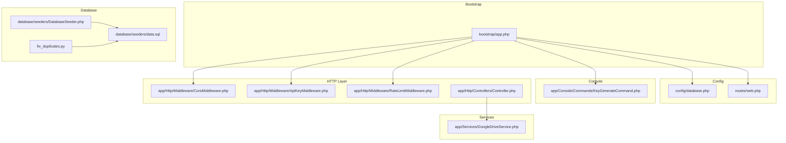
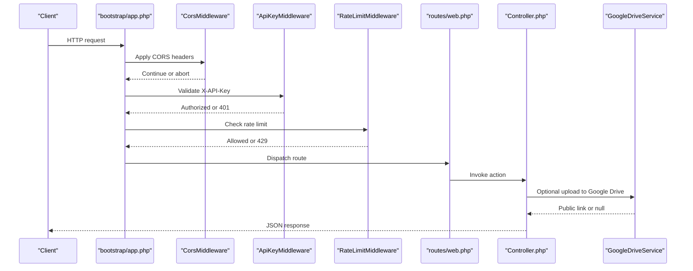
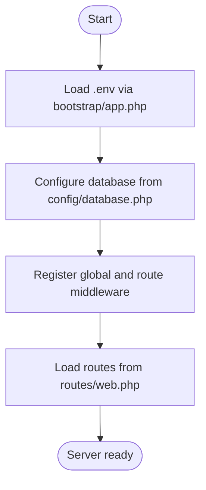
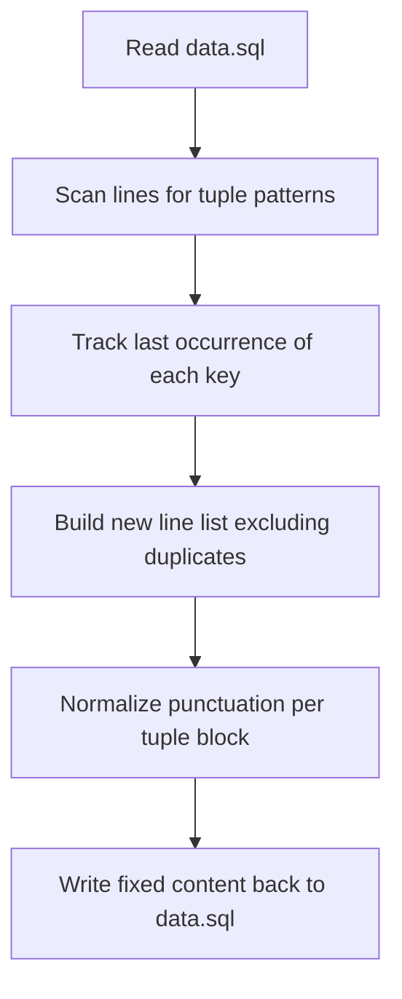
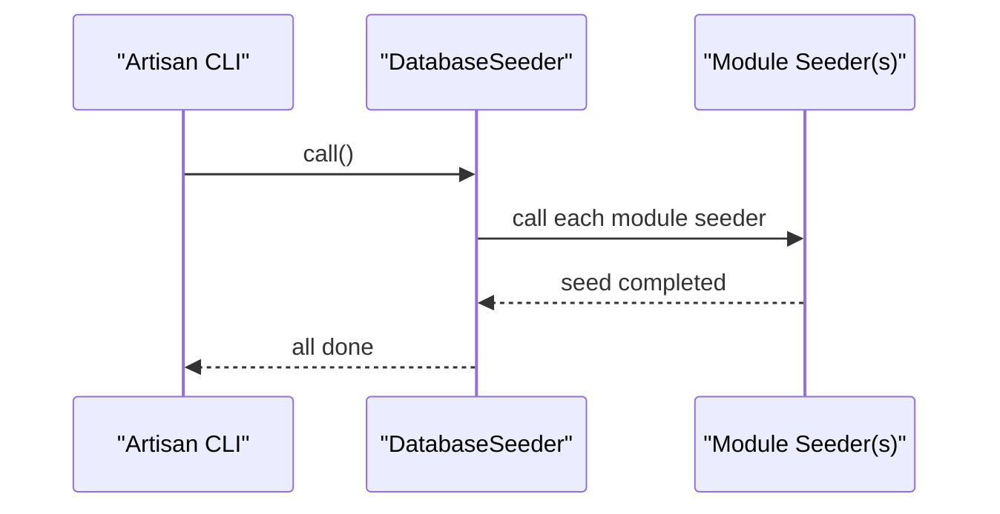
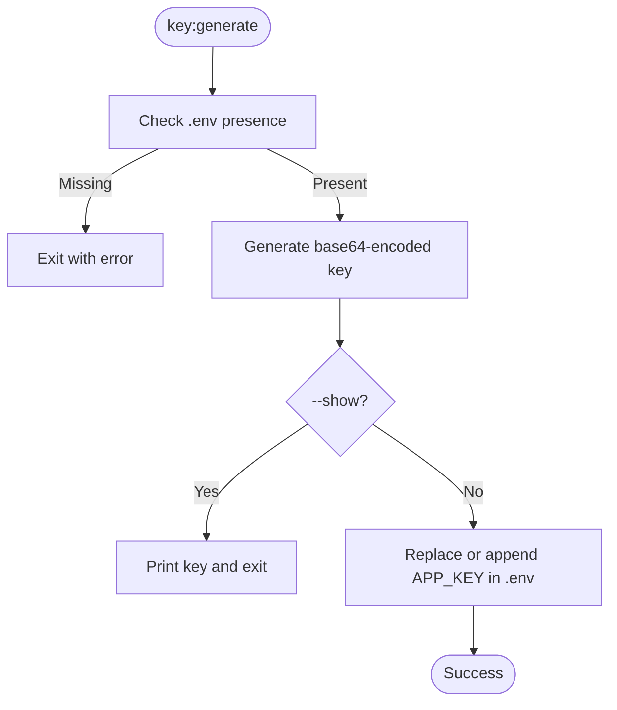
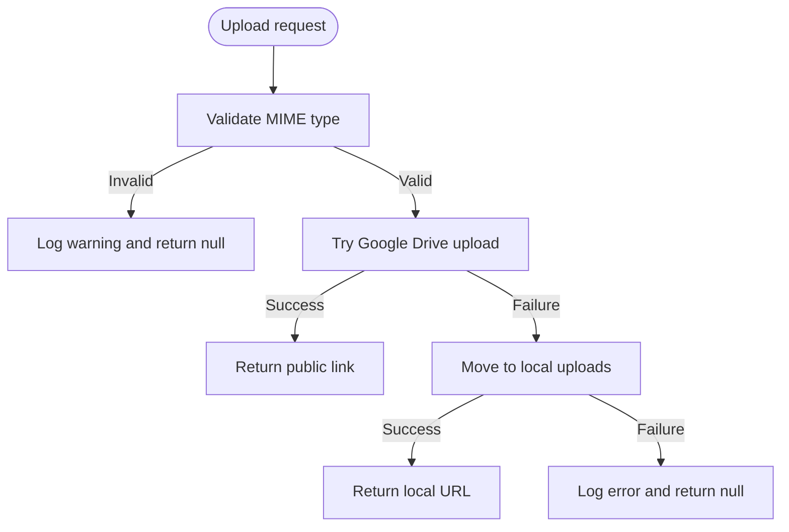
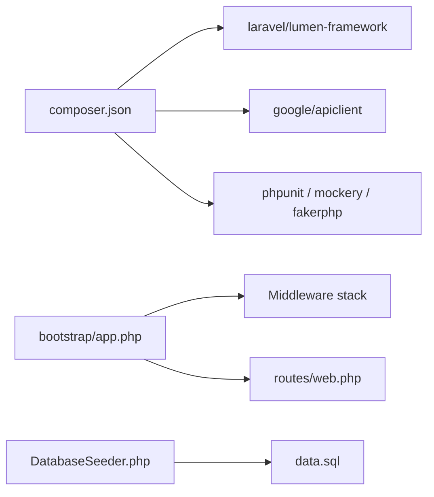

# Development Guide

<cite>
**Referenced Files in This Document**
- [composer.json](file://composer.json)
- [bootstrap/app.php](file://bootstrap/app.php)
- [config/database.php](file://config/database.php)
- [routes/web.php](file://routes/web.php)
- [app/Console/Commands/KeyGenerateCommand.php](file://app/Console/Commands/KeyGenerateCommand.php)
- [app/Http/Middleware/ApiKeyMiddleware.php](file://app/Http/Middleware/ApiKeyMiddleware.php)
- [app/Http/Middleware/CorsMiddleware.php](file://app/Http/Middleware/CorsMiddleware.php)
- [app/Http/Middleware/RateLimitMiddleware.php](file://app/Http/Middleware/RateLimitMiddleware.php)
- [app/Http/Controllers/Controller.php](file://app/Http/Controllers/Controller.php)
- [app/Services/GoogleDriveService.php](file://app/Services/GoogleDriveService.php)
- [database/seeders/DatabaseSeeder.php](file://database/seeders/DatabaseSeeder.php)
- [database/seeders/data.sql](file://database/seeders/data.sql)
- [fix_duplicates.py](file://fix_duplicates.py)
</cite>

## Table of Contents
1. [Introduction](#introduction)
2. [Project Structure](#project-structure)
3. [Core Components](#core-components)
4. [Architecture Overview](#architecture-overview)
5. [Detailed Component Analysis](#detailed-component-analysis)
6. [Dependency Analysis](#dependency-analysis)
7. [Performance Considerations](#performance-considerations)
8. [Troubleshooting Guide](#troubleshooting-guide)
9. [Conclusion](#conclusion)
10. [Appendices](#appendices)

## Introduction
This guide helps contributors set up the Lumen API backend, configure the environment, run tests, and develop new features safely and efficiently. It covers environment setup, Composer installation, database configuration, initial setup, testing with PHPUnit, data seeding, CSV and SQL import workflows, CLI commands, coding standards, and best practices for security and performance.

## Project Structure
The project follows a standard Lumen layout with modular controllers, middleware, service providers, and seeders. Key areas:
- Application bootstrap and middleware registration
- Route groups with public and protected endpoints
- Database configuration and migrations
- Seeders and SQL fixtures
- CLI command for key generation
- Shared controller utilities and Google Drive integration

**Diagram sources**
- [bootstrap/app.php:1-55](file://bootstrap/app.php#L1-L55)
- [config/database.php:1-30](file://config/database.php#L1-L30)
- [routes/web.php:1-165](file://routes/web.php#L1-L165)
- [app/Console/Commands/KeyGenerateCommand.php:1-52](file://app/Console/Commands/KeyGenerateCommand.php#L1-L52)
- [app/Http/Middleware/CorsMiddleware.php:1-64](file://app/Http/Middleware/CorsMiddleware.php#L1-L64)
- [app/Http/Middleware/ApiKeyMiddleware.php:1-41](file://app/Http/Middleware/ApiKeyMiddleware.php#L1-L41)
- [app/Http/Middleware/RateLimitMiddleware.php:1-49](file://app/Http/Middleware/RateLimitMiddleware.php#L1-L49)
- [app/Http/Controllers/Controller.php:1-97](file://app/Http/Controllers/Controller.php#L1-L97)
- [app/Services/GoogleDriveService.php:1-117](file://app/Services/GoogleDriveService.php#L1-L117)
- [database/seeders/DatabaseSeeder.php:1-32](file://database/seeders/DatabaseSeeder.php#L1-L32)
- [database/seeders/data.sql:1-175](file://database/seeders/data.sql#L1-L175)
- [fix_duplicates.py:1-70](file://fix_duplicates.py#L1-L70)

**Section sources**
- [bootstrap/app.php:1-55](file://bootstrap/app.php#L1-L55)
- [routes/web.php:1-165](file://routes/web.php#L1-L165)

## Core Components
- Environment and bootstrap: loads environment variables, registers middleware, routes, and console kernel.
- Middleware stack: global CORS, per-route API key validation, and rate limiting.
- Controllers: shared sanitization and file upload utilities; Google Drive fallback.
- Services: Google Drive integration with daily folder organization and public link creation.
- Seeders and data: grouped seeder orchestrating module-specific seeders and SQL fixtures.
- CLI: key:generate command to manage APP_KEY.

**Section sources**
- [bootstrap/app.php:18-45](file://bootstrap/app.php#L18-L45)
- [app/Http/Middleware/CorsMiddleware.php:14-62](file://app/Http/Middleware/CorsMiddleware.php#L14-L62)
- [app/Http/Middleware/ApiKeyMiddleware.php:14-39](file://app/Http/Middleware/ApiKeyMiddleware.php#L14-L39)
- [app/Http/Middleware/RateLimitMiddleware.php:15-39](file://app/Http/Middleware/RateLimitMiddleware.php#L15-L39)
- [app/Http/Controllers/Controller.php:18-95](file://app/Http/Controllers/Controller.php#L18-L95)
- [app/Services/GoogleDriveService.php:14-115](file://app/Services/GoogleDriveService.php#L14-L115)
- [database/seeders/DatabaseSeeder.php:15-30](file://database/seeders/DatabaseSeeder.php#L15-L30)
- [app/Console/Commands/KeyGenerateCommand.php:13-50](file://app/Console/Commands/KeyGenerateCommand.php#L13-L50)

## Architecture Overview
The runtime flow integrates environment loading, middleware enforcement, route dispatch, and controller actions. Security is layered via CORS whitelisting, API key validation, rate limiting, and safe file handling.

**Diagram sources**
- [bootstrap/app.php:22-30](file://bootstrap/app.php#L22-L30)
- [app/Http/Middleware/CorsMiddleware.php:14-62](file://app/Http/Middleware/CorsMiddleware.php#L14-L62)
- [app/Http/Middleware/ApiKeyMiddleware.php:14-39](file://app/Http/Middleware/ApiKeyMiddleware.php#L14-L39)
- [app/Http/Middleware/RateLimitMiddleware.php:15-39](file://app/Http/Middleware/RateLimitMiddleware.php#L15-L39)
- [routes/web.php:14-164](file://routes/web.php#L14-L164)
- [app/Http/Controllers/Controller.php:40-95](file://app/Http/Controllers/Controller.php#L40-L95)
- [app/Services/GoogleDriveService.php:38-82](file://app/Services/GoogleDriveService.php#L38-L82)

## Detailed Component Analysis

### Environment Setup and Initial Configuration
- PHP and framework requirements are declared in Composer.
- Autoload uses PSR-4 for app, factories, seeders, and tests.
- Bootstrap loads environment variables, enables Eloquent, registers middleware, and routes.
- Database connection defaults to MySQL from environment variables.

**Diagram sources**
- [bootstrap/app.php:5-52](file://bootstrap/app.php#L5-L52)
- [config/database.php:3-29](file://config/database.php#L3-L29)
- [routes/web.php:48-52](file://routes/web.php#L48-L52)

**Section sources**
- [composer.json:11-33](file://composer.json#L11-L33)
- [bootstrap/app.php:5-52](file://bootstrap/app.php#L5-L52)
- [config/database.php:3-29](file://config/database.php#L3-L29)

### Testing Framework and Utilities
- PHPUnit is included for unit/integration tests.
- FakerPHP is available for generating test data.
- Tests are autoloaded under PSR-4.

Recommended workflow:
- Run tests with phpunit.
- Use FakerPHP in tests or seeders to generate realistic test fixtures.
- Keep test isolation and avoid external network dependencies when possible.

**Section sources**
- [composer.json:16-21](file://composer.json#L16-L21)

### Data Import Procedures

#### CSV Processing with fix_duplicates.py
- Reads the SQL fixture file and removes duplicate rows keyed by a parsed identifier.
- Ensures proper punctuation for SQL INSERT blocks.
- Writes fixed content back to the same file.

**Diagram sources**
- [fix_duplicates.py:3-67](file://fix_duplicates.py#L3-L67)

**Section sources**
- [fix_duplicates.py:1-70](file://fix_duplicates.py#L1-L70)
- [database/seeders/data.sql:1-175](file://database/seeders/data.sql#L1-L175)

#### SQL Import from data.sql
- The SQL fixture defines INSERT statements for the primary dataset.
- Use your database client or CLI to import the file after deduplication.

Validation tips:
- Verify unique constraints and referential integrity post-import.
- Confirm endpoint queries return expected results.

**Section sources**
- [database/seeders/data.sql:1-175](file://database/seeders/data.sql#L1-L175)

#### Seeders Orchestration
- The main DatabaseSeeder calls module-specific seeders in a defined order.
- Use artisan db:seed to run the full suite.

**Diagram sources**
- [database/seeders/DatabaseSeeder.php:15-30](file://database/seeders/DatabaseSeeder.php#L15-L30)

**Section sources**
- [database/seeders/DatabaseSeeder.php:1-32](file://database/seeders/DatabaseSeeder.php#L1-L32)

### Command-Line Interface

#### KeyGenerateCommand
- Generates a new APP_KEY value and updates the .env file.
- Supports --show to print the key without writing to disk.

**Diagram sources**
- [app/Console/Commands/KeyGenerateCommand.php:13-50](file://app/Console/Commands/KeyGenerateCommand.php#L13-L50)

**Section sources**
- [app/Console/Commands/KeyGenerateCommand.php:1-52](file://app/Console/Commands/KeyGenerateCommand.php#L1-L52)

### Middleware Security Controls

#### CORS Middleware
- Whitelists trusted origins and sets strict security headers.
- Disallows wildcard origins in production; supports local dev origins.

**Section sources**
- [app/Http/Middleware/CorsMiddleware.php:14-62](file://app/Http/Middleware/CorsMiddleware.php#L14-L62)

#### API Key Middleware
- Validates X-API-Key header against environment variable.
- Uses timing-safe comparison and introduces a randomized delay to mitigate timing attacks.

**Section sources**
- [app/Http/Middleware/ApiKeyMiddleware.php:14-39](file://app/Http/Middleware/ApiKeyMiddleware.php#L14-L39)

#### Rate Limit Middleware
- Enforces per-IP limits using cache with configurable attempts and decay window.
- Adds rate limit headers and returns 429 when exceeded.

**Section sources**
- [app/Http/Middleware/RateLimitMiddleware.php:15-39](file://app/Http/Middleware/RateLimitMiddleware.php#L15-L39)

### Shared Controller Utilities and File Upload
- Input sanitization strips HTML tags and trims strings, with skip fields support.
- File upload prioritizes Google Drive; falls back to local storage with secure filenames and MIME validation.

**Diagram sources**
- [app/Http/Controllers/Controller.php:40-95](file://app/Http/Controllers/Controller.php#L40-L95)
- [app/Services/GoogleDriveService.php:38-82](file://app/Services/GoogleDriveService.php#L38-L82)

**Section sources**
- [app/Http/Controllers/Controller.php:18-95](file://app/Http/Controllers/Controller.php#L18-L95)
- [app/Services/GoogleDriveService.php:14-115](file://app/Services/GoogleDriveService.php#L14-L115)

### Coding Standards and PSR-4 Autoloading
- PSR-4 configuration maps:
  - App namespace to app/
  - Factories to database/factories/
  - Seeders to database/seeders/
  - Tests to tests/
- Follow PSR-12 style conventions for code formatting and naming.

**Section sources**
- [composer.json:22-33](file://composer.json#L22-L33)

### Development Best Practices
- Keep secrets in environment variables (API keys, database credentials).
- Use HTTPS and strict CORS policies in production.
- Validate and sanitize all inputs; avoid exposing raw exceptions to clients.
- Prefer Google Drive for file hosting with public link generation; log failures gracefully.
- Keep rate limits tuned for expected traffic patterns.

[No sources needed since this section provides general guidance]

## Dependency Analysis
Composer declares framework and third-party dependencies, dev tools, and autoload configuration. The bootstrap wires middleware and routes, while seeders depend on database migrations and SQL fixtures.

**Diagram sources**
- [composer.json:11-33](file://composer.json#L11-L33)
- [bootstrap/app.php:22-52](file://bootstrap/app.php#L22-L52)
- [routes/web.php:14-164](file://routes/web.php#L14-L164)
- [database/seeders/DatabaseSeeder.php:15-30](file://database/seeders/DatabaseSeeder.php#L15-L30)
- [database/seeders/data.sql:1-175](file://database/seeders/data.sql#L1-L175)

**Section sources**
- [composer.json:11-46](file://composer.json#L11-L46)
- [bootstrap/app.php:18-52](file://bootstrap/app.php#L18-L52)
- [routes/web.php:14-164](file://routes/web.php#L14-L164)

## Performance Considerations
- Enable OPcache and short TTLs for static assets.
- Use rate limiting to prevent abuse; tune attempts and decay windows.
- Minimize heavy synchronous operations in controllers; offload to queues when possible.
- Monitor slow endpoints with logging and consider caching for read-heavy GET routes.

[No sources needed since this section provides general guidance]

## Troubleshooting Guide
Common issues and resolutions:
- Missing APP_KEY: Run the key:generate command to set APP_KEY in .env.
- Unauthorized responses: Ensure X-API-Key matches the configured API key and that CORS allows your origin.
- Too Many Requests: Adjust throttle settings or reduce client-side polling frequency.
- Upload failures: Verify Google Drive credentials and permissions; confirm local uploads directory is writable.

**Section sources**
- [app/Console/Commands/KeyGenerateCommand.php:25-49](file://app/Console/Commands/KeyGenerateCommand.php#L25-L49)
- [app/Http/Middleware/ApiKeyMiddleware.php:16-36](file://app/Http/Middleware/ApiKeyMiddleware.php#L16-L36)
- [app/Http/Middleware/RateLimitMiddleware.php:22-28](file://app/Http/Middleware/RateLimitMiddleware.php#L22-L28)
- [app/Services/GoogleDriveService.php:72-81](file://app/Services/GoogleDriveService.php#L72-L81)

## Conclusion
This guide outlined environment setup, middleware security controls, data import workflows, CLI utilities, and best practices for developing and maintaining the Lumen API. By following these procedures and leveraging the provided components, contributors can build reliable, secure, and maintainable features.

[No sources needed since this section summarizes without analyzing specific files]

## Appendices

### Practical Examples

- Adding a new module:
  - Create a Model and Migration for the new entity.
  - Add a Controller under app/Http/Controllers/.
  - Register routes in routes/web.php under the appropriate group.
  - Add a Seeder under database/seeders/ and include it in DatabaseSeeder.php.
  - If applicable, update the shared Controller utilities for input sanitization or file handling.

- Extending existing functionality:
  - Modify the relevant Controller action to accept new parameters.
  - Add or adjust validation rules and sanitization.
  - If file uploads are involved, reuse the shared upload method and ensure MIME validation.

- Debugging common issues:
  - Use logs to capture upload failures and API key mismatches.
  - Temporarily increase log verbosity during development.
  - Validate rate limit headers to confirm throttling behavior.

[No sources needed since this section provides general guidance]