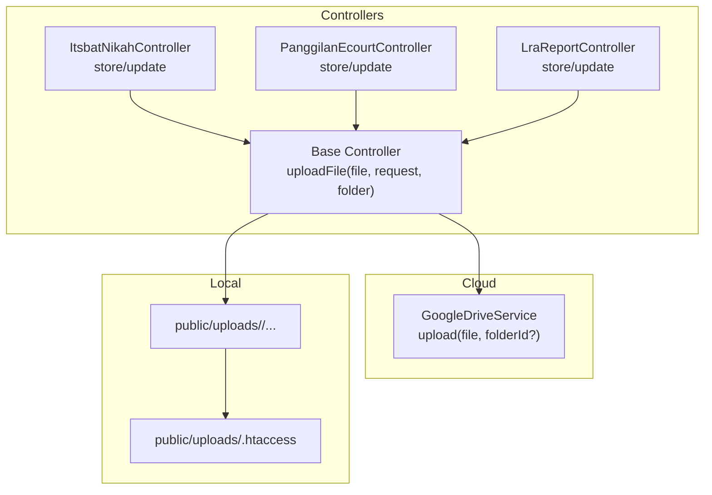
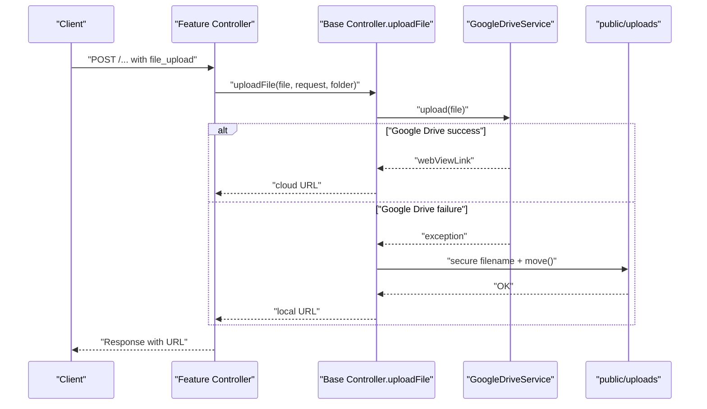
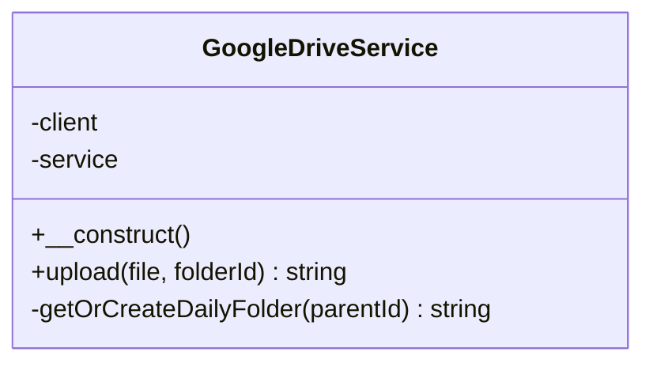
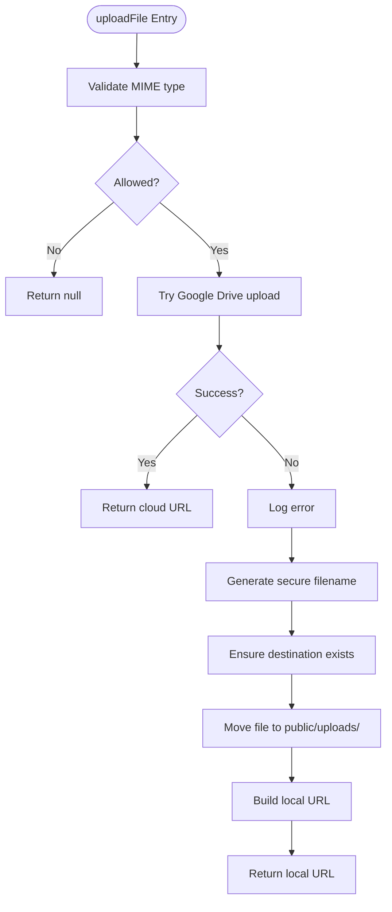
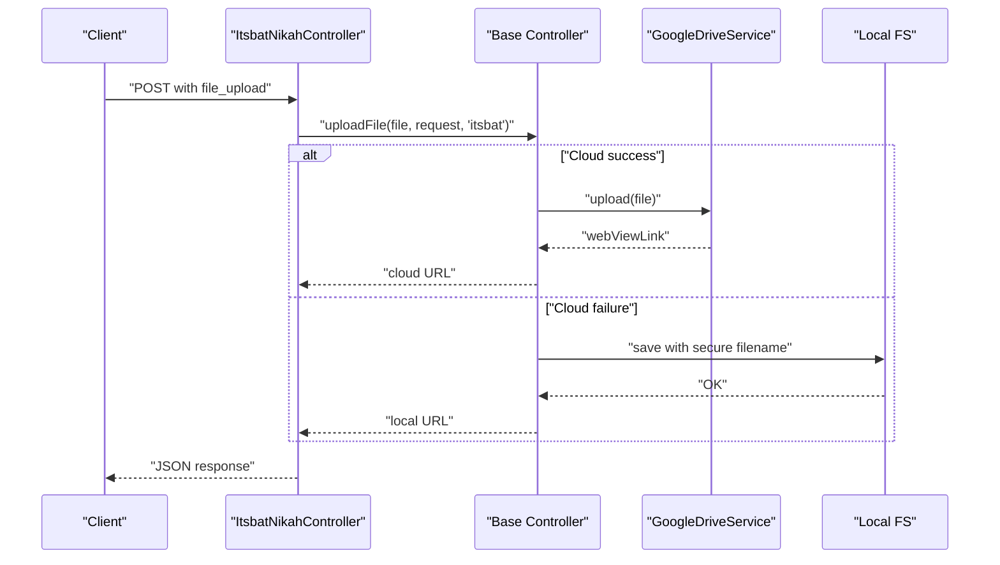
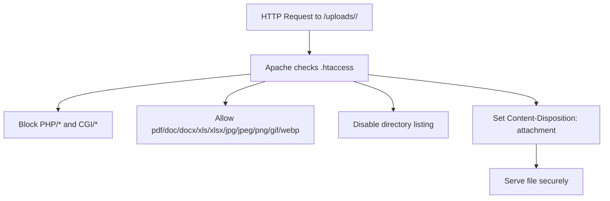
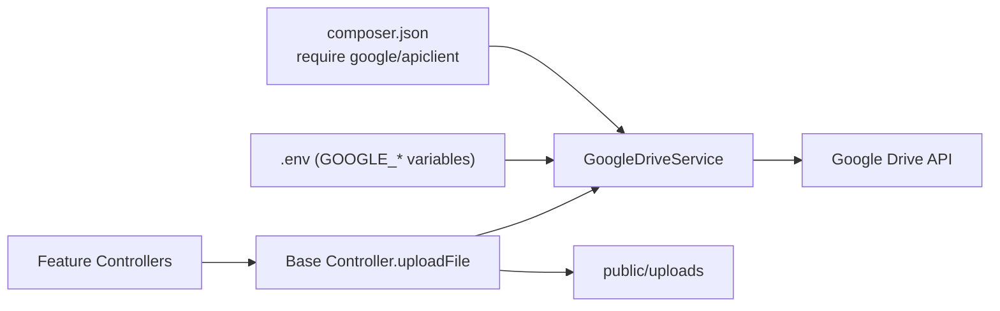

# File Management

<cite>
**Referenced Files in This Document**
- [GoogleDriveService.php](file://app/Services/GoogleDriveService.php)
- [Controller.php](file://app/Http/Controllers/Controller.php)
- [ItsbatNikahController.php](file://app/Http/Controllers/ItsbatNikahController.php)
- [PanggilanEcourtController.php](file://app/Http/Controllers/PanggilanEcourtController.php)
- [LraReportController.php](file://app/Http/Controllers/LraReportController.php)
- [.htaccess](file://public/uploads/.htaccess)
- [composer.json](file://composer.json)
- [SECURITY.md](file://SECURITY.md)
</cite>

## Table of Contents
1. [Introduction](#introduction)
2. [Project Structure](#project-structure)
3. [Core Components](#core-components)
4. [Architecture Overview](#architecture-overview)
5. [Detailed Component Analysis](#detailed-component-analysis)
6. [Dependency Analysis](#dependency-analysis)
7. [Performance Considerations](#performance-considerations)
8. [Troubleshooting Guide](#troubleshooting-guide)
9. [Conclusion](#conclusion)
10. [Appendices](#appendices)

## Introduction
This document explains the file management system for the Lumen API backend, which implements a dual storage strategy: Google Drive for cloud storage and the local filesystem for fallback. It covers the GoogleDriveService implementation, daily folder organization, file upload workflows, local storage fallback, URL generation, naming conventions, validation rules, security considerations, and integration with court case management modules. It also includes performance guidance, storage quotas awareness, and maintenance procedures for both cloud and local storage.

## Project Structure
The file management system spans three primary areas:
- Cloud storage service: GoogleDriveService encapsulates Google Drive integration.
- Controllers: Shared upload logic in the base Controller and specialized handling in feature-specific controllers.
- Local storage: Publicly served uploads under public/uploads with security hardening via .htaccess.

**Diagram sources**
- [Controller.php:40-95](file://app/Http/Controllers/Controller.php#L40-L95)
- [GoogleDriveService.php:38-82](file://app/Services/GoogleDriveService.php#L38-L82)
- [.htaccess:1-30](file://public/uploads/.htaccess#L1-L30)

**Section sources**
- [Controller.php:40-95](file://app/Http/Controllers/Controller.php#L40-L95)
- [GoogleDriveService.php:38-82](file://app/Services/GoogleDriveService.php#L38-L82)
- [.htaccess:1-30](file://public/uploads/.htaccess#L1-L30)

## Core Components
- GoogleDriveService: Handles authentication, daily folder organization, file upload, and optional public sharing permission.
- Base Controller uploadFile: Centralized upload logic with MIME validation, cloud-first upload, and local fallback with secure filename generation.
- Feature controllers: Specialized validation and fallback behavior for specific modules (Itsbat Nikah, Panggilan Ecourt, LRA Reports).

Key responsibilities:
- MIME validation using magic bytes to prevent extension spoofing.
- Daily folder creation in Google Drive for organization.
- Secure local filenames using random bytes.
- URL generation for both cloud and local storage.
- Logging and error handling for robust fallback.

**Section sources**
- [GoogleDriveService.php:14-22](file://app/Services/GoogleDriveService.php#L14-L22)
- [GoogleDriveService.php:38-82](file://app/Services/GoogleDriveService.php#L38-L82)
- [GoogleDriveService.php:87-115](file://app/Services/GoogleDriveService.php#L87-L115)
- [Controller.php:40-95](file://app/Http/Controllers/Controller.php#L40-L95)

## Architecture Overview
The upload pipeline follows a cloud-first strategy with local fallback. Controllers validate requests, delegate upload to the base controller, which attempts Google Drive upload and falls back to local storage if needed.

**Diagram sources**
- [Controller.php:40-95](file://app/Http/Controllers/Controller.php#L40-L95)
- [GoogleDriveService.php:38-82](file://app/Services/GoogleDriveService.php#L38-L82)
- [ItsbatNikahController.php:64-108](file://app/Http/Controllers/ItsbatNikahController.php#L64-L108)
- [PanggilanEcourtController.php:142-192](file://app/Http/Controllers/PanggilanEcourtController.php#L142-L192)
- [LraReportController.php:198-233](file://app/Http/Controllers/LraReportController.php#L198-L233)

## Detailed Component Analysis

### GoogleDriveService
Implements Google Drive integration with:
- Authentication via client credentials and refresh token.
- Daily folder organization strategy using date-based subfolders under a configurable root.
- File upload with explicit MIME type and multipart upload.
- Optional public read permission for generated links.

**Diagram sources**
- [GoogleDriveService.php:9-22](file://app/Services/GoogleDriveService.php#L9-L22)
- [GoogleDriveService.php:38-82](file://app/Services/GoogleDriveService.php#L38-L82)
- [GoogleDriveService.php:87-115](file://app/Services/GoogleDriveService.php#L87-L115)

**Section sources**
- [GoogleDriveService.php:14-22](file://app/Services/GoogleDriveService.php#L14-L22)
- [GoogleDriveService.php:38-82](file://app/Services/GoogleDriveService.php#L38-L82)
- [GoogleDriveService.php:87-115](file://app/Services/GoogleDriveService.php#L87-L115)

### Base Controller uploadFile
Centralized upload logic:
- Validates MIME type using magic bytes.
- Attempts Google Drive upload; logs failures.
- Generates secure local filename using random bytes.
- Creates destination directory if missing.
- Returns URL for either cloud or local storage.

**Diagram sources**
- [Controller.php:40-95](file://app/Http/Controllers/Controller.php#L40-L95)

**Section sources**
- [Controller.php:40-95](file://app/Http/Controllers/Controller.php#L40-L95)

### Feature Controllers: Itsbat Nikah, Panggilan Ecourt, LRA Reports
- ItsbatNikahController: Validates file constraints, attempts Google Drive upload, falls back to local storage with timestamped sanitized filename, and returns JSON responses.
- PanggilanEcourtController: Similar pattern with separate local folder, explicit class existence check, and robust logging.
- LraReportController: Uses a dedicated method to upload to Google Drive with subfolders for reports and covers, and applies stricter file size limits.

**Diagram sources**
- [ItsbatNikahController.php:64-108](file://app/Http/Controllers/ItsbatNikahController.php#L64-L108)
- [PanggilanEcourtController.php:142-192](file://app/Http/Controllers/PanggilanEcourtController.php#L142-L192)
- [LraReportController.php:198-233](file://app/Http/Controllers/LraReportController.php#L198-L233)
- [Controller.php:40-95](file://app/Http/Controllers/Controller.php#L40-L95)

**Section sources**
- [ItsbatNikahController.php:47-53](file://app/Http/Controllers/ItsbatNikahController.php#L47-L53)
- [ItsbatNikahController.php:64-108](file://app/Http/Controllers/ItsbatNikahController.php#L64-L108)
- [PanggilanEcourtController.php:120-133](file://app/Http/Controllers/PanggilanEcourtController.php#L120-L133)
- [PanggilanEcourtController.php:142-192](file://app/Http/Controllers/PanggilanEcourtController.php#L142-L192)
- [LraReportController.php:82-89](file://app/Http/Controllers/LraReportController.php#L82-L89)
- [LraReportController.php:198-233](file://app/Http/Controllers/LraReportController.php#L198-L233)

### Local Storage Security and Access Patterns
- Directory: public/uploads/<module> with module-specific subfolders.
- Security hardening via .htaccess:
  - Disables PHP execution.
  - Blocks access to potentially dangerous extensions.
  - Allows only safe file types.
  - Disables directory listing.
  - Forces Content-Disposition attachment and sets X-Content-Type-Options.

**Diagram sources**
- [.htaccess:1-30](file://public/uploads/.htaccess#L1-L30)

**Section sources**
- [.htaccess:1-30](file://public/uploads/.htaccess#L1-L30)

## Dependency Analysis
- Google Drive SDK dependency declared in composer.json.
- GoogleDriveService depends on environment variables for authentication and root folder.
- Controllers depend on GoogleDriveService availability and base upload logic.

**Diagram sources**
- [composer.json:11-14](file://composer.json#L11-L14)
- [GoogleDriveService.php:16-21](file://app/Services/GoogleDriveService.php#L16-L21)
- [Controller.php:64-67](file://app/Http/Controllers/Controller.php#L64-L67)

**Section sources**
- [composer.json:11-14](file://composer.json#L11-L14)
- [GoogleDriveService.php:16-21](file://app/Services/GoogleDriveService.php#L16-L21)
- [Controller.php:64-67](file://app/Http/Controllers/Controller.php#L64-L67)

## Performance Considerations
- Large file handling:
  - Prefer streaming uploads for very large files; current implementation reads file content into memory. Consider chunked uploads or resumable uploads for files larger than typical limits.
  - Monitor Google Drive quotas and rate limits; implement retry with exponential backoff on transient errors.
- Organization strategy:
  - Daily folders reduce contention and improve searchability; ensure cleanup policies for old folders.
- Local storage:
  - Use SSD-backed storage for higher IOPS.
  - Implement CDN for static assets to reduce origin load.
- Validation:
  - Continue relying on magic-byte MIME detection to avoid unnecessary processing of malicious files.

[No sources needed since this section provides general guidance]

## Troubleshooting Guide
Common issues and resolutions:
- Google Drive upload failures:
  - Verify environment variables for client credentials and refresh token.
  - Check network connectivity and Google Drive API quota.
  - Review logs for exceptions during folder creation or permission setting.
- Local fallback failures:
  - Ensure public/uploads/<module> is writable by the web server.
  - Confirm .htaccess is loaded and not overridden by server config.
- MIME validation rejections:
  - Confirm the uploaded file’s actual MIME type matches allowed types.
- URL generation problems:
  - Ensure request root is correctly detected; confirm APP_URL or reverse proxy configuration.

**Section sources**
- [GoogleDriveService.php:16-21](file://app/Services/GoogleDriveService.php#L16-L21)
- [Controller.php:68-74](file://app/Http/Controllers/Controller.php#L68-L74)
- [Controller.php:87-94](file://app/Http/Controllers/Controller.php#L87-L94)
- [.htaccess:1-30](file://public/uploads/.htaccess#L1-L30)

## Conclusion
The dual storage system leverages Google Drive for scalable, organized cloud storage with automatic daily folder organization and public link generation, while ensuring reliability through a secure local filesystem fallback. Centralized validation, secure filename generation, and strong access controls protect the system against common threats. By following the recommended practices and monitoring quotas, the system remains robust and maintainable.

[No sources needed since this section summarizes without analyzing specific files]

## Appendices

### File Naming Conventions
- Cloud: Original filename preserved; uploaded to a date-based subfolder under the configured root.
- Local: Random 32-character hex string plus original extension; stored in module-specific subdirectories under public/uploads.

**Section sources**
- [GoogleDriveService.php:56-59](file://app/Services/GoogleDriveService.php#L56-L59)
- [Controller.php:78-85](file://app/Http/Controllers/Controller.php#L78-L85)
- [ItsbatNikahController.php:87-95](file://app/Http/Controllers/ItsbatNikahController.php#L87-L95)
- [PanggilanEcourtController.php:165-173](file://app/Http/Controllers/PanggilanEcourtController.php#L165-L173)

### Upload Validation Rules
- Allowed MIME types: PDF, Word, Excel, JPEG, PNG.
- Maximum sizes:
  - General uploads: up to 5 MB.
  - LRA PDF: up to 10 MB; cover images: up to 5 MB.
- Additional constraints:
  - Itsbat Nikah: file_upload is optional; when present, constrained by mimes and max.
  - Panggilan Ecourt: file_upload is optional; when present, constrained by mimes and max.
  - LRA Reports: file_upload is required for create; cover_upload is optional.

**Section sources**
- [Controller.php:44-52](file://app/Http/Controllers/Controller.php#L44-L52)
- [ItsbatNikahController.php:52](file://app/Http/Controllers/ItsbatNikahController.php#L52)
- [PanggilanEcourtController.php:131](file://app/Http/Controllers/PanggilanEcourtController.php#L131)
- [LraReportController.php:87-89](file://app/Http/Controllers/LraReportController.php#L87-L89)

### Security Considerations
- MIME validation via magic bytes prevents extension spoofing.
- Local uploads use random filenames to mitigate guessing attacks.
- Apache .htaccess blocks executable scripts and enforces safe file types.
- Public access is restricted to safe file types and forced download behavior.
- API security layers (authentication, rate limiting, input validation) complement file handling.

**Section sources**
- [Controller.php:42-60](file://app/Http/Controllers/Controller.php#L42-L60)
- [Controller.php:78-85](file://app/Http/Controllers/Controller.php#L78-L85)
- [.htaccess:11-29](file://public/uploads/.htaccess#L11-L29)
- [SECURITY.md:9-51](file://SECURITY.md#L9-L51)

### Practical Examples: API Usage
- Upload a document for Itsbat Nikah:
  - Endpoint: POST to Itsbat Nikah route with form-data containing file_upload.
  - Behavior: Attempts Google Drive; on failure, saves to public/uploads/itsbat with a timestamped sanitized filename.
- Upload a court notice for Panggilan Ecourt:
  - Endpoint: POST to Panggilan Ecourt route with file_upload.
  - Behavior: Attempts Google Drive; on failure, saves to public/uploads/panggilan_ecourt with a timestamped sanitized filename.
- Upload an LRA report:
  - Endpoint: POST to LRA Reports route with file_upload (PDF) and optional cover_upload (image).
  - Behavior: Attempts Google Drive; on failure, falls back to local storage with secure filenames.

**Section sources**
- [ItsbatNikahController.php:64-108](file://app/Http/Controllers/ItsbatNikahController.php#L64-L108)
- [PanggilanEcourtController.php:142-192](file://app/Http/Controllers/PanggilanEcourtController.php#L142-L192)
- [LraReportController.php:96-101](file://app/Http/Controllers/LraReportController.php#L96-L101)

### Backup Strategies
- Cloud backups:
  - Enable Google Drive Team Drives or shared drives with retention policies.
  - Periodically export metadata and maintain checksums for integrity verification.
- Local backups:
  - Schedule regular snapshots of public/uploads and database backups.
  - Store offsite copies encrypted and rotated.
- Monitoring:
  - Track upload success rates and storage usage.
  - Alert on repeated Google Drive failures or disk space nearing capacity.

[No sources needed since this section provides general guidance]

### Maintenance Procedures
- Cloud maintenance:
  - Review and prune unused daily folders periodically.
  - Rotate refresh tokens and update environment variables securely.
- Local maintenance:
  - Clean expired or orphaned files from public/uploads.
  - Monitor disk usage and enforce quotas per module.
- Operational hygiene:
  - Rotate API keys and review access logs.
  - Keep Google API client updated and monitor deprecation notices.

[No sources needed since this section provides general guidance]