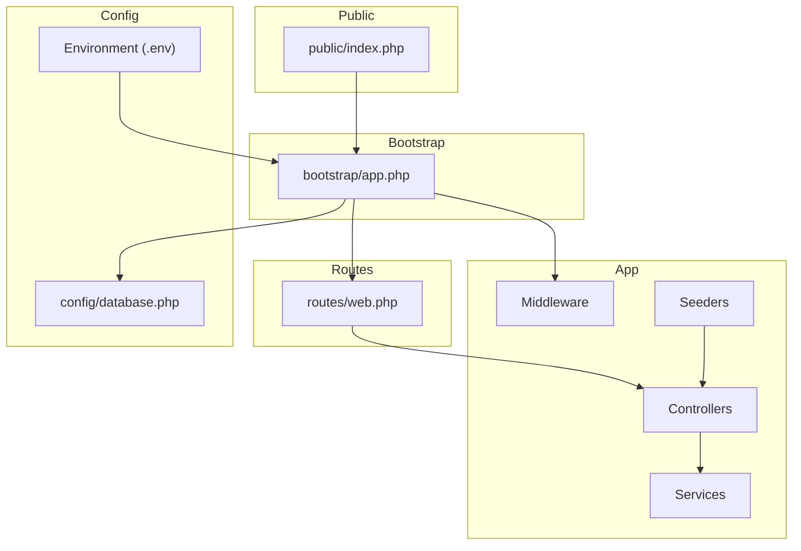
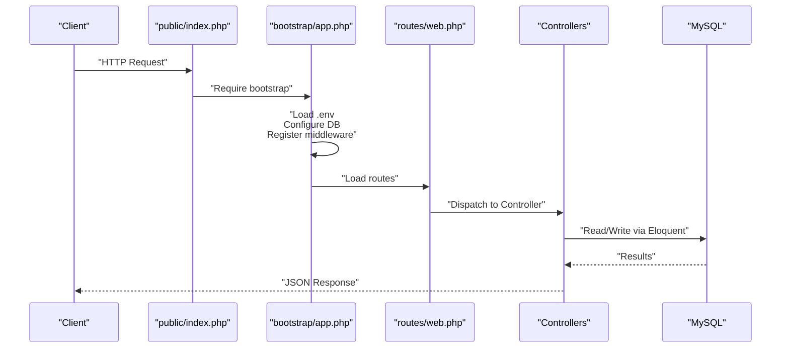
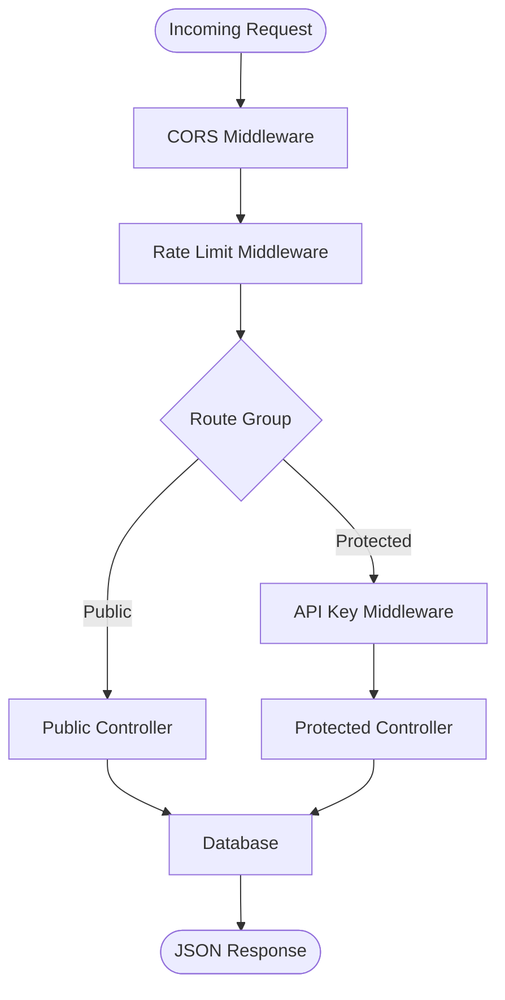
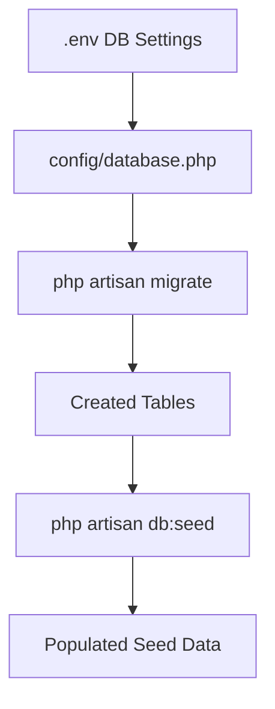
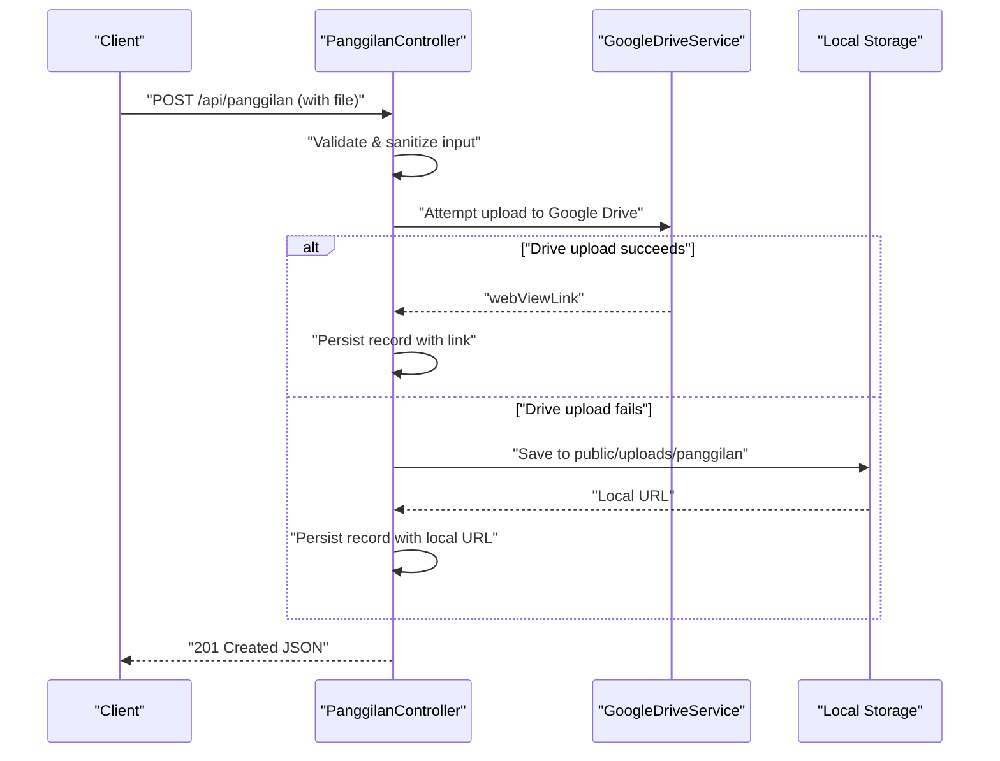
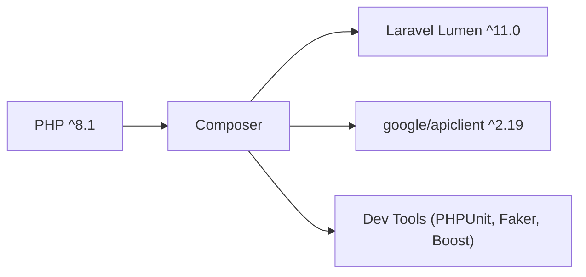

# Getting Started

<cite>
**Referenced Files in This Document**
- [composer.json](file://composer.json)
- [.env.example](file://.env.example)
- [bootstrap/app.php](file://bootstrap/app.php)
- [routes/web.php](file://routes/web.php)
- [app/Console/Commands/KeyGenerateCommand.php](file://app/Console/Commands/KeyGenerateCommand.php)
- [app/Http/Middleware/ApiKeyMiddleware.php](file://app/Http/Middleware/ApiKeyMiddleware.php)
- [app/Http/Middleware/CorsMiddleware.php](file://app/Http/Middleware/CorsMiddleware.php)
- [app/Http/Middleware/RateLimitMiddleware.php](file://app/Http/Middleware/RateLimitMiddleware.php)
- [config/database.php](file://config/database.php)
- [database/migrations/2026_01_21_000001_create_panggilan_ghaib_table.php](file://database/migrations/2026_01_21_000001_create_panggilan_ghaib_table.php)
- [database/seeders/DatabaseSeeder.php](file://database/seeders/DatabaseSeeder.php)
- [public/index.php](file://public/index.php)
- [artisan](file://artisan)
- [app/Services/GoogleDriveService.php](file://app/Services/GoogleDriveService.php)
- [app/Http/Controllers/PanggilanController.php](file://app/Http/Controllers/PanggilanController.php)
</cite>

## Table of Contents
1. [Introduction](#introduction)
2. [Project Structure](#project-structure)
3. [Core Components](#core-components)
4. [Architecture Overview](#architecture-overview)
5. [Detailed Component Analysis](#detailed-component-analysis)
6. [Dependency Analysis](#dependency-analysis)
7. [Performance Considerations](#performance-considerations)
8. [Troubleshooting Guide](#troubleshooting-guide)
9. [Conclusion](#conclusion)
10. [Appendices](#appendices)

## Introduction
This guide helps you set up the Lumen API backend for local development. You will install prerequisites, configure the environment, run database migrations, seed initial data, generate an application key, and test public and protected endpoints. The API exposes public read-only endpoints and protected write endpoints secured by an API key and rate limiting.

## Project Structure
The repository follows a standard Lumen layout:
- Application code under app/, including controllers, middleware, models, providers, and services
- Configuration under config/
- Database assets under database/ (migrations and seeders)
- Public entry point under public/
- Routing under routes/web.php
- Environment configuration via .env.example
- Composer metadata under composer.json

**Diagram sources**
- [public/index.php:1-19](file://public/index.php#L1-L19)
- [bootstrap/app.php:1-55](file://bootstrap/app.php#L1-L55)
- [config/database.php:1-30](file://config/database.php#L1-L30)
- [routes/web.php:1-165](file://routes/web.php#L1-L165)

**Section sources**
- [composer.json:1-47](file://composer.json#L1-L47)
- [routes/web.php:1-165](file://routes/web.php#L1-L165)
- [bootstrap/app.php:1-55](file://bootstrap/app.php#L1-L55)

## Core Components
- Environment configuration: .env.example defines required keys for app, database, API key, CORS, and cache driver.
- Security middleware:
  - CORS whitelisting with strict origins
  - API key validation for protected routes
  - Rate limiting per IP
- Routing:
  - Public endpoints under /api prefixed group with throttling
  - Protected endpoints under /api prefixed group with api.key and throttling
- Database:
  - MySQL connection configured via environment variables
  - Initial migration for the primary table
  - Seeders to populate initial datasets
- Upload service:
  - Optional Google Drive integration with fallback to local storage

Prerequisites
- PHP ^8.1
- Composer
- MySQL server

Installation Steps
1. Clone the repository and install dependencies
2. Create and edit .env from .env.example
3. Generate APP_KEY
4. Configure database credentials
5. Run database migrations
6. Seed initial data
7. Start the development server

Step-by-step Instructions
1. Clone the repository and install dependencies
- Install PHP ^8.1 and Composer
- Clone the repository locally
- Install PHP dependencies with Composer

2. Create and edit .env
- Copy .env.example to .env
- Set APP_KEY, DB_* credentials, API_KEY, CORS_ALLOWED_ORIGINS, CACHE_DRIVER
- Ensure APP_ENV and APP_DEBUG are appropriate for your environment

3. Generate APP_KEY
- Use the provided artisan command to generate and inject a secure key into .env

4. Configure database
- Set DB_HOST, DB_PORT, DB_DATABASE, DB_USERNAME, DB_PASSWORD
- Ensure the database exists and is accessible

5. Run database migrations
- Apply migrations to create tables

6. Seed initial data
- Run the database seeder to populate initial records

7. Start the development server
- Use the built-in PHP server or your preferred web server

**Section sources**
- [.env.example:1-41](file://.env.example#L1-L41)
- [app/Console/Commands/KeyGenerateCommand.php:1-52](file://app/Console/Commands/KeyGenerateCommand.php#L1-L52)
- [config/database.php:1-30](file://config/database.php#L1-L30)
- [database/migrations/2026_01_21_000001_create_panggilan_ghaib_table.php:1-42](file://database/migrations/2026_01_21_000001_create_panggilan_ghaib_table.php#L1-L42)
- [database/seeders/DatabaseSeeder.php:1-32](file://database/seeders/DatabaseSeeder.php#L1-L32)
- [artisan:1-20](file://artisan#L1-L20)
- [public/index.php:1-19](file://public/index.php#L1-L19)

## Architecture Overview
The runtime flow starts at the public entry point, boots the application, loads environment variables, registers middleware, and routes requests to controllers. Protected routes require an API key and enforce rate limits.

**Diagram sources**
- [public/index.php:1-19](file://public/index.php#L1-L19)
- [bootstrap/app.php:1-55](file://bootstrap/app.php#L1-L55)
- [routes/web.php:1-165](file://routes/web.php#L1-L165)

## Detailed Component Analysis

### Environment and Security Setup
- Environment variables are loaded early and used across the app for database, API key, CORS, and cache driver.
- CORS middleware enforces a strict whitelist and denies wildcard origins in production.
- API key middleware validates the X-API-Key header using a timing-safe comparison and delays on failure.
- Rate limit middleware tracks attempts per IP and returns standardized headers and responses.

**Diagram sources**
- [app/Http/Middleware/CorsMiddleware.php:1-64](file://app/Http/Middleware/CorsMiddleware.php#L1-L64)
- [app/Http/Middleware/RateLimitMiddleware.php:1-49](file://app/Http/Middleware/RateLimitMiddleware.php#L1-L49)
- [app/Http/Middleware/ApiKeyMiddleware.php:1-41](file://app/Http/Middleware/ApiKeyMiddleware.php#L1-L41)
- [routes/web.php:1-165](file://routes/web.php#L1-L165)

**Section sources**
- [bootstrap/app.php:1-55](file://bootstrap/app.php#L1-L55)
- [app/Http/Middleware/CorsMiddleware.php:1-64](file://app/Http/Middleware/CorsMiddleware.php#L1-L64)
- [app/Http/Middleware/ApiKeyMiddleware.php:1-41](file://app/Http/Middleware/ApiKeyMiddleware.php#L1-L41)
- [app/Http/Middleware/RateLimitMiddleware.php:1-49](file://app/Http/Middleware/RateLimitMiddleware.php#L1-L49)

### API Endpoints Overview
- Public endpoints (GET /api/...): Read-only access with throttle protection
- Protected endpoints (POST/PUT/DELETE /api/...): Require X-API-Key header and throttle protection

Example endpoint groups:
- Case information: /api/panggilan, /api/panggilan/{id}, /api/panggilan/tahun/{year}
- Itsbat Nikah: /api/itsbat, /api/itsbat/{id}
- e-Court listings: /api/panggilan-ecourt, /api/panggilan-ecourt/{id}, /api/panggilan-ecourt/tahun/{year}
- Agenda Pimpinan: /api/agenda, /api/agenda/{id}
- LHKPN: /api/lhkpn, /api/lhkpn/{id}
- Realisasi Anggaran: /api/anggaran, /api/anggaran/{id}, /api/pagu
- DIPA POK: /api/dipapok, /api/dipapok/{id}
- Aset BMN: /api/aset-bmn, /api/aset-bmn/{id}
- SAKIP: /api/sakip, /api/sakip/{id}, /api/sakip/tahun/{year}
- Laporan Pengaduan: /api/laporan-pengaduan, /api/laporan-pengaduan/{id}, /api/laporan-pengaduan/tahun/{year}
- Keuangan Perkara: /api/keuangan-perkara, /api/keuangan-perkara/{id}, /api/keuangan-perkara/tahun/{year}
- Sisa Panjar: /api/sisa-panjar, /api/sisa-panjar/{id}, /api/sisa-panjar/tahun/{year}
- MOU: /api/mou, /api/mou/{id}
- LRA Reports: /api/lra, /api/lra/{id}

Protected CRUD examples (require X-API-Key):
- POST/PUT/DELETE /api/panggilan, /api/itsbat, /api/panggilan-ecourt, /api/agenda, /api/lhkpn, /api/anggaran, /api/pagu, /api/dipapok, /api/aset-bmn, /api/sakip, /api/laporan-pengaduan, /api/keuangan-perkara, /api/sisa-panjar, /api/mou, /api/lra

**Section sources**
- [routes/web.php:1-165](file://routes/web.php#L1-L165)

### Database and Seeding
- Database connection defaults to mysql and reads host, port, database, username, and password from environment variables.
- An initial migration creates the primary table for case information.
- A database seeder orchestrates multiple model-specific seeders to populate data.

**Diagram sources**
- [config/database.php:1-30](file://config/database.php#L1-L30)
- [database/migrations/2026_01_21_000001_create_panggilan_ghaib_table.php:1-42](file://database/migrations/2026_01_21_000001_create_panggilan_ghaib_table.php#L1-L42)
- [database/seeders/DatabaseSeeder.php:1-32](file://database/seeders/DatabaseSeeder.php#L1-L32)

**Section sources**
- [config/database.php:1-30](file://config/database.php#L1-L30)
- [database/migrations/2026_01_21_000001_create_panggilan_ghaib_table.php:1-42](file://database/migrations/2026_01_21_000001_create_panggilan_ghaib_table.php#L1-L42)
- [database/seeders/DatabaseSeeder.php:1-32](file://database/seeders/DatabaseSeeder.php#L1-L32)

### Upload Workflow (Protected Endpoints)
Protected endpoints supporting uploads (e.g., case documents) can store files to Google Drive or fall back to local storage. The controller handles validation, sanitization, and persistence.

**Diagram sources**
- [app/Http/Controllers/PanggilanController.php:1-200](file://app/Http/Controllers/PanggilanController.php#L1-L200)
- [app/Services/GoogleDriveService.php:1-117](file://app/Services/GoogleDriveService.php#L1-L117)

**Section sources**
- [app/Http/Controllers/PanggilanController.php:1-200](file://app/Http/Controllers/PanggilanController.php#L1-L200)
- [app/Services/GoogleDriveService.php:1-117](file://app/Services/GoogleDriveService.php#L1-L117)

## Dependency Analysis
- PHP ^8.1 is required by composer.json
- Lumen framework v11.x is used
- Google API client is included for optional file uploads
- Dev dependencies include PHPUnit, Faker, and Laravel Boost

**Diagram sources**
- [composer.json:1-47](file://composer.json#L1-L47)

**Section sources**
- [composer.json:1-47](file://composer.json#L1-L47)

## Performance Considerations
- Rate limiting is enforced per IP to mitigate abuse
- Pagination is applied to public endpoints to avoid heavy queries
- File uploads are optimized with size limits and MIME-type checks
- Consider enabling Redis cache driver for rate limiting in production

[No sources needed since this section provides general guidance]

## Troubleshooting Guide
Common setup issues and resolutions:
- Missing or empty APP_KEY
  - Use the provided key:generate command to set a secure key in .env
- CORS blocked requests
  - Ensure Origin is in CORS_ALLOWED_ORIGINS or trusted domains
- Unauthorized on protected endpoints
  - Verify X-API-Key header matches API_KEY in .env
- Database connection failures
  - Confirm DB_HOST, DB_PORT, DB_DATABASE, DB_USERNAME, DB_PASSWORD
- Rate limit exceeded
  - Wait for retry-after window or adjust throttle configuration
- Upload failures
  - Ensure Google Drive credentials are configured or rely on local fallback

**Section sources**
- [app/Console/Commands/KeyGenerateCommand.php:1-52](file://app/Console/Commands/KeyGenerateCommand.php#L1-L52)
- [app/Http/Middleware/CorsMiddleware.php:1-64](file://app/Http/Middleware/CorsMiddleware.php#L1-L64)
- [app/Http/Middleware/ApiKeyMiddleware.php:1-41](file://app/Http/Middleware/ApiKeyMiddleware.php#L1-L41)
- [app/Http/Middleware/RateLimitMiddleware.php:1-49](file://app/Http/Middleware/RateLimitMiddleware.php#L1-L49)
- [config/database.php:1-30](file://config/database.php#L1-L30)

## Conclusion
You now have the essentials to run the Lumen API locally: environment configuration, database setup, migrations, seeding, and key generation. Use the documented public endpoints for read-only access and protected endpoints with X-API-Key for writes. For uploads, the system integrates with Google Drive with a safe local fallback.

[No sources needed since this section summarizes without analyzing specific files]

## Appendices

### Environment Variables Reference
- APP_NAME, APP_ENV, APP_KEY, APP_DEBUG, APP_URL, APP_TIMEZONE
- DB_CONNECTION, DB_HOST, DB_PORT, DB_DATABASE, DB_USERNAME, DB_PASSWORD
- API_KEY (secret key for protected endpoints)
- CORS_ALLOWED_ORIGINS (comma-separated origins)
- CACHE_DRIVER (e.g., file, redis)

**Section sources**
- [.env.example:1-41](file://.env.example#L1-L41)

### Development Server Startup
- Use the built-in PHP server or integrate with your web server
- The public entry point sets security headers and delegates to the application

**Section sources**
- [public/index.php:1-19](file://public/index.php#L1-L19)

### Practical Examples (curl)
Note: Replace placeholders with your actual values and server URL.

- Public: fetch case information
  - GET /api/panggilan
  - GET /api/panggilan/{id}
  - GET /api/panggilan/tahun/{year}

- Protected: create/update/delete case
  - POST /api/panggilan
  - PUT /api/panggilan/{id}
  - DELETE /api/panggilan/{id}

- Headers for protected endpoints:
  - X-API-Key: YOUR_API_KEY
  - Content-Type: application/json

- Upload workflow (protected):
  - POST /api/panggilan with multipart/form-data including file_upload

[No sources needed since this section provides general guidance]