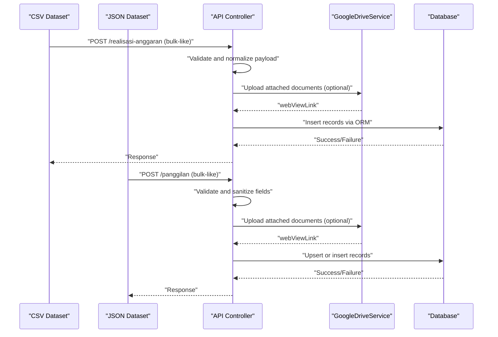
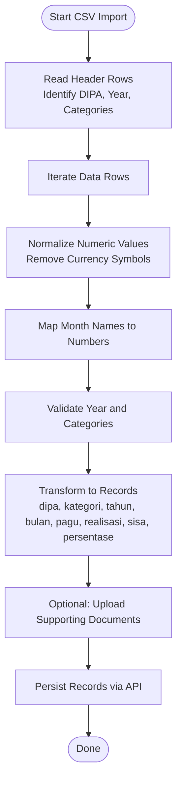
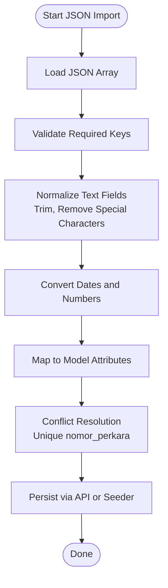
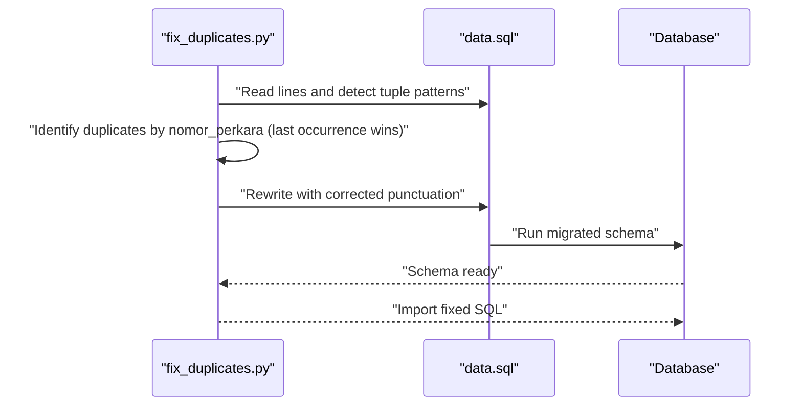
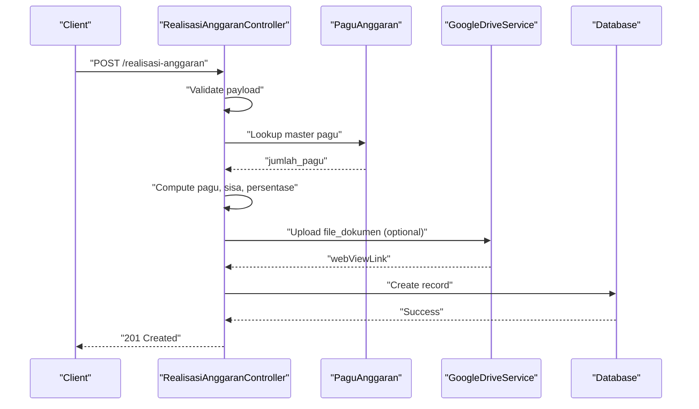
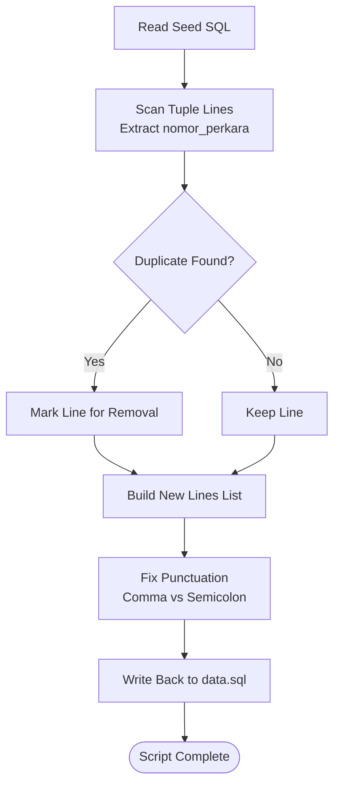
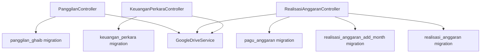

# Data Import and Migration Procedures

<cite>
**Referenced Files in This Document**
- [fix_duplicates.py](file://fix_duplicates.py)
- [composer.json](file://composer.json)
- [database/data/data_pegawai.json](file://database/data/data_pegawai.json)
- [database/seeders/data.sql](file://database/seeders/data.sql)
- [database/seeders/data_itsbat.json](file://database/seeders/data_itsbat.json)
- [database/migrations/2026_01_21_000001_create_panggilan_ghaib_table.php](file://database/migrations/2026_01_21_000001_create_panggilan_ghaib_table.php)
- [database/migrations/2026_02_10_000000_create_realisasi_anggaran_table.php](file://database/migrations/2026_02_10_000000_create_realisasi_anggaran_table.php)
- [database/migrations/2026_02_10_000001_update_realisasi_anggaran_add_month.php](file://database/migrations/2026_02_10_000001_update_realisasi_anggaran_add_month.php)
- [database/migrations/2026_02_10_000002_create_pagu_anggaran_table.php](file://database/migrations/2026_02_10_000002_create_pagu_anggaran_table.php)
- [database/migrations/2026_04_01_000000_create_keuangan_perkara_table.php](file://database/migrations/2026_04_01_000000_create_keuangan_perkara_table.php)
- [docs/Anggaran Belanja - 2023.csv](file://docs/Anggaran Belanja - 2023.csv)
- [docs/Anggaran Belanja 2024 - 2024.csv](file://docs/Anggaran Belanja 2024 - 2024.csv)
- [docs/Realisasi Anggaran 2025 - Sheet1.csv](file://docs/Realisasi Anggaran 2025 - Sheet1.csv)
- [app/Http/Controllers/PanggilanController.php](file://app/Http/Controllers/PanggilanController.php)
- [app/Http/Controllers/RealisasiAnggaranController.php](file://app/Http/Controllers/RealisasiAnggaranController.php)
- [app/Http/Controllers/KeuanganPerkaraController.php](file://app/Http/Controllers/KeuanganPerkaraController.php)
- [app/Services/GoogleDriveService.php](file://app/Services/GoogleDriveService.php)
</cite>

## Table of Contents
1. [Introduction](#introduction)
2. [Project Structure](#project-structure)
3. [Core Components](#core-components)
4. [Architecture Overview](#architecture-overview)
5. [Detailed Component Analysis](#detailed-component-analysis)
6. [Dependency Analysis](#dependency-analysis)
7. [Performance Considerations](#performance-considerations)
8. [Troubleshooting Guide](#troubleshooting-guide)
9. [Conclusion](#conclusion)
10. [Appendices](#appendices)

## Introduction
This document describes the end-to-end data import and migration procedures for the project, focusing on:
- CSV processing and ingestion for budget tracking and administrative datasets
- SQL import workflows for bulk data insertion
- Automated migration scripts for duplicate data removal and data integrity
- Validation and conflict resolution strategies
- Practical examples of data cleaning, normalization, and format conversion
- Batch processing strategies and error recovery mechanisms
- Performance considerations and monitoring approaches
- Troubleshooting common issues and rollback strategies

## Project Structure
The repository organizes data import and migration assets across several areas:
- CSV datasets under docs/ for budget and administrative reporting
- JSON datasets under database/data/ for staff-related administrative data
- SQL seed data under database/seeders/ for initial dataset population
- Laravel migrations under database/migrations/ defining schema compatibility
- PHP controllers under app/Http/Controllers/ exposing APIs for data ingestion
- Google Drive integration service under app/Services/ for file upload workflows

```mermaid
graph TB
subgraph "Data Sources"
CSV1["docs/Anggaran Belanja - 2023.csv"]
CSV2["docs/Anggaran Belanja 2024 - 2024.csv"]
CSV3["docs/Realisasi Anggaran 2025 - Sheet1.csv"]
JSON1["database/data/data_pegawai.json"]
SQL1["database/seeders/data.sql"]
JSON2["database/seeders/data_itsbat.json"]
end
subgraph "Processing"
PY["fix_duplicates.py"]
CTRL1["PanggilanController.php"]
CTRL2["RealisasiAnggaranController.php"]
CTRL3["KeuanganPerkaraController.php"]
SVC["GoogleDriveService.php"]
end
subgraph "Schema and Migrations"
MIG1["2026_01_21_000001_create_panggilan_ghaib_table.php"]
MIG2["2026_02_10_000000_create_realisasi_anggaran_table.php"]
MIG3["2026_02_10_000001_update_realisasi_anggaran_add_month.php"]
MIG4["2026_02_10_000002_create_pagu_anggaran_table.php"]
MIG5["2026_04_01_000000_create_keuangan_perkara_table.php"]
end
CSV1 --> CTRL2
CSV2 --> CTRL2
CSV3 --> CTRL2
JSON1 --> CTRL1
JSON2 --> CTRL1
SQL1 --> PY
PY --> MIG1
CTRL1 --> MIG1
CTRL2 --> MIG2
CTRL2 --> MIG3
CTRL2 --> MIG4
CTRL3 --> MIG5
CTRL1 --> SVC
CTRL2 --> SVC
CTRL3 --> SVC
```

**Diagram sources**
- [fix_duplicates.py:1-70](file://fix_duplicates.py#L1-L70)
- [app/Http/Controllers/PanggilanController.php:1-333](file://app/Http/Controllers/PanggilanController.php#L1-L333)
- [app/Http/Controllers/RealisasiAnggaranController.php:1-154](file://app/Http/Controllers/RealisasiAnggaranController.php#L1-L154)
- [app/Http/Controllers/KeuanganPerkaraController.php:1-192](file://app/Http/Controllers/KeuanganPerkaraController.php#L1-L192)
- [app/Services/GoogleDriveService.php:1-117](file://app/Services/GoogleDriveService.php#L1-L117)
- [database/migrations/2026_01_21_000001_create_panggilan_ghaib_table.php:1-42](file://database/migrations/2026_01_21_000001_create_panggilan_ghaib_table.php#L1-L42)
- [database/migrations/2026_02_10_000000_create_realisasi_anggaran_table.php:1-36](file://database/migrations/2026_02_10_000000_create_realisasi_anggaran_table.php#L1-L36)
- [database/migrations/2026_02_10_000001_update_realisasi_anggaran_add_month.php:1-30](file://database/migrations/2026_02_10_000001_update_realisasi_anggaran_add_month.php#L1-L30)
- [database/migrations/2026_02_10_000002_create_pagu_anggaran_table.php:1-33](file://database/migrations/2026_02_10_000002_create_pagu_anggaran_table.php#L1-L33)
- [database/migrations/2026_04_01_000000_create_keuangan_perkara_table.php:1-31](file://database/migrations/2026_04_01_000000_create_keuangan_perkara_table.php#L1-L31)

**Section sources**
- [composer.json:1-47](file://composer.json#L1-L47)

## Core Components
- CSV ingestion for budget tracking and administrative reporting
- JSON ingestion for staff and case financials
- SQL seed data with deduplication automation
- API controllers for secure, validated, and normalized data ingestion
- Google Drive integration for file attachments
- Laravel migrations ensuring schema compatibility and uniqueness constraints

**Section sources**
- [docs/Anggaran Belanja - 2023.csv:1-35](file://docs/Anggaran Belanja - 2023.csv#L1-L35)
- [docs/Anggaran Belanja 2024 - 2024.csv:1-35](file://docs/Anggaran Belanja 2024 - 2024.csv#L1-L35)
- [docs/Realisasi Anggaran 2025 - Sheet1.csv:1-35](file://docs/Realisasi Anggaran 2025 - Sheet1.csv#L1-L35)
- [database/data/data_pegawai.json:1-292](file://database/data/data_pegawai.json#L1-L292)
- [database/seeders/data.sql:1-175](file://database/seeders/data.sql#L1-L175)
- [database/seeders/data_itsbat.json:1-800](file://database/seeders/data_itsbat.json#L1-L800)
- [app/Http/Controllers/PanggilanController.php:1-333](file://app/Http/Controllers/PanggilanController.php#L1-L333)
- [app/Http/Controllers/RealisasiAnggaranController.php:1-154](file://app/Http/Controllers/RealisasiAnggaranController.php#L1-L154)
- [app/Http/Controllers/KeuanganPerkaraController.php:1-192](file://app/Http/Controllers/KeuanganPerkaraController.php#L1-L192)
- [app/Services/GoogleDriveService.php:1-117](file://app/Services/GoogleDriveService.php#L1-L117)
- [database/migrations/2026_01_21_000001_create_panggilan_ghaib_table.php:1-42](file://database/migrations/2026_01_21_000001_create_panggilan_ghaib_table.php#L1-L42)
- [database/migrations/2026_02_10_000000_create_realisasi_anggaran_table.php:1-36](file://database/migrations/2026_02_10_000000_create_realisasi_anggaran_table.php#L1-L36)
- [database/migrations/2026_02_10_000001_update_realisasi_anggaran_add_month.php:1-30](file://database/migrations/2026_02_10_000001_update_realisasi_anggaran_add_month.php#L1-L30)
- [database/migrations/2026_02_10_000002_create_pagu_anggaran_table.php:1-33](file://database/migrations/2026_02_10_000002_create_pagu_anggaran_table.php#L1-L33)
- [database/migrations/2026_04_01_000000_create_keuangan_perkara_table.php:1-31](file://database/migrations/2026_04_01_000000_create_keuangan_perkara_table.php#L1-L31)

## Architecture Overview
The data import pipeline integrates external datasets with internal APIs and storage systems. It ensures validation, normalization, and safe persistence with fallbacks for file uploads.

**Diagram sources**
- [app/Http/Controllers/RealisasiAnggaranController.php:55-85](file://app/Http/Controllers/RealisasiAnggaranController.php#L55-L85)
- [app/Http/Controllers/PanggilanController.php:115-198](file://app/Http/Controllers/PanggilanController.php#L115-L198)
- [app/Services/GoogleDriveService.php:38-82](file://app/Services/GoogleDriveService.php#L38-L82)
- [database/migrations/2026_02_10_000000_create_realisasi_anggaran_table.php:14-25](file://database/migrations/2026_02_10_000000_create_realisasi_anggaran_table.php#L14-L25)
- [database/migrations/2026_01_21_000001_create_panggilan_ghaib_table.php:13-31](file://database/migrations/2026_01_21_000001_create_panggilan_ghaib_table.php#L13-L31)

## Detailed Component Analysis

### CSV Data Import Procedures
- Budget tracking datasets (Anggaran Belanja) and Realisasi Anggaran datasets are structured with headers indicating DIPA, categories, monthly breakdowns, totals, and balances.
- Recommended ingestion steps:
  - Parse CSV header rows to identify DIPA, year, category groups, and monthly columns.
  - Normalize numeric values (remove currency symbols and thousand separators) and convert to appropriate numeric types.
  - Map month names to integer values (1–12) and derive quarter or semester metadata if needed.
  - Validate year ranges and category names against configured lists.
  - Transform rows into normalized records with fields such as dipa, kategori, tahun, bulan, jumlah_pagu, realisasi, sisa, persentase, url_dokumen.
  - For each record, optionally attach supporting documents by uploading to Google Drive and capturing the public link.

**Diagram sources**
- [docs/Anggaran Belanja - 2023.csv:1-35](file://docs/Anggaran Belanja - 2023.csv#L1-L35)
- [docs/Anggaran Belanja 2024 - 2024.csv:1-35](file://docs/Anggaran Belanja 2024 - 2024.csv#L1-L35)
- [docs/Realisasi Anggaran 2025 - Sheet1.csv:1-35](file://docs/Realisasi Anggaran 2025 - Sheet1.csv#L1-L35)
- [app/Http/Controllers/RealisasiAnggaranController.php:55-85](file://app/Http/Controllers/RealisasiAnggaranController.php#L55-L85)
- [app/Services/GoogleDriveService.php:38-82](file://app/Services/GoogleDriveService.php#L38-L82)

**Section sources**
- [docs/Anggaran Belanja - 2023.csv:1-35](file://docs/Anggaran Belanja - 2023.csv#L1-L35)
- [docs/Anggaran Belanja 2024 - 2024.csv:1-35](file://docs/Anggaran Belanja 2024 - 2024.csv#L1-L35)
- [docs/Realisasi Anggaran 2025 - Sheet1.csv:1-35](file://docs/Realisasi Anggaran 2025 - Sheet1.csv#L1-L35)
- [app/Http/Controllers/RealisasiAnggaranController.php:55-85](file://app/Http/Controllers/RealisasiAnggaranController.php#L55-L85)
- [app/Services/GoogleDriveService.php:38-82](file://app/Services/GoogleDriveService.php#L38-L82)

### JSON Data Import Procedures
- Staff administrative data (data_pegawai.json) and case financials (data_itsbat.json) require:
  - Parsing JSON arrays and validating required fields.
  - Normalizing whitespace and special characters in textual fields.
  - Converting dates and numeric identifiers to canonical formats.
  - Mapping JSON keys to model attributes and applying validation rules.
  - Bulk insertion/upsert with conflict resolution (e.g., unique nomor_perkara).

**Diagram sources**
- [database/data/data_pegawai.json:1-292](file://database/data/data_pegawai.json#L1-L292)
- [database/seeders/data_itsbat.json:1-800](file://database/seeders/data_itsbat.json#L1-L800)
- [app/Http/Controllers/PanggilanController.php:115-198](file://app/Http/Controllers/PanggilanController.php#L115-L198)

**Section sources**
- [database/data/data_pegawai.json:1-292](file://database/data/data_pegawai.json#L1-L292)
- [database/seeders/data_itsbat.json:1-800](file://database/seeders/data_itsbat.json#L1-L800)
- [app/Http/Controllers/PanggilanController.php:115-198](file://app/Http/Controllers/PanggilanController.php#L115-L198)

### SQL Import Procedures and Schema Compatibility
- Seed SQL (data.sql) contains INSERT statements for panggilan_ghaib. A dedicated script removes duplicate entries by nomor_perkara while preserving the last occurrence and fixing tuple punctuation.
- Migrations define schema compatibility and enforce uniqueness:
  - panggilan_ghaib: unique index on nomor_perkara
  - realisasi_anggaran: unique composite on (dipa, kategori, tahun); later extended with bulan and link_dokumen
  - pagu_anggaran: unique composite on (dipa, kategori, tahun)
  - keuangan_perkara: unique composite on (tahun, bulan)

**Diagram sources**
- [fix_duplicates.py:1-70](file://fix_duplicates.py#L1-L70)
- [database/seeders/data.sql:1-175](file://database/seeders/data.sql#L1-L175)
- [database/migrations/2026_01_21_000001_create_panggilan_ghaib_table.php:13-31](file://database/migrations/2026_01_21_000001_create_panggilan_ghaib_table.php#L13-L31)
- [database/migrations/2026_02_10_000000_create_realisasi_anggaran_table.php:14-25](file://database/migrations/2026_02_10_000000_create_realisasi_anggaran_table.php#L14-L25)
- [database/migrations/2026_02_10_000001_update_realisasi_anggaran_add_month.php:14-17](file://database/migrations/2026_02_10_000001_update_realisasi_anggaran_add_month.php#L14-L17)
- [database/migrations/2026_02_10_000002_create_pagu_anggaran_table.php:14-21](file://database/migrations/2026_02_10_000002_create_pagu_anggaran_table.php#L14-L21)
- [database/migrations/2026_04_01_000000_create_keuangan_perkara_table.php:11-23](file://database/migrations/2026_04_01_000000_create_keuangan_perkara_table.php#L11-L23)

**Section sources**
- [fix_duplicates.py:1-70](file://fix_duplicates.py#L1-L70)
- [database/seeders/data.sql:1-175](file://database/seeders/data.sql#L1-L175)
- [database/migrations/2026_01_21_000001_create_panggilan_ghaib_table.php:13-31](file://database/migrations/2026_01_21_000001_create_panggilan_ghaib_table.php#L13-L31)
- [database/migrations/2026_02_10_000000_create_realisasi_anggaran_table.php:14-25](file://database/migrations/2026_02_10_000000_create_realisasi_anggaran_table.php#L14-L25)
- [database/migrations/2026_02_10_000001_update_realisasi_anggaran_add_month.php:14-17](file://database/migrations/2026_02_10_000001_update_realisasi_anggaran_add_month.php#L14-L17)
- [database/migrations/2026_02_10_000002_create_pagu_anggaran_table.php:14-21](file://database/migrations/2026_02_10_000002_create_pagu_anggaran_table.php#L14-L21)
- [database/migrations/2026_04_01_000000_create_keuangan_perkara_table.php:11-23](file://database/migrations/2026_04_01_000000_create_keuangan_perkara_table.php#L11-L23)

### API Workflows for Data Ingestion
- RealisasiAnggaranController:
  - Validates dipa, kategori, tahun, bulan, realisasi
  - Optionally attaches documents and computes pagu, sisa, persentase
  - Uses master pagu from pagu_anggaran for consistency
- KeuanganPerkaraController:
  - Validates tahun and bulan uniqueness
  - Accepts optional file uploads and stores url_detail
- PanggilanController:
  - Validates and sanitizes fields for panggilan_ghaib
  - Supports file uploads with Google Drive fallback to local storage

**Diagram sources**
- [app/Http/Controllers/RealisasiAnggaranController.php:55-85](file://app/Http/Controllers/RealisasiAnggaranController.php#L55-L85)
- [app/Services/GoogleDriveService.php:38-82](file://app/Services/GoogleDriveService.php#L38-L82)
- [database/migrations/2026_02_10_000000_create_realisasi_anggaran_table.php:14-25](file://database/migrations/2026_02_10_000000_create_realisasi_anggaran_table.php#L14-L25)
- [database/migrations/2026_02_10_000002_create_pagu_anggaran_table.php:14-21](file://database/migrations/2026_02_10_000002_create_pagu_anggaran_table.php#L14-L21)

**Section sources**
- [app/Http/Controllers/RealisasiAnggaranController.php:55-85](file://app/Http/Controllers/RealisasiAnggaranController.php#L55-L85)
- [app/Http/Controllers/KeuanganPerkaraController.php:57-120](file://app/Http/Controllers/KeuanganPerkaraController.php#L57-L120)
- [app/Http/Controllers/PanggilanController.php:115-198](file://app/Http/Controllers/PanggilanController.php#L115-L198)
- [app/Services/GoogleDriveService.php:38-82](file://app/Services/GoogleDriveService.php#L38-L82)

### Automated Migration Scripts and Batch Processing
- fix_duplicates.py:
  - Reads seed SQL, extracts nomor_perkara using regex
  - Identifies duplicates by scanning tuple lines and keeps the last occurrence
  - Rewrites lines with proper comma/semicolon punctuation for SQL correctness
  - Writes back to the same file and prints summary
- Batch processing strategy:
  - Process CSV/JSON in chunks to avoid memory spikes
  - Use streaming parsers for large CSV files
  - Apply transaction batching for SQL inserts
  - Implement retry/backoff for transient errors during file uploads

**Diagram sources**
- [fix_duplicates.py:1-70](file://fix_duplicates.py#L1-L70)
- [database/seeders/data.sql:1-175](file://database/seeders/data.sql#L1-L175)

**Section sources**
- [fix_duplicates.py:1-70](file://fix_duplicates.py#L1-L70)
- [database/seeders/data.sql:1-175](file://database/seeders/data.sql#L1-L175)

### Data Cleaning, Normalization, and Format Conversion
- CSV normalization:
  - Remove currency symbols and thousand separators
  - Convert percentages to decimals
  - Map month names to integers
  - Derive quarters or semesters if needed
- JSON normalization:
  - Trim whitespace and remove non-breaking spaces
  - Normalize date formats to YYYY-MM-DD
  - Validate numeric identifiers and categorize unknowns
- SQL normalization:
  - Ensure consistent quoting and punctuation
  - Preserve last occurrence of duplicates by nomor_perkara

**Section sources**
- [docs/Anggaran Belanja - 2023.csv:1-35](file://docs/Anggaran Belanja - 2023.csv#L1-L35)
- [docs/Anggaran Belanja 2024 - 2024.csv:1-35](file://docs/Anggaran Belanja 2024 - 2024.csv#L1-L35)
- [docs/Realisasi Anggaran 2025 - Sheet1.csv:1-35](file://docs/Realisasi Anggaran 2025 - Sheet1.csv#L1-L35)
- [database/data/data_pegawai.json:1-292](file://database/data/data_pegawai.json#L1-L292)
- [database/seeders/data_itsbat.json:1-800](file://database/seeders/data_itsbat.json#L1-L800)
- [fix_duplicates.py:1-70](file://fix_duplicates.py#L1-L70)

### Validation and Conflict Resolution Strategies
- Validation:
  - Year range checks (2000–2100)
  - Regex validation for nomor_perkara
  - MIME type and size limits for uploads
  - Unique constraints enforced by migrations
- Conflict resolution:
  - Last-wins strategy for duplicates by nomor_perkara
  - Unique constraints prevent duplicate inserts
  - Upsert logic recommended for JSON datasets

**Section sources**
- [app/Http/Controllers/PanggilanController.php:118-130](file://app/Http/Controllers/PanggilanController.php#L118-L130)
- [app/Http/Controllers/RealisasiAnggaranController.php:57-64](file://app/Http/Controllers/RealisasiAnggaranController.php#L57-L64)
- [app/Http/Controllers/KeuanganPerkaraController.php:59-76](file://app/Http/Controllers/KeuanganPerkaraController.php#L59-L76)
- [database/migrations/2026_01_21_000001_create_panggilan_ghaib_table.php:28-31](file://database/migrations/2026_01_21_000001_create_panggilan_ghaib_table.php#L28-L31)
- [database/migrations/2026_02_10_000002_create_pagu_anggaran_table.php](file://database/migrations/2026_02_10_000002_create_pagu_anggaran_table.php#L20)
- [database/migrations/2026_04_01_000000_create_keuangan_perkara_table.php](file://database/migrations/2026_04_01_000000_create_keuangan_perkara_table.php#L21)

## Dependency Analysis
- Controllers depend on:
  - GoogleDriveService for file upload workflows
  - Database migrations for schema compatibility
  - External CSV/JSON datasets for ingestion
- Migrations define:
  - Unique constraints and indexes
  - Numeric precision for financial data
  - Nullable fields for optional uploads and metadata

**Diagram sources**
- [app/Http/Controllers/PanggilanController.php:142-148](file://app/Http/Controllers/PanggilanController.php#L142-L148)
- [app/Http/Controllers/RealisasiAnggaranController.php:68-71](file://app/Http/Controllers/RealisasiAnggaranController.php#L68-L71)
- [app/Http/Controllers/KeuanganPerkaraController.php:85-86](file://app/Http/Controllers/KeuanganPerkaraController.php#L85-L86)
- [app/Services/GoogleDriveService.php:38-82](file://app/Services/GoogleDriveService.php#L38-L82)
- [database/migrations/2026_01_21_000001_create_panggilan_ghaib_table.php:13-31](file://database/migrations/2026_01_21_000001_create_panggilan_ghaib_table.php#L13-L31)
- [database/migrations/2026_02_10_000000_create_realisasi_anggaran_table.php:14-25](file://database/migrations/2026_02_10_000000_create_realisasi_anggaran_table.php#L14-L25)
- [database/migrations/2026_02_10_000001_update_realisasi_anggaran_add_month.php:14-17](file://database/migrations/2026_02_10_000001_update_realisasi_anggaran_add_month.php#L14-L17)
- [database/migrations/2026_02_10_000002_create_pagu_anggaran_table.php:14-21](file://database/migrations/2026_02_10_000002_create_pagu_anggaran_table.php#L14-L21)
- [database/migrations/2026_04_01_000000_create_keuangan_perkara_table.php:11-23](file://database/migrations/2026_04_01_000000_create_keuangan_perkara_table.php#L11-L23)

**Section sources**
- [composer.json:22-27](file://composer.json#L22-L27)

## Performance Considerations
- Memory optimization:
  - Stream CSV parsing and process in chunks
  - Use generators for large JSON arrays
  - Batch SQL inserts and commit in transactions
- Network and storage:
  - Prefer chunked uploads for large files
  - Use Google Drive public links for scalable document retrieval
- Monitoring:
  - Log upload attempts and fallbacks
  - Track validation failures and duplicate removal counts
  - Monitor database constraint violations and unique key conflicts

[No sources needed since this section provides general guidance]

## Troubleshooting Guide
- Encoding problems:
  - Ensure CSV files are saved with UTF-8 encoding
  - Validate column delimiters and quote characters
- Format inconsistencies:
  - Standardize date formats to YYYY-MM-DD
  - Normalize numeric formats (remove currency symbols and thousand separators)
- Validation failures:
  - Verify year ranges, MIME types, and sizes
  - Confirm unique constraints (nomor_perkara, (dipa,kategori,tahun), (tahun,bulan))
- Error recovery:
  - Retry transient Google Drive errors with exponential backoff
  - Fallback to local storage when Google Drive is unavailable
  - Rollback failed transactions and reattempt in smaller batches

**Section sources**
- [app/Http/Controllers/PanggilanController.php:140-188](file://app/Http/Controllers/PanggilanController.php#L140-L188)
- [app/Http/Controllers/RealisasiAnggaranController.php:68-71](file://app/Http/Controllers/RealisasiAnggaranController.php#L68-L71)
- [app/Http/Controllers/KeuanganPerkaraController.php:85-107](file://app/Http/Controllers/KeuanganPerkaraController.php#L85-L107)

## Conclusion
The project’s data import and migration procedures combine robust validation, normalization, and schema compatibility checks with resilient file upload workflows. By leveraging controllers, migrations, and automation scripts, teams can reliably ingest CSV, JSON, and SQL datasets while maintaining data quality and integrity.

[No sources needed since this section summarizes without analyzing specific files]

## Appendices

### Appendix A: Data Quality Assurance and Rollback Strategies
- Data quality assurance:
  - Pre-import checksums for CSV/JSON datasets
  - Post-import verification of unique constraints and referential integrity
  - Audit logs for all ingestion events
- Rollback strategies:
  - Transactional batches with savepoints
  - Seed SQL backup prior to running fix_duplicates.py
  - Versioned migrations with reversible down() methods

**Section sources**
- [fix_duplicates.py:65-70](file://fix_duplicates.py#L65-L70)
- [database/migrations/2026_01_21_000001_create_panggilan_ghaib_table.php:37-40](file://database/migrations/2026_01_21_000001_create_panggilan_ghaib_table.php#L37-L40)
- [database/migrations/2026_02_10_000000_create_realisasi_anggaran_table.php:31-34](file://database/migrations/2026_02_10_000000_create_realisasi_anggaran_table.php#L31-L34)
- [database/migrations/2026_02_10_000002_create_pagu_anggaran_table.php:28-31](file://database/migrations/2026_02_10_000002_create_pagu_anggaran_table.php#L28-L31)
- [database/migrations/2026_04_01_000000_create_keuangan_perkara_table.php:26-29](file://database/migrations/2026_04_01_000000_create_keuangan_perkara_table.php#L26-L29)