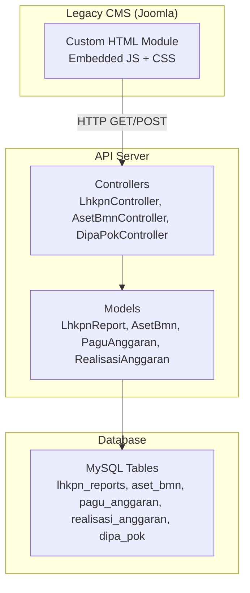
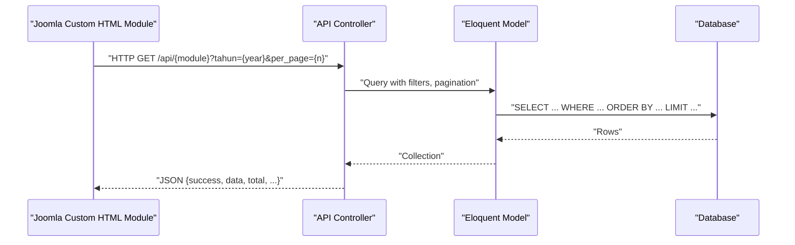
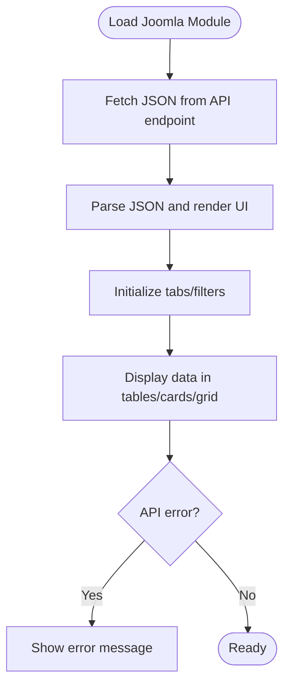
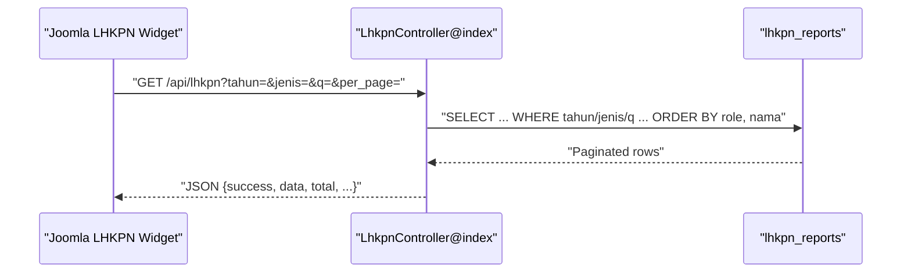
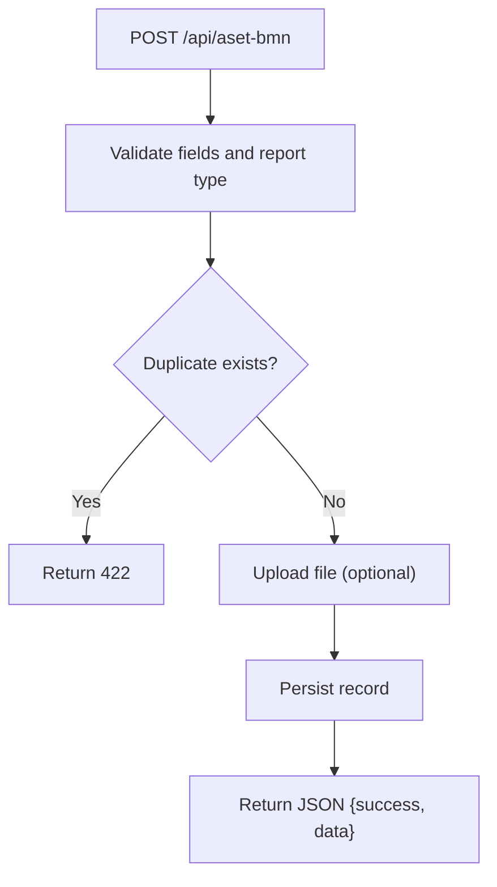
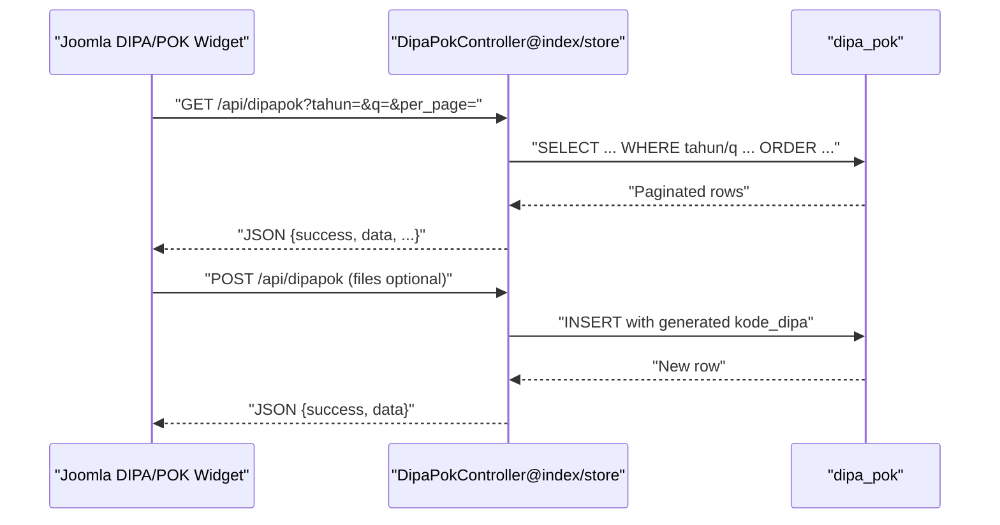
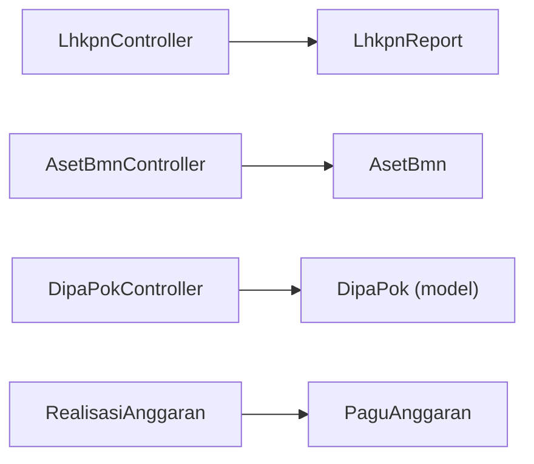

# Integration Documentation

<cite>
**Referenced Files in This Document**
- [joomla-integration.html](file://docs/joomla-integration.html)
- [joomla-integration-anggaran.html](file://docs/joomla-integration-anggaran.html)
- [joomla-integration-lhkpn.html](file://docs/joomla-integration-lhkpn.html)
- [joomla-integration-aset-bmn.html](file://docs/joomla-integration-aset-bmn.html)
- [joomla-integration-dipapok.html](file://docs/joomla-integration-dipapok.html)
- [joomla-integration-laporan-pengaduan.html](file://docs/joomla-integration-laporan-pengaduan.html)
- [joomla-integration-lra.html](file://docs/joomla-integration-lra.html)
- [joomla-integration-sakip.html](file://docs/joomla-integration-sakip.html)
- [LhkpnController.php](file://app/Http/Controllers/LhkpnController.php)
- [AsetBmnController.php](file://app/Http/Controllers/AsetBmnController.php)
- [DipaPokController.php](file://app/Http/Controllers/DipaPokController.php)
- [PaguAnggaran.php](file://app/Models/PaguAnggaran.php)
- [RealisasiAnggaran.php](file://app/Models/RealisasiAnggaran.php)
- [LhkpnReport.php](file://app/Models/LhkpnReport.php)
- [AsetBmn.php](file://app/Models/AsetBmn.php)
</cite>

## Table of Contents
1. [Introduction](#introduction)
2. [Project Structure](#project-structure)
3. [Core Components](#core-components)
4. [Architecture Overview](#architecture-overview)
5. [Detailed Component Analysis](#detailed-component-analysis)
6. [Dependency Analysis](#dependency-analysis)
7. [Performance Considerations](#performance-considerations)
8. [Troubleshooting Guide](#troubleshooting-guide)
9. [Conclusion](#conclusion)
10. [Appendices](#appendices)

## Introduction
This document provides comprehensive integration documentation for legacy system migration and third-party integration patterns. It focuses on how the platform integrates with legacy systems and external consumers via APIs, with a strong emphasis on:
- Migration strategies from legacy systems
- Historical data preservation and synchronization
- Integration patterns for modules: anggaran (budget), lhkpn (asset declarations), aset bmn (state property), and dipapok (annual planning)
- Data transformation, validation, and conflict resolution
- Practical examples for CSV processing, SQL import, and automated migration scripts
- Testing, data quality assurance, rollback strategies, performance optimization, and monitoring

## Project Structure
The integration ecosystem consists of:
- Frontend integration assets (HTML snippets and JavaScript) embedded into legacy CMS (Joomla) via Custom HTML modules
- Backend API implemented with a PHP framework, exposing REST endpoints for each module
- Database models and relations representing historical and operational datasets
- Controllers implementing CRUD operations, validation, and file upload handling



**Diagram sources**
- [joomla-integration.html:1-398](file://docs/joomla-integration.html#L1-L398)
- [LhkpnController.php:1-147](file://app/Http/Controllers/LhkpnController.php#L1-L147)
- [AsetBmnController.php:1-167](file://app/Http/Controllers/AsetBmnController.php#L1-L167)
- [DipaPokController.php:1-192](file://app/Http/Controllers/DipaPokController.php#L1-L192)
- [LhkpnReport.php:1-28](file://app/Models/LhkpnReport.php#L1-L28)
- [AsetBmn.php:1-21](file://app/Models/AsetBmn.php#L1-L21)
- [PaguAnggaran.php:1-30](file://app/Models/PaguAnggaran.php#L1-L30)
- [RealisasiAnggaran.php:1-46](file://app/Models/RealisasiAnggaran.php#L1-L46)

**Section sources**
- [joomla-integration.html:1-398](file://docs/joomla-integration.html#L1-L398)
- [joomla-integration-anggaran.html:1-265](file://docs/joomla-integration-anggaran.html#L1-L265)
- [joomla-integration-lhkpn.html:1-350](file://docs/joomla-integration-lhkpn.html#L1-L350)
- [joomla-integration-aset-bmn.html:1-292](file://docs/joomla-integration-aset-bmn.html#L1-L292)
- [joomla-integration-dipapok.html:1-321](file://docs/joomla-integration-dipapok.html#L1-L321)
- [joomla-integration-laporan-pengaduan.html:1-265](file://docs/joomla-integration-laporan-pengaduan.html#L1-L265)
- [joomla-integration-lra.html:1-277](file://docs/joomla-integration-lra.html#L1-L277)
- [joomla-integration-sakip.html:1-280](file://docs/joomla-integration-sakip.html#L1-L280)

## Core Components
- Legacy integration assets: HTML/CSS/JS snippets embedded in Joomla Custom HTML modules to render tables and documents from API endpoints
- API controllers: Provide REST endpoints for retrieval and management of module data, including pagination, filtering, and file upload handling
- Data models: Define table schemas, fillable attributes, casting, and relationships (e.g., realisasi to pagu)
- Validation and conflict resolution: Controllers enforce field validation and prevent duplicates where applicable

Key integration patterns:
- Public read endpoints for historical data consumption by legacy systems
- Protected write endpoints for administrative ingestion and updates
- File upload pipeline generating secure links for PDFs and office documents
- Pagination and filtering to support large datasets

**Section sources**
- [LhkpnController.php:1-147](file://app/Http/Controllers/LhkpnController.php#L1-L147)
- [AsetBmnController.php:1-167](file://app/Http/Controllers/AsetBmnController.php#L1-L167)
- [DipaPokController.php:1-192](file://app/Http/Controllers/DipaPokController.php#L1-L192)
- [LhkpnReport.php:1-28](file://app/Models/LhkpnReport.php#L1-L28)
- [AsetBmn.php:1-21](file://app/Models/AsetBmn.php#L1-L21)
- [PaguAnggaran.php:1-30](file://app/Models/PaguAnggaran.php#L1-L30)
- [RealisasiAnggaran.php:1-46](file://app/Models/RealisasiAnggaran.php#L1-L46)

## Architecture Overview
The integration architecture follows a thin-client pattern:
- Legacy CMS renders UI widgets and loads data via AJAX from API endpoints
- Controllers handle requests, apply filters and pagination, and return structured JSON
- Models encapsulate persistence and relationships
- Optional file uploads produce document URLs for PDFs and office documents



**Diagram sources**
- [joomla-integration-anggaran.html:172-265](file://docs/joomla-integration-anggaran.html#L172-L265)
- [joomla-integration-lhkpn.html:181-350](file://docs/joomla-integration-lhkpn.html#L181-L350)
- [joomla-integration-aset-bmn.html:171-292](file://docs/joomla-integration-aset-bmn.html#L171-L292)
- [joomla-integration-dipapok.html:186-321](file://docs/joomla-integration-dipapok.html#L186-L321)
- [LhkpnController.php:11-53](file://app/Http/Controllers/LhkpnController.php#L11-L53)
- [AsetBmnController.php:32-54](file://app/Http/Controllers/AsetBmnController.php#L32-L54)
- [DipaPokController.php:10-39](file://app/Http/Controllers/DipaPokController.php#L10-L39)

## Detailed Component Analysis

### Legacy Integration Assets (Joomla Modules)
- Purpose: Embed interactive dashboards and document listings into legacy CMS pages
- Mechanism: Inline CSS/JS with AJAX calls to API endpoints; tabs and filters applied client-side
- Examples:
  - Anggaran: Yearly tabs and progress bars
  - LHKPN: Role-based sorting and document links
  - Aset BMN: Lookup-based rendering of report categories
  - DIPA/POK: Currency/date formatting and document buttons
  - Laporan Pengaduan: Monthly aggregation table
  - LRA: Grouped cards per DIPA type
  - Sakip: Lookup-based document table
  - Panggilan: Filtered table with responsive DataTables



**Diagram sources**
- [joomla-integration-anggaran.html:172-265](file://docs/joomla-integration-anggaran.html#L172-L265)
- [joomla-integration-lhkpn.html:181-350](file://docs/joomla-integration-lhkpn.html#L181-L350)
- [joomla-integration-aset-bmn.html:171-292](file://docs/joomla-integration-aset-bmn.html#L171-L292)
- [joomla-integration-dipapok.html:186-321](file://docs/joomla-integration-dipapok.html#L186-L321)
- [joomla-integration-laporan-pengaduan.html:143-265](file://docs/joomla-integration-laporan-pengaduan.html#L143-L265)
- [joomla-integration-lra.html:170-277](file://docs/joomla-integration-lra.html#L170-L277)
- [joomla-integration-sakip.html:186-280](file://docs/joomla-integration-sakip.html#L186-L280)

**Section sources**
- [joomla-integration.html:1-398](file://docs/joomla-integration.html#L1-L398)
- [joomla-integration-anggaran.html:1-265](file://docs/joomla-integration-anggaran.html#L1-L265)
- [joomla-integration-lhkpn.html:1-350](file://docs/joomla-integration-lhkpn.html#L1-L350)
- [joomla-integration-aset-bmn.html:1-292](file://docs/joomla-integration-aset-bmn.html#L1-L292)
- [joomla-integration-dipapok.html:1-321](file://docs/joomla-integration-dipapok.html#L1-L321)
- [joomla-integration-laporan-pengaduan.html:1-265](file://docs/joomla-integration-laporan-pengaduan.html#L1-L265)
- [joomla-integration-lra.html:1-277](file://docs/joomla-integration-lra.html#L1-L277)
- [joomla-integration-sakip.html:1-280](file://docs/joomla-integration-sakip.html#L1-L280)

### LHKPN Integration (Asset Declarations)
- Data model: LhkpnReport stores personal and reporting metadata with optional document links
- Controller: Supports filtering by year and type, global search, role-aware ordering, pagination, and file uploads
- Integration pattern: Legacy UI displays sorted rows with document badges and links



**Diagram sources**
- [joomla-integration-lhkpn.html:181-350](file://docs/joomla-integration-lhkpn.html#L181-L350)
- [LhkpnController.php:11-53](file://app/Http/Controllers/LhkpnController.php#L11-L53)
- [LhkpnReport.php:1-28](file://app/Models/LhkpnReport.php#L1-L28)

**Section sources**
- [LhkpnController.php:1-147](file://app/Http/Controllers/LhkpnController.php#L1-L147)
- [LhkpnReport.php:1-28](file://app/Models/LhkpnReport.php#L1-L28)
- [joomla-integration-lhkpn.html:1-350](file://docs/joomla-integration-lhkpn.html#L1-L350)

### ASET BMN Integration (State Property Reports)
- Data model: AsetBmn stores yearly report entries with predefined report types
- Controller: Validates report type against allowed list, prevents duplicates, supports file uploads
- Integration pattern: Legacy UI renders categorized report rows with document links



**Diagram sources**
- [AsetBmnController.php:71-105](file://app/Http/Controllers/AsetBmnController.php#L71-L105)
- [AsetBmn.php:1-21](file://app/Models/AsetBmn.php#L1-L21)

**Section sources**
- [AsetBmnController.php:1-167](file://app/Http/Controllers/AsetBmnController.php#L1-L167)
- [AsetBmn.php:1-21](file://app/Models/AsetBmn.php#L1-L21)
- [joomla-integration-aset-bmn.html:1-292](file://docs/joomla-integration-aset-bmn.html#L1-L292)

### DIPA/POK Integration (Annual Planning)
- Controller: Handles creation/update with file uploads for DIPA and POK documents; generates internal code based on inputs
- Integration pattern: Legacy UI lists entries with formatted currency/date and document buttons



**Diagram sources**
- [joomla-integration-dipapok.html:186-321](file://docs/joomla-integration-dipapok.html#L186-L321)
- [DipaPokController.php:10-39](file://app/Http/Controllers/DipaPokController.php#L10-L39)
- [DipaPokController.php:41-96](file://app/Http/Controllers/DipaPokController.php#L41-L96)

**Section sources**
- [DipaPokController.php:1-192](file://app/Http/Controllers/DipaPokController.php#L1-L192)
- [joomla-integration-dipapok.html:1-321](file://docs/joomla-integration-dipapok.html#L1-L321)

### Anggaran Integration (Budget)
- Integration pattern: Yearly tabs, currency formatting, progress bars, and paginated tables
- Controller: Index supports pagination and filtering; models define numeric casts and relationships

```mermaid
classDiagram
class PaguAnggaran {
+table "pagu_anggaran"
+fillable ["dipa","kategori","jumlah_pagu","tahun"]
+casts {"jumlah_pagu" : "decimal : 2","tahun" : "integer"}
+setJumlahPaguAttribute(value)
+getJumlahPaguAttribute(value) float
}
class RealisasiAnggaran {
+table "realisasi_anggaran"
+fillable [...]
+casts {"pagu" : "float","realisasi" : "float",...}
+paguMaster() belongsTo
}
RealisasiAnggaran --> PaguAnggaran : "belongsTo(dipa,kategori,tahun)"
```

**Diagram sources**
- [PaguAnggaran.php:1-30](file://app/Models/PaguAnggaran.php#L1-L30)
- [RealisasiAnggaran.php:1-46](file://app/Models/RealisasiAnggaran.php#L1-L46)

**Section sources**
- [joomla-integration-anggaran.html:1-265](file://docs/joomla-integration-anggaran.html#L1-L265)
- [PaguAnggaran.php:1-30](file://app/Models/PaguAnggaran.php#L1-L30)
- [RealisasiAnggaran.php:1-46](file://app/Models/RealisasiAnggaran.php#L1-L46)

### Additional Modules (Laporan Pengaduan, LRA, Sakip, Panggilan)
- Laporan Pengaduan: Monthly aggregation table with totals
- LRA: Grouped cards per DIPA type with cover placeholders
- Sakip: Lookup-based document table
- Panggilan: Filtered table with responsive DataTables

**Section sources**
- [joomla-integration-laporan-pengaduan.html:1-265](file://docs/joomla-integration-laporan-pengaduan.html#L1-L265)
- [joomla-integration-lra.html:1-277](file://docs/joomla-integration-lra.html#L1-L277)
- [joomla-integration-sakip.html:1-280](file://docs/joomla-integration-sakip.html#L1-L280)
- [joomla-integration.html:1-398](file://docs/joomla-integration.html#L1-L398)

## Dependency Analysis
- Controllers depend on Eloquent models for data access and validation
- Models define relationships (e.g., realisasi to pagu) enabling referential integrity
- Legacy UI depends on API endpoints; UI assets are decoupled from backend logic



**Diagram sources**
- [LhkpnController.php:1-147](file://app/Http/Controllers/LhkpnController.php#L1-L147)
- [AsetBmnController.php:1-167](file://app/Http/Controllers/AsetBmnController.php#L1-L167)
- [DipaPokController.php:1-192](file://app/Http/Controllers/DipaPokController.php#L1-L192)
- [LhkpnReport.php:1-28](file://app/Models/LhkpnReport.php#L1-L28)
- [AsetBmn.php:1-21](file://app/Models/AsetBmn.php#L1-L21)
- [PaguAnggaran.php:1-30](file://app/Models/PaguAnggaran.php#L1-L30)
- [RealisasiAnggaran.php:1-46](file://app/Models/RealisasiAnggaran.php#L1-L46)

**Section sources**
- [LhkpnController.php:1-147](file://app/Http/Controllers/LhkpnController.php#L1-L147)
- [AsetBmnController.php:1-167](file://app/Http/Controllers/AsetBmnController.php#L1-L167)
- [DipaPokController.php:1-192](file://app/Http/Controllers/DipaPokController.php#L1-L192)
- [LhkpnReport.php:1-28](file://app/Models/LhkpnReport.php#L1-L28)
- [AsetBmn.php:1-21](file://app/Models/AsetBmn.php#L1-L21)
- [PaguAnggaran.php:1-30](file://app/Models/PaguAnggaran.php#L1-L30)
- [RealisasiAnggaran.php:1-46](file://app/Models/RealisasiAnggaran.php#L1-L46)

## Performance Considerations
- Pagination: Controllers implement per_page and pagination to limit payload sizes
- Filtering: Use targeted query filters (year/type/search) to reduce dataset size
- Sorting: Prefer indexed columns and avoid expensive computed sorts on large datasets
- File uploads: Enforce size limits and mime types; store only secure links
- Client-side rendering: Legacy widgets rely on AJAX; ensure adequate caching and CDN for static assets
- Monitoring: Track response times and error rates at the API gateway or reverse proxy level

[No sources needed since this section provides general guidance]

## Troubleshooting Guide
Common issues and resolutions:
- API errors in legacy widgets:
  - Verify API URL configuration and CORS settings
  - Inspect browser network tab for 5xx/4xx responses
- Data not appearing:
  - Confirm filters (year/type) match backend expectations
  - Check pagination parameters and page length
- File upload failures:
  - Validate file size and MIME type constraints
  - Ensure upload directory permissions and disk configuration
- Duplicate entries:
  - For Aset BMN, controller prevents duplicates; adjust inputs accordingly
- Sorting anomalies:
  - LHKPN uses role-based ordering; confirm job title keywords are accurate

**Section sources**
- [AsetBmnController.php:83-92](file://app/Http/Controllers/AsetBmnController.php#L83-L92)
- [LhkpnController.php:26-40](file://app/Http/Controllers/LhkpnController.php#L26-L40)
- [joomla-integration-lhkpn.html:235-323](file://docs/joomla-integration-lhkpn.html#L235-L323)

## Conclusion
The integration architecture cleanly separates legacy presentation from modern API services. By leveraging validated controllers, robust models, and client-side widgets, the system supports reliable historical data access and controlled ingestion for sensitive modules like LHKPN, Aset BMN, and DIPA/POK. Adhering to the documented validation, conflict resolution, and performance practices ensures scalable, maintainable third-party integrations.

[No sources needed since this section summarizes without analyzing specific files]

## Appendices

### Migration Strategies and Data Import Workflows
- CSV processing:
  - Normalize headers to match model fillable attributes
  - Validate numeric and date fields; cast appropriately
  - Batch insert with chunking to manage memory
- SQL import:
  - Use database-specific bulk insert statements
  - Apply constraints and indexes prior to import for performance
- Automated migration scripts:
  - Implement idempotent steps with checksum verification
  - Use transactions for atomicity; rollback on failure
- Conflict resolution:
  - Deduplicate by composite keys (year + report type)
  - Merge on update; preserve historical versions where applicable

[No sources needed since this section provides general guidance]

### Data Quality Assurance and Rollback Procedures
- QA checklist:
  - Validate counts per year/type
  - Cross-check sums (e.g., budget vs. realization)
  - Verify document link accessibility
- Rollback:
  - Maintain backup snapshots before bulk operations
  - Use transactional writes and staged deployments
  - Revert by restoring from backups or re-running reverse migrations

[No sources needed since this section provides general guidance]