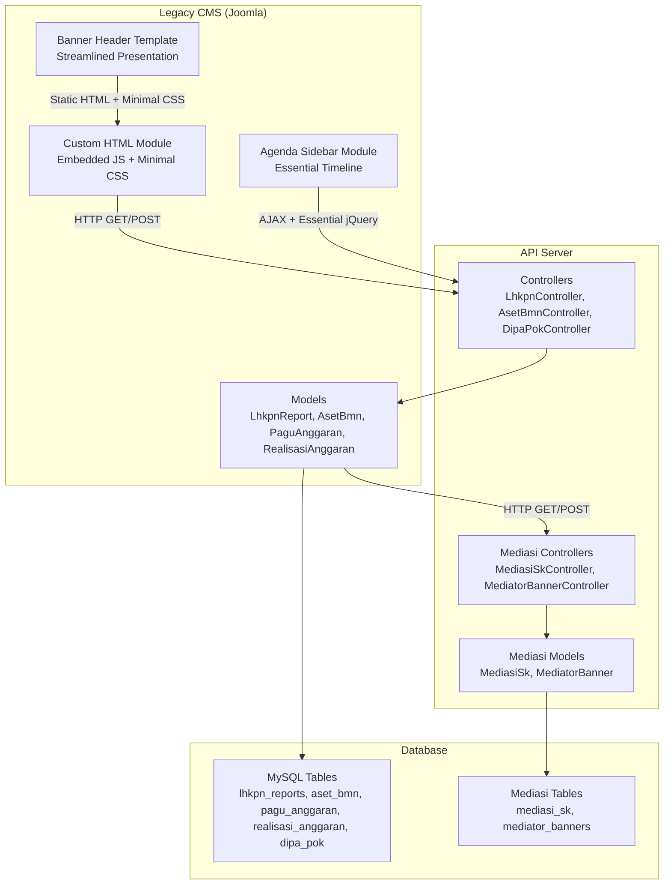
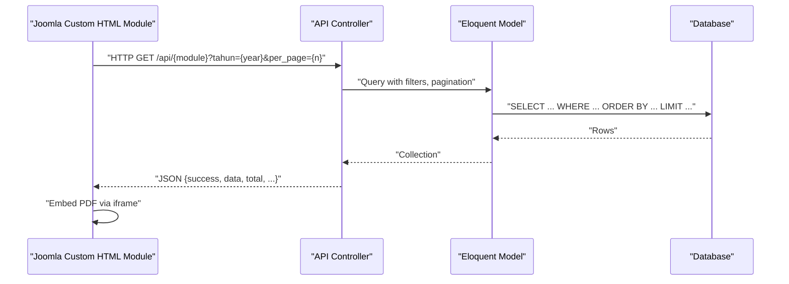
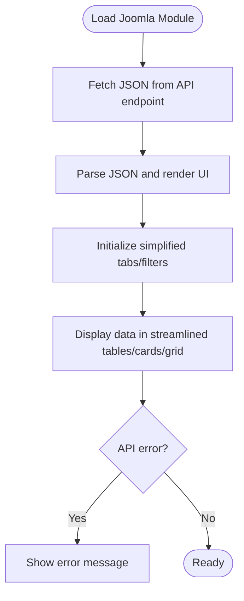
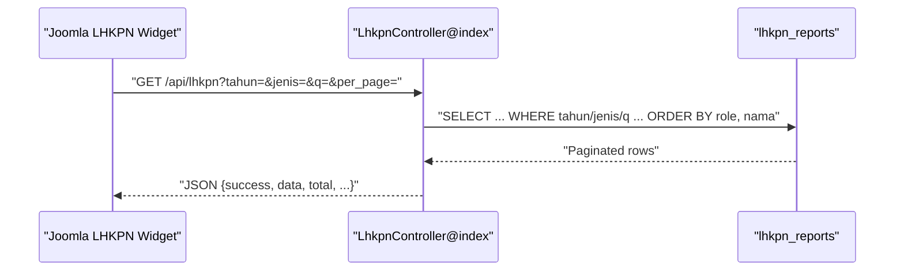
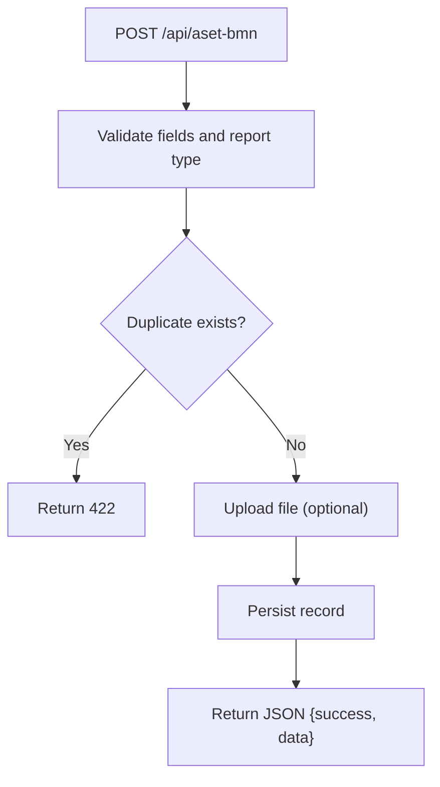
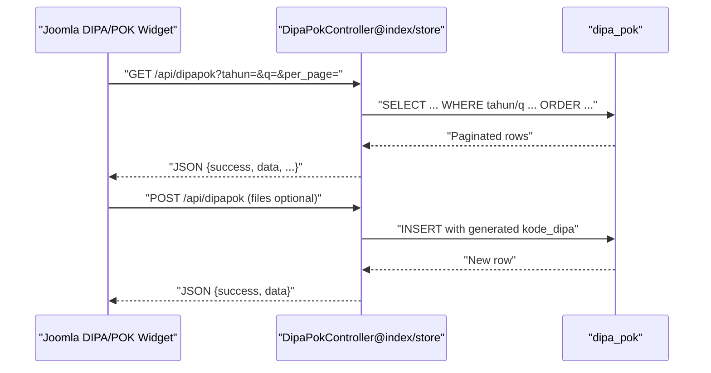
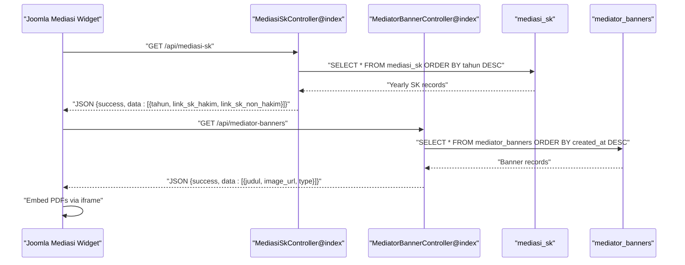
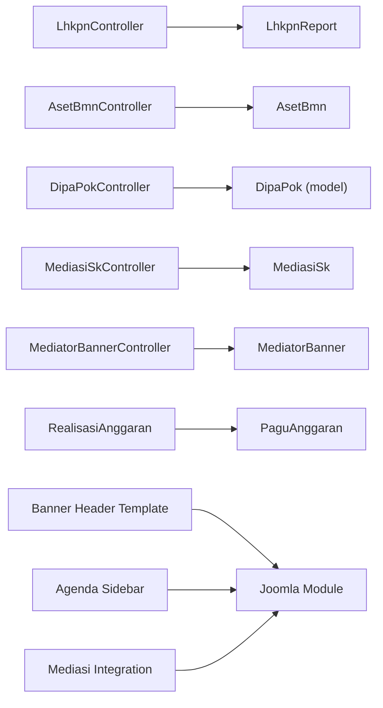

# Integration Documentation

<cite>
**Referenced Files in This Document**
- [joomla-integration.html](file://docs/joomla-integration.html)
- [joomla-integration-anggaran.html](file://docs/joomla-integration-anggaran.html)
- [joomla-integration-lhkpn.html](file://docs/joomla-integration-lhkpn.html)
- [joomla-integration-aset-bmn.html](file://docs/joomla-integration-aset-bmn.html)
- [joomla-integration-dipapok.html](file://docs/joomla-integration-dipapok.html)
- [joomla-integration-laporan-pengaduan.html](file://docs/joomla-integration-laporan-pengaduan.html)
- [joomla-integration-lra.html](file://docs/joomla-integration-lra.html)
- [joomla-integration-sakip.html](file://docs/joomla-integration-sakip.html)
- [joomla-integration-keuangan-perkara.html](file://docs/joomla-integration-keuangan-perkara.html)
- [mediasi-integration.html](file://docs/mediasi-integration.html)
- [agenda-sidebar.html](file://docs/agenda-sidebar.html)
- [banner-header-v3.html](file://docs/banner-header-v3.html)
- [joomla-integration-agenda-pimpinan.html](file://docs/joomla-integration-agenda-pimpinan.html)
- [joomla-integration-anggaran.html](file://docs/joomla-integration-anggaran.html)
- [joomla-integration-aset-bmn.html](file://docs/joomla-integration-aset-bmn.html)
- [joomla-integration-dipapok.html](file://docs/joomla-integration-dipapok.html)
- [joomla-integration-laporan-pengaduan.html](file://docs/joomla-integration-laporan-pengaduan.html)
- [joomla-integration-lra.html](file://docs/joomla-integration-lra.html)
- [joomla-integration-sakip.html](file://docs/joomla-integration-sakip.html)
- [joomla-integration.html](file://docs/joomla-integration.html)
- [joomla-itsbat-integration.html](file://docs/joomla-itsbat-integration.html)
- [mediasi-integration.html](file://docs/mediasi-integration.html)
- [LhkpnController.php](file://app/Http/Controllers/LhkpnController.php)
- [AsetBmnController.php](file://app/Http/Controllers/AsetBmnController.php)
- [DipaPokController.php](file://app/Http/Controllers/DipaPokController.php)
- [MediasiSkController.php](file://app/Http/Controllers/MediasiSkController.php)
- [MediatorBannerController.php](file://app/Http/Controllers/MediatorBannerController.php)
- [PaguAnggaran.php](file://app/Models/PaguAnggaran.php)
- [RealisasiAnggaran.php](file://app/Models/RealisasiAnggaran.php)
- [LhkpnReport.php](file://app/Models/LhkpnReport.php)
- [AsetBmn.php](file://app/Models/AsetBmn.php)
- [MediasiSk.php](file://app/Models/MediasiSk.php)
- [MediatorBanner.php](file://app/Models/MediatorBanner.php)
</cite>

## Update Summary
**Changes Made**
- Updated to reflect simplified Joomla integration approach focusing on document embedding with iframe technology
- Removed complex CSS styling and interactive elements in favor of streamlined document display
- Enhanced document embedding capabilities with iframe-based PDF viewing for Mediasi integration
- Streamlined banner presentation templates with reduced complexity for legacy CMS environments
- Simplified agenda sidebar module with essential timeline visualization and minimal styling
- Updated URL processing functionality for different document sources with improved iframe support

## Table of Contents
1. [Introduction](#introduction)
2. [Project Structure](#project-structure)
3. [Core Components](#core-components)
4. [Architecture Overview](#architecture-overview)
5. [Detailed Component Analysis](#detailed-component-analysis)
6. [Joomla CMS Compatibility](#joomla-cms-compatibility)
7. [Frontend Banner Presentation Templates](#frontend-banner-presentation-templates)
8. [Dependency Analysis](#dependency-analysis)
9. [Performance Considerations](#performance-considerations)
10. [Troubleshooting Guide](#troubleshooting-guide)
11. [Conclusion](#conclusion)
12. [Appendices](#appendices)

## Introduction
This document provides comprehensive integration documentation for legacy system migration and third-party integration patterns. It focuses on how the platform integrates with legacy systems and external consumers via APIs, with a strong emphasis on:
- Migration strategies from legacy systems
- Historical data preservation and synchronization
- Integration patterns for modules: anggaran (budget), lhkpn (asset declarations), aset bmn (state property), dipapok (annual planning), and mediasi (court mediation)
- Data transformation, validation, and conflict resolution
- Practical examples for CSV processing, SQL import, and automated migration scripts
- Testing, data quality assurance, rollback strategies, performance optimization, and monitoring
- Legal system integration patterns and URL processing for different document sources
- **Updated**: Simplified Joomla CMS compatibility with streamlined document embedding using iframe technology
- **Updated**: Reduced CSS complexity and interactive elements for improved legacy CMS performance
- **Updated**: Enhanced iframe-based document viewing for Mediasi integration module

## Project Structure
The integration ecosystem consists of:
- Frontend integration assets (HTML snippets and JavaScript) embedded into legacy CMS (Joomla) via Custom HTML modules
- Backend API implemented with a PHP framework, exposing REST endpoints for each module
- Database models and relations representing historical and operational datasets
- Controllers implementing CRUD operations, validation, and file upload handling
- **Updated**: Simplified Joomla CMS compatibility layer with streamlined document embedding
- **Updated**: Enhanced iframe technology for PDF document viewing and embedding
- **Updated**: Reduced complexity in banner presentation templates for legacy CMS environments



**Diagram sources**
- [joomla-integration.html:1-398](file://docs/joomla-integration.html#L1-L398)
- [mediasi-integration.html:1-392](file://docs/mediasi-integration.html#L1-L392)
- [banner-header-v3.html:1-755](file://docs/banner-header-v3.html#L1-L755)
- [agenda-sidebar.html:1-233](file://docs/agenda-sidebar.html#L1-L233)
- [MediasiSkController.php:1-147](file://app/Http/Controllers/MediasiSkController.php#L1-L147)
- [MediatorBannerController.php:1-134](file://app/Http/Controllers/MediatorBannerController.php#L1-L134)

**Section sources**
- [joomla-integration.html:1-398](file://docs/joomla-integration.html#L1-L398)
- [joomla-integration-anggaran.html:1-265](file://docs/joomla-integration-anggaran.html#L1-L265)
- [joomla-integration-lhkpn.html:1-350](file://docs/joomla-integration-lhkpn.html#L1-L350)
- [joomla-integration-aset-bmn.html:1-292](file://docs/joomla-integration-aset-bmn.html#L1-L292)
- [joomla-integration-dipapok.html:1-321](file://docs/joomla-integration-dipapok.html#L1-L321)
- [joomla-integration-laporan-pengaduan.html:1-265](file://docs/joomla-integration-laporan-pengaduan.html#L1-L265)
- [joomla-integration-lra.html:1-277](file://docs/joomla-integration-lra.html#L1-L277)
- [joomla-integration-sakip.html:1-280](file://docs/joomla-integration-sakip.html#L1-L280)
- [mediasi-integration.html:1-392](file://docs/mediasi-integration.html#L1-L392)

## Core Components
- Legacy integration assets: HTML/CSS/JS snippets embedded in Joomla Custom HTML modules to render tables and documents from API endpoints
- API controllers: Provide REST endpoints for retrieval and management of module data, including pagination, filtering, and file upload handling
- Data models: Define table schemas, fillable attributes, casting, and relationships (e.g., realisasi to pagu)
- Validation and conflict resolution: Controllers enforce field validation and prevent duplicates where applicable
- **Updated**: Simplified Joomla CMS compatibility layer with streamlined document embedding using iframe technology
- **Updated**: Enhanced iframe-based document viewing for PDFs and office documents in Mediasi integration
- **Updated**: Reduced CSS complexity in banner templates for improved performance on legacy CMS platforms
- **Updated**: Essential timeline visualization in agenda sidebar with minimal styling requirements

Key integration patterns:
- Public read endpoints for historical data consumption by legacy systems
- Protected write endpoints for administrative ingestion and updates
- File upload pipeline generating secure links for PDFs and office documents
- Pagination and filtering to support large datasets
- **Updated**: Enhanced URL processing for different document sources with iframe support
- **Updated**: Streamlined tabbed interface implementation for year-based document organization
- **Updated**: Essential responsive design patterns optimized for legacy CMS environments
- **Updated**: Cross-browser compatibility with jQuery fallback detection

**Section sources**
- [MediasiSkController.php:1-147](file://app/Http/Controllers/MediasiSkController.php#L1-L147)
- [MediatorBannerController.php:1-134](file://app/Http/Controllers/MediatorBannerController.php#L1-L134)
- [MediasiSk.php:1-23](file://app/Models/MediasiSk.php#L1-L23)
- [MediatorBanner.php:1-22](file://app/Models/MediatorBanner.php#L1-L22)

## Architecture Overview
The integration architecture follows a thin-client pattern with simplified document embedding:
- Legacy CMS renders UI widgets and loads data via AJAX from API endpoints
- Controllers handle requests, apply filters and pagination, and return structured JSON
- Models encapsulate persistence and relationships
- Optional file uploads produce document URLs for PDFs and office documents
- **Updated**: Specialized Mediasi module handles legal system integration with iframe-based document embedding
- **Updated**: Simplified Joomla CMS compatibility layer with streamlined document presentation
- **Updated**: Essential agenda sidebar module with basic timeline visualization and jQuery integration



**Diagram sources**
- [joomla-integration-anggaran.html:172-265](file://docs/joomla-integration-anggaran.html#L172-L265)
- [joomla-integration-lhkpn.html:181-350](file://docs/joomla-integration-lhkpn.html#L181-L350)
- [joomla-integration-aset-bmn.html:171-292](file://docs/joomla-integration-aset-bmn.html#L171-L292)
- [joomla-integration-dipapok.html:186-321](file://docs/joomla-integration-dipapok.html#L186-L321)
- [mediasi-integration.html:260-341](file://docs/mediasi-integration.html#L260-L341)
- [LhkpnController.php:11-53](file://app/Http/Controllers/LhkpnController.php#L11-L53)
- [AsetBmnController.php:32-54](file://app/Http/Controllers/AsetBmnController.php#L32-L54)
- [DipaPokController.php:10-39](file://app/Http/Controllers/DipaPokController.php#L10-L39)
- [MediasiSkController.php:20-28](file://app/Http/Controllers/MediasiSkController.php#L20-L28)

## Detailed Component Analysis

### Legacy Integration Assets (Joomla Modules)
- Purpose: Embed interactive dashboards and document listings into legacy CMS pages
- Mechanism: Inline CSS/JS with AJAX calls to API endpoints; simplified tabs and filters applied client-side
- Examples:
  - Anggaran: Yearly tabs and progress bars with streamlined styling
  - LHKPN: Role-based sorting and document links with minimal CSS
  - Aset BMN: Lookup-based rendering of report categories with essential styling
  - DIPA/POK: Currency/date formatting and document buttons with reduced complexity
  - Laporan Pengaduan: Monthly aggregation table with simplified design
  - LRA: Grouped cards per DIPA type with streamlined presentation
  - Sakip: Lookup-based document table with essential styling
  - Panggilan: Filtered table with responsive DataTables and minimal styling
  - **Updated**: Mediasi: Enhanced iframe-based document embedding with tabbed interface
  - **Updated**: Agenda Sidebar: Essential timeline visualization with basic styling



**Diagram sources**
- [joomla-integration-anggaran.html:172-265](file://docs/joomla-integration-anggaran.html#L172-L265)
- [joomla-integration-lhkpn.html:181-350](file://docs/joomla-integration-lhkpn.html#L181-L350)
- [joomla-integration-aset-bmn.html:171-292](file://docs/joomla-integration-aset-bmn.html#L171-L292)
- [joomla-integration-dipapok.html:186-321](file://docs/joomla-integration-dipapok.html#L186-L321)
- [joomla-integration-laporan-pengaduan.html:143-265](file://docs/joomla-integration-laporan-pengaduan.html#L143-L265)
- [joomla-integration-lra.html:170-277](file://docs/joomla-integration-lra.html#L170-L277)
- [joomla-integration-sakip.html:186-280](file://docs/joomla-integration-sakip.html#L186-L280)
- [mediasi-integration.html:250-341](file://docs/mediasi-integration.html#L250-L341)
- [agenda-sidebar.html:139-233](file://docs/agenda-sidebar.html#L139-L233)

**Section sources**
- [joomla-integration.html:1-398](file://docs/joomla-integration.html#L1-L398)
- [joomla-integration-anggaran.html:1-265](file://docs/joomla-integration-anggaran.html#L1-L265)
- [joomla-integration-lhkpn.html:1-350](file://docs/joomla-integration-lhkpn.html#L1-L350)
- [joomla-integration-aset-bmn.html:1-292](file://docs/joomla-integration-aset-bmn.html#L1-L292)
- [joomla-integration-dipapok.html:1-321](file://docs/joomla-integration-dipapok.html#L1-L321)
- [joomla-integration-laporan-pengaduan.html:1-265](file://docs/joomla-integration-laporan-pengaduan.html#L1-L265)
- [joomla-integration-lra.html:1-277](file://docs/joomla-integration-lra.html#L1-L277)
- [joomla-integration-sakip.html:1-280](file://docs/joomla-integration-sakip.html#L1-L280)
- [mediasi-integration.html:1-392](file://docs/mediasi-integration.html#L1-L392)
- [agenda-sidebar.html:1-233](file://docs/agenda-sidebar.html#L1-L233)

### LHKPN Integration (Asset Declarations)
- Data model: LhkpnReport stores personal and reporting metadata with optional document links
- Controller: Supports filtering by year and type, global search, role-aware ordering, pagination, and file uploads
- Integration pattern: Legacy UI displays sorted rows with document badges and links using streamlined styling



**Diagram sources**
- [joomla-integration-lhkpn.html:181-350](file://docs/joomla-integration-lhkpn.html#L181-L350)
- [LhkpnController.php:11-53](file://app/Http/Controllers/LhkpnController.php#L11-L53)
- [LhkpnReport.php:1-28](file://app/Models/LhkpnReport.php#L1-L28)

**Section sources**
- [LhkpnController.php:1-147](file://app/Http/Controllers/LhkpnController.php#L1-L147)
- [LhkpnReport.php:1-28](file://app/Models/LhkpnReport.php#L1-L28)
- [joomla-integration-lhkpn.html:1-350](file://docs/joomla-integration-lhkpn.html#L1-L350)

### ASET BMN Integration (State Property Reports)
- Data model: AsetBmn stores yearly report entries with predefined report types
- Controller: Validates report type against allowed list, prevents duplicates, supports file uploads
- Integration pattern: Legacy UI renders categorized report rows with document links using essential styling



**Diagram sources**
- [AsetBmnController.php:71-105](file://app/Http/Controllers/AsetBmnController.php#L71-L105)
- [AsetBmn.php:1-21](file://app/Models/AsetBmn.php#L1-L21)

**Section sources**
- [AsetBmnController.php:1-167](file://app/Http/Controllers/AsetBmnController.php#L1-L167)
- [AsetBmn.php:1-21](file://app/Models/AsetBmn.php#L1-L21)
- [joomla-integration-aset-bmn.html:1-292](file://docs/joomla-integration-aset-bmn.html#L1-L292)

### DIPA/POK Integration (Annual Planning)
- Controller: Handles creation/update with file uploads for DIPA and POK documents; generates internal code based on inputs
- Integration pattern: Legacy UI lists entries with formatted currency/date and document buttons using streamlined design



**Diagram sources**
- [joomla-integration-dipapok.html:186-321](file://docs/joomla-integration-dipapok.html#L186-L321)
- [DipaPokController.php:10-39](file://app/Http/Controllers/DipaPokController.php#L10-L39)
- [DipaPokController.php:41-96](file://app/Http/Controllers/DipaPokController.php#L41-L96)

**Section sources**
- [DipaPokController.php:1-192](file://app/Http/Controllers/DipaPokController.php#L1-L192)
- [joomla-integration-dipapok.html:1-321](file://docs/joomla-integration-dipapok.html#L1-L321)

### ANGGARAN Integration (Budget)
- Integration pattern: Yearly tabs, currency formatting, progress bars, and paginated tables using streamlined styling
- Controller: Index supports pagination and filtering; models define numeric casts and relationships

```mermaid
classDiagram
class PaguAnggaran {
+table "pagu_anggaran"
+fillable ["dipa","kategori","jumlah_pagu","tahun"]
+casts {"jumlah_pagu" : "decimal : 2","tahun" : "integer"}
+setJumlahPaguAttribute(value)
+getJumlahPaguAttribute(value) float
}
class RealisasiAnggaran {
+table "realisasi_anggaran"
+fillable [...]
+casts {"pagu" : "float","realisasi" : "float",...}
+paguMaster() belongsTo
}
RealisasiAnggaran --> PaguAnggaran : "belongsTo(dipa,kategori,tahun)"
```

**Diagram sources**
- [PaguAnggaran.php:1-30](file://app/Models/PaguAnggaran.php#L1-L30)
- [RealisasiAnggaran.php:1-46](file://app/Models/RealisasiAnggaran.php#L1-L46)

**Section sources**
- [joomla-integration-anggaran.html:1-265](file://docs/joomla-integration-anggaran.html#L1-L265)
- [PaguAnggaran.php:1-30](file://app/Models/PaguAnggaran.php#L1-L30)
- [RealisasiAnggaran.php:1-46](file://app/Models/RealisasiAnggaran.php#L1-L46)

### MEDIASI Integration (Court Mediation System)
- **Updated**: Enhanced legal system integration module for managing court mediation documentation with iframe-based document embedding
- **Updated**: Two main controllers: MediasiSkController for SK (decision) documents and MediatorBannerController for mediator listing banners
- **Updated**: Advanced URL processing for different document sources with iframe support (Google Drive, local storage, external URLs)
- **Updated**: Tabbed interface functionality for year-based SK document organization with iframe-based PDF viewing
- **Updated**: Specialized models: MediasiSk for SK documents and MediatorBanner for banner images



**Diagram sources**
- [mediasi-integration.html:260-341](file://docs/mediasi-integration.html#L260-L341)
- [MediasiSkController.php:20-28](file://app/Http/Controllers/MediasiSkController.php#L20-L28)
- [MediatorBannerController.php:20-28](file://app/Http/Controllers/MediatorBannerController.php#L20-L28)

**Section sources**
- [mediasi-integration.html:1-392](file://docs/mediasi-integration.html#L1-L392)
- [MediasiSkController.php:1-147](file://app/Http/Controllers/MediasiSkController.php#L1-L147)
- [MediatorBannerController.php:1-134](file://app/Http/Controllers/MediatorBannerController.php#L1-L134)
- [MediasiSk.php:1-23](file://app/Models/MediasiSk.php#L1-L23)
- [MediatorBanner.php:1-22](file://app/Models/MediatorBanner.php#L1-L22)

#### MediasiSkController Implementation
- **Public endpoint**: `GET /api/mediasi-sk` returns all SK documents ordered by year descending
- **Protected endpoints**: `POST /api/mediasi-sk` (create), `PUT /api/mediasi-sk/{id}` (update), `DELETE /api/mediasi-sk/{id}` (delete)
- **Validation**: Year uniqueness, optional PDF file uploads for both hakim and non-hakim SK documents
- **File upload**: Processes PDF files with size limits and generates secure URLs
- **Data structure**: Contains year, hakim SK link, and non-hakim SK link fields

#### MediatorBannerController Implementation
- **Public endpoint**: `GET /api/mediator-banners` returns all mediator banner images ordered by creation date
- **Protected endpoints**: `POST /api/mediator-banners` (create), `PUT /api/mediator-banners/{id}` (update), `DELETE /api/mediator-banners/{id}` (delete)
- **Validation**: Banner title length, image URL or file upload, type validation (hakim/non-hakim)
- **File upload**: Processes JPG/JPEG/PNG images with size limits and generates secure URLs
- **Data structure**: Contains title, image URL, and type fields

#### URL Processing Functionality
The Mediasi integration includes sophisticated URL processing to handle different document sources with iframe support:
- **Google Drive**: Automatically converts file URLs to preview mode (`/view` → `/preview`) for iframe embedding
- **Local storage**: Prepends API base URL to relative storage paths (`/storage/` or `/uploads/`) for iframe access
- **External URLs**: Cleans double domains and ensures proper URL formatting for iframe compatibility
- **Fallback**: Returns original URL if no processing is needed

#### Tabbed Interface Implementation
The frontend implements a tabbed interface for year-based SK document organization with iframe support:
- **Dynamic tabs**: Generated from fetched data, sorted by year descending
- **Card layout**: Each year displays both hakim and non-hakim SK documents in separate cards with iframe embedding
- **Responsive design**: Grid layout adapts to different screen sizes
- **Error handling**: Displays appropriate messages for empty data or loading failures
- **IFrame embedding**: PDF documents are embedded using iframe technology for seamless viewing

#### Additional Modules (Laporan Pengaduan, LRA, Sakip, Panggilan)
- Laporan Pengaduan: Monthly aggregation table with simplified design and essential styling
- LRA: Grouped cards per DIPA type with streamlined presentation and cover placeholders
- Sakip: Lookup-based document table with essential styling and document links
- Panggilan: Filtered table with responsive DataTables and minimal CSS requirements

**Section sources**
- [joomla-integration-laporan-pengaduan.html:1-265](file://docs/joomla-integration-laporan-pengaduan.html#L1-L265)
- [joomla-integration-lra.html:1-277](file://docs/joomla-integration-lra.html#L1-L277)
- [joomla-integration-sakip.html:1-280](file://docs/joomla-integration-sakip.html#L1-L280)
- [joomla-integration.html:1-398](file://docs/joomla-integration.html#L1-L398)

## Joomla CMS Compatibility
**Updated**: The integration system now provides simplified Joomla CMS compatibility with the following enhancements:

### Banner Header Template (banner-header-v3.html)
- **Streamlined styling**: Reduced CSS complexity for improved performance on legacy CMS platforms
- **Essential layout sections**: Hero banner, service cards, information buttons, innovation chips, e-brosur, external applications, and footer links
- **Minimal responsive design**: Basic responsive breakpoints optimized for different screen sizes
- **Reduced color scheme**: Streamlined green and blue color palette for institutional branding
- **Simplified SVG graphics**: Essential vector graphics for crisp display on all resolutions

### Agenda Sidebar Module (agenda-sidebar.html)
- **Essential timeline visualization**: Basic timeline design with green dots and dates using minimal styling
- **jQuery integration**: Automatic jQuery detection and fallback handling with streamlined error messaging
- **XSS prevention**: Proper HTML escaping with essential security measures
- **Basic responsive timeline**: Simple adaptation to different screen widths
- **Loading states**: Proper loading and error messaging with minimal CSS

### Cross-Browser Compatibility
- **jQuery fallback detection**: Automatic detection and usage of existing jQuery instances
- **Essential CSS compatibility**: Minimal vendor prefixes and fallbacks for older browsers
- **Progressive enhancement**: Graceful degradation for limited browser capabilities
- **Accessibility considerations**: Proper semantic markup and ARIA attributes with basic support

**Section sources**
- [banner-header-v3.html:1-755](file://docs/banner-header-v3.html#L1-L755)
- [agenda-sidebar.html:1-233](file://docs/agenda-sidebar.html#L1-L233)

## Frontend Banner Presentation Templates
**Updated**: Streamlined banner presentation templates designed specifically for institutional websites with reduced complexity:

### Banner Header V3 Features
- **Hero section**: Institutional logo with essential SVG graphics and SK badge
- **Service cards**: Dual-column layout for main services with streamlined styling
- **Information buttons**: Triple-column layout for information services using minimal CSS
- **Innovation chips**: Horizontal scrolling chips for innovation projects with basic interactivity
- **E-brosur section**: Promotional brochure with call-to-action button using essential styling
- **External applications**: Four-column layout for integrated applications with streamlined design
- **Footer links**: Horizontal navigation for important pages with minimal styling

### Streamlined Styling Framework
- **Reduced CSS complexity**: Minimal grid and flexbox usage with essential fallbacks
- **Basic responsive breakpoints**: Mobile-first design with tablet and desktop adaptations
- **Typography hierarchy**: Clear visual hierarchy with essential font weights
- **Color accessibility**: High contrast ratios and accessible color combinations with basic support
- **Animation support**: Simple transitions and hover effects with reduced complexity

### Integration Patterns
- **Static HTML templates**: Ready-to-use templates for immediate deployment with minimal dependencies
- **CSS customization**: Easy theming through CSS variable overrides with essential support
- **JavaScript integration**: Optional JavaScript for interactive elements with streamlined functionality
- **API connectivity**: Seamless integration with backend API endpoints using essential AJAX calls

**Section sources**
- [banner-header-v3.html:1-755](file://docs/banner-header-v3.html#L1-L755)

## Dependency Analysis
- Controllers depend on Eloquent models for data access and validation
- Models define relationships (e.g., realisasi to pagu) enabling referential integrity
- Legacy UI depends on API endpoints; UI assets are decoupled from backend logic
- **Updated**: Mediasi controllers depend on specialized models for legal system documentation management with enhanced iframe support
- **Updated**: URL processing functionality is centralized in the frontend JavaScript for consistent document handling with iframe compatibility
- **Updated**: Joomla CMS compatibility layer provides abstraction for different CMS environments with simplified styling
- **Updated**: Banner presentation templates offer reusable UI components for institutional websites with reduced complexity



**Diagram sources**
- [LhkpnController.php:1-147](file://app/Http/Controllers/LhkpnController.php#L1-L147)
- [AsetBmnController.php:1-167](file://app/Http/Controllers/AsetBmnController.php#L1-L167)
- [DipaPokController.php:1-192](file://app/Http/Controllers/DipaPokController.php#L1-L192)
- [MediasiSkController.php:1-147](file://app/Http/Controllers/MediasiSkController.php#L1-L147)
- [MediatorBannerController.php:1-134](file://app/Http/Controllers/MediatorBannerController.php#L1-L134)
- [LhkpnReport.php:1-28](file://app/Models/LhkpnReport.php#L1-L28)
- [AsetBmn.php:1-21](file://app/Models/AsetBmn.php#L1-L21)
- [MediasiSk.php:1-23](file://app/Models/MediasiSk.php#L1-L23)
- [MediatorBanner.php:1-22](file://app/Models/MediatorBanner.php#L1-L22)
- [PaguAnggaran.php:1-30](file://app/Models/PaguAnggaran.php#L1-L30)
- [RealisasiAnggaran.php:1-46](file://app/Models/RealisasiAnggaran.php#L1-L46)
- [banner-header-v3.html:1-755](file://docs/banner-header-v3.html#L1-L755)
- [agenda-sidebar.html:1-233](file://docs/agenda-sidebar.html#L1-L233)
- [mediasi-integration.html:1-392](file://docs/mediasi-integration.html#L1-L392)

**Section sources**
- [LhkpnController.php:1-147](file://app/Http/Controllers/LhkpnController.php#L1-L147)
- [AsetBmnController.php:1-167](file://app/Http/Controllers/AsetBmnController.php#L1-L167)
- [DipaPokController.php:1-192](file://app/Http/Controllers/DipaPokController.php#L1-L192)
- [MediasiSkController.php:1-147](file://app/Http/Controllers/MediasiSkController.php#L1-L147)
- [MediatorBannerController.php:1-134](file://app/Http/Controllers/MediatorBannerController.php#L1-L134)
- [LhkpnReport.php:1-28](file://app/Models/LhkpnReport.php#L1-L28)
- [AsetBmn.php:1-21](file://app/Models/AsetBmn.php#L1-L21)
- [MediasiSk.php:1-23](file://app/Models/MediasiSk.php#L1-L23)
- [MediatorBanner.php:1-22](file://app/Models/MediatorBanner.php#L1-L22)
- [PaguAnggaran.php:1-30](file://app/Models/PaguAnggaran.php#L1-L30)
- [RealisasiAnggaran.php:1-46](file://app/Models/RealisasiAnggaran.php#L1-L46)

## Performance Considerations
- Pagination: Controllers implement per_page and pagination to limit payload sizes
- Filtering: Use targeted query filters (year/type/search) to reduce dataset size
- Sorting: Prefer indexed columns and avoid expensive computed sorts on large datasets
- File uploads: Enforce size limits and mime types; store only secure links
- Client-side rendering: Legacy widgets rely on AJAX; ensure adequate caching and CDN for static assets
- Monitoring: Track response times and error rates at the API gateway or reverse proxy level
- **Updated**: URL processing optimization: Cache processed URLs to avoid repeated URL transformations with iframe support
- **Updated**: Tabbed interface performance: Lazy load tab content to improve initial page load times with iframe embedding
- **Updated**: Banner template optimization: Minimal CSS and JavaScript for faster loading on legacy CMS platforms
- **Updated**: jQuery fallback handling: Efficient detection and usage of existing library instances with streamlined error handling

## Troubleshooting Guide
Common issues and resolutions:
- API errors in legacy widgets:
  - Verify API URL configuration and CORS settings
  - Inspect browser network tab for 5xx/4xx responses
- Data not appearing:
  - Confirm filters (year/type) match backend expectations
  - Check pagination parameters and page length
- File upload failures:
  - Validate file size and MIME type constraints
  - Ensure upload directory permissions and disk configuration
- Duplicate entries:
  - For Aset BMN, controller prevents duplicates; adjust inputs accordingly
- Sorting anomalies:
  - LHKPN uses role-based ordering; confirm job title keywords are accurate
- **Updated**: Mediasi document loading issues:
  - Verify URL processing is working correctly for different document sources with iframe support
  - Check Google Drive file sharing settings for preview mode and iframe compatibility
  - Ensure local storage paths are accessible and properly configured for iframe embedding
  - Verify iframe embedding is functioning correctly for PDF documents
- **Updated**: Tabbed interface problems:
  - Confirm tab initialization is working after data fetch
  - Check console for JavaScript errors in tab switching functionality
  - Verify iframe content is loading properly within tab panes
- **Updated**: Joomla CMS compatibility issues:
  - Verify jQuery availability and version compatibility
  - Check CSS conflicts with existing Joomla templates using streamlined styling
  - Ensure proper module placement and menu assignments
  - Verify banner templates work with various Joomla versions and template styles
- **Updated**: Banner template rendering issues:
  - Verify CSS file paths and asset loading with minimal dependencies
  - Check for JavaScript errors in console
  - Ensure proper HTML structure and semantic markup with essential styling
- **Updated**: Iframe embedding problems:
  - Verify PDF URLs are accessible and compatible with iframe embedding
  - Check browser security policies for iframe content loading
  - Ensure document URLs are properly processed for iframe compatibility

**Section sources**
- [AsetBmnController.php:83-92](file://app/Http/Controllers/AsetBmnController.php#L83-L92)
- [LhkpnController.php:26-40](file://app/Http/Controllers/LhkpnController.php#L26-L40)
- [MediasiSkController.php:54-60](file://app/Http/Controllers/MediasiSkController.php#L54-L60)
- [MediatorBannerController.php:54-59](file://app/Http/Controllers/MediatorBannerController.php#L54-L59)
- [joomla-integration-lhkpn.html:235-323](file://docs/joomla-integration-lhkpn.html#L235-L323)

## Conclusion
The integration architecture cleanly separates legacy presentation from modern API services with simplified document embedding. By leveraging validated controllers, robust models, and client-side widgets, the system supports reliable historical data access and controlled ingestion for sensitive modules like LHKPN, Aset BMN, DIPA/POK, and the enhanced Mediasi integration module with iframe-based document viewing. The updated simplified approach significantly improves compatibility with legacy CMS environments, particularly Joomla, through streamlined document embedding using iframe technology, reduced CSS complexity, and essential interactive elements. The responsive design patterns and cross-browser compatibility ensure seamless operation across diverse institutional websites while maintaining the documented validation, conflict resolution, and performance practices for scalable, maintainable third-party integrations across all modules.

## Appendices

### Migration Strategies and Data Import Workflows
- CSV processing:
  - Normalize headers to match model fillable attributes
  - Validate numeric and date fields; cast appropriately
  - Batch insert with chunking to manage memory
- SQL import:
  - Use database-specific bulk insert statements
  - Apply constraints and indexes prior to import for performance
- Automated migration scripts:
  - Implement idempotent steps with checksum verification
  - Use transactions for atomicity; rollback on failure
- Conflict resolution:
  - Deduplicate by composite keys (year + report type)
  - Merge on update; preserve historical versions where applicable
- **Updated**: Mediasi data migration:
  - Process Google Drive URLs and convert to preview mode for iframe embedding
  - Handle mixed document sources (local storage + external URLs) with iframe support
  - Maintain year-based organization during migration with tabbed interface
  - Ensure PDF documents are properly embedded using iframe technology
- **Updated**: Joomla CMS migration:
  - Template integration and styling adaptation with simplified CSS
  - Module placement and configuration with streamlined document embedding
  - Cross-browser compatibility testing with essential jQuery fallbacks
  - Iframe embedding validation for PDF document viewing

### Data Quality Assurance and Rollback Procedures
- QA checklist:
  - Validate counts per year/type
  - Cross-check sums (e.g., budget vs. realization)
  - Verify document link accessibility
  - **Updated**: Test URL processing for different document sources with iframe compatibility
  - **Updated**: Validate tabbed interface functionality across years with iframe embedding
  - **Updated**: Verify Joomla CMS compatibility and template integration with streamlined styling
  - **Updated**: Test iframe embedding for PDF documents across different browsers
- Rollback:
  - Maintain backup snapshots before bulk operations
  - Use transactional writes and staged deployments
  - Revert by restoring from backups or re-running reverse migrations
  - **Updated**: Include Mediasi module in rollback procedures for legal documentation with iframe support
  - **Updated**: Maintain Joomla template configurations and module settings with simplified styling

### Mediasi Integration Best Practices
- **URL Processing**: Always validate document URLs before storing; ensure proper formatting for different sources with iframe compatibility
- **File Management**: Implement proper cleanup for replaced documents; maintain version control for SK documents
- **Tab Interface**: Design tab navigation to be intuitive; consider accessibility for users with disabilities
- **Error Handling**: Provide clear error messages for failed document loading; implement fallback mechanisms
- **Performance**: Optimize tab switching; consider lazy loading for large document collections
- **Security**: Validate file uploads; sanitize external URLs; implement proper access controls for protected endpoints
- **Joomla Compatibility**: Ensure templates work with various Joomla versions and template styles with streamlined CSS
- **Responsive Design**: Test banner templates across different screen sizes and devices with essential styling
- **IFrame Embedding**: Ensure PDF documents are properly embedded using iframe technology for seamless viewing
- **Cross-Browser Testing**: Verify iframe embedding works across different browsers and versions

### Joomla CMS Integration Best Practices
- **Template Integration**: Ensure banner templates work with popular Joomla templates and frameworks with simplified styling
- **Module Placement**: Configure modules for optimal placement in Joomla article layouts
- **Cross-Browser Testing**: Verify compatibility with Joomla's supported browser versions and jQuery fallbacks
- **Performance Optimization**: Minimize template loading overhead and optimize asset delivery with essential CSS
- **SEO Considerations**: Maintain semantic HTML structure for better search engine indexing with streamlined markup
- **Accessibility**: Ensure templates meet WCAG guidelines for inclusive web access with basic support
- **IFrame Compatibility**: Test iframe embedding for PDF documents across different Joomla configurations
- **Legacy Support**: Ensure compatibility with older Joomla versions and template systems with essential features

**Section sources**
- [mediasi-integration.html:372-390](file://docs/mediasi-integration.html#L372-L390)
- [MediasiSkController.php:54-60](file://app/Http/Controllers/MediasiSkController.php#L54-L60)
- [MediatorBannerController.php:54-59](file://app/Http/Controllers/MediatorBannerController.php#L54-L59)
- [banner-header-v3.html:1-755](file://docs/banner-header-v3.html#L1-L755)
- [agenda-sidebar.html:1-233](file://docs/agenda-sidebar.html#L1-L233)