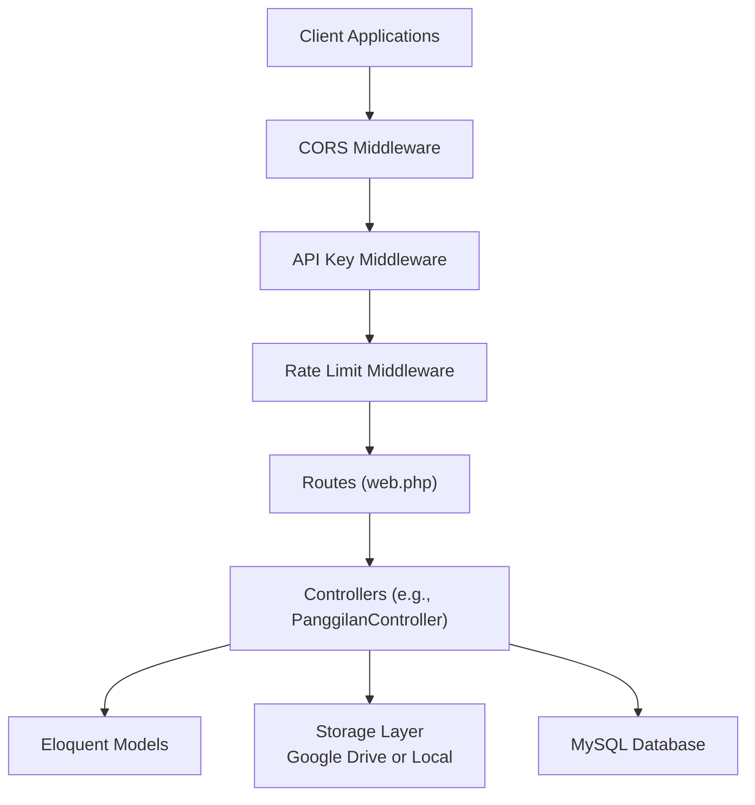
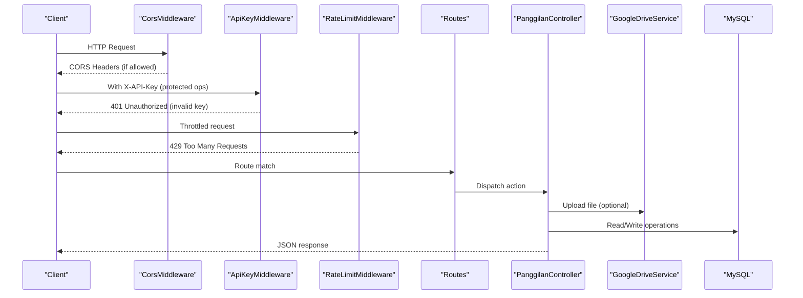
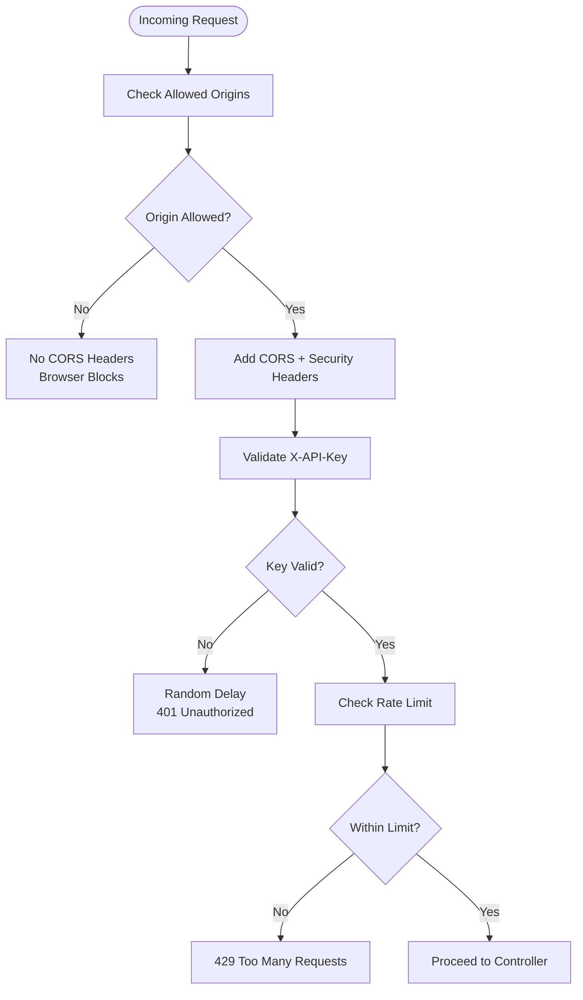
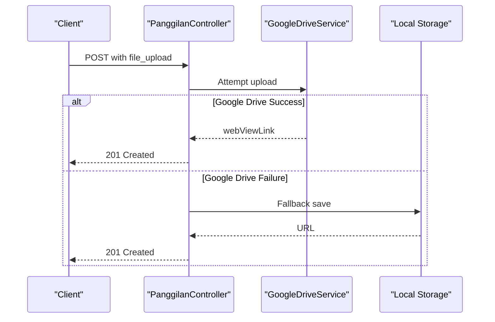
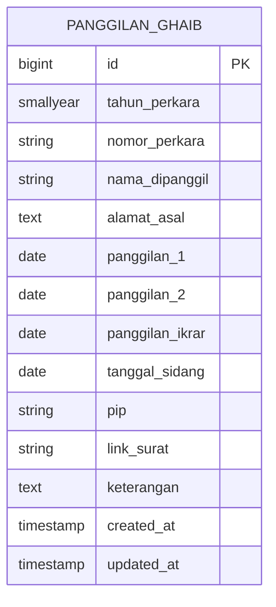
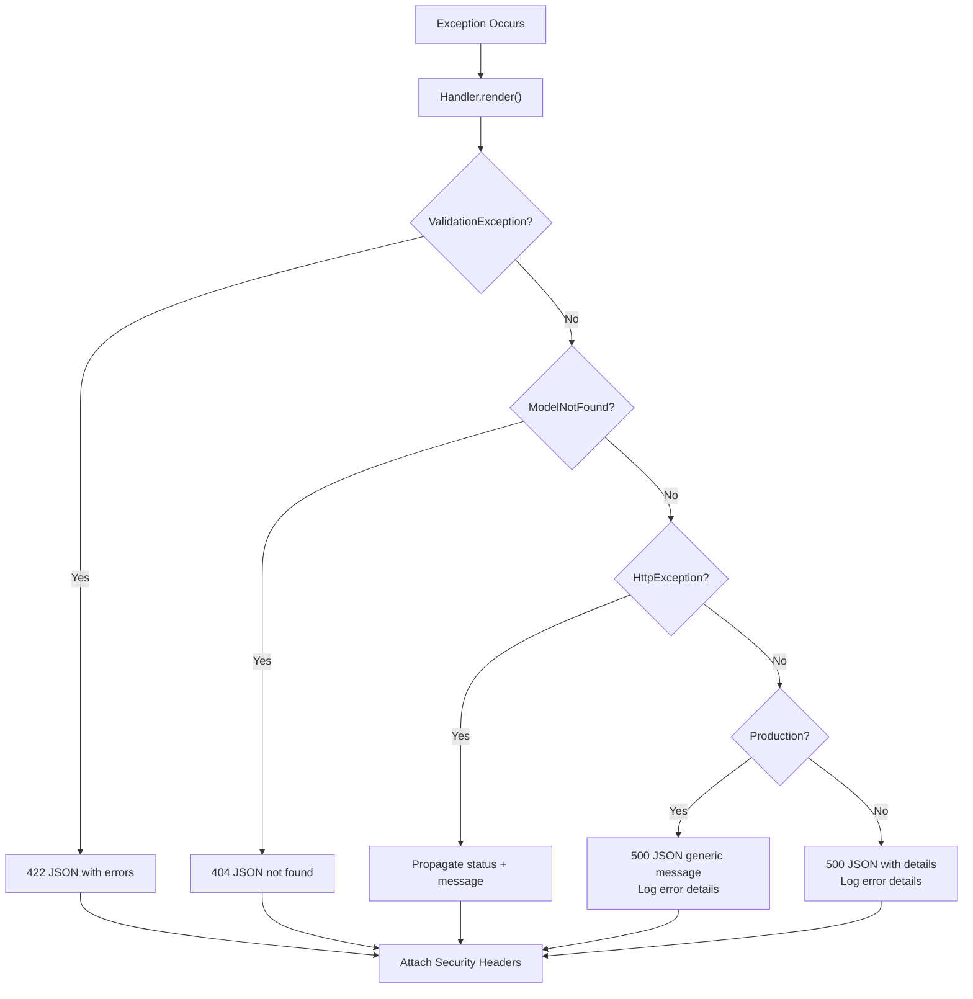
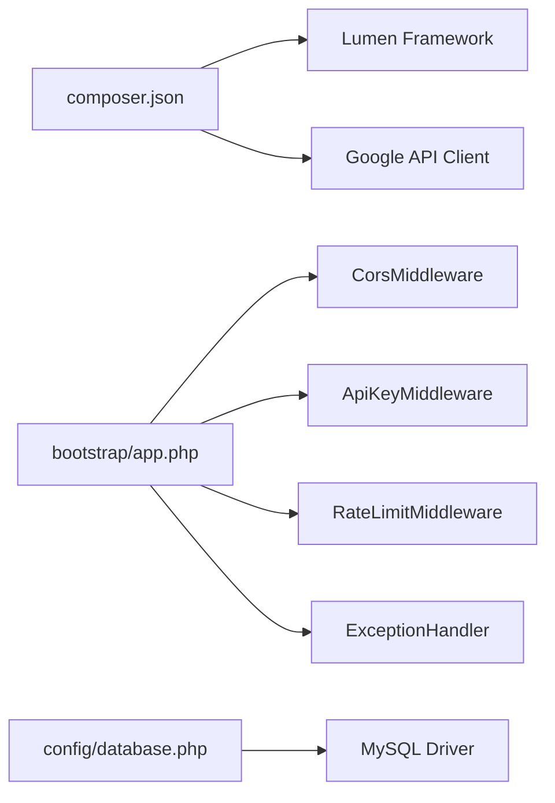

# Integration Testing and Maintenance

<cite>
**Referenced Files in This Document**
- [composer.json](file://composer.json)
- [bootstrap/app.php](file://bootstrap/app.php)
- [config/database.php](file://config/database.php)
- [routes/web.php](file://routes/web.php)
- [SECURITY.md](file://SECURITY.md)
- [app/Http/Middleware/ApiKeyMiddleware.php](file://app/Http/Middleware/ApiKeyMiddleware.php)
- [app/Http/Middleware/CorsMiddleware.php](file://app/Http/Middleware/CorsMiddleware.php)
- [app/Http/Middleware/RateLimitMiddleware.php](file://app/Http/Middleware/RateLimitMiddleware.php)
- [app/Exceptions/Handler.php](file://app/Exceptions/Handler.php)
- [app/Services/GoogleDriveService.php](file://app/Services/GoogleDriveService.php)
- [app/Http/Controllers/Controller.php](file://app/Http/Controllers/Controller.php)
- [app/Http/Controllers/PanggilanController.php](file://app/Http/Controllers/PanggilanController.php)
- [database/migrations/2026_01_21_000001_create_panggilan_ghaib_table.php](file://database/migrations/2026_01_21_000001_create_panggilan_ghaib_table.php)
- [database/seeders/PanggilanSeeder.php](file://database/seeders/PanggilanSeeder.php)
</cite>

## Table of Contents
1. [Introduction](#introduction)
2. [Project Structure](#project-structure)
3. [Core Components](#core-components)
4. [Architecture Overview](#architecture-overview)
5. [Detailed Component Analysis](#detailed-component-analysis)
6. [Dependency Analysis](#dependency-analysis)
7. [Performance Considerations](#performance-considerations)
8. [Troubleshooting Guide](#troubleshooting-guide)
9. [Conclusion](#conclusion)
10. [Appendices](#appendices)

## Introduction
This document provides comprehensive integration testing and maintenance guidance for validating API connections, data synchronization, and cross-system compatibility. It covers testing strategies for unit, integration, and end-to-end validations; monitoring and alerting approaches; operational maintenance procedures; error handling and logging; rollback and disaster recovery planning; and troubleshooting for common integration issues such as authentication failures, data synchronization problems, and performance bottlenecks.

## Project Structure
The project is a Lumen-based PHP microservice exposing REST endpoints for multiple modules (e.g., Panggilan Ghaib, Itsbat Nikah, LRA reports). It integrates with external systems via Google Drive for file storage and relies on middleware for security and rate limiting. Routes are grouped by public and protected access, with strict validation and sanitization applied at the controller level.

**Diagram sources**
- [routes/web.php:1-165](file://routes/web.php#L1-L165)
- [app/Http/Middleware/CorsMiddleware.php:1-64](file://app/Http/Middleware/CorsMiddleware.php#L1-L64)
- [app/Http/Middleware/ApiKeyMiddleware.php:1-41](file://app/Http/Middleware/ApiKeyMiddleware.php#L1-L41)
- [app/Http/Middleware/RateLimitMiddleware.php:1-49](file://app/Http/Middleware/RateLimitMiddleware.php#L1-L49)
- [app/Http/Controllers/PanggilanController.php:1-333](file://app/Http/Controllers/PanggilanController.php#L1-L333)
- [app/Services/GoogleDriveService.php:1-117](file://app/Services/GoogleDriveService.php#L1-L117)
- [config/database.php:1-30](file://config/database.php#L1-L30)

**Section sources**
- [routes/web.php:1-165](file://routes/web.php#L1-L165)
- [bootstrap/app.php:1-55](file://bootstrap/app.php#L1-L55)
- [composer.json:1-47](file://composer.json#L1-L47)

## Core Components
- Routing and Middleware: Public and protected route groups define access policies and enforce rate limits and API keys.
- Controllers: Implement strict input validation, sanitization, and file upload fallback logic to Google Drive or local storage.
- Services: GoogleDriveService encapsulates Google Drive integration with daily folder organization and public permission handling.
- Database: MySQL connection configured via environment variables; migrations define module schemas; seeders load initial data.
- Exception Handling: Centralized handler ensures consistent security headers and controlled error responses across environments.

**Section sources**
- [routes/web.php:1-165](file://routes/web.php#L1-L165)
- [app/Http/Middleware/ApiKeyMiddleware.php:1-41](file://app/Http/Middleware/ApiKeyMiddleware.php#L1-L41)
- [app/Http/Middleware/RateLimitMiddleware.php:1-49](file://app/Http/Middleware/RateLimitMiddleware.php#L1-L49)
- [app/Http/Controllers/Controller.php:1-97](file://app/Http/Controllers/Controller.php#L1-L97)
- [app/Services/GoogleDriveService.php:1-117](file://app/Services/GoogleDriveService.php#L1-L117)
- [config/database.php:1-30](file://config/database.php#L1-L30)
- [app/Exceptions/Handler.php:1-134](file://app/Exceptions/Handler.php#L1-L134)

## Architecture Overview
The system architecture emphasizes layered security and resilience:
- Transport security via HTTPS and strict CORS.
- Authentication via API key with timing-safe comparison and randomized delays.
- Rate limiting to prevent abuse.
- Input validation and sanitization to mitigate injection and XSS risks.
- File upload with primary Google Drive integration and local fallback.
- Centralized exception handling with security headers.

**Diagram sources**
- [app/Http/Middleware/CorsMiddleware.php:1-64](file://app/Http/Middleware/CorsMiddleware.php#L1-L64)
- [app/Http/Middleware/ApiKeyMiddleware.php:1-41](file://app/Http/Middleware/ApiKeyMiddleware.php#L1-L41)
- [app/Http/Middleware/RateLimitMiddleware.php:1-49](file://app/Http/Middleware/RateLimitMiddleware.php#L1-L49)
- [routes/web.php:1-165](file://routes/web.php#L1-L165)
- [app/Http/Controllers/PanggilanController.php:1-333](file://app/Http/Controllers/PanggilanController.php#L1-L333)
- [app/Services/GoogleDriveService.php:1-117](file://app/Services/GoogleDriveService.php#L1-L117)
- [config/database.php:1-30](file://config/database.php#L1-L30)

## Detailed Component Analysis

### API Security and Access Control
- CORS: Origin whitelisting with strict enforcement; security headers included on all responses.
- API Key: Timing-safe comparison and randomized delay on failure; enforced on protected routes.
- Rate Limit: Per-IP counters with configurable limits and Retry-After headers.

**Diagram sources**
- [app/Http/Middleware/CorsMiddleware.php:1-64](file://app/Http/Middleware/CorsMiddleware.php#L1-L64)
- [app/Http/Middleware/ApiKeyMiddleware.php:1-41](file://app/Http/Middleware/ApiKeyMiddleware.php#L1-L41)
- [app/Http/Middleware/RateLimitMiddleware.php:1-49](file://app/Http/Middleware/RateLimitMiddleware.php#L1-L49)

**Section sources**
- [app/Http/Middleware/CorsMiddleware.php:1-64](file://app/Http/Middleware/CorsMiddleware.php#L1-L64)
- [app/Http/Middleware/ApiKeyMiddleware.php:1-41](file://app/Http/Middleware/ApiKeyMiddleware.php#L1-L41)
- [app/Http/Middleware/RateLimitMiddleware.php:1-49](file://app/Http/Middleware/RateLimitMiddleware.php#L1-L49)
- [SECURITY.md:1-107](file://SECURITY.md#L1-L107)

### File Upload and Storage Integration
- Primary storage: Google Drive with daily subfolders and public read permissions.
- Fallback storage: Local filesystem under public/uploads with randomized filenames and MIME-type validation.

**Diagram sources**
- [app/Http/Controllers/PanggilanController.php:138-198](file://app/Http/Controllers/PanggilanController.php#L138-L198)
- [app/Services/GoogleDriveService.php:38-82](file://app/Services/GoogleDriveService.php#L38-L82)
- [app/Http/Controllers/Controller.php:40-95](file://app/Http/Controllers/Controller.php#L40-L95)

**Section sources**
- [app/Services/GoogleDriveService.php:1-117](file://app/Services/GoogleDriveService.php#L1-L117)
- [app/Http/Controllers/Controller.php:1-97](file://app/Http/Controllers/Controller.php#L1-L97)
- [app/Http/Controllers/PanggilanController.php:138-198](file://app/Http/Controllers/PanggilanController.php#L138-L198)

### Data Models and Schemas
- Module schemas are defined via migrations; the Panggilan Ghaib module includes indexed fields for efficient querying.
- Seeders import initial datasets to populate the database for development and testing.

**Diagram sources**
- [database/migrations/2026_01_21_000001_create_panggilan_ghaib_table.php:11-31](file://database/migrations/2026_01_21_000001_create_panggilan_ghaib_table.php#L11-L31)

**Section sources**
- [database/migrations/2026_01_21_000001_create_panggilan_ghaib_table.php:1-42](file://database/migrations/2026_01_21_000001_create_panggilan_ghaib_table.php#L1-L42)
- [database/seeders/PanggilanSeeder.php:1-28](file://database/seeders/PanggilanSeeder.php#L1-L28)

### Exception Handling and Logging
- Centralized handler applies security headers to all responses, normalizes validation and model-not-found errors, and logs unhandled exceptions with environment-aware message visibility.

**Diagram sources**
- [app/Exceptions/Handler.php:36-132](file://app/Exceptions/Handler.php#L36-L132)

**Section sources**
- [app/Exceptions/Handler.php:1-134](file://app/Exceptions/Handler.php#L1-L134)

## Dependency Analysis
- Framework and libraries: Lumen framework and Google API client are declared in composer dependencies.
- Runtime dependencies: Middleware registration and exception handler binding occur during application bootstrap.
- Database connectivity: MySQL configuration loaded from environment variables.

**Diagram sources**
- [composer.json:11-21](file://composer.json#L11-L21)
- [bootstrap/app.php:22-39](file://bootstrap/app.php#L22-L39)
- [config/database.php:7-25](file://config/database.php#L7-L25)

**Section sources**
- [composer.json:1-47](file://composer.json#L1-L47)
- [bootstrap/app.php:1-55](file://bootstrap/app.php#L1-L55)
- [config/database.php:1-30](file://config/database.php#L1-L30)

## Performance Considerations
- Rate limiting reduces load and mitigates abuse; tune limits per environment and endpoint group.
- Pagination and safe defaults (controller-side) prevent excessive memory usage.
- File upload fallback minimizes downtime when external services are unavailable.
- Database indexing improves query performance for frequently filtered fields.

[No sources needed since this section provides general guidance]

## Troubleshooting Guide
Common integration issues and resolutions:
- Authentication failures
  - Verify API key presence and correctness; ensure timing-safe comparison is not bypassed.
  - Confirm environment configuration for API key and CORS allowed origins.
- Data synchronization problems
  - Validate input validation rules and sanitized fields; confirm only allowed fields are accepted.
  - Review database migrations and seeders for schema alignment.
- Performance bottlenecks
  - Adjust rate limit thresholds and monitor Retry-After behavior.
  - Optimize queries with appropriate indexes and pagination.
- File upload failures
  - Check Google Drive service credentials and permissions; verify daily folder creation logic.
  - Confirm fallback to local storage and MIME-type validation.

**Section sources**
- [app/Http/Middleware/ApiKeyMiddleware.php:14-39](file://app/Http/Middleware/ApiKeyMiddleware.php#L14-L39)
- [app/Http/Middleware/CorsMiddleware.php:14-62](file://app/Http/Middleware/CorsMiddleware.php#L14-L62)
- [app/Http/Middleware/RateLimitMiddleware.php:15-39](file://app/Http/Middleware/RateLimitMiddleware.php#L15-L39)
- [app/Http/Controllers/PanggilanController.php:118-136](file://app/Http/Controllers/PanggilanController.php#L118-L136)
- [database/migrations/2026_01_21_000001_create_panggilan_ghaib_table.php:13-31](file://database/migrations/2026_01_21_000001_create_panggilan_ghaib_table.php#L13-L31)
- [app/Services/GoogleDriveService.php:14-22](file://app/Services/GoogleDriveService.php#L14-L22)
- [app/Exceptions/Handler.php:99-125](file://app/Exceptions/Handler.php#L99-L125)

## Conclusion
The system employs robust middleware-driven security, resilient file storage integration, and centralized exception handling to support reliable API operations. Integration testing should validate authentication, rate limiting, input sanitization, file upload flows, and database consistency. Monitoring should track error rates, latency, and rate-limit triggers, while maintenance should focus on secure deployments, dependency updates, and backup procedures.

[No sources needed since this section summarizes without analyzing specific files]

## Appendices

### Testing Strategies and Examples
- Unit tests
  - Validate input validation rules and sanitization logic in controllers.
  - Mock Google Drive service to assert fallback behavior and error handling.
- Integration tests
  - Test protected endpoints with valid/invalid API keys and rate-limit scenarios.
  - Verify database writes/read consistency against migrations and seeders.
- End-to-end validation
  - Simulate client flows: upload file, receive link, fetch records, paginate results.
  - Validate CORS headers and security headers on all responses.

**Section sources**
- [app/Http/Controllers/PanggilanController.php:118-136](file://app/Http/Controllers/PanggilanController.php#L118-L136)
- [app/Services/GoogleDriveService.php:38-82](file://app/Services/GoogleDriveService.php#L38-L82)
- [database/migrations/2026_01_21_000001_create_panggilan_ghaib_table.php:13-31](file://database/migrations/2026_01_21_000001_create_panggilan_ghaib_table.php#L13-L31)
- [database/seeders/PanggilanSeeder.php:14-26](file://database/seeders/PanggilanSeeder.php#L14-L26)

### Monitoring and Alerting
- Metrics to track
  - Request volume, error rates (4xx/5xx), latency percentiles, rate-limit hits.
  - File upload success/failure ratios and fallback frequency.
- Thresholds and alerts
  - Set alerts for sustained error rates above baseline, repeated 429 responses, and elevated latency.
  - Monitor CORS violations and unauthorized access attempts.

**Section sources**
- [app/Exceptions/Handler.php:36-132](file://app/Exceptions/Handler.php#L36-L132)
- [app/Http/Middleware/RateLimitMiddleware.php:15-39](file://app/Http/Middleware/RateLimitMiddleware.php#L15-L39)

### Maintenance Procedures
- Keep dependencies updated according to composer policy.
- Apply database migrations in staging before production deployment.
- Rotate API keys periodically and update environment configurations.
- Back up database and maintain offsite archives; test restore procedures regularly.

**Section sources**
- [composer.json:11-21](file://composer.json#L11-L21)
- [config/database.php:7-25](file://config/database.php#L7-L25)
- [SECURITY.md:54-84](file://SECURITY.md#L54-L84)

### Error Handling and Rollback
- Error handling
  - Use centralized exception handler to ensure consistent security headers and messages.
  - Log structured errors with environment-aware verbosity.
- Rollback and recovery
  - Maintain migration history and database backups.
  - Revert recent migrations and restore from backups if integration updates fail.

**Section sources**
- [app/Exceptions/Handler.php:27-132](file://app/Exceptions/Handler.php#L27-L132)
- [config/database.php:27-28](file://config/database.php#L27-L28)