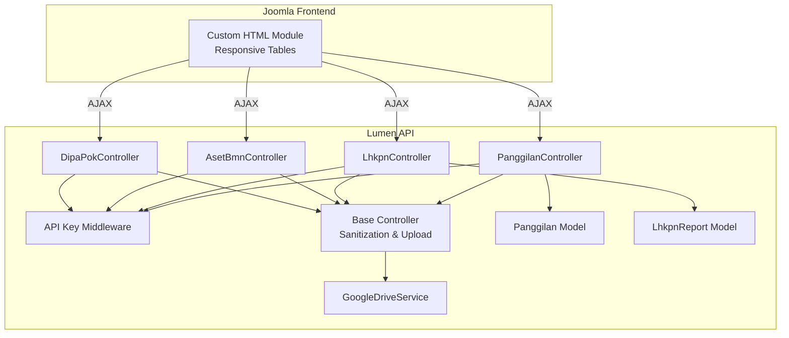
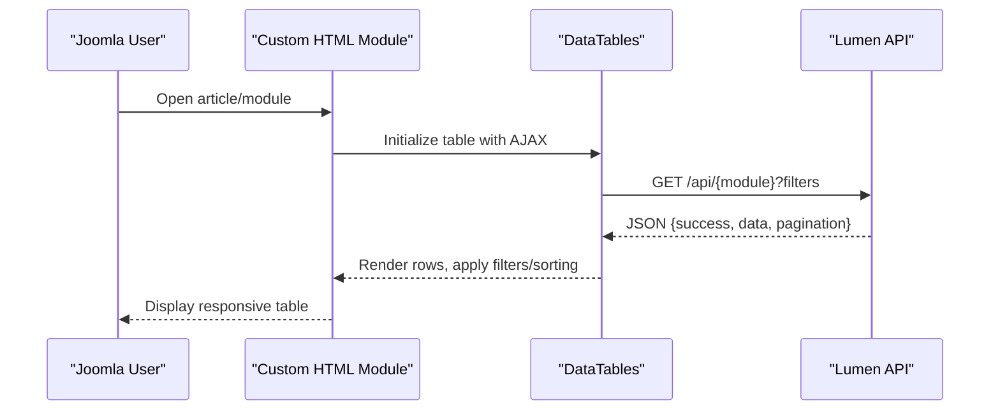
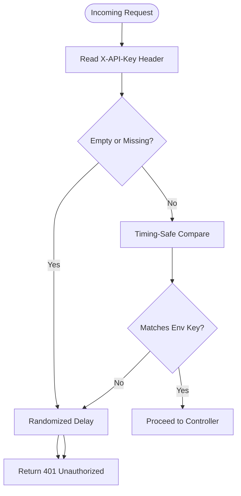
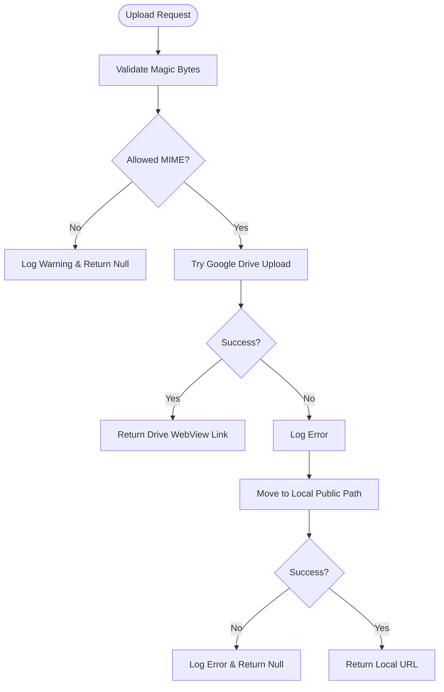
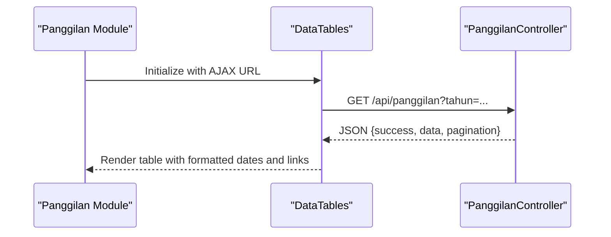
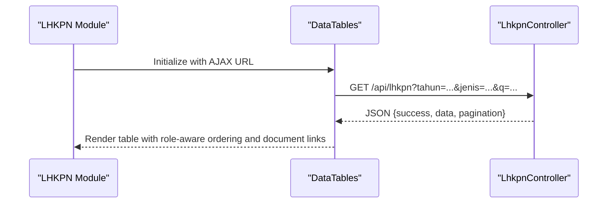
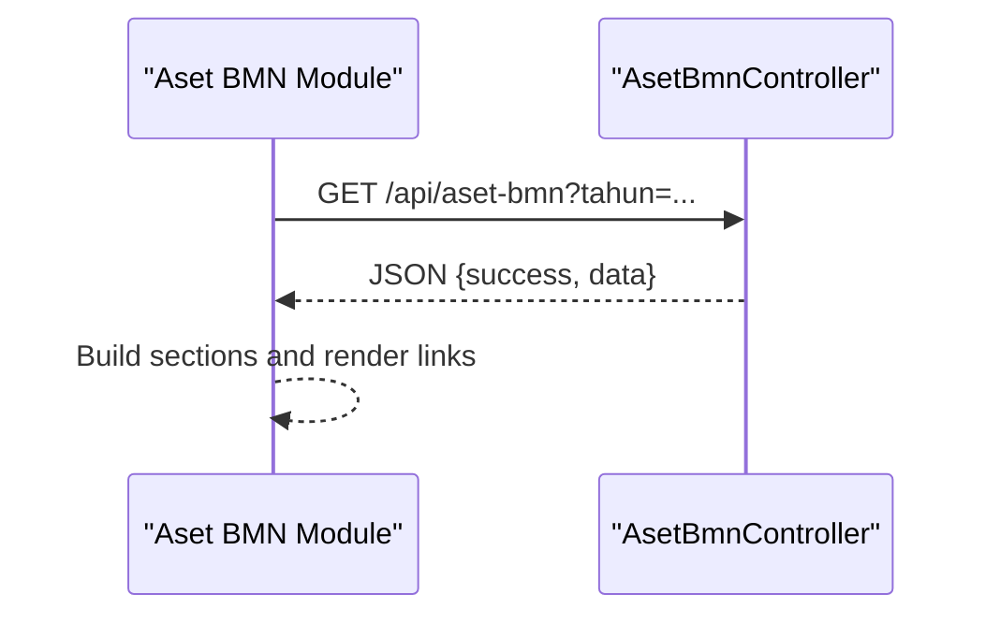
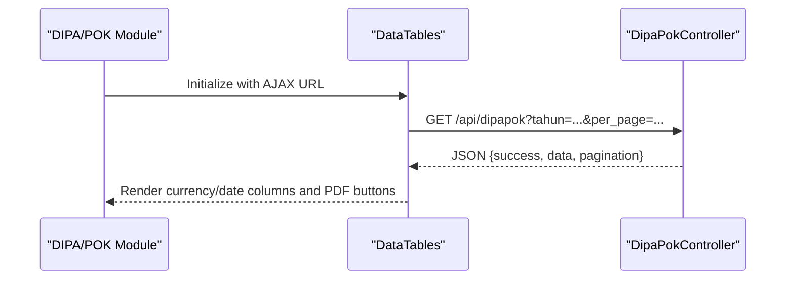
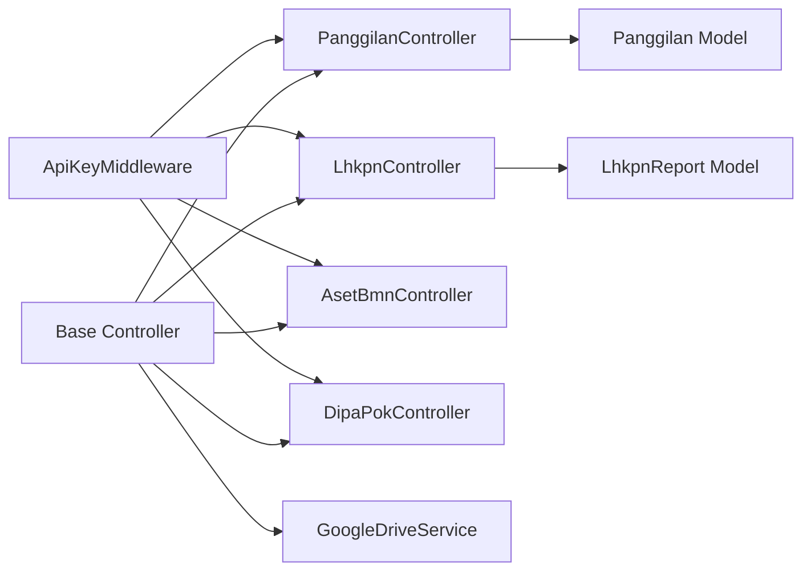

# Legacy System Integration

<cite>
**Referenced Files in This Document**
- [PanggilanController.php](file://app/Http/Controllers/PanggilanController.php)
- [LhkpnController.php](file://app/Http/Controllers/LhkpnController.php)
- [AsetBmnController.php](file://app/Http/Controllers/AsetBmnController.php)
- [DipaPokController.php](file://app/Http/Controllers/DipaPokController.php)
- [Controller.php](file://app/Http/Controllers/Controller.php)
- [ApiKeyMiddleware.php](file://app/Http/Middleware/ApiKeyMiddleware.php)
- [GoogleDriveService.php](file://app/Services/GoogleDriveService.php)
- [Panggilan.php](file://app/Models/Panggilan.php)
- [LhkpnReport.php](file://app/Models/LhkpnReport.php)
- [joomla-integration.html](file://docs/joomla-integration.html)
- [joomla-integration-anggaran.html](file://docs/joomla-integration-anggaran.html)
- [joomla-integration-aset-bmn.html](file://docs/joomla-integration-aset-bmn.html)
- [joomla-integration-dipapok.html](file://docs/joomla-integration-dipapok.html)
- [joomla-integration-lhkpn.html](file://docs/joomla-integration-lhkpn.html)
</cite>

## Table of Contents
1. [Introduction](#introduction)
2. [Project Structure](#project-structure)
3. [Core Components](#core-components)
4. [Architecture Overview](#architecture-overview)
5. [Detailed Component Analysis](#detailed-component-analysis)
6. [Dependency Analysis](#dependency-analysis)
7. [Performance Considerations](#performance-considerations)
8. [Troubleshooting Guide](#troubleshooting-guide)
9. [Conclusion](#conclusion)
10. [Appendices](#appendices)

## Introduction
This document explains how legacy systems integrate with modern API endpoints to power dynamic, responsive user interfaces inside Joomla CMS. It focuses on integration patterns for court modules including panggilan ghaib, anggaran, lhkpn, aset bmn, and dipapok. The guide covers:
- API endpoint design and security (API key middleware)
- Data fetching via AJAX and JSON responses
- Responsive table rendering using DataTables and custom layouts
- JavaScript-driven filtering, sorting, and pagination
- Data transformation and sanitization
- Error handling and fallback strategies
- Responsive design and mobile optimization
- Testing, compatibility, and performance optimization
- Troubleshooting common integration issues

## Project Structure
The backend is a Lumen application exposing RESTful endpoints grouped by domain module. Each controller implements standardized CRUD operations with validation, sanitization, and file upload support. Integration templates for Joomla are provided under docs/, demonstrating how to embed custom HTML modules that fetch data from these APIs.

**Diagram sources**
- [joomla-integration.html:1-398](file://docs/joomla-integration.html#L1-L398)
- [joomla-integration-anggaran.html:1-265](file://docs/joomla-integration-anggaran.html#L1-L265)
- [joomla-integration-aset-bmn.html:1-292](file://docs/joomla-integration-aset-bmn.html#L1-L292)
- [joomla-integration-dipapok.html:1-321](file://docs/joomla-integration-dipapok.html#L1-L321)
- [joomla-integration-lhkpn.html:1-350](file://docs/joomla-integration-lhkpn.html#L1-L350)
- [PanggilanController.php:1-333](file://app/Http/Controllers/PanggilanController.php#L1-L333)
- [LhkpnController.php:1-147](file://app/Http/Controllers/LhkpnController.php#L1-L147)
- [AsetBmnController.php:1-167](file://app/Http/Controllers/AsetBmnController.php#L1-L167)
- [DipaPokController.php:1-192](file://app/Http/Controllers/DipaPokController.php#L1-L192)
- [Controller.php:1-97](file://app/Http/Controllers/Controller.php#L1-L97)
- [ApiKeyMiddleware.php:1-41](file://app/Http/Middleware/ApiKeyMiddleware.php#L1-L41)
- [GoogleDriveService.php:1-117](file://app/Services/GoogleDriveService.php#L1-L117)
- [Panggilan.php:1-55](file://app/Models/Panggilan.php#L1-L55)
- [LhkpnReport.php:1-28](file://app/Models/LhkpnReport.php#L1-L28)

**Section sources**
- [joomla-integration.html:1-398](file://docs/joomla-integration.html#L1-L398)
- [joomla-integration-anggaran.html:1-265](file://docs/joomla-integration-anggaran.html#L1-L265)
- [joomla-integration-aset-bmn.html:1-292](file://docs/joomla-integration-aset-bmn.html#L1-L292)
- [joomla-integration-dipapok.html:1-321](file://docs/joomla-integration-dipapok.html#L1-L321)
- [joomla-integration-lhkpn.html:1-350](file://docs/joomla-integration-lhkpn.html#L1-L350)
- [PanggilanController.php:1-333](file://app/Http/Controllers/PanggilanController.php#L1-L333)
- [LhkpnController.php:1-147](file://app/Http/Controllers/LhkpnController.php#L1-L147)
- [AsetBmnController.php:1-167](file://app/Http/Controllers/AsetBmnController.php#L1-L167)
- [DipaPokController.php:1-192](file://app/Http/Controllers/DipaPokController.php#L1-L192)
- [Controller.php:1-97](file://app/Http/Controllers/Controller.php#L1-L97)
- [ApiKeyMiddleware.php:1-41](file://app/Http/Middleware/ApiKeyMiddleware.php#L1-L41)
- [GoogleDriveService.php:1-117](file://app/Services/GoogleDriveService.php#L1-L117)
- [Panggilan.php:1-55](file://app/Models/Panggilan.php#L1-L55)
- [LhkpnReport.php:1-28](file://app/Models/LhkpnReport.php#L1-L28)

## Core Components
- API Key Middleware: Enforces authentication for protected endpoints using a timing-safe header comparison and controlled delays to mitigate timing attacks.
- Base Controller: Provides shared utilities for input sanitization and robust file upload with Google Drive fallback to local storage.
- Google Drive Service: Handles secure uploads to Google Drive with daily subfolders and public read permissions, logging failures and continuing gracefully.
- Domain Controllers: Implement standardized index/show/store/update/destroy actions with validation, pagination, and file handling tailored to each module.
- Models: Define fillable attributes, casts, and date formatting helpers for consistent serialization.

**Section sources**
- [ApiKeyMiddleware.php:1-41](file://app/Http/Middleware/ApiKeyMiddleware.php#L1-L41)
- [Controller.php:1-97](file://app/Http/Controllers/Controller.php#L1-L97)
- [GoogleDriveService.php:1-117](file://app/Services/GoogleDriveService.php#L1-L117)
- [PanggilanController.php:1-333](file://app/Http/Controllers/PanggilanController.php#L1-L333)
- [LhkpnController.php:1-147](file://app/Http/Controllers/LhkpnController.php#L1-L147)
- [AsetBmnController.php:1-167](file://app/Http/Controllers/AsetBmnController.php#L1-L167)
- [DipaPokController.php:1-192](file://app/Http/Controllers/DipaPokController.php#L1-L192)
- [Panggilan.php:1-55](file://app/Models/Panggilan.php#L1-L55)
- [LhkpnReport.php:1-28](file://app/Models/LhkpnReport.php#L1-L28)

## Architecture Overview
The integration pattern centers on embedding Custom HTML Modules in Joomla that:
- Load external CSS/JS libraries (jQuery, DataTables)
- Configure API URLs per module
- Fetch paginated data via AJAX
- Render responsive tables with localized languages and mobile-friendly layouts
- Apply filters (year, search) and handle errors gracefully

**Diagram sources**
- [joomla-integration.html:229-396](file://docs/joomla-integration.html#L229-L396)
- [joomla-integration-anggaran.html:172-264](file://docs/joomla-integration-anggaran.html#L172-L264)
- [joomla-integration-aset-bmn.html:171-291](file://docs/joomla-integration-aset-bmn.html#L171-L291)
- [joomla-integration-dipapok.html:186-320](file://docs/joomla-integration-dipapok.html#L186-L320)
- [joomla-integration-lhkpn.html:181-349](file://docs/joomla-integration-lhkpn.html#L181-L349)
- [PanggilanController.php:31-57](file://app/Http/Controllers/PanggilanController.php#L31-L57)
- [LhkpnController.php:11-53](file://app/Http/Controllers/LhkpnController.php#L11-L53)
- [AsetBmnController.php:32-54](file://app/Http/Controllers/AsetBmnController.php#L32-L54)
- [DipaPokController.php:10-39](file://app/Http/Controllers/DipaPokController.php#L10-L39)

## Detailed Component Analysis

### API Security and Authentication
- API key validation occurs via a dedicated middleware that reads X-API-Key from headers and compares against an environment variable using a timing-safe function. On mismatch, a randomized delay is applied before returning unauthorized.
- Protected endpoints require the API key; public endpoints expose read-only data without authentication.

**Diagram sources**
- [ApiKeyMiddleware.php:14-39](file://app/Http/Middleware/ApiKeyMiddleware.php#L14-L39)

**Section sources**
- [ApiKeyMiddleware.php:1-41](file://app/Http/Middleware/ApiKeyMiddleware.php#L1-L41)

### File Upload and Fallback Strategy
- Base controller encapsulates upload logic with MIME-type validation based on magic bytes, not just extensions.
- Attempts Google Drive upload first; on failure, falls back to local storage with randomized filenames and safe destination paths.
- Returns a public URL for the uploaded file to be stored in the model’s link field.

**Diagram sources**
- [Controller.php:40-95](file://app/Http/Controllers/Controller.php#L40-L95)
- [GoogleDriveService.php:38-82](file://app/Services/GoogleDriveService.php#L38-L82)

**Section sources**
- [Controller.php:1-97](file://app/Http/Controllers/Controller.php#L1-L97)
- [GoogleDriveService.php:1-117](file://app/Services/GoogleDriveService.php#L1-L117)

### Panggilan Ghaib Integration
- Backend: Controller supports pagination, optional year filter, and strict input validation. File uploads are supported with sanitization and fallback.
- Frontend: Custom HTML module initializes DataTables, applies Indonesian localization, renders dates, and handles error states. Filtering by year is supported.

**Diagram sources**
- [joomla-integration.html:229-396](file://docs/joomla-integration.html#L229-L396)
- [PanggilanController.php:31-57](file://app/Http/Controllers/PanggilanController.php#L31-L57)

**Section sources**
- [PanggilanController.php:1-333](file://app/Http/Controllers/PanggilanController.php#L1-L333)
- [joomla-integration.html:1-398](file://docs/joomla-integration.html#L1-L398)
- [Panggilan.php:1-55](file://app/Models/Panggilan.php#L1-L55)

### LHKPN Integration
- Backend: Supports year and type filters, global search across name/NIP, hierarchical ordering by organizational role, and file uploads with link resolution.
- Frontend: Year tabs, DataTables initialization, Indonesian localization, custom rendering for badges and document links, and robust error handling.

**Diagram sources**
- [joomla-integration-lhkpn.html:181-349](file://docs/joomla-integration-lhkpn.html#L181-L349)
- [LhkpnController.php:11-53](file://app/Http/Controllers/LhkpnController.php#L11-L53)

**Section sources**
- [LhkpnController.php:1-147](file://app/Http/Controllers/LhkpnController.php#L1-L147)
- [joomla-integration-lhkpn.html:1-350](file://docs/joomla-integration-lhkpn.html#L1-L350)
- [LhkpnReport.php:1-28](file://app/Models/LhkpnReport.php#L1-L28)

### Aset BMN Integration
- Backend: Supports year filtering and predefined report types with strict validation and duplicate prevention. File uploads handled via shared controller logic.
- Frontend: Year tabs, sectioned layout grouping related reports, and document link rendering. Uses fetch-based data loading.

**Diagram sources**
- [joomla-integration-aset-bmn.html:171-291](file://docs/joomla-integration-aset-bmn.html#L171-L291)
- [AsetBmnController.php:32-54](file://app/Http/Controllers/AsetBmnController.php#L32-L54)

**Section sources**
- [AsetBmnController.php:1-167](file://app/Http/Controllers/AsetBmnController.php#L1-L167)
- [joomla-integration-aset-bmn.html:1-292](file://docs/joomla-integration-aset-bmn.html#L1-L292)

### DIPA/POK Integration
- Backend: Supports year filtering, free-text search across multiple fields, hierarchical ordering, and dual file upload handling for DIPA and POK documents.
- Frontend: Year tabs, DataTables with currency formatting, date formatting, and PDF icon buttons for document access.

**Diagram sources**
- [joomla-integration-dipapok.html:186-320](file://docs/joomla-integration-dipapok.html#L186-L320)
- [DipaPokController.php:10-39](file://app/Http/Controllers/DipaPokController.php#L10-L39)

**Section sources**
- [DipaPokController.php:1-192](file://app/Http/Controllers/DipaPokController.php#L1-L192)
- [joomla-integration-dipapok.html:1-321](file://docs/joomla-integration-dipapok.html#L1-L321)

### Anggaran Integration (Reference Pattern)
- Demonstrates tabbed year selection, DataTables integration, currency formatting, progress bars, and error handling. Useful as a template for similar modules.

**Section sources**
- [joomla-integration-anggaran.html:1-265](file://docs/joomla-integration-anggaran.html#L1-L265)

## Dependency Analysis
- Controllers depend on the base controller for sanitization and upload utilities.
- Upload utilities depend on Google Drive SDK and environment configuration; on failure, they fall back to local storage.
- Middleware enforces API key checks for protected routes.
- Models define schema and casting for consistent serialization.

**Diagram sources**
- [ApiKeyMiddleware.php:1-41](file://app/Http/Middleware/ApiKeyMiddleware.php#L1-L41)
- [Controller.php:1-97](file://app/Http/Controllers/Controller.php#L1-L97)
- [GoogleDriveService.php:1-117](file://app/Services/GoogleDriveService.php#L1-L117)
- [PanggilanController.php:1-333](file://app/Http/Controllers/PanggilanController.php#L1-L333)
- [LhkpnController.php:1-147](file://app/Http/Controllers/LhkpnController.php#L1-L147)
- [AsetBmnController.php:1-167](file://app/Http/Controllers/AsetBmnController.php#L1-L167)
- [DipaPokController.php:1-192](file://app/Http/Controllers/DipaPokController.php#L1-L192)
- [Panggilan.php:1-55](file://app/Models/Panggilan.php#L1-L55)
- [LhkpnReport.php:1-28](file://app/Models/LhkpnReport.php#L1-L28)

**Section sources**
- [ApiKeyMiddleware.php:1-41](file://app/Http/Middleware/ApiKeyMiddleware.php#L1-L41)
- [Controller.php:1-97](file://app/Http/Controllers/Controller.php#L1-L97)
- [GoogleDriveService.php:1-117](file://app/Services/GoogleDriveService.php#L1-L117)
- [PanggilanController.php:1-333](file://app/Http/Controllers/PanggilanController.php#L1-L333)
- [LhkpnController.php:1-147](file://app/Http/Controllers/LhkpnController.php#L1-L147)
- [AsetBmnController.php:1-167](file://app/Http/Controllers/AsetBmnController.php#L1-L167)
- [DipaPokController.php:1-192](file://app/Http/Controllers/DipaPokController.php#L1-L192)
- [Panggilan.php:1-55](file://app/Models/Panggilan.php#L1-L55)
- [LhkpnReport.php:1-28](file://app/Models/LhkpnReport.php#L1-L28)

## Performance Considerations
- Pagination: Controllers enforce per_page limits and use database-side pagination to avoid memory exhaustion.
- Validation and sanitization: Strict input validation reduces downstream processing overhead and prevents malformed requests.
- File uploads: MIME validation and fallback minimize failed uploads and reduce storage errors.
- Frontend: DataTables with responsive settings and localized language packs improve perceived performance on mobile devices.
- Recommendations:
  - Prefer server-side pagination and filtering.
  - Cache frequently accessed metadata (e.g., available years) when feasible.
  - Minimize DOM updates by reusing DataTable instances and destroying/reinitializing only when filters change.
  - Use lazy loading for large PDF previews if necessary.

[No sources needed since this section provides general guidance]

## Troubleshooting Guide
- API connectivity problems:
  - Verify X-API-Key header matches configured environment value.
  - Confirm middleware is attached to protected routes.
  - Check network tab for 401/500 responses and inspect logs.
- Data loading failures:
  - Ensure API URL is correct and reachable from the browser.
  - Confirm CORS and rate limiting are not blocking requests.
  - Validate JSON response structure matches frontend expectations.
- Styling conflicts:
  - Isolate module styles and avoid global CSS overrides.
  - Use scoped containers and modular CSS classes.
- File upload issues:
  - Confirm Google Drive credentials and refresh token are set.
  - Check fallback to local storage when Drive is unavailable.
  - Validate MIME types and file sizes meet controller constraints.

**Section sources**
- [ApiKeyMiddleware.php:1-41](file://app/Http/Middleware/ApiKeyMiddleware.php#L1-L41)
- [Controller.php:1-97](file://app/Http/Controllers/Controller.php#L1-L97)
- [GoogleDriveService.php:1-117](file://app/Services/GoogleDriveService.php#L1-L117)
- [joomla-integration.html:229-396](file://docs/joomla-integration.html#L229-L396)
- [joomla-integration-lhkpn.html:181-349](file://docs/joomla-integration-lhkpn.html#L181-L349)
- [joomla-integration-aset-bmn.html:171-291](file://docs/joomla-integration-aset-bmn.html#L171-L291)
- [joomla-integration-dipapok.html:186-320](file://docs/joomla-integration-dipapok.html#L186-L320)
- [joomla-integration-anggaran.html:1-265](file://docs/joomla-integration-anggaran.html#L1-L265)

## Conclusion
The integration strategy leverages clean, validated API endpoints and reusable frontend templates to deliver responsive, filtered views of court data within Joomla. By centralizing security (API keys), sanitization, and file handling in the backend, and delegating presentation and UX to modular HTML/CSS/JS, teams can maintain consistency and scalability across modules like panggilan ghaib, anggaran, lhkpn, aset bmn, and dipapok.

[No sources needed since this section summarizes without analyzing specific files]

## Appendices

### API URL Configuration Examples
- Panggilan: Configure the module’s API_URL to your Lumen endpoint and ensure the year filter is appended as a query parameter.
- LHKPN: Set the API_URL and rely on year/type/q filters.
- Aset BMN: Use the year filter to scope reports.
- DIPA/POK: Use the year filter and adjust per_page as needed.

**Section sources**
- [joomla-integration.html:229-396](file://docs/joomla-integration.html#L229-L396)
- [joomla-integration-lhkpn.html:181-349](file://docs/joomla-integration-lhkpn.html#L181-L349)
- [joomla-integration-aset-bmn.html:171-291](file://docs/joomla-integration-aset-bmn.html#L171-L291)
- [joomla-integration-dipapok.html:186-320](file://docs/joomla-integration-dipapok.html#L186-L320)

### Data Transformation and Rendering Patterns
- Dates: Convert ISO dates to localized Indonesian formats in the frontend.
- Currency: Format numeric values using locale-specific currency formatting.
- Progress bars: Compute percentages client-side and render progress containers.
- Document links: Render PDF icons/buttons with appropriate accessibility attributes.

**Section sources**
- [joomla-integration-anggaran.html:172-264](file://docs/joomla-integration-anggaran.html#L172-L264)
- [joomla-integration-dipapok.html:204-302](file://docs/joomla-integration-dipapok.html#L204-L302)
- [joomla-integration-lhkpn.html:189-322](file://docs/joomla-integration-lhkpn.html#L189-L322)

### Browser Compatibility and Mobile Optimization
- Use DataTables’ responsive plugin and localized language packs for consistent behavior.
- Test across major browsers and ensure fallbacks for older environments.
- Optimize touch interactions and button sizing for mobile screens.

**Section sources**
- [joomla-integration.html:1-398](file://docs/joomla-integration.html#L1-L398)
- [joomla-integration-anggaran.html:1-265](file://docs/joomla-integration-anggaran.html#L1-L265)
- [joomla-integration-aset-bmn.html:1-292](file://docs/joomla-integration-aset-bmn.html#L1-L292)
- [joomla-integration-dipapok.html:1-321](file://docs/joomla-integration-dipapok.html#L1-L321)
- [joomla-integration-lhkpn.html:1-350](file://docs/joomla-integration-lhkpn.html#L1-L350)