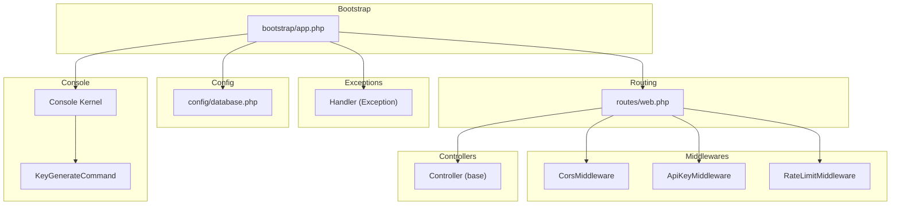
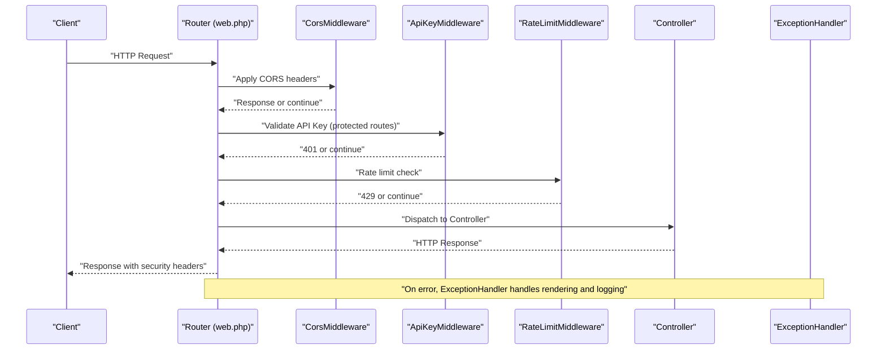
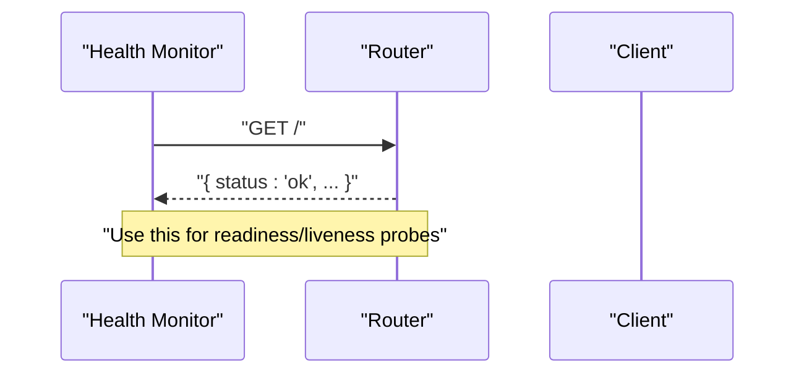
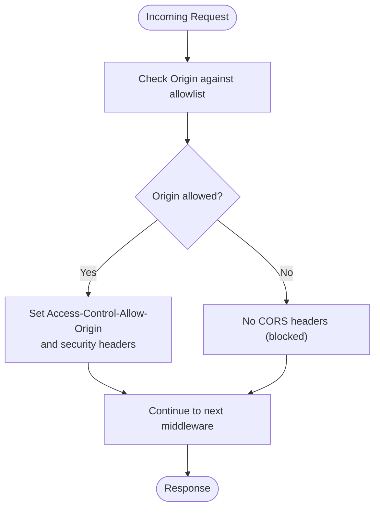
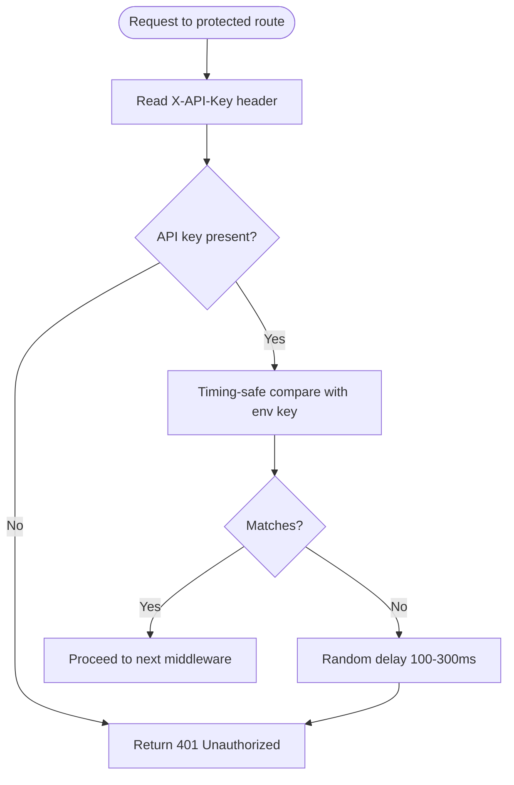
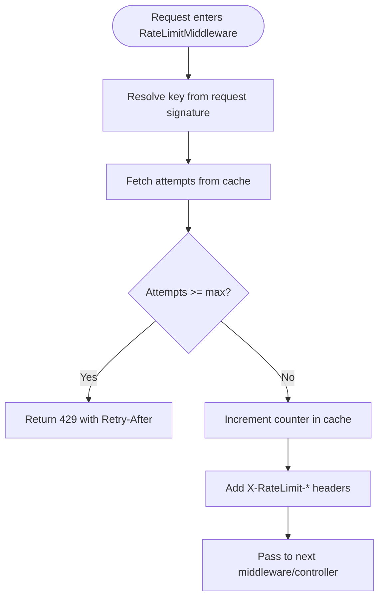
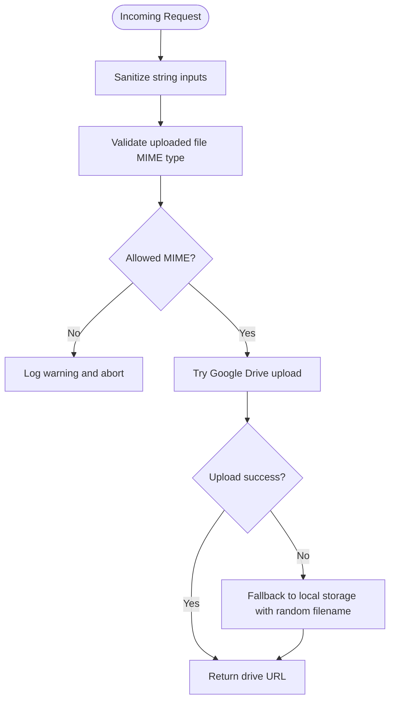
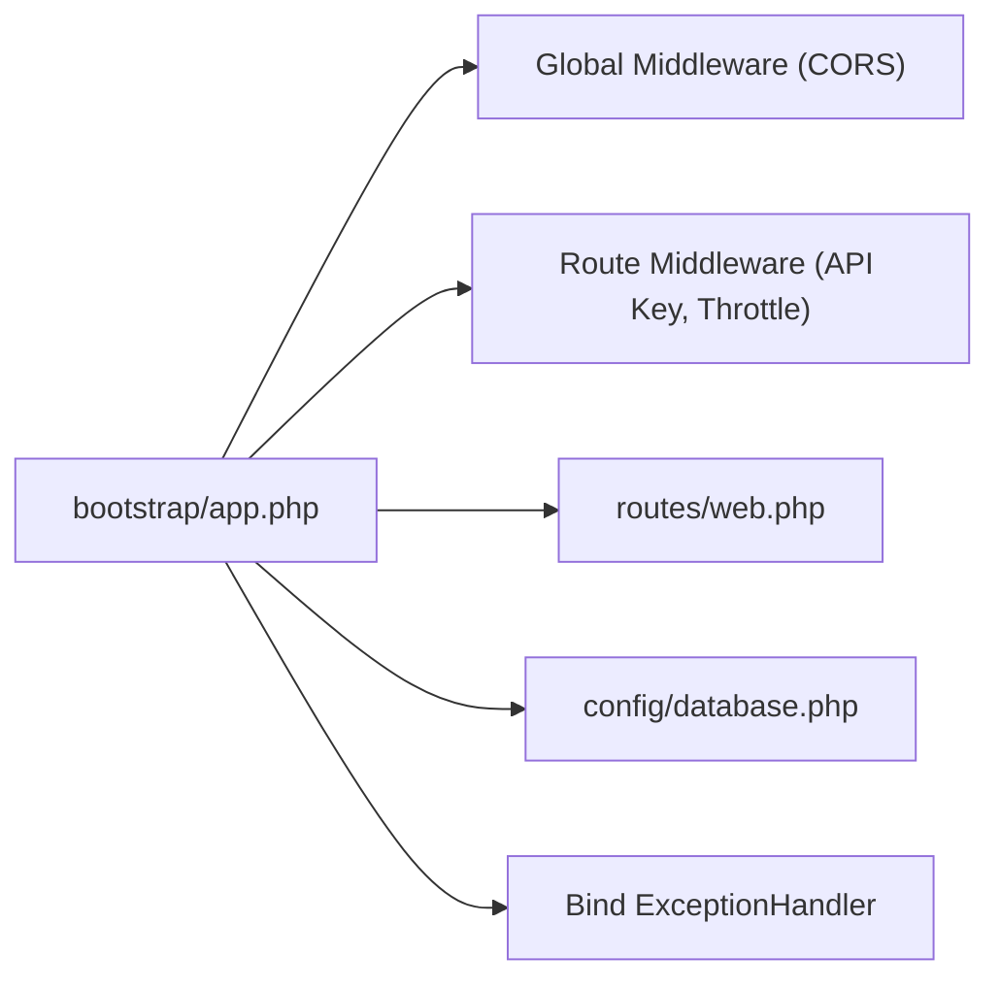
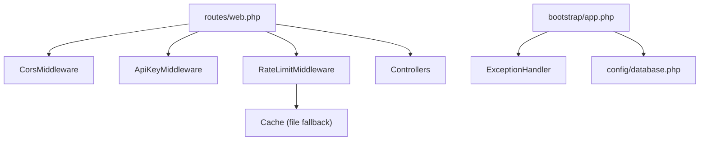

# Monitoring and Maintenance

<cite>
**Referenced Files in This Document**
- [app.php](file://bootstrap/app.php)
- [Handler.php](file://app/Exceptions/Handler.php)
- [CorsMiddleware.php](file://app/Http/Middleware/CorsMiddleware.php)
- [ApiKeyMiddleware.php](file://app/Http/Middleware/ApiKeyMiddleware.php)
- [RateLimitMiddleware.php](file://app/Http/Middleware/RateLimitMiddleware.php)
- [Controller.php](file://app/Http/Controllers/Controller.php)
- [web.php](file://routes/web.php)
- [database.php](file://config/database.php)
- [Kernel.php](file://app/Console/Kernel.php)
- [KeyGenerateCommand.php](file://app/Console/Commands/KeyGenerateCommand.php)
- [SECURITY.md](file://SECURITY.md)
</cite>

## Table of Contents
1. [Introduction](#introduction)
2. [Project Structure](#project-structure)
3. [Core Components](#core-components)
4. [Architecture Overview](#architecture-overview)
5. [Detailed Component Analysis](#detailed-component-analysis)
6. [Dependency Analysis](#dependency-analysis)
7. [Performance Considerations](#performance-considerations)
8. [Troubleshooting Guide](#troubleshooting-guide)
9. [Conclusion](#conclusion)
10. [Appendices](#appendices)

## Introduction
This document provides comprehensive monitoring and maintenance guidance for the Lumen API backend. It covers health checks, performance monitoring, operational procedures, error logging, audit trails, debugging in production, exception handling, alerting strategies, dashboard setup, log analysis, performance bottleneck identification, maintenance procedures (database optimization, cache management, storage cleanup), disaster recovery and backups, incident response, capacity planning, scaling, load testing, and security maintenance.

## Project Structure
The API is a Lumen application with a small set of routes grouped under a single router file. Security is enforced via global and route-specific middleware. The exception handler centralizes error reporting and response rendering. Environment-driven configuration controls database connectivity and runtime behavior.



**Diagram sources**
- [app.php:11-55](file://bootstrap/app.php#L11-L55)
- [web.php:5-165](file://routes/web.php#L5-L165)
- [CorsMiddleware.php:14-62](file://app/Http/Middleware/CorsMiddleware.php#L14-L62)
- [ApiKeyMiddleware.php:14-39](file://app/Http/Middleware/ApiKeyMiddleware.php#L14-L39)
- [RateLimitMiddleware.php:15-47](file://app/Http/Middleware/RateLimitMiddleware.php#L15-L47)
- [Controller.php:18-96](file://app/Http/Controllers/Controller.php#L18-L96)
- [Handler.php:27-132](file://app/Exceptions/Handler.php#L27-L132)
- [database.php:3-29](file://config/database.php#L3-L29)
- [Kernel.php:8-26](file://app/Console/Kernel.php#L8-L26)
- [KeyGenerateCommand.php:23-50](file://app/Console/Commands/KeyGenerateCommand.php#L23-L50)

**Section sources**
- [app.php:11-55](file://bootstrap/app.php#L11-L55)
- [web.php:5-165](file://routes/web.php#L5-L165)

## Core Components
- Health check endpoint: A simple root endpoint returns a status message for readiness and liveness checks.
- Security middleware: Enforces strict CORS, API key validation, and rate limiting.
- Exception handling: Centralized handler renders secure JSON responses, applies security headers, and logs unhandled exceptions.
- Configuration: Database connection configured via environment variables.
- Console commands: Application key generation command for secure deployments.

**Section sources**
- [web.php:6-11](file://routes/web.php#L6-L11)
- [CorsMiddleware.php:14-62](file://app/Http/Middleware/CorsMiddleware.php#L14-L62)
- [ApiKeyMiddleware.php:14-39](file://app/Http/Middleware/ApiKeyMiddleware.php#L14-L39)
- [RateLimitMiddleware.php:15-47](file://app/Http/Middleware/RateLimitMiddleware.php#L15-L47)
- [Handler.php:27-132](file://app/Exceptions/Handler.php#L27-L132)
- [database.php:3-29](file://config/database.php#L3-L29)
- [KeyGenerateCommand.php:23-50](file://app/Console/Commands/KeyGenerateCommand.php#L23-L50)

## Architecture Overview
The runtime flow integrates routing, middleware, controllers, and centralized exception handling. Security headers are applied consistently, and rate limiting is enforced centrally.



**Diagram sources**
- [web.php:5-165](file://routes/web.php#L5-L165)
- [CorsMiddleware.php:14-62](file://app/Http/Middleware/CorsMiddleware.php#L14-L62)
- [ApiKeyMiddleware.php:14-39](file://app/Http/Middleware/ApiKeyMiddleware.php#L14-L39)
- [RateLimitMiddleware.php:15-47](file://app/Http/Middleware/RateLimitMiddleware.php#L15-L47)
- [Handler.php:36-132](file://app/Exceptions/Handler.php#L36-L132)

## Detailed Component Analysis

### Health Checks and System Status
- Root endpoint: Returns a simple JSON payload indicating service availability and identity.
- Recommended monitoring: Probe the root endpoint for HTTP 200 and parse the status field.



**Diagram sources**
- [web.php:6-11](file://routes/web.php#L6-L11)

**Section sources**
- [web.php:6-11](file://routes/web.php#L6-L11)

### Security Headers and CORS
- CORS middleware enforces a strict origin allowlist, sets security headers, and handles preflight requests.
- Security headers are also applied to error responses via the exception handler.



**Diagram sources**
- [CorsMiddleware.php:14-62](file://app/Http/Middleware/CorsMiddleware.php#L14-L62)
- [Handler.php:36-56](file://app/Exceptions/Handler.php#L36-L56)

**Section sources**
- [CorsMiddleware.php:14-62](file://app/Http/Middleware/CorsMiddleware.php#L14-L62)
- [Handler.php:36-56](file://app/Exceptions/Handler.php#L36-L56)

### API Key Authentication
- Protected routes require a validated API key. The middleware performs a timing-safe comparison and introduces a randomized delay on failure to mitigate timing attacks.



**Diagram sources**
- [ApiKeyMiddleware.php:14-39](file://app/Http/Middleware/ApiKeyMiddleware.php#L14-L39)

**Section sources**
- [ApiKeyMiddleware.php:14-39](file://app/Http/Middleware/ApiKeyMiddleware.php#L14-L39)

### Rate Limiting
- A simple sliding-window rate limiter keyed by client IP is implemented. It increments counters in cache and returns 429 with Retry-After when exceeded.



**Diagram sources**
- [RateLimitMiddleware.php:15-47](file://app/Http/Middleware/RateLimitMiddleware.php#L15-L47)

**Section sources**
- [RateLimitMiddleware.php:15-47](file://app/Http/Middleware/RateLimitMiddleware.php#L15-L47)

### Exception Handling and Logging
- The centralized handler:
  - Applies security headers to all responses, including error responses.
  - Renders structured JSON for validation, model-not-found, and HTTP exceptions.
  - Logs unhandled exceptions with minimal details in production to avoid information disclosure.
  - Returns generic messages in production while preserving detailed messages in development.

```mermaid
sequenceDiagram
participant Ctrl as "Controller"
participant App as "Lumen App"
participant Ex as "ExceptionHandler"
participant Log as "Logger"
Ctrl->>App : "Throw exception"
App->>Ex : "report(exception)"
Ex->>Log : "Log error (minimal details)"
App->>Ex : "render(request, exception)"
Ex-->>Ctrl : "JSON response with security headers"
Note over Ex,Ctrl : "Production hides stack traces; development shows details"
```

**Diagram sources**
- [Handler.php:27-132](file://app/Exceptions/Handler.php#L27-L132)

**Section sources**
- [Handler.php:27-132](file://app/Exceptions/Handler.php#L27-L132)

### Input Sanitization and File Upload Security
- Base controller provides input sanitization and secure file upload with MIME-type validation and fallback storage.



**Diagram sources**
- [Controller.php:18-96](file://app/Http/Controllers/Controller.php#L18-L96)

**Section sources**
- [Controller.php:18-96](file://app/Http/Controllers/Controller.php#L18-L96)

### Operational Procedures and Configuration
- Bootstrap registers global and route-specific middleware, binds the exception handler, and loads routes.
- Database configuration is environment-driven.



**Diagram sources**
- [app.php:21-39](file://bootstrap/app.php#L21-L39)
- [app.php:48-52](file://bootstrap/app.php#L48-L52)
- [database.php:3-29](file://config/database.php#L3-L29)

**Section sources**
- [app.php:21-39](file://bootstrap/app.php#L21-L39)
- [app.php:48-52](file://bootstrap/app.php#L48-L52)
- [database.php:3-29](file://config/database.php#L3-L29)

## Dependency Analysis
- Routing depends on middleware registration and controller resolution.
- Exception handling is bound globally to ensure consistent error responses.
- Rate limiting relies on cache; if Redis is unavailable, file-based cache is used.
- Database connectivity is controlled by environment variables.



**Diagram sources**
- [web.php:5-165](file://routes/web.php#L5-L165)
- [CorsMiddleware.php:14-62](file://app/Http/Middleware/CorsMiddleware.php#L14-L62)
- [ApiKeyMiddleware.php:14-39](file://app/Http/Middleware/ApiKeyMiddleware.php#L14-L39)
- [RateLimitMiddleware.php:15-47](file://app/Http/Middleware/RateLimitMiddleware.php#L15-L47)
- [app.php:21-39](file://bootstrap/app.php#L21-L39)
- [database.php:3-29](file://config/database.php#L3-L29)

**Section sources**
- [web.php:5-165](file://routes/web.php#L5-L165)
- [RateLimitMiddleware.php:15-47](file://app/Http/Middleware/RateLimitMiddleware.php#L15-L47)
- [app.php:21-39](file://bootstrap/app.php#L21-L39)
- [database.php:3-29](file://config/database.php#L3-L29)

## Performance Considerations
- Enable and monitor rate-limit headers (X-RateLimit-Limit, X-RateLimit-Remaining) to detect hotspots and throttled clients.
- Use the root health endpoint for quick liveness/readiness checks during load tests.
- Apply caching at the application layer for expensive queries and at the CDN/proxy layer for static assets.
- Monitor database connections and slow queries via your database’s performance schema or logs.
- For file uploads, prefer cloud storage (Google Drive) to reduce local disk I/O and improve scalability.

[No sources needed since this section provides general guidance]

## Troubleshooting Guide
Common operational issues and remedies:
- Unauthorized responses on protected routes:
  - Verify the X-API-Key header and that the API key is set in environment configuration.
- Too Many Requests (429):
  - Check client-side retry-after behavior and adjust limits if necessary.
- CORS blocked requests:
  - Confirm the Origin is in the allowlist and that trusted domains are configured appropriately.
- Generic 500 errors in production:
  - Inspect application logs for the logged exception metadata; do not expose stack traces to clients.
- Upload failures:
  - Validate MIME type and ensure either Google Drive service is available or local storage is writable.

**Section sources**
- [ApiKeyMiddleware.php:14-39](file://app/Http/Middleware/ApiKeyMiddleware.php#L14-L39)
- [RateLimitMiddleware.php:15-47](file://app/Http/Middleware/RateLimitMiddleware.php#L15-L47)
- [CorsMiddleware.php:14-62](file://app/Http/Middleware/CorsMiddleware.php#L14-L62)
- [Handler.php:102-107](file://app/Exceptions/Handler.php#L102-L107)
- [Controller.php:54-94](file://app/Http/Controllers/Controller.php#L54-L94)

## Conclusion
The Lumen API implements strong security defaults via middleware and centralized exception handling. Monitoring should focus on the health endpoint, rate-limit headers, CORS allowlists, and robust logging. Operational excellence requires disciplined environment configuration, secure deployment practices, and proactive cache and storage strategies.

[No sources needed since this section summarizes without analyzing specific files]

## Appendices

### Monitoring Dashboard Setup
- Health: Poll the root endpoint for HTTP 200 and parse the status field.
- Latency and Throughput: Instrument route handlers and record response times and counts.
- Error Rates: Aggregate 4xx/5xx from access logs and correlate with exception logs.
- Rate Limits: Track X-RateLimit-Remaining and Retry-After occurrences.
- Database: Monitor connection counts, slow query logs, and replication lag if applicable.

[No sources needed since this section provides general guidance]

### Log Analysis Procedures
- Filter by severity and correlation IDs.
- Correlate request IDs across middleware and controllers.
- Alert on spikes in 5xx errors and repeated 401/429 responses.
- Rotate and retain logs per compliance requirements.

[No sources needed since this section provides general guidance]

### Performance Bottleneck Identification
- Use rate-limit headers to identify throttled clients.
- Profile controller actions and database queries.
- Observe upload paths and storage backends for I/O bottlenecks.
- Scale horizontally and introduce CDN caching for static assets.

[No sources needed since this section provides general guidance]

### Maintenance Procedures
- Database optimization:
  - Review slow query logs and add appropriate indexes.
  - Normalize and denormalize as needed; monitor cardinality.
- Cache management:
  - Clear stale keys periodically; monitor hit ratios.
  - Prefer distributed cache (Redis) for production.
- Storage cleanup:
  - Archive old uploads; enforce retention policies.
  - Monitor disk usage and set alerts.

[No sources needed since this section provides general guidance]

### Disaster Recovery and Backups
- Database:
  - Automated daily logical backups with point-in-time recovery.
  - Test restore procedures regularly.
- Application:
  - Immutable artifacts and environment parity.
  - Maintain a documented rollback procedure.
- Offsite backups and DR drills.

[No sources needed since this section provides general guidance]

### Capacity Planning and Scaling
- Horizontal scaling: Stateless application servers behind a load balancer.
- Vertical scaling: Increase CPU/RAM for memory-intensive operations.
- Auto-scaling: Trigger on CPU, latency, or request queues.
- Load testing: Use tools to simulate traffic and validate thresholds.

[No sources needed since this section provides general guidance]

### Load Testing Procedures
- Define SLOs and SLIs aligned with business outcomes.
- Simulate realistic traffic patterns and burst loads.
- Validate rate limits, error budgets, and recovery behavior.

[No sources needed since this section provides general guidance]

### Security Maintenance
- Keep dependencies updated and monitor advisories.
- Rotate secrets (API key, database credentials) regularly.
- Enforce least privilege for database and storage accounts.
- Review and audit CORS allowlists and trusted domains.

**Section sources**
- [SECURITY.md:54-84](file://SECURITY.md#L54-L84)

### Environment Configuration Checklist
- Required environment variables:
  - APP_ENV and APP_DEBUG for environment and debug modes.
  - API_KEY for protected routes.
  - CORS_ALLOWED_ORIGINS for strict origin allowlist.
  - Database credentials and connection settings.

**Section sources**
- [SECURITY.md:56-63](file://SECURITY.md#L56-L63)
- [database.php:3-29](file://config/database.php#L3-L29)

### Console Commands for Operations
- Application key generation:
  - Use the provided command to generate and inject a secure application key into the environment file.

**Section sources**
- [Kernel.php:15-17](file://app/Console/Kernel.php#L15-L17)
- [KeyGenerateCommand.php:23-50](file://app/Console/Commands/KeyGenerateCommand.php#L23-L50)