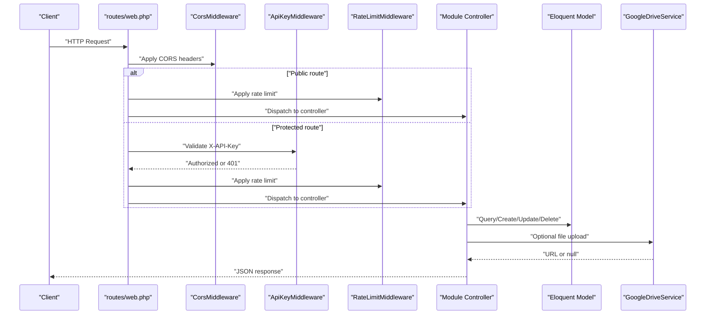
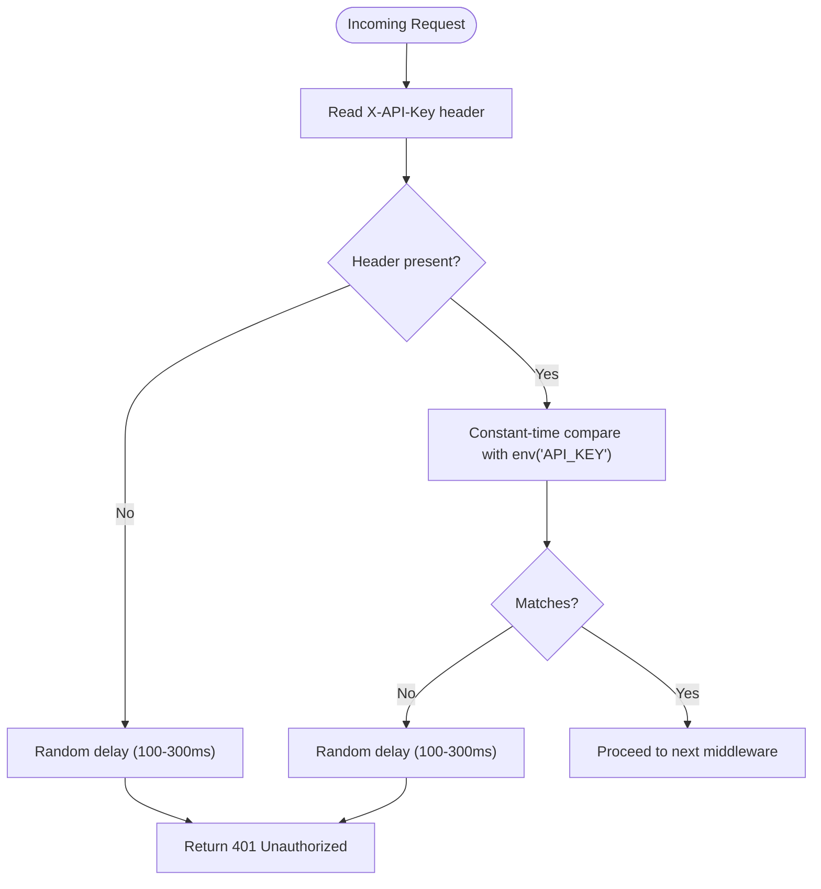
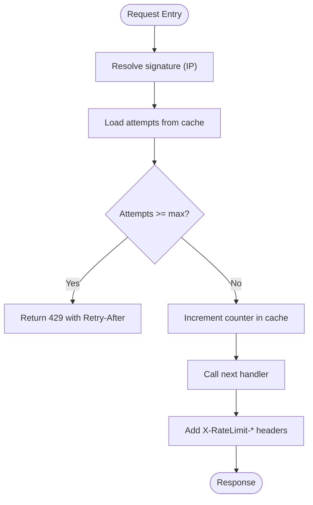
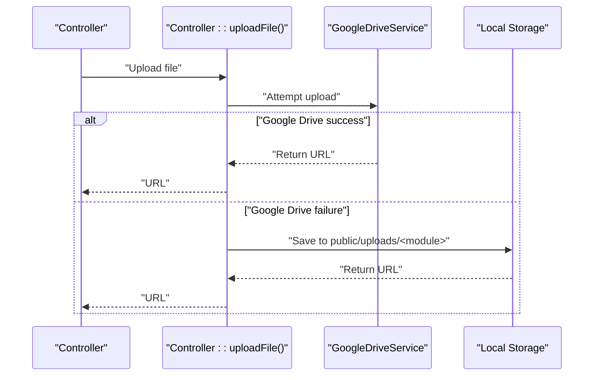
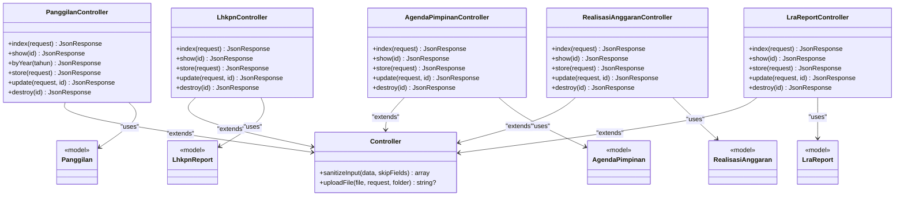

# API Scope and Modules

<cite>
**Referenced Files in This Document**
- [routes/web.php](file://routes/web.php)
- [ApiKeyMiddleware.php](file://app/Http/Middleware/ApiKeyMiddleware.php)
- [RateLimitMiddleware.php](file://app/Http/Middleware/RateLimitMiddleware.php)
- [CorsMiddleware.php](file://app/Http/Middleware/CorsMiddleware.php)
- [Controller.php](file://app/Http/Controllers/Controller.php)
- [PanggilanController.php](file://app/Http/Controllers/PanggilanController.php)
- [LhkpnController.php](file://app/Http/Controllers/LhkpnController.php)
- [AgendaPimpinanController.php](file://app/Http/Controllers/AgendaPimpinanController.php)
- [RealisasiAnggaranController.php](file://app/Http/Controllers/RealisasiAnggaranController.php)
- [LraReportController.php](file://app/Http/Controllers/LraReportController.php)
- [Panggilan.php](file://app/Models/Panggilan.php)
- [LhkpnReport.php](file://app/Models/LhkpnReport.php)
- [AgendaPimpinan.php](file://app/Models/AgendaPimpinan.php)
- [RealisasiAnggaran.php](file://app/Models/RealisasiAnggaran.php)
- [GoogleDriveService.php](file://app/Services/GoogleDriveService.php)
</cite>

## Table of Contents
1. [Introduction](#introduction)
2. [Project Structure](#project-structure)
3. [Core Components](#core-components)
4. [Architecture Overview](#architecture-overview)
5. [Detailed Component Analysis](#detailed-component-analysis)
6. [Dependency Analysis](#dependency-analysis)
7. [Performance Considerations](#performance-considerations)
8. [Troubleshooting Guide](#troubleshooting-guide)
9. [Conclusion](#conclusion)

## Introduction
This document describes the API scope and modules for the court data platform, covering 165 endpoints organized across 12 distinct modules. It distinguishes between:
- Public read-only endpoints (15 modules with rate-limited access)
- Protected CRUD endpoints (full create, read, update, delete operations requiring API key authentication)

It explains endpoint patterns, request/response formats, pagination, error handling, authentication, rate limiting, CORS, and demonstrates how the modular design supports operational needs across the court system.

## Project Structure
The API surface is defined in the routing file and implemented via dedicated controllers grouped by functional modules. Middleware enforces CORS, API key authentication, and rate limiting. Shared utilities provide input sanitization and file upload capabilities.

```mermaid
graph TB
subgraph "Routing Layer"
R["routes/web.php"]
end
subgraph "Middleware"
C["CorsMiddleware.php"]
K["ApiKeyMiddleware.php"]
T["RateLimitMiddleware.php"]
end
subgraph "Controllers"
PC["PanggilanController.php"]
IC["ItsbatNikahController.php"]
EC["PanggilanEcourtController.php"]
AC["AgendaPimpinanController.php"]
LC["LhkpnController.php"]
RA["RealisasiAnggaranController.php"]
PAC["PaguAnggaranController.php"]
DC["DipaPokController.php"]
BC["AsetBmnController.php"]
SC["SakipController.php"]
LPC["LaporanPengaduanController.php"]
KC["KeuanganPerkaraController.php"]
SPC["SisaPanjarController.php"]
MC["MouController.php"]
LRC["LraReportController.php"]
end
subgraph "Base"
Base["Controller.php"]
end
subgraph "Models"
PM["Panggilan.php"]
IM["ItsbatNikah.php"]
EM["PanggilanEcourt.php"]
AM["AgendaPimpinan.php"]
LM["LhkpnReport.php"]
RAM["RealisasiAnggaran.php"]
PMM["PaguAnggaran.php"]
DM["DipaPok.php"]
BM["AsetBmn.php"]
SM["Sakip.php"]
LPM["LaporanPengaduan.php"]
KM["KeuanganPerkara.php"]
SPM["SisaPanjar.php"]
MM["Mou.php"]
LRM["LraReport.php"]
end
subgraph "Services"
GDS["GoogleDriveService.php"]
end
R --> C
R --> K
R --> T
R --> PC
R --> IC
R --> EC
R --> AC
R --> LC
R --> RA
R --> PAC
R --> DC
R --> BC
R --> SC
R --> LPC
R --> KC
R --> SPC
R --> MC
R --> LRC
PC --> PM
LC --> LM
AC --> AM
RA --> RAM
LRC --> LRM
Base --> GDS
PC --> Base
LC --> Base
AC --> Base
RA --> Base
LRC --> Base
```

**Diagram sources**
- [routes/web.php:13-76](file://routes/web.php#L13-L76)
- [routes/web.php:78-164](file://routes/web.php#L78-L164)
- [CorsMiddleware.php:14-62](file://app/Http/Middleware/CorsMiddleware.php#L14-L62)
- [ApiKeyMiddleware.php:14-39](file://app/Http/Middleware/ApiKeyMiddleware.php#L14-L39)
- [RateLimitMiddleware.php:15-39](file://app/Http/Middleware/RateLimitMiddleware.php#L15-L39)
- [Controller.php:18-95](file://app/Http/Controllers/Controller.php#L18-L95)
- [PanggilanController.php:9-333](file://app/Http/Controllers/PanggilanController.php#L9-L333)
- [LhkpnController.php:9-147](file://app/Http/Controllers/LhkpnController.php#L9-L147)
- [AgendaPimpinanController.php:9-164](file://app/Http/Controllers/AgendaPimpinanController.php#L9-L164)
- [RealisasiAnggaranController.php:9-154](file://app/Http/Controllers/RealisasiAnggaranController.php#L9-L154)
- [LraReportController.php:11-234](file://app/Http/Controllers/LraReportController.php#L11-L234)
- [Panggilan.php:7-55](file://app/Models/Panggilan.php#L7-L55)
- [LhkpnReport.php:7-28](file://app/Models/LhkpnReport.php#L7-L28)
- [AgendaPimpinan.php:7-35](file://app/Models/AgendaPimpinan.php#L7-L35)
- [RealisasiAnggaran.php:9-46](file://app/Models/RealisasiAnggaran.php#L9-L46)
- [GoogleDriveService.php:9-117](file://app/Services/GoogleDriveService.php#L9-L117)

**Section sources**
- [routes/web.php:13-76](file://routes/web.php#L13-L76)
- [routes/web.php:78-164](file://routes/web.php#L78-L164)

## Core Components
- Public read-only endpoints (15 modules): Accessible without authentication, with rate limiting applied. Typical operations include listing entries, filtering by year, and retrieving single records.
- Protected CRUD endpoints: Require API key authentication and rate limiting. Support create, read, update, and delete operations for each module.
- Pagination: Implemented consistently across modules with page metadata (current_page, last_page, per_page, total).
- Request/response formats: JSON responses with standardized keys (success/status/data/message/total/current_page/last_page/per_page). Validation errors use structured error arrays.
- Error handling: Standardized HTTP status codes (200, 201, 400, 401, 404, 422, 429, 500) and messages. Rate limit headers included for rate-limited endpoints.
- Authentication: API key header (X-API-Key) validated securely with constant-time comparison and deliberate delays to mitigate timing attacks.
- Rate limiting: Configurable middleware with configurable limits and decay windows; defaults configured in routes for 100 requests/minute.
- CORS: Strictly controlled origins with whitelisting, security headers, and preflight handling.

**Section sources**
- [routes/web.php:13-76](file://routes/web.php#L13-L76)
- [routes/web.php:78-164](file://routes/web.php#L78-L164)
- [ApiKeyMiddleware.php:14-39](file://app/Http/Middleware/ApiKeyMiddleware.php#L14-L39)
- [RateLimitMiddleware.php:15-39](file://app/Http/Middleware/RateLimitMiddleware.php#L15-L39)
- [CorsMiddleware.php:14-62](file://app/Http/Middleware/CorsMiddleware.php#L14-L62)
- [Controller.php:18-95](file://app/Http/Controllers/Controller.php#L18-L95)

## Architecture Overview
The API follows a layered architecture:
- Routing groups endpoints by access level (public vs protected) and applies middleware stacks.
- Controllers encapsulate endpoint logic, validation, and response formatting.
- Models define persistence and casting.
- Shared base controller provides sanitization and file upload utilities.
- Optional Google Drive service handles secure file uploads with fallback to local storage.



**Diagram sources**
- [routes/web.php:13-76](file://routes/web.php#L13-L76)
- [routes/web.php:78-164](file://routes/web.php#L78-L164)
- [CorsMiddleware.php:14-62](file://app/Http/Middleware/CorsMiddleware.php#L14-L62)
- [ApiKeyMiddleware.php:14-39](file://app/Http/Middleware/ApiKeyMiddleware.php#L14-L39)
- [RateLimitMiddleware.php:15-39](file://app/Http/Middleware/RateLimitMiddleware.php#L15-L39)
- [Controller.php:40-95](file://app/Http/Controllers/Controller.php#L40-L95)
- [GoogleDriveService.php:38-82](file://app/Services/GoogleDriveService.php#L38-L82)

## Detailed Component Analysis

### Endpoint Patterns and Pagination
- Public read-only endpoints support:
  - List with optional filters and pagination
  - Single record retrieval by ID
  - Year-based filtering for modules supporting historical queries
- Protected CRUD endpoints support:
  - Create with validation and optional file upload
  - Read with pagination and filters
  - Update with partial validation
  - Delete by ID

Pagination metadata is returned consistently:
- current_page
- last_page
- per_page
- total

Validation errors return structured error arrays with HTTP 422.

**Section sources**
- [PanggilanController.php:31-110](file://app/Http/Controllers/PanggilanController.php#L31-L110)
- [LhkpnController.php:11-53](file://app/Http/Controllers/LhkpnController.php#L11-L53)
- [AgendaPimpinanController.php:17-58](file://app/Http/Controllers/AgendaPimpinanController.php#L17-L58)
- [RealisasiAnggaranController.php:11-53](file://app/Http/Controllers/RealisasiAnggaranController.php#L11-L53)
- [LraReportController.php:20-55](file://app/Http/Controllers/LraReportController.php#L20-L55)

### Authentication and API Key Security
- Protected endpoints require the X-API-Key header.
- API key validation uses constant-time comparison and introduces a randomized delay to mitigate timing attacks.
- Missing or invalid API key yields HTTP 401 with a standardized message.



**Diagram sources**
- [ApiKeyMiddleware.php:14-39](file://app/Http/Middleware/ApiKeyMiddleware.php#L14-L39)

**Section sources**
- [ApiKeyMiddleware.php:14-39](file://app/Http/Middleware/ApiKeyMiddleware.php#L14-L39)
- [routes/web.php:78-164](file://routes/web.php#L78-L164)

### Rate Limiting and Throttling
- Public and protected routes both apply rate limiting.
- Default configuration sets 100 requests per minute per client IP.
- On exceeding the limit, returns HTTP 429 with Retry-After header and standardized message.
- Rate limit headers are added to responses: X-RateLimit-Limit and X-RateLimit-Remaining.



**Diagram sources**
- [RateLimitMiddleware.php:15-39](file://app/Http/Middleware/RateLimitMiddleware.php#L15-L39)
- [routes/web.php:14](file://routes/web.php#L14)

**Section sources**
- [RateLimitMiddleware.php:15-39](file://app/Http/Middleware/RateLimitMiddleware.php#L15-L39)
- [routes/web.php:14](file://routes/web.php#L14)

### CORS Settings
- Origins are strictly whitelisted; only trusted origins receive CORS headers.
- Preflight OPTIONS requests are handled with appropriate headers.
- Security headers include X-Content-Type-Options, X-Frame-Options, and X-XSS-Protection.
- Trusted domains include production domains and optionally localhost in local environments.

**Section sources**
- [CorsMiddleware.php:14-62](file://app/Http/Middleware/CorsMiddleware.php#L14-L62)

### File Upload and Storage
- Controllers delegate file uploads to a shared method that validates MIME types by content, not extension.
- Attempts Google Drive upload first; falls back to local storage with randomized filenames.
- Upload URLs are stored in model fields for public access.



**Diagram sources**
- [Controller.php:40-95](file://app/Http/Controllers/Controller.php#L40-L95)
- [GoogleDriveService.php:38-82](file://app/Services/GoogleDriveService.php#L38-L82)

**Section sources**
- [Controller.php:40-95](file://app/Http/Controllers/Controller.php#L40-L95)
- [GoogleDriveService.php:38-82](file://app/Services/GoogleDriveService.php#L38-L82)

### Module Organization and Endpoint Coverage

#### Public Read-Only Endpoints (15 modules)
- Panggilan Ghaib
  - List, show by ID, list by year
- Itsbat Nikah
  - List, show by ID
- Panggilan e-Court
  - List, show by ID, list by year
- Agenda Pimpinan
  - List, show by ID
- LHKPN Reports
  - List with filters (tahun, jenis, search), show by ID
- Realisasi Anggaran
  - List with filters (tahun, bulan, dipa, search), show by ID
- Pagu Anggaran
  - List (master data)
- DIPA Pok
  - List, show by ID
- Aset BMN
  - List, show by ID
- SAKIP
  - List, show by ID, list by year
- Laporan Pengaduan
  - List, show by ID, list by year
- Keuangan Perkara
  - List, show by ID, list by year
- Sisa Panjar
  - List, show by ID, list by year
- MOU
  - List, show by ID
- LRA Reports
  - List, show by ID

**Section sources**
- [routes/web.php:13-76](file://routes/web.php#L13-L76)

#### Protected CRUD Endpoints (12 modules)
- Panggilan Ghaib
  - Create, Update, Delete
- Itsbat Nikah
  - Create, Update, Delete
- Panggilan e-Court
  - Create, Update, Delete
- Agenda Pimpinan
  - Create, Update, Delete
- LHKPN Reports
  - Create, Update, Delete
- Realisasi Anggaran
  - Create, Update, Delete
- Pagu Anggaran
  - Create, Delete
- DIPA Pok
  - Create, Update, Delete
- Aset BMN
  - Create, Update, Delete
- SAKIP
  - Create, Update, Delete
- Laporan Pengaduan
  - Create, Update, Delete
- Keuangan Perkara
  - Create, Update, Delete
- Sisa Panjar
  - Create, Update, Delete
- MOU
  - Create, Update, Delete
- LRA Reports
  - Create, Update, Delete

**Section sources**
- [routes/web.php:78-164](file://routes/web.php#L78-L164)

### Request/Response Formats and Error Handling
- Responses include:
  - success/status flag
  - data payload
  - message for informational responses
  - pagination metadata (when applicable)
- Validation errors return HTTP 422 with structured error arrays.
- Not found returns HTTP 404 with message.
- Rate limit exceeded returns HTTP 429 with retry-after seconds.
- Unauthorized returns HTTP 401 with message.
- Internal errors return HTTP 500 with message.

**Section sources**
- [PanggilanController.php:49-110](file://app/Http/Controllers/PanggilanController.php#L49-L110)
- [LhkpnController.php:45-53](file://app/Http/Controllers/LhkpnController.php#L45-L53)
- [AgendaPimpinanController.php:50-87](file://app/Http/Controllers/AgendaPimpinanController.php#L50-L87)
- [RealisasiAnggaranController.php:45-85](file://app/Http/Controllers/RealisasiAnggaranController.php#L45-L85)
- [LraReportController.php:47-110](file://app/Http/Controllers/LraReportController.php#L47-L110)

### Practical Usage Examples
- Public read-only:
  - GET /api/panggilan?tahun=2024&limit=20
  - GET /api/agenda/{id}
  - GET /api/lhkpn?q=John&jenis=LHKPN
- Protected CRUD:
  - POST /api/panggilan with form-data (including optional file_upload)
  - PUT /api/agenda/{id} with JSON body
  - DELETE /api/lhkpn/{id}
- Headers:
  - X-API-Key: <your-api-key>
  - Content-Type: application/json or multipart/form-data

Note: These examples describe typical request shapes and do not reproduce code content.

## Dependency Analysis
- Controllers depend on:
  - Eloquent models for persistence
  - Base controller utilities for sanitization and uploads
  - Google Drive service for cloud storage
- Middleware:
  - CORS: controls allowed origins and headers
  - API Key: enforces authentication
  - Rate Limit: enforces quotas
- Routing groups endpoints by access level and applies middleware stacks.



**Diagram sources**
- [Controller.php:7-97](file://app/Http/Controllers/Controller.php#L7-L97)
- [PanggilanController.php:9-333](file://app/Http/Controllers/PanggilanController.php#L9-L333)
- [LhkpnController.php:9-147](file://app/Http/Controllers/LhkpnController.php#L9-L147)
- [AgendaPimpinanController.php:9-164](file://app/Http/Controllers/AgendaPimpinanController.php#L9-L164)
- [RealisasiAnggaranController.php:9-154](file://app/Http/Controllers/RealisasiAnggaranController.php#L9-L154)
- [LraReportController.php:11-234](file://app/Http/Controllers/LraReportController.php#L11-L234)
- [Panggilan.php:7-55](file://app/Models/Panggilan.php#L7-L55)
- [LhkpnReport.php:7-28](file://app/Models/LhkpnReport.php#L7-L28)
- [AgendaPimpinan.php:7-35](file://app/Models/AgendaPimpinan.php#L7-L35)
- [RealisasiAnggaran.php:9-46](file://app/Models/RealisasiAnggaran.php#L9-L46)
- [LraReport.php:1-234](file://app/Models/LraReport.php#L1-L234)

**Section sources**
- [Controller.php:7-97](file://app/Http/Controllers/Controller.php#L7-L97)
- [PanggilanController.php:9-333](file://app/Http/Controllers/PanggilanController.php#L9-L333)
- [LhkpnController.php:9-147](file://app/Http/Controllers/LhkpnController.php#L9-L147)
- [AgendaPimpinanController.php:9-164](file://app/Http/Controllers/AgendaPimpinanController.php#L9-L164)
- [RealisasiAnggaranController.php:9-154](file://app/Http/Controllers/RealisasiAnggaranController.php#L9-L154)
- [LraReportController.php:11-234](file://app/Http/Controllers/LraReportController.php#L11-L234)

## Performance Considerations
- Pagination limits: Public endpoints cap per_page to prevent excessive memory usage.
- Validation: Strict input validation reduces downstream processing overhead.
- Rate limiting: Prevents abuse and ensures fair resource allocation.
- File uploads: Prefer cloud storage for scalability; local fallback maintains availability.
- Query optimization: Controllers apply filters and ordering efficiently; avoid N+1 queries by using eager loading where applicable.

[No sources needed since this section provides general guidance]

## Troubleshooting Guide
- 401 Unauthorized:
  - Verify X-API-Key header matches configured value.
  - Confirm API key is set in environment and not empty.
- 429 Too Many Requests:
  - Respect Retry-After seconds and reduce request frequency.
  - Consider batching or caching on client side.
- 404 Not Found:
  - Ensure resource ID exists and is accessible.
- 422 Validation Error:
  - Review request payload against documented validation rules.
- CORS Issues:
  - Confirm Origin is whitelisted; preflight OPTIONS must succeed.
- File Upload Failures:
  - Check MIME type validation and storage permissions.
  - Inspect logs for Google Drive errors and fallback behavior.

**Section sources**
- [ApiKeyMiddleware.php:14-39](file://app/Http/Middleware/ApiKeyMiddleware.php#L14-L39)
- [RateLimitMiddleware.php:22-28](file://app/Http/Middleware/RateLimitMiddleware.php#L22-L28)
- [CorsMiddleware.php:42-62](file://app/Http/Middleware/CorsMiddleware.php#L42-L62)
- [Controller.php:40-95](file://app/Http/Controllers/Controller.php#L40-L95)

## Conclusion
The API provides a secure, modular, and scalable interface for court data operations. Public endpoints enable transparent access to historical and current datasets with strict rate limits, while protected endpoints support authorized updates with robust authentication, validation, and file handling. The consistent response formats, pagination, and error handling simplify integration across diverse operational needs within the court system.