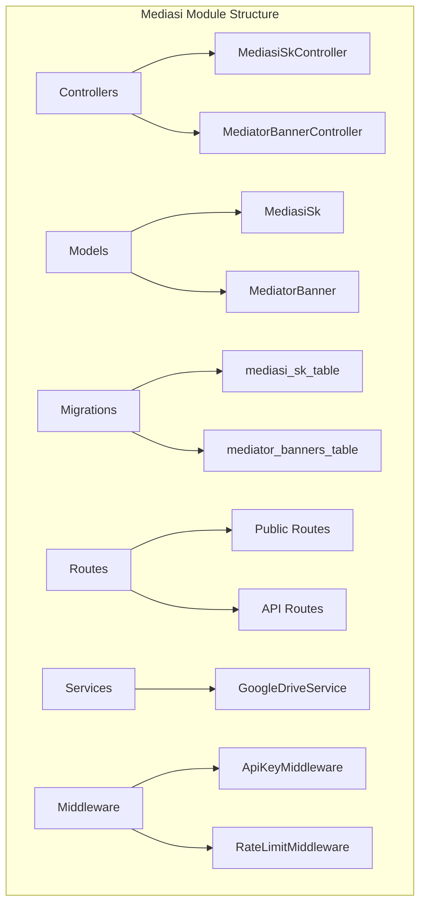
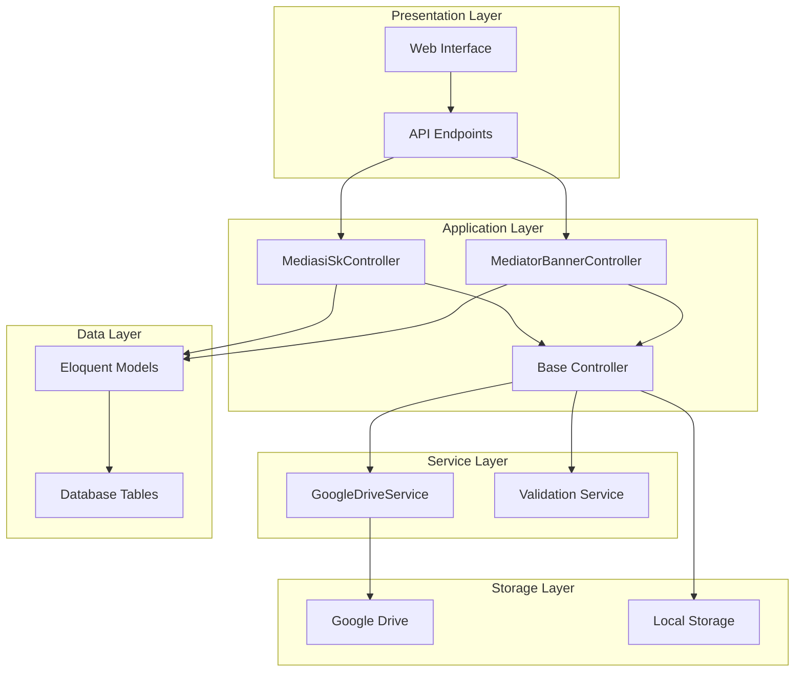
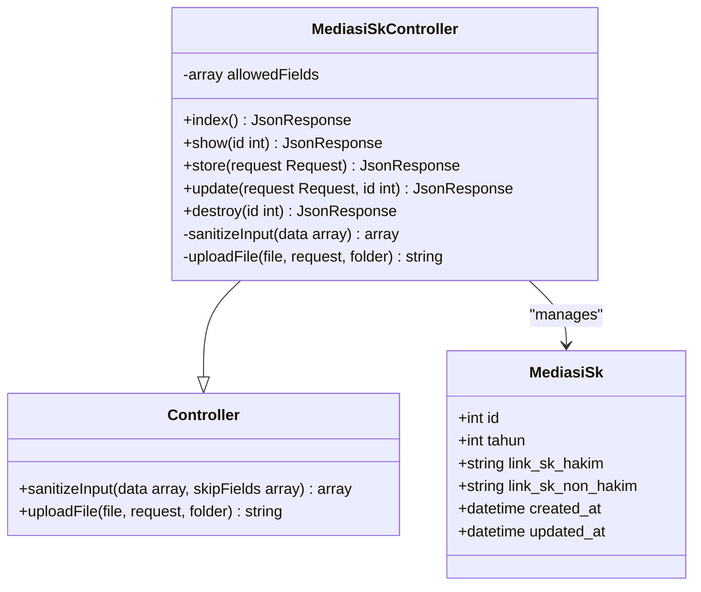
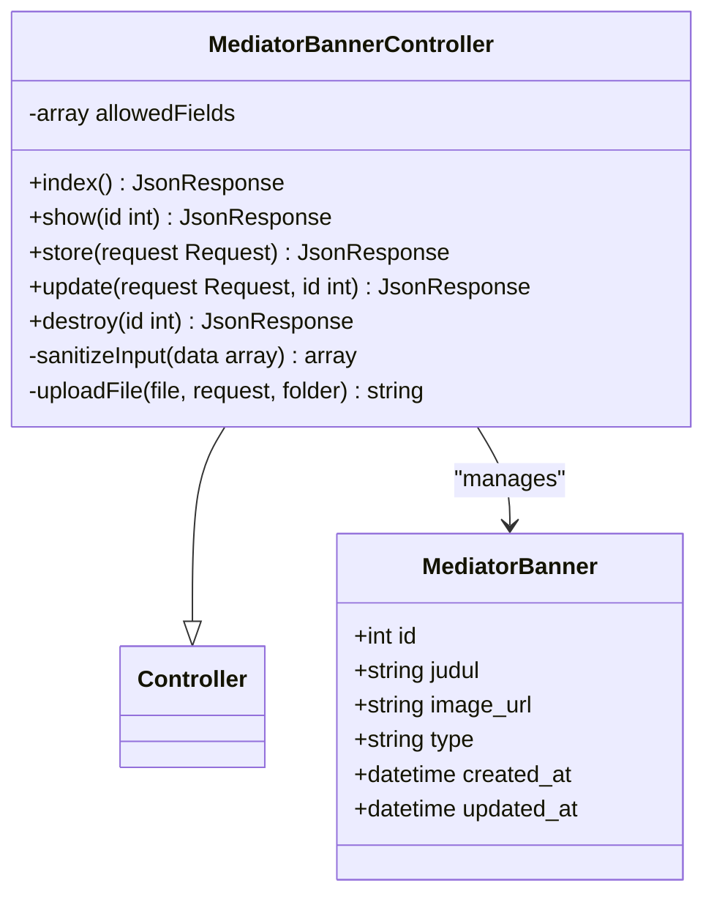
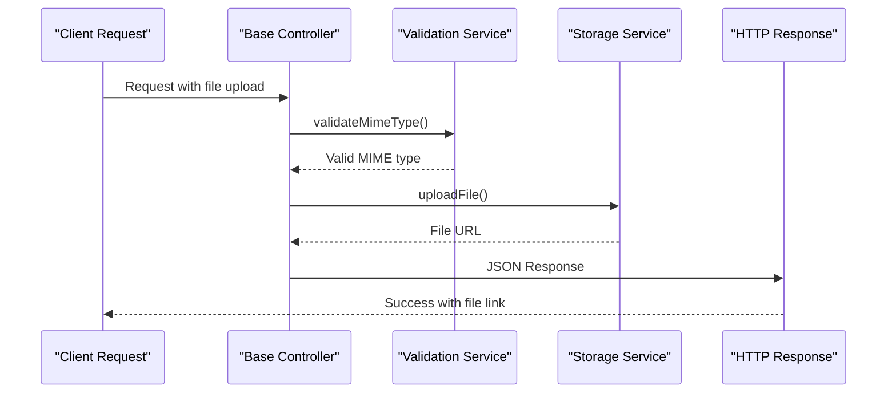
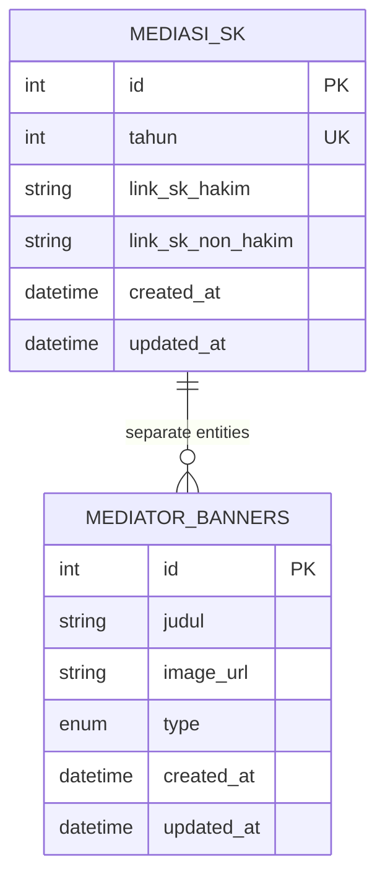
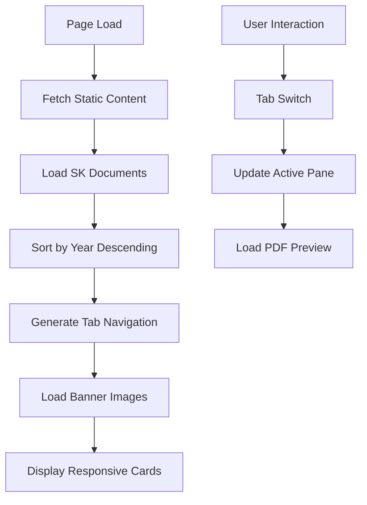

# Mediasi Module

<cite>
**Referenced Files in This Document**
- [MediasiSkController.php](file://app/Http/Controllers/MediasiSkController.php)
- [MediatorBannerController.php](file://app/Http/Controllers/MediatorBannerController.php)
- [MediasiSk.php](file://app/Models/MediasiSk.php)
- [MediatorBanner.php](file://app/Models/MediatorBanner.php)
- [2026_04_05_165903_create_mediasi_sk_table.php](file://database/migrations/2026_04_05_165903_create_mediasi_sk_table.php)
- [2026_04_05_165903_create_mediator_banners_table.php](file://database/migrations/2026_04_05_165903_create_mediator_banners_table.php)
- [MediasiSeeder.php](file://database/seeders/MediasiSeeder.php)
- [web.php](file://routes/web.php)
- [Controller.php](file://app/Http/Controllers/Controller.php)
- [GoogleDriveService.php](file://app/Services/GoogleDriveService.php)
- [ApiKeyMiddleware.php](file://app/Http/Middleware/ApiKeyMiddleware.php)
- [RateLimitMiddleware.php](file://app/Http/Middleware/RateLimitMiddleware.php)
- [mediasi-integration.html](file://docs/mediasi-integration.html)
</cite>

## Table of Contents
1. [Introduction](#introduction)
2. [Project Structure](#project-structure)
3. [Core Components](#core-components)
4. [Architecture Overview](#architecture-overview)
5. [Detailed Component Analysis](#detailed-component-analysis)
6. [API Endpoints](#api-endpoints)
7. [Data Models](#data-models)
8. [Security Implementation](#security-implementation)
9. [Integration with Frontend](#integration-with-frontend)
10. [Performance Considerations](#performance-considerations)
11. [Troubleshooting Guide](#troubleshooting-guide)
12. [Conclusion](#conclusion)

## Introduction

The Mediasi Module is a comprehensive content management system designed to handle mediation-related documents and promotional materials for the Penajam Law Court. This module manages two primary types of content: Mediation Decree Documents (SK Mediasi) and Mediator Banner Images. The system provides a complete CRUD (Create, Read, Update, Delete) interface for administrators while offering a seamless public interface for end-users to access mediation-related information.

The module serves as a bridge between the court's administrative systems and public information dissemination, featuring secure document management, flexible content organization, and robust security measures. It supports both Google Drive integration for cloud storage and local file storage as fallback mechanisms.

## Project Structure

The Mediasi Module follows Laravel's MVC architecture pattern with clear separation of concerns:

**Diagram sources**
- [MediasiSkController.php:1-147](file://app/Http/Controllers/MediasiSkController.php#L1-L147)
- [MediatorBannerController.php:1-134](file://app/Http/Controllers/MediatorBannerController.php#L1-L134)
- [MediasiSk.php:1-23](file://app/Models/MediasiSk.php#L1-L23)
- [MediatorBanner.php:1-22](file://app/Models/MediatorBanner.php#L1-L22)

**Section sources**
- [MediasiSkController.php:1-147](file://app/Http/Controllers/MediasiSkController.php#L1-L147)
- [MediatorBannerController.php:1-134](file://app/Http/Controllers/MediatorBannerController.php#L1-L134)
- [web.php:77-82](file://routes/web.php#L77-L82)

## Core Components

The Mediasi Module consists of four primary components working together to provide comprehensive mediation content management:

### 1. MediasiSkController
Handles all operations related to mediation decree documents, including PDF document management and year-based organization.

### 2. MediatorBannerController  
Manages promotional banner images for mediator programs, supporting both hakim (judge) and non-hakim (non-judge) categories.

### 3. Shared Base Controller
Provides common functionality including input sanitization, file upload capabilities, and security measures used by both controllers.

### 4. Google Drive Service
Enables cloud-based file storage with automatic organization and fallback to local storage when cloud services are unavailable.

**Section sources**
- [MediasiSkController.php:9-147](file://app/Http/Controllers/MediasiSkController.php#L9-L147)
- [MediatorBannerController.php:9-134](file://app/Http/Controllers/MediatorBannerController.php#L9-L134)
- [Controller.php:18-95](file://app/Http/Controllers/Controller.php#L18-L95)
- [GoogleDriveService.php:9-117](file://app/Services/GoogleDriveService.php#L9-L117)

## Architecture Overview

The Mediasi Module implements a layered architecture with clear separation between presentation, business logic, and data persistence:

**Diagram sources**
- [MediasiSkController.php:1-147](file://app/Http/Controllers/MediasiSkController.php#L1-L147)
- [MediatorBannerController.php:1-134](file://app/Http/Controllers/MediatorBannerController.php#L1-L134)
- [Controller.php:1-97](file://app/Http/Controllers/Controller.php#L1-L97)
- [GoogleDriveService.php:1-117](file://app/Services/GoogleDriveService.php#L1-L117)

## Detailed Component Analysis

### MediasiSkController Analysis

The MediasiSkController serves as the primary interface for managing mediation decree documents. It implements comprehensive CRUD operations with advanced validation and file handling capabilities.

**Diagram sources**
- [MediasiSkController.php:9-147](file://app/Http/Controllers/MediasiSkController.php#L9-L147)
- [Controller.php:18-95](file://app/Http/Controllers/Controller.php#L18-L95)
- [MediasiSk.php:7-22](file://app/Models/MediasiSk.php#L7-L22)

#### Key Features:
- **Document Management**: Handles PDF uploads for both hakim and non-hakim mediator positions
- **Year-Based Organization**: Ensures unique year entries with automatic sorting
- **Flexible File Handling**: Supports both Google Drive and local storage
- **Advanced Validation**: Comprehensive input validation with custom rules

**Section sources**
- [MediasiSkController.php:11-82](file://app/Http/Controllers/MediasiSkController.php#L11-L82)
- [MediasiSkController.php:87-124](file://app/Http/Controllers/MediasiSkController.php#L87-L124)

### MediatorBannerController Analysis

The MediatorBannerController manages promotional banner images for mediator programs, supporting category-based organization and flexible image handling.

**Diagram sources**
- [MediatorBannerController.php:9-134](file://app/Http/Controllers/MediatorBannerController.php#L9-L134)
- [MediatorBanner.php:7-21](file://app/Models/MediatorBanner.php#L7-L21)

#### Key Features:
- **Category Management**: Supports hakim and non-hakim categorization
- **Image Optimization**: Handles various image formats with size limitations
- **Flexible Content**: Allows both external URLs and uploaded images
- **Responsive Design Support**: Optimized for various display contexts

**Section sources**
- [MediatorBannerController.php:11-75](file://app/Http/Controllers/MediatorBannerController.php#L11-L75)
- [MediatorBannerController.php:80-111](file://app/Http/Controllers/MediatorBannerController.php#L80-L111)

### Base Controller Functionality

The shared base controller provides essential security and utility functions used across both Mediasi controllers.

**Diagram sources**
- [Controller.php:40-95](file://app/Http/Controllers/Controller.php#L40-L95)

**Section sources**
- [Controller.php:18-95](file://app/Http/Controllers/Controller.php#L18-L95)

## API Endpoints

The Mediasi Module exposes a comprehensive set of RESTful endpoints for content management:

### Public Endpoints (Read-Only)
| Endpoint | Method | Description | Authentication |
|----------|--------|-------------|----------------|
| `/mediasi-sk` | GET | List all mediation decree documents | None |
| `/mediasi-sk/{id}` | GET | Get specific decree document | None |
| `/mediator-banners` | GET | List all mediator banners | None |
| `/mediator-banners/{id}` | GET | Get specific banner | None |

### Protected Endpoints (Admin Access Required)
| Endpoint | Method | Description | Authentication |
|----------|--------|-------------|----------------|
| `/api/mediasi-sk` | POST | Create new decree document | API Key |
| `/api/mediasi-sk/{id}` | PUT | Update existing document | API Key |
| `/api/mediator-banners` | POST | Create new banner | API Key |
| `/api/mediator-banners/{id}` | PUT | Update existing banner | API Key |
| `/api/mediasi-sk/{id}` | DELETE | Remove decree document | API Key |
| `/api/mediator-banners/{id}` | DELETE | Remove banner | API Key |

**Section sources**
- [web.php:77-82](file://routes/web.php#L77-L82)
- [web.php:171-181](file://routes/web.php#L171-L181)

## Data Models

The Mediasi Module utilizes two primary Eloquent models for data persistence:

### MediasiSk Model
Represents mediation decree documents with comprehensive validation and casting:

**Diagram sources**
- [MediasiSk.php:7-22](file://app/Models/MediasiSk.php#L7-L22)
- [MediatorBanner.php:7-21](file://app/Models/MediatorBanner.php#L7-L21)

### Database Schema Details

#### mediasi_sk Table
- **Unique Year Constraint**: Prevents duplicate entries for the same year
- **Nullable Document Links**: Supports partial document availability
- **Timestamp Tracking**: Automatic creation and modification timestamps

#### mediator_banners Table  
- **Enum Type Validation**: Ensures valid category values (hakim/non-hakim)
- **Flexible Image Sources**: Supports both external URLs and uploaded files
- **Title Length Limits**: Prevents excessively long banner titles

**Section sources**
- [2026_04_05_165903_create_mediasi_sk_table.php:14-20](file://database/migrations/2026_04_05_165903_create_mediasi_sk_table.php#L14-L20)
- [2026_04_05_165903_create_mediator_banners_table.php:14-19](file://database/migrations/2026_04_05_165903_create_mediator_banners_table.php#L14-L19)

## Security Implementation

The Mediasi Module implements comprehensive security measures across multiple layers:

### Authentication & Authorization
- **API Key Middleware**: Protects all write operations with configurable API keys
- **Timing-Safe Comparison**: Prevents timing attack vulnerabilities
- **Random Delays**: Mitigates brute force attempts

### Rate Limiting
- **Public Endpoints**: 100 requests per minute per IP
- **Protected Endpoints**: 30 requests per minute per IP
- **Smart Caching**: Uses Redis when available, falls back to file cache

### Input Validation & Sanitization
- **XSS Prevention**: Automatic stripping of HTML tags from input
- **MIME Type Verification**: Validates file content, not just extensions
- **File Size Limits**: Prevents resource exhaustion attacks

### File Upload Security
- **Cloud Storage First**: Attempts Google Drive upload before local fallback
- **Content Validation**: Verifies file authenticity before processing
- **Secure Naming**: Randomized filenames prevent directory traversal

**Section sources**
- [ApiKeyMiddleware.php:14-39](file://app/Http/Middleware/ApiKeyMiddleware.php#L14-L39)
- [RateLimitMiddleware.php:15-48](file://app/Http/Middleware/RateLimitMiddleware.php#L15-L48)
- [Controller.php:40-95](file://app/Http/Controllers/Controller.php#L40-L95)

## Integration with Frontend

The Mediasi Module seamlessly integrates with the frontend through a sophisticated JavaScript-based content management system:

### Dynamic Content Loading
The frontend implementation features intelligent content loading and organization:

**Diagram sources**
- [mediasi-integration.html:260-341](file://docs/mediasi-integration.html#L260-L341)

### Document URL Processing
The frontend includes sophisticated URL processing for different document sources:

- **Google Drive Integration**: Automatic conversion to embeddable previews
- **Local Storage Support**: Direct linking to uploaded files
- **URL Normalization**: Consistent handling of various URL formats

### Responsive Design Features
- **Mobile Optimization**: Touch-friendly tab navigation
- **Progressive Enhancement**: Graceful degradation for older browsers
- **Accessibility Support**: Proper ARIA labels and semantic markup

**Section sources**
- [mediasi-integration.html:207-391](file://docs/mediasi-integration.html#L207-L391)

## Performance Considerations

The Mediasi Module is designed with several performance optimization strategies:

### Database Optimization
- **Indexing Strategy**: Unique constraints on year fields for fast lookups
- **Query Optimization**: Efficient ordering and filtering operations
- **Connection Pooling**: Leverages Laravel's optimized database connections

### File Storage Optimization
- **CDN Integration**: Google Drive links support global CDN distribution
- **Lazy Loading**: PDF previews loaded only when tabs are activated
- **Image Compression**: Automatic optimization for banner images

### Caching Strategy
- **Response Caching**: Public endpoints benefit from framework-level caching
- **Rate Limit State**: Efficient in-memory or Redis-based rate limiting
- **Static Asset Delivery**: Optimized for CDN distribution

## Troubleshooting Guide

### Common Issues and Solutions

#### File Upload Failures
**Symptoms**: Uploads rejected with MIME type errors
**Causes**: Invalid file types or corrupted files
**Solutions**: 
- Verify file extensions match content type
- Check file size limits (PDF: 20MB, Images: 5MB)
- Ensure proper MIME type detection

#### API Authentication Errors
**Symptoms**: 401 Unauthorized responses
**Causes**: Missing or invalid API keys
**Solutions**:
- Verify X-API-Key header is present
- Check API key configuration in environment
- Ensure key meets minimum length requirements

#### Database Connection Issues
**Symptoms**: Application errors during CRUD operations
**Causes**: Database connectivity or migration issues
**Solutions**:
- Verify database credentials in .env file
- Run pending migrations: `php artisan migrate`
- Check database user permissions

#### Frontend Integration Problems
**Symptoms**: Blank content or loading failures
**Causes**: Network issues or CORS restrictions
**Solutions**:
- Verify API endpoint accessibility
- Check CORS configuration for frontend domain
- Inspect browser console for JavaScript errors

**Section sources**
- [Controller.php:54-60](file://app/Http/Controllers/Controller.php#L54-L60)
- [ApiKeyMiddleware.php:28-36](file://app/Http/Middleware/ApiKeyMiddleware.php#L28-L36)

## Conclusion

The Mediasi Module represents a comprehensive solution for managing mediation-related content within the Penajam Law Court ecosystem. Its architecture demonstrates best practices in modern web development, combining security, scalability, and user experience considerations.

Key strengths of the implementation include:

- **Robust Security**: Multi-layered protection against common web vulnerabilities
- **Flexible Storage**: Cloud-first approach with reliable local fallback
- **Developer-Friendly**: Clean code structure with comprehensive documentation
- **User Experience**: Responsive design with intuitive content organization
- **Maintainability**: Clear separation of concerns and modular architecture

The module successfully bridges the gap between administrative content management and public information access, providing a foundation for future enhancements and expansions. Its implementation serves as an excellent example of how modern PHP frameworks can be leveraged to build secure, scalable, and maintainable web applications.