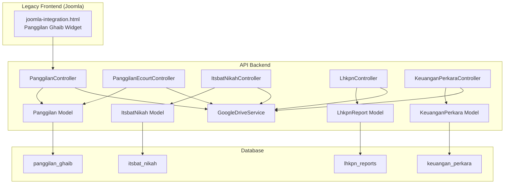
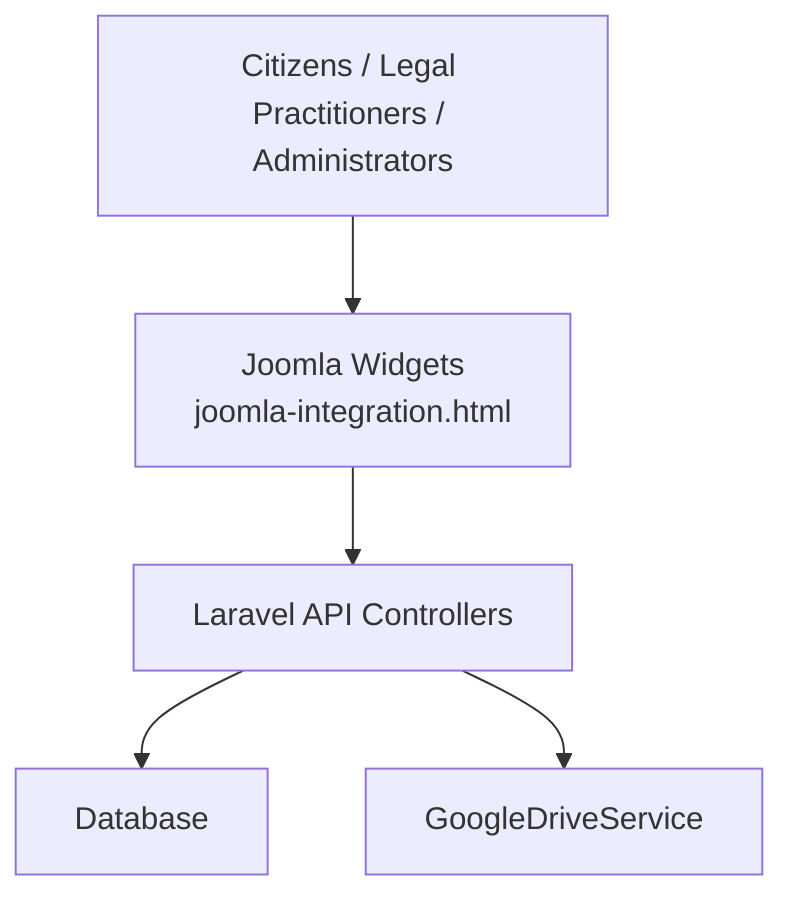
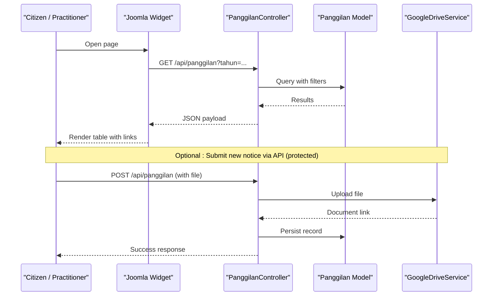
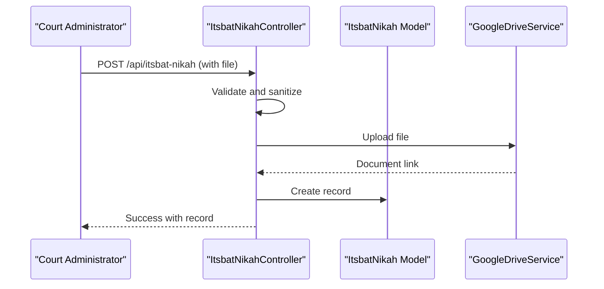
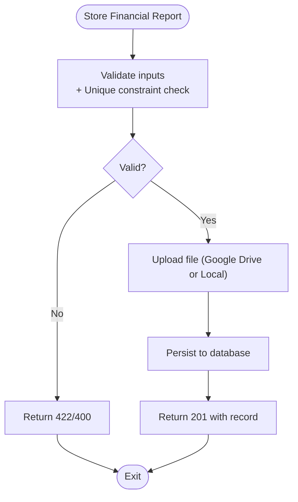
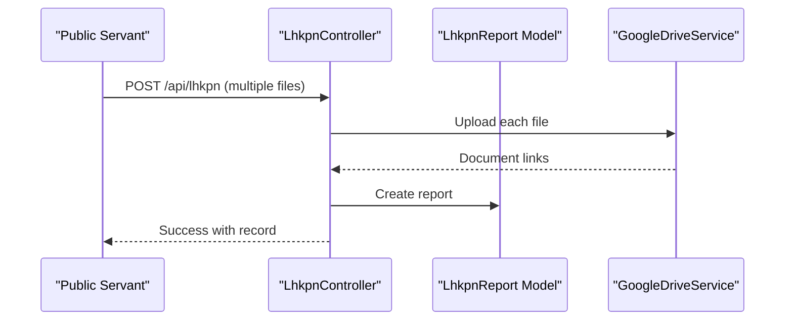
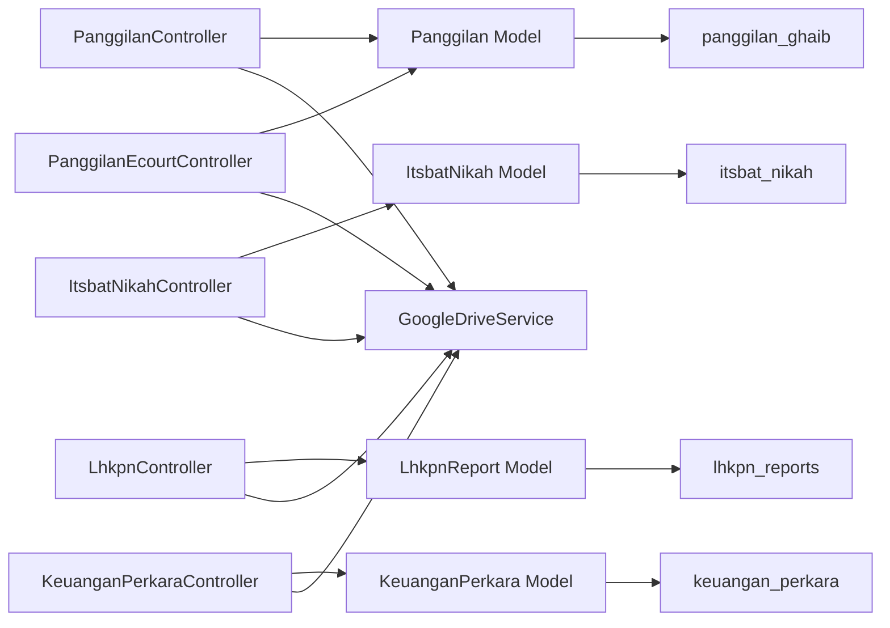

# Business Domain and Use Cases

<cite>
**Referenced Files in This Document**
- [PanggilanController.php](file://app/Http/Controllers/PanggilanController.php)
- [PanggilanEcourtController.php](file://app/Http/Controllers/PanggilanEcourtController.php)
- [ItsbatNikahController.php](file://app/Http/Controllers/ItsbatNikahController.php)
- [LhkpnController.php](file://app/Http/Controllers/LhkpnController.php)
- [KeuanganPerkaraController.php](file://app/Http/Controllers/KeuanganPerkaraController.php)
- [Panggilan.php](file://app/Models/Panggilan.php)
- [ItsbatNikah.php](file://app/Models/ItsbatNikah.php)
- [LhkpnReport.php](file://app/Models/LhkpnReport.php)
- [KeuanganPerkara.php](file://app/Models/KeuanganPerkara.php)
- [GoogleDriveService.php](file://app/Services/GoogleDriveService.php)
- [2026_01_21_000001_create_panggilan_ghaib_table.php](file://database/migrations/2026_01_21_000001_create_panggilan_ghaib_table.php)
- [2026_01_21_000003_create_itsbat_nikah_table.php](file://database/migrations/2026_01_21_000003_create_itsbat_nikah_table.php)
- [2026_02_02_162040_create_lhkpn_reports_table.php](file://database/migrations/2026_02_02_162040_create_lhkpn_reports_table.php)
- [2026_04_01_000000_create_keuangan_perkara_table.php](file://database/migrations/2026_04_01_000000_create_keuangan_perkara_table.php)
- [joomla-integration.html](file://docs/joomla-integration.html)
</cite>

## Table of Contents
1. [Introduction](#introduction)
2. [Project Structure](#project-structure)
3. [Core Components](#core-components)
4. [Architecture Overview](#architecture-overview)
5. [Detailed Component Analysis](#detailed-component-analysis)
6. [Dependency Analysis](#dependency-analysis)
7. [Performance Considerations](#performance-considerations)
8. [Troubleshooting Guide](#troubleshooting-guide)
9. [Conclusion](#conclusion)
10. [Appendices](#appendices)

## Introduction
This document describes the business domain and use cases for the court management system serving the Penajam Paser Utara District Court. It focuses on five core business processes:
- Legal case notifications (Panggilan Ghaib)
- Marriage certificate processing (Itsbat Nikah)
- Budget execution tracking (Keuangan Perkara)
- Asset declarations (LHKPN)
- Administrative reporting

It also documents the integration with legacy systems via Joomla-based frontends and the transition toward modern API-driven operations. Operational workflows covered include case management, document submission, financial reporting, and inter-agency coordination. Stakeholder perspectives are included for court administrators, legal practitioners, and citizens accessing public services. Finally, the business requirements that drive the API design—digital transformation, transparency, and operational efficiency—are explained.

## Project Structure
The system is implemented as a Laravel-based API backend with controllers per module, Eloquent models, database migrations, and a Google Drive integration service for document storage. Legacy integration is supported through static HTML snippets embedded in Joomla pages that consume the API.

**Diagram sources**
- [joomla-integration.html](file://docs/joomla-integration.html)
- [PanggilanController.php](file://app/Http/Controllers/PanggilanController.php)
- [PanggilanEcourtController.php](file://app/Http/Controllers/PanggilanEcourtController.php)
- [ItsbatNikahController.php](file://app/Http/Controllers/ItsbatNikahController.php)
- [LhkpnController.php](file://app/Http/Controllers/LhkpnController.php)
- [KeuanganPerkaraController.php](file://app/Http/Controllers/KeuanganPerkaraController.php)
- [GoogleDriveService.php](file://app/Services/GoogleDriveService.php)
- [Panggilan.php](file://app/Models/Panggilan.php)
- [ItsbatNikah.php](file://app/Models/ItsbatNikah.php)
- [LhkpnReport.php](file://app/Models/LhkpnReport.php)
- [KeuanganPerkara.php](file://app/Models/KeuanganPerkara.php)
- [2026_01_21_000001_create_panggilan_ghaib_table.php](file://database/migrations/2026_01_21_000001_create_panggilan_ghaib_table.php)
- [2026_01_21_000003_create_itsbat_nikah_table.php](file://database/migrations/2026_01_21_000003_create_itsbat_nikah_table.php)
- [2026_02_02_162040_create_lhkpn_reports_table.php](file://database/migrations/2026_02_02_162040_create_lhkpn_reports_table.php)
- [2026_04_01_000000_create_keuangan_perkara_table.php](file://database/migrations/2026_04_01_000000_create_keuangan_perkara_table.php)

**Section sources**
- [joomla-integration.html](file://docs/joomla-integration.html)
- [PanggilanController.php](file://app/Http/Controllers/PanggilanController.php)
- [ItsbatNikahController.php](file://app/Http/Controllers/ItsbatNikahController.php)
- [LhkpnController.php](file://app/Http/Controllers/LhkpnController.php)
- [KeuanganPerkaraController.php](file://app/Http/Controllers/KeuanganPerkaraController.php)
- [GoogleDriveService.php](file://app/Services/GoogleDriveService.php)

## Core Components
This section outlines the five core business domains and their primary responsibilities.

- Legal case notifications (Panggilan Ghaib)
  - Tracks notices for absent defendants and related case dates.
  - Supports public read access and protected write operations via API keys.
  - Integrates document uploads with Google Drive or local fallback.

- Marriage certificate processing (Itsbat Nikah)
  - Manages marriage announcement and hearing records.
  - Provides search by keyword across key identifiers and names.
  - Supports document upload with Google Drive or local fallback.

- Budget execution tracking (Keuangan Perkara)
  - Records monthly financial summaries for court operations.
  - Prevents duplicate entries per year/month.
  - Allows document upload for detailed reports.

- Asset declarations (LHKPN)
  - Stores annual asset and income disclosure reports.
  - Supports filtering by year and report type.
  - Provides structured ordering aligned with organizational hierarchy.

- Administrative reporting
  - Provides a foundation for cross-cutting reporting across modules.
  - Enables integration with legacy frontends for citizen-facing displays.

**Section sources**
- [PanggilanController.php](file://app/Http/Controllers/PanggilanController.php)
- [PanggilanEcourtController.php](file://app/Http/Controllers/PanggilanEcourtController.php)
- [ItsbatNikahController.php](file://app/Http/Controllers/ItsbatNikahController.php)
- [LhkpnController.php](file://app/Http/Controllers/LhkpnController.php)
- [KeuanganPerkaraController.php](file://app/Http/Controllers/KeuanganPerkaraController.php)

## Architecture Overview
The system follows a layered architecture:
- Presentation layer: Legacy Joomla widgets embed API calls to display public data.
- API layer: REST-like controllers expose endpoints for CRUD operations with validation and rate-limiting middleware.
- Domain layer: Controllers orchestrate requests, validate inputs, sanitize data, and manage file uploads.
- Persistence layer: Eloquent models map to database tables created by migrations.
- Integration layer: Google Drive service provides cloud storage with local fallback.

**Diagram sources**
- [joomla-integration.html](file://docs/joomla-integration.html)
- [PanggilanController.php](file://app/Http/Controllers/PanggilanController.php)
- [GoogleDriveService.php](file://app/Services/GoogleDriveService.php)

**Section sources**
- [joomla-integration.html](file://docs/joomla-integration.html)
- [PanggilanController.php](file://app/Http/Controllers/PanggilanController.php)
- [GoogleDriveService.php](file://app/Services/GoogleDriveService.php)

## Detailed Component Analysis

### Legal Case Notifications (Panggilan Ghaib)
- Purpose: Manage notices for absent defendants, track notice dates, and publish supporting documents.
- Public read access: List all records or filtered by year; paginated results.
- Protected write access: Requires API key; strict validation and sanitization; supports file upload with dual storage (Google Drive or local).
- Data model: Includes year, case number, defendant name, addresses, notice dates, hearing date, representative identifier, document link, and notes.
- Legacy integration: A Joomla widget consumes the public endpoint to render a searchable, paginated table.

**Diagram sources**
- [joomla-integration.html](file://docs/joomla-integration.html)
- [PanggilanController.php](file://app/Http/Controllers/PanggilanController.php)
- [Panggilan.php](file://app/Models/Panggilan.php)
- [GoogleDriveService.php](file://app/Services/GoogleDriveService.php)

**Section sources**
- [PanggilanController.php](file://app/Http/Controllers/PanggilanController.php)
- [Panggilan.php](file://app/Models/Panggilan.php)
- [2026_01_21_000001_create_panggilan_ghaib_table.php](file://database/migrations/2026_01_21_000001_create_panggilan_ghaib_table.php)
- [joomla-integration.html](file://docs/joomla-integration.html)

### Marriage Certificate Processing (Itsbat Nikah)
- Purpose: Record marriage announcements and hearings, support keyword search across case numbers and names.
- Public read access: Paginated listing with optional year filter and keyword search.
- Protected write access: Validation ensures uniqueness of case numbers; supports file upload with dual storage.
- Data model: Case number, petitioner names, announcement and hearing dates, document link, and year.

**Diagram sources**
- [ItsbatNikahController.php](file://app/Http/Controllers/ItsbatNikahController.php)
- [ItsbatNikah.php](file://app/Models/ItsbatNikah.php)
- [2026_01_21_000003_create_itsbat_nikah_table.php](file://database/migrations/2026_01_21_000003_create_itsbat_nikah_table.php)
- [GoogleDriveService.php](file://app/Services/GoogleDriveService.php)

**Section sources**
- [ItsbatNikahController.php](file://app/Http/Controllers/ItsbatNikahController.php)
- [ItsbatNikah.php](file://app/Models/ItsbatNikah.php)
- [2026_01_21_000003_create_itsbat_nikah_table.php](file://database/migrations/2026_01_21_000003_create_itsbat_nikah_table.php)

### Budget Execution Tracking (Keuangan Perkara)
- Purpose: Monthly financial summaries for court operations, preventing duplicates per year/month.
- Public read access: List by year or all, ordered by year descending and month ascending.
- Protected write access: Validation for numeric fields and optional file upload; supports dual storage.
- Data model: Year, month, opening balance, receipts, expenditures, and document URL.

**Diagram sources**
- [KeuanganPerkaraController.php](file://app/Http/Controllers/KeuanganPerkaraController.php)
- [KeuanganPerkara.php](file://app/Models/KeuanganPerkara.php)
- [2026_04_01_000000_create_keuangan_perkara_table.php](file://database/migrations/2026_04_01_000000_create_keuangan_perkara_table.php)
- [GoogleDriveService.php](file://app/Services/GoogleDriveService.php)

**Section sources**
- [KeuanganPerkaraController.php](file://app/Http/Controllers/KeuanganPerkaraController.php)
- [KeuanganPerkara.php](file://app/Models/KeuanganPerkara.php)
- [2026_04_01_000000_create_keuangan_perkara_table.php](file://database/migrations/2026_04_01_000000_create_keuangan_perkara_table.php)

### Asset Declarations (LHKPN)
- Purpose: Store annual asset and income disclosure reports with hierarchical ordering.
- Public read access: Filter by year and report type; keyword search by name or NIP; ordered by year, role hierarchy, and name.
- Protected write access: Validation for required fields and optional multiple file uploads; supports dual storage.

**Diagram sources**
- [LhkpnController.php](file://app/Http/Controllers/LhkpnController.php)
- [LhkpnReport.php](file://app/Models/LhkpnReport.php)
- [2026_02_02_162040_create_lhkpn_reports_table.php](file://database/migrations/2026_02_02_162040_create_lhkpn_reports_table.php)
- [GoogleDriveService.php](file://app/Services/GoogleDriveService.php)

**Section sources**
- [LhkpnController.php](file://app/Http/Controllers/LhkpnController.php)
- [LhkpnReport.php](file://app/Models/LhkpnReport.php)
- [2026_02_02_162040_create_lhkpn_reports_table.php](file://database/migrations/2026_02_02_162040_create_lhkpn_reports_table.php)

### Administrative Reporting
- Purpose: Provide consolidated views across modules for internal reporting and transparency.
- Mechanism: Public endpoints enable aggregation and filtering; legacy frontends embed these endpoints for citizen-facing dashboards.

[No sources needed since this section synthesizes previously analyzed components]

## Dependency Analysis
- Controllers depend on Eloquent models for persistence and on GoogleDriveService for document storage.
- Migrations define normalized schemas with appropriate indexes for performance.
- Legacy integration depends on stable public endpoints and consistent JSON payloads.

**Diagram sources**
- [PanggilanController.php](file://app/Http/Controllers/PanggilanController.php)
- [PanggilanEcourtController.php](file://app/Http/Controllers/PanggilanEcourtController.php)
- [ItsbatNikahController.php](file://app/Http/Controllers/ItsbatNikahController.php)
- [LhkpnController.php](file://app/Http/Controllers/LhkpnController.php)
- [KeuanganPerkaraController.php](file://app/Http/Controllers/KeuanganPerkaraController.php)
- [Panggilan.php](file://app/Models/Panggilan.php)
- [ItsbatNikah.php](file://app/Models/ItsbatNikah.php)
- [LhkpnReport.php](file://app/Models/LhkpnReport.php)
- [KeuanganPerkara.php](file://app/Models/KeuanganPerkara.php)
- [GoogleDriveService.php](file://app/Services/GoogleDriveService.php)
- [2026_01_21_000001_create_panggilan_ghaib_table.php](file://database/migrations/2026_01_21_000001_create_panggilan_ghaib_table.php)
- [2026_01_21_000003_create_itsbat_nikah_table.php](file://database/migrations/2026_01_21_000003_create_itsbat_nikah_table.php)
- [2026_02_02_162040_create_lhkpn_reports_table.php](file://database/migrations/2026_02_02_162040_create_lhkpn_reports_table.php)
- [2026_04_01_000000_create_keuangan_perkara_table.php](file://database/migrations/2026_04_01_000000_create_keuangan_perkara_table.php)

**Section sources**
- [PanggilanController.php](file://app/Http/Controllers/PanggilanController.php)
- [PanggilanEcourtController.php](file://app/Http/Controllers/PanggilanEcourtController.php)
- [ItsbatNikahController.php](file://app/Http/Controllers/ItsbatNikahController.php)
- [LhkpnController.php](file://app/Http/Controllers/LhkpnController.php)
- [KeuanganPerkaraController.php](file://app/Http/Controllers/KeuanganPerkaraController.php)
- [GoogleDriveService.php](file://app/Services/GoogleDriveService.php)

## Performance Considerations
- Pagination and limits: Controllers enforce safe defaults and caps to prevent memory exhaustion.
- Indexes: Migrations define indexes on frequently queried columns (case numbers, years, names) to improve search performance.
- File storage: Dual storage strategy (cloud and local) ensures resilience; avoid unnecessary re-uploads by validating existing links.
- Ordering: Consistent sorting (by latest creation date, year-month) improves user experience and reduces client-side sorting overhead.

[No sources needed since this section provides general guidance]

## Troubleshooting Guide
- Authentication and authorization
  - Protected endpoints require API keys; ensure clients include the required header or mechanism.
- Validation errors
  - Strict validation returns 422 for malformed inputs; review request payloads against controller rules.
- Duplicate entries
  - Financial reports prevent duplicate year-month combinations; adjust inputs accordingly.
- File upload failures
  - Google Drive failures automatically fall back to local storage; confirm local permissions and disk space.
- Legacy frontend connectivity
  - Verify API URLs and CORS settings; ensure endpoints remain stable for embedded widgets.

**Section sources**
- [PanggilanController.php](file://app/Http/Controllers/PanggilanController.php)
- [ItsbatNikahController.php](file://app/Http/Controllers/ItsbatNikahController.php)
- [LhkpnController.php](file://app/Http/Controllers/LhkpnController.php)
- [KeuanganPerkaraController.php](file://app/Http/Controllers/KeuanganPerkaraController.php)
- [joomla-integration.html](file://docs/joomla-integration.html)

## Conclusion
The court management system modernizes operations by exposing standardized APIs for legal case notifications, marriage certificates, budget execution, asset declarations, and administrative reporting. It preserves access via legacy Joomla frontends while enabling future digital transformation. The design emphasizes transparency, efficiency, and resilience through robust validation, secure file handling, and consistent data models.

[No sources needed since this section summarizes without analyzing specific files]

## Appendices

### Use Cases and Stakeholders
- Court administrators
  - Maintain records, validate submissions, coordinate document storage, and monitor system health.
- Legal practitioners
  - Access case-related information, submit updates, and retrieve supporting documents.
- Citizens
  - View public notices and decisions through embedded frontends; receive timely notifications.

[No sources needed since this section provides general guidance]