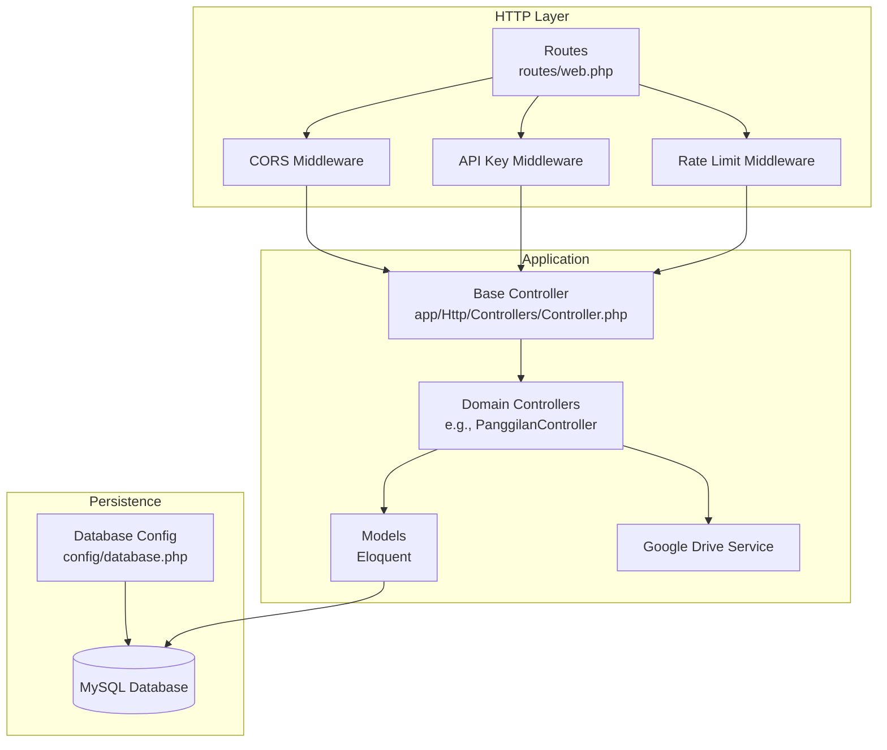
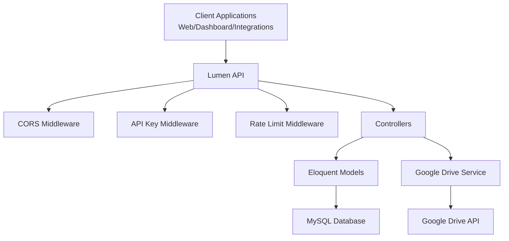
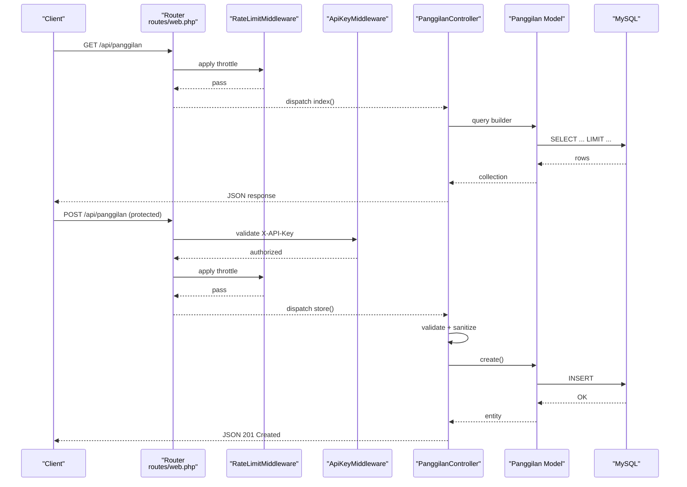
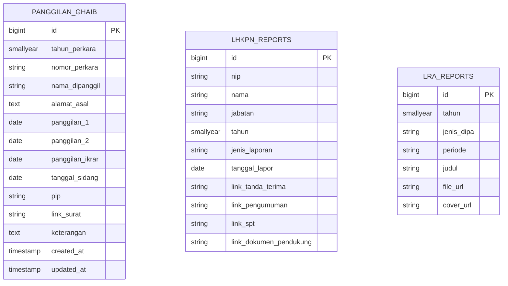
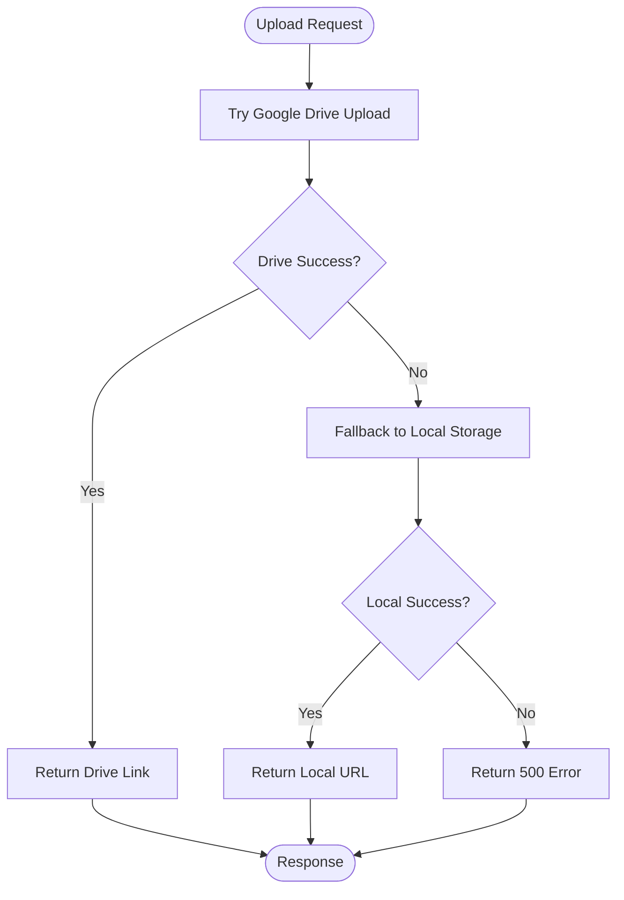
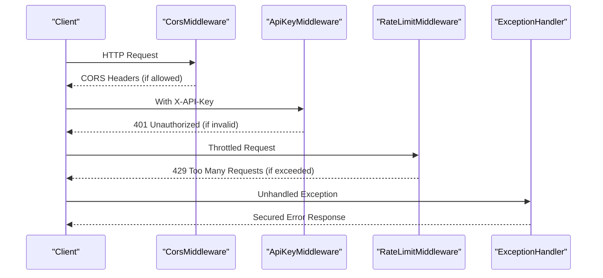
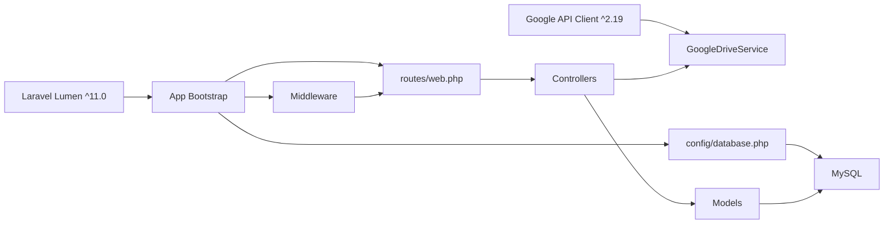

# Project Overview

<cite>
**Referenced Files in This Document**
- [composer.json](file://composer.json)
- [routes/web.php](file://routes/web.php)
- [bootstrap/app.php](file://bootstrap/app.php)
- [app/Http/Middleware/ApiKeyMiddleware.php](file://app/Http/Middleware/ApiKeyMiddleware.php)
- [app/Http/Middleware/CorsMiddleware.php](file://app/Http/Middleware/CorsMiddleware.php)
- [app/Http/Middleware/RateLimitMiddleware.php](file://app/Http/Middleware/RateLimitMiddleware.php)
- [app/Exceptions/Handler.php](file://app/Exceptions/Handler.php)
- [app/Http/Controllers/Controller.php](file://app/Http/Controllers/Controller.php)
- [app/Http/Controllers/PanggilanController.php](file://app/Http/Controllers/PanggilanController.php)
- [app/Services/GoogleDriveService.php](file://app/Services/GoogleDriveService.php)
- [app/Models/Panggilan.php](file://app/Models/Panggilan.php)
- [app/Models/LhkpnReport.php](file://app/Models/LhkpnReport.php)
- [app/Models/LraReport.php](file://app/Models/LraReport.php)
- [database/migrations/2026_01_21_000001_create_panggilan_ghaib_table.php](file://database/migrations/2026_01_21_000001_create_panggilan_ghaib_table.php)
- [config/database.php](file://config/database.php)
</cite>

## Table of Contents
1. [Introduction](#introduction)
2. [Project Structure](#project-structure)
3. [Core Components](#core-components)
4. [Architecture Overview](#architecture-overview)
5. [Detailed Component Analysis](#detailed-component-analysis)
6. [Dependency Analysis](#dependency-analysis)
7. [Performance Considerations](#performance-considerations)
8. [Troubleshooting Guide](#troubleshooting-guide)
9. [Conclusion](#conclusion)

## Introduction
This project is a RESTful API backend built with Laravel Lumen Framework ^11.0 to support digital court operations at the Penajam Paser Utara District Court. It manages court case notifications, legal proceedings, and administrative documentation under the "Panggilan Ghaib" domain and integrates related modules such as "Itsbat Nikah", "LHKPN Reports", and financial/admin reports. The API exposes 165 endpoints across 12 functional modules, with a clear separation between public read-only endpoints and protected CRUD endpoints that require API key authentication.

The system emphasizes security-first design with CORS whitelisting, strict rate limiting, API key validation, and sanitized input handling. It also provides a dual storage mechanism for uploaded documents: cloud via Google Drive and local fallback, ensuring resilience and compliance with court data governance.

## Project Structure
The backend follows a compact Lumen MVC layout optimized for API services:
- Routing: Centralized in routes/web.php with two groups: public read-only endpoints and protected CRUD endpoints.
- Controllers: Each module has a dedicated controller extending a shared base controller for common utilities.
- Models: Eloquent models mapped to database tables for each domain (e.g., Panggilan, LHKPN Reports, LRA Reports).
- Middleware: Global CORS, API key validation, and rate limiting applied at route level.
- Services: Google Drive integration for document uploads with automatic daily folder organization.
- Configuration: Database connection and environment-driven settings.

**Diagram sources**
- [routes/web.php:1-165](file://routes/web.php#L1-L165)
- [bootstrap/app.php:21-30](file://bootstrap/app.php#L21-L30)
- [app/Http/Controllers/Controller.php:1-97](file://app/Http/Controllers/Controller.php#L1-L97)
- [app/Services/GoogleDriveService.php:1-117](file://app/Services/GoogleDriveService.php#L1-L117)
- [config/database.php:1-30](file://config/database.php#L1-L30)

**Section sources**
- [routes/web.php:1-165](file://routes/web.php#L1-L165)
- [bootstrap/app.php:1-55](file://bootstrap/app.php#L1-L55)
- [composer.json:1-47](file://composer.json#L1-L47)

## Core Components
- Technology Stack
  - Framework: Laravel Lumen ^11.0
  - HTTP Client: Google API Client ^2.19
  - PHP Runtime: ^8.1
- Middleware Pipeline
  - CORS: Strict origin whitelisting with security headers
  - API Key: Header-based validation with timing-safe comparison
  - Rate Limit: Per-IP caching-based throttling
- MVC Pattern
  - Base Controller provides input sanitization and file upload utilities
  - Domain Controllers implement index/show/byYear/store/update/destroy
  - Models define fillable attributes, casts, and output formatting
- Dual Storage System
  - Cloud: Google Drive with daily subfolders and public read permissions
  - Local: Fallback storage with randomized filenames and controlled paths

**Section sources**
- [composer.json:11-14](file://composer.json#L11-L14)
- [bootstrap/app.php:21-30](file://bootstrap/app.php#L21-L30)
- [app/Http/Controllers/Controller.php:18-95](file://app/Http/Controllers/Controller.php#L18-L95)
- [app/Services/GoogleDriveService.php:38-82](file://app/Services/GoogleDriveService.php#L38-L82)

## Architecture Overview
The API employs a layered architecture:
- Presentation: HTTP endpoints grouped by public and protected access
- Application: Controllers orchestrate validation, sanitization, persistence, and file handling
- Domain Models: Eloquent models encapsulate table schemas and data casting
- Infrastructure: Google Drive service and database configuration

**Diagram sources**
- [routes/web.php:13-164](file://routes/web.php#L13-L164)
- [app/Http/Middleware/CorsMiddleware.php:14-62](file://app/Http/Middleware/CorsMiddleware.php#L14-L62)
- [app/Http/Middleware/ApiKeyMiddleware.php:14-39](file://app/Http/Middleware/ApiKeyMiddleware.php#L14-L39)
- [app/Http/Middleware/RateLimitMiddleware.php:15-39](file://app/Http/Middleware/RateLimitMiddleware.php#L15-L39)
- [app/Services/GoogleDriveService.php:14-22](file://app/Services/GoogleDriveService.php#L14-L22)
- [config/database.php:7-25](file://config/database.php#L7-L25)

## Detailed Component Analysis

### Public vs Protected Endpoints
- Public Endpoints (prefix api under throttle:100,1)
  - Read-only access to all 12 modules
  - Examples: GET /api/panggilan, GET /api/itsbat/{id}, GET /api/lhkpn, GET /api/lra
- Protected Endpoints (prefix api under api.key + throttle:100,1)
  - Full CRUD for all 12 modules
  - Examples: POST /api/panggilan, PUT|DELETE /api/panggilan/{id}, POST|PUT|DELETE /api/lhkpn/{id}

**Diagram sources**
- [routes/web.php:14-164](file://routes/web.php#L14-L164)
- [app/Http/Middleware/RateLimitMiddleware.php:15-39](file://app/Http/Middleware/RateLimitMiddleware.php#L15-L39)
- [app/Http/Middleware/ApiKeyMiddleware.php:14-39](file://app/Http/Middleware/ApiKeyMiddleware.php#L14-L39)
- [app/Http/Controllers/PanggilanController.php:31-198](file://app/Http/Controllers/PanggilanController.php#L31-L198)
- [app/Models/Panggilan.php:7-32](file://app/Models/Panggilan.php#L7-L32)
- [config/database.php:7-25](file://config/database.php#L7-L25)

**Section sources**
- [routes/web.php:13-164](file://routes/web.php#L13-L164)
- [app/Http/Middleware/ApiKeyMiddleware.php:14-39](file://app/Http/Middleware/ApiKeyMiddleware.php#L14-L39)
- [app/Http/Middleware/RateLimitMiddleware.php:15-39](file://app/Http/Middleware/RateLimitMiddleware.php#L15-L39)

### Data Models and Persistence
- Panggilan Ghaib
  - Table: panggilan_ghaib
  - Fields include year, case number, names, dates, and document links
  - Indexes on year and case number for efficient queries
- LHKPN Reports
  - Table: lhkpn_reports
  - Fields for NIP, name, position, reporting year, and multiple document links
- LRA Reports
  - Table: lra_reports
  - Fields for year, budget type, period, title, and URLs for file and cover

**Diagram sources**
- [database/migrations/2026_01_21_000001_create_panggilan_ghaib_table.php:13-31](file://database/migrations/2026_01_21_000001_create_panggilan_ghaib_table.php#L13-L31)
- [app/Models/LhkpnReport.php:9-27](file://app/Models/LhkpnReport.php#L9-L27)
- [app/Models/LraReport.php:8-22](file://app/Models/LraReport.php#L8-L22)

**Section sources**
- [database/migrations/2026_01_21_000001_create_panggilan_ghaib_table.php:11-31](file://database/migrations/2026_01_21_000001_create_panggilan_ghaib_table.php#L11-L31)
- [app/Models/LhkpnReport.php:7-27](file://app/Models/LhkpnReport.php#L7-L27)
- [app/Models/LraReport.php:7-23](file://app/Models/LraReport.php#L7-L23)

### File Upload and Storage Strategy
- Google Drive Integration
  - Daily subfolder organization by date (YYYY-MM-DD)
  - Public read permission granted on uploaded files
  - Fallback to local storage if Google Drive is unavailable
- Local Fallback
  - Randomized filename generation
  - Controlled destination path under public/uploads
- Base Controller Utilities
  - Input sanitization and MIME-type validation for uploads
  - Shared upload method with error logging

**Diagram sources**
- [app/Services/GoogleDriveService.php:38-82](file://app/Services/GoogleDriveService.php#L38-L82)
- [app/Http/Controllers/Controller.php:40-95](file://app/Http/Controllers/Controller.php#L40-L95)
- [app/Http/Controllers/PanggilanController.php:139-189](file://app/Http/Controllers/PanggilanController.php#L139-L189)

**Section sources**
- [app/Services/GoogleDriveService.php:14-115](file://app/Services/GoogleDriveService.php#L14-L115)
- [app/Http/Controllers/Controller.php:18-95](file://app/Http/Controllers/Controller.php#L18-L95)
- [app/Http/Controllers/PanggilanController.php:115-198](file://app/Http/Controllers/PanggilanController.php#L115-L198)

### Security Controls
- CORS
  - Origin whitelisting with trusted domains per environment
  - Security headers included on all responses
- API Key
  - Header-based validation with constant-time comparison
  - Randomized delay to mitigate brute-force attempts
- Rate Limit
  - Per-IP counters with configurable limits and decay windows
- Exception Handling
  - Security headers on error responses
  - Environment-aware error message exposure

**Diagram sources**
- [app/Http/Middleware/CorsMiddleware.php:14-62](file://app/Http/Middleware/CorsMiddleware.php#L14-L62)
- [app/Http/Middleware/ApiKeyMiddleware.php:14-39](file://app/Http/Middleware/ApiKeyMiddleware.php#L14-L39)
- [app/Http/Middleware/RateLimitMiddleware.php:15-39](file://app/Http/Middleware/RateLimitMiddleware.php#L15-L39)
- [app/Exceptions/Handler.php:36-132](file://app/Exceptions/Handler.php#L36-L132)

**Section sources**
- [app/Http/Middleware/CorsMiddleware.php:14-62](file://app/Http/Middleware/CorsMiddleware.php#L14-L62)
- [app/Http/Middleware/ApiKeyMiddleware.php:14-39](file://app/Http/Middleware/ApiKeyMiddleware.php#L14-L39)
- [app/Http/Middleware/RateLimitMiddleware.php:15-39](file://app/Http/Middleware/RateLimitMiddleware.php#L15-L39)
- [app/Exceptions/Handler.php:36-132](file://app/Exceptions/Handler.php#L36-L132)

## Dependency Analysis
- Framework Dependencies
  - laravel/lumen-framework ^11.0 for routing, service container, and HTTP features
  - google/apiclient ^2.19 for Google Drive integration
- Internal Dependencies
  - Controllers depend on Models and Google Drive Service
  - Middleware depends on environment variables and cache
  - Bootstrap wires middleware, providers, and routes

**Diagram sources**
- [composer.json:11-14](file://composer.json#L11-L14)
- [bootstrap/app.php:11-52](file://bootstrap/app.php#L11-L52)
- [app/Services/GoogleDriveService.php:14-22](file://app/Services/GoogleDriveService.php#L14-L22)
- [config/database.php:7-25](file://config/database.php#L7-L25)

**Section sources**
- [composer.json:11-14](file://composer.json#L11-L14)
- [bootstrap/app.php:11-52](file://bootstrap/app.php#L11-L52)
- [config/database.php:5-25](file://config/database.php#L5-L25)

## Performance Considerations
- Pagination and Limits
  - Public endpoints enforce a maximum page size to prevent memory exhaustion
- Rate Limiting
  - Per-IP caching reduces load and mitigates abuse
- Database Indexes
  - Indexes on frequently filtered columns improve query performance
- File Upload Optimization
  - MIME-type verification prevents unnecessary processing
  - Daily folder organization on Google Drive improves retrieval and archival

[No sources needed since this section provides general guidance]

## Troubleshooting Guide
- Authentication Failures
  - Verify X-API-Key header matches configured API key
  - Confirm API key is set in environment variables
- CORS Issues
  - Ensure request Origin is whitelisted
  - Check environment-specific trusted domains
- Rate Limit Exceeded
  - Wait for decay window or reduce request frequency
- Upload Failures
  - Confirm Google Drive credentials and refresh token
  - Validate MIME type and file size constraints
- Database Connectivity
  - Review database host, port, credentials, and socket settings

**Section sources**
- [app/Http/Middleware/ApiKeyMiddleware.php:16-35](file://app/Http/Middleware/ApiKeyMiddleware.php#L16-L35)
- [app/Http/Middleware/CorsMiddleware.php:16-30](file://app/Http/Middleware/CorsMiddleware.php#L16-L30)
- [app/Http/Middleware/RateLimitMiddleware.php:22-28](file://app/Http/Middleware/RateLimitMiddleware.php#L22-L28)
- [app/Services/GoogleDriveService.php:17-21](file://app/Services/GoogleDriveService.php#L17-L21)
- [config/database.php:10-23](file://config/database.php#L10-L23)

## Conclusion
This Lumen API backend delivers a secure, scalable foundation for digital court operations in Penajam Paser Utara District Court. By separating public read-only endpoints from protected CRUD endpoints, enforcing strict CORS and API key policies, and implementing robust rate limiting and input sanitization, the system ensures reliable access to court data while maintaining integrity and compliance. The dual storage strategy for documents further strengthens operational continuity, enabling seamless integration with internal systems and public portals.