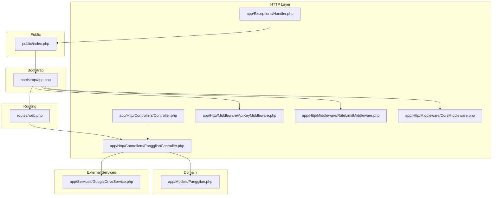
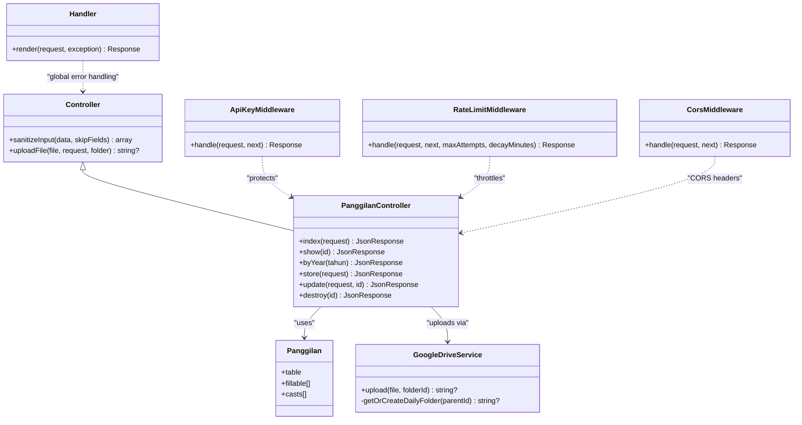
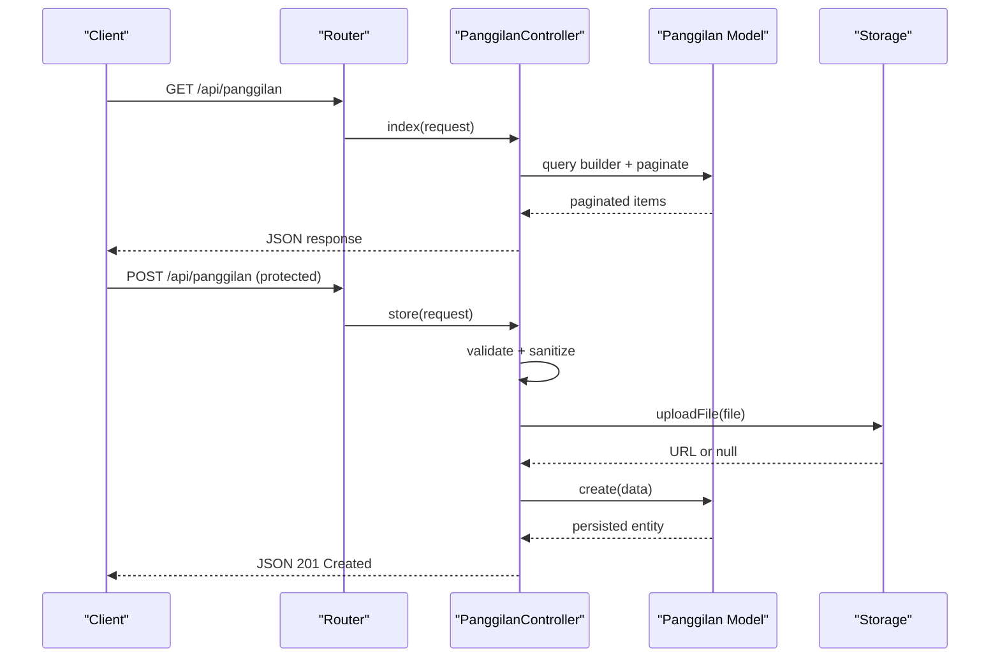
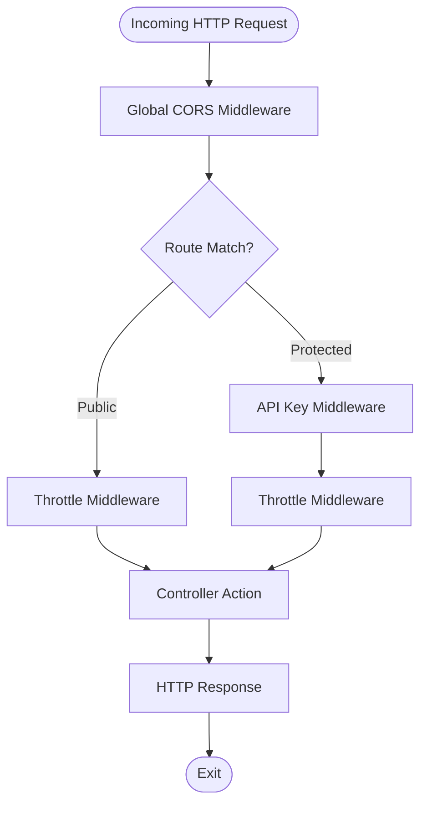
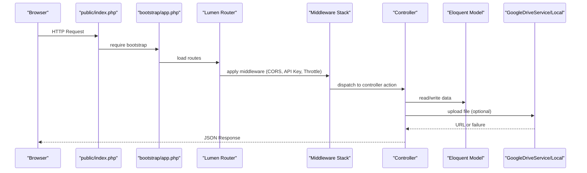
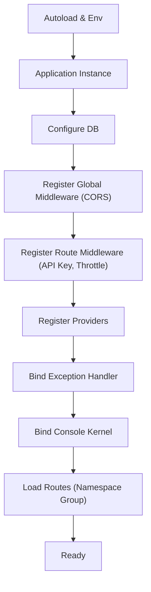
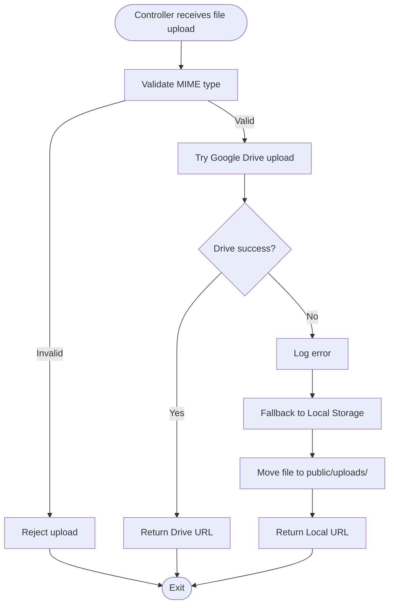
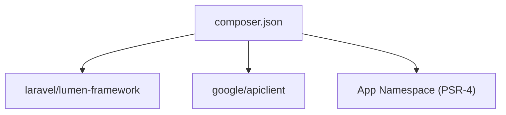

# System Architecture

<cite>
**Referenced Files in This Document**
- [bootstrap/app.php](file://bootstrap/app.php)
- [public/index.php](file://public/index.php)
- [routes/web.php](file://routes/web.php)
- [app/Http/Middleware/ApiKeyMiddleware.php](file://app/Http/Middleware/ApiKeyMiddleware.php)
- [app/Http/Middleware/RateLimitMiddleware.php](file://app/Http/Middleware/RateLimitMiddleware.php)
- [app/Http/Middleware/CorsMiddleware.php](file://app/Http/Middleware/CorsMiddleware.php)
- [app/Exceptions/Handler.php](file://app/Exceptions/Handler.php)
- [app/Http/Controllers/Controller.php](file://app/Http/Controllers/Controller.php)
- [app/Http/Controllers/PanggilanController.php](file://app/Http/Controllers/PanggilanController.php)
- [app/Models/Panggilan.php](file://app/Models/Panggilan.php)
- [app/Services/GoogleDriveService.php](file://app/Services/GoogleDriveService.php)
- [app/Providers/AppServiceProvider.php](file://app/Providers/AppServiceProvider.php)
- [app/Console/Kernel.php](file://app/Console/Kernel.php)
- [composer.json](file://composer.json)
</cite>

## Table of Contents
1. [Introduction](#introduction)
2. [Project Structure](#project-structure)
3. [Core Components](#core-components)
4. [Architecture Overview](#architecture-overview)
5. [Detailed Component Analysis](#detailed-component-analysis)
6. [Dependency Analysis](#dependency-analysis)
7. [Performance Considerations](#performance-considerations)
8. [Troubleshooting Guide](#troubleshooting-guide)
9. [Conclusion](#conclusion)

## Introduction
This document explains the system architecture of the Laravel Lumen microservice backend. It focuses on how the MVC pattern is implemented, how the middleware pipeline secures and throttles requests, and how the request flows from HTTP entrypoint to response. It also documents the application bootstrap process, service provider registration, routing mechanism, and the separation between public read-only endpoints and protected CRUD operations. The dual storage architecture combining Google Drive API and a local filesystem fallback is detailed, along with practical examples of request flows through the system.

## Project Structure
The project follows a layered structure typical of Lumen applications:
- Public entry point: a single-file front controller initializes the framework and runs the application.
- Bootstrap: application initialization, middleware registration, route loading, and service provider registration.
- Routing: centralized route definitions grouped by access level and resource.
- HTTP layer: controllers implementing actions, middleware enforcing security and rate limits, and shared helpers.
- Domain layer: Eloquent models representing database entities.
- Services: external integrations (e.g., Google Drive).
- Configuration and environment: Composer dependencies and autoload configuration.

**Diagram sources**
- [public/index.php:1-19](file://public/index.php#L1-L19)
- [bootstrap/app.php:1-55](file://bootstrap/app.php#L1-L55)
- [routes/web.php:1-165](file://routes/web.php#L1-L165)
- [app/Http/Controllers/Controller.php:1-97](file://app/Http/Controllers/Controller.php#L1-L97)
- [app/Http/Controllers/PanggilanController.php:1-333](file://app/Http/Controllers/PanggilanController.php#L1-L333)
- [app/Http/Middleware/ApiKeyMiddleware.php:1-41](file://app/Http/Middleware/ApiKeyMiddleware.php#L1-L41)
- [app/Http/Middleware/RateLimitMiddleware.php:1-49](file://app/Http/Middleware/RateLimitMiddleware.php#L1-L49)
- [app/Http/Middleware/CorsMiddleware.php:1-64](file://app/Http/Middleware/CorsMiddleware.php#L1-L64)
- [app/Exceptions/Handler.php:1-134](file://app/Exceptions/Handler.php#L1-L134)
- [app/Models/Panggilan.php:1-55](file://app/Models/Panggilan.php#L1-L55)
- [app/Services/GoogleDriveService.php:1-117](file://app/Services/GoogleDriveService.php#L1-L117)

**Section sources**
- [public/index.php:1-19](file://public/index.php#L1-L19)
- [bootstrap/app.php:1-55](file://bootstrap/app.php#L1-L55)
- [routes/web.php:1-165](file://routes/web.php#L1-L165)

## Core Components
- Application bootstrap: registers global and route-specific middleware, loads routes, registers providers, and binds exception handler and console kernel.
- Routing: defines public read-only endpoints under a throttle group and protected CRUD endpoints under combined API key and throttle middleware.
- Middleware:
  - CORS: strict origin whitelisting with security headers.
  - API key: validates a configured key via a timing-safe comparison.
  - Rate limit: per-IP counters with configurable limits and decay windows.
- Controllers: base controller provides input sanitization and dual-storage file upload; resource controllers implement CRUD actions with validation and storage fallback.
- Models: Eloquent models define fillable attributes and value casting/formatting.
- External service: Google Drive integration with daily folder organization and public link generation, with graceful fallback to local storage.

**Section sources**
- [bootstrap/app.php:21-52](file://bootstrap/app.php#L21-L52)
- [routes/web.php:13-164](file://routes/web.php#L13-L164)
- [app/Http/Middleware/CorsMiddleware.php:14-62](file://app/Http/Middleware/CorsMiddleware.php#L14-L62)
- [app/Http/Middleware/ApiKeyMiddleware.php:14-39](file://app/Http/Middleware/ApiKeyMiddleware.php#L14-L39)
- [app/Http/Middleware/RateLimitMiddleware.php:15-39](file://app/Http/Middleware/RateLimitMiddleware.php#L15-L39)
- [app/Http/Controllers/Controller.php:18-95](file://app/Http/Controllers/Controller.php#L18-L95)
- [app/Http/Controllers/PanggilanController.php:114-198](file://app/Http/Controllers/PanggilanController.php#L114-L198)
- [app/Models/Panggilan.php:11-32](file://app/Models/Panggilan.php#L11-L32)
- [app/Services/GoogleDriveService.php:38-82](file://app/Services/GoogleDriveService.php#L38-L82)

## Architecture Overview
The system implements a classic MVC pattern within Lumen:
- Controllers handle HTTP requests and orchestrate model access and response formatting.
- Models encapsulate persistence and data casting/formatting.
- Middleware enforces cross-cutting concerns (CORS, authentication, rate limiting).
- External services (Google Drive) are integrated via dedicated service classes.

**Diagram sources**
- [app/Http/Controllers/Controller.php:7-97](file://app/Http/Controllers/Controller.php#L7-L97)
- [app/Http/Controllers/PanggilanController.php:9-333](file://app/Http/Controllers/PanggilanController.php#L9-L333)
- [app/Models/Panggilan.php:7-55](file://app/Models/Panggilan.php#L7-L55)
- [app/Services/GoogleDriveService.php:9-117](file://app/Services/GoogleDriveService.php#L9-L117)
- [app/Http/Middleware/ApiKeyMiddleware.php:8-41](file://app/Http/Middleware/ApiKeyMiddleware.php#L8-L41)
- [app/Http/Middleware/RateLimitMiddleware.php:9-49](file://app/Http/Middleware/RateLimitMiddleware.php#L9-L49)
- [app/Http/Middleware/CorsMiddleware.php:8-64](file://app/Http/Middleware/CorsMiddleware.php#L8-L64)
- [app/Exceptions/Handler.php:12-134](file://app/Exceptions/Handler.php#L12-L134)

## Detailed Component Analysis

### MVC Pattern Implementation
- Base Controller: Provides shared utilities for input sanitization and file upload with dual storage fallback.
- Resource Controllers: Implement index/show/byYear for read-only public access and store/update/destroy for protected CRUD operations.
- Models: Define table mapping, fillable attributes, and attribute casting/formatting for consistent serialization.

**Diagram sources**
- [routes/web.php:16-76](file://routes/web.php#L16-L76)
- [app/Http/Controllers/PanggilanController.php:31-198](file://app/Http/Controllers/PanggilanController.php#L31-L198)
- [app/Models/Panggilan.php:9-32](file://app/Models/Panggilan.php#L9-L32)
- [app/Http/Controllers/Controller.php:40-95](file://app/Http/Controllers/Controller.php#L40-L95)

**Section sources**
- [app/Http/Controllers/Controller.php:18-95](file://app/Http/Controllers/Controller.php#L18-L95)
- [app/Http/Controllers/PanggilanController.php:31-198](file://app/Http/Controllers/PanggilanController.php#L31-L198)
- [app/Models/Panggilan.php:11-32](file://app/Models/Panggilan.php#L11-L32)

### Middleware Pipeline Design
- Global CORS middleware ensures only trusted origins receive CORS headers and applies strict security headers.
- Route-specific middleware groups:
  - Public read-only endpoints: throttled globally.
  - Protected CRUD endpoints: require API key and throttling.

**Diagram sources**
- [bootstrap/app.php:21-30](file://bootstrap/app.php#L21-L30)
- [routes/web.php:13-164](file://routes/web.php#L13-L164)
- [app/Http/Middleware/CorsMiddleware.php:14-62](file://app/Http/Middleware/CorsMiddleware.php#L14-L62)
- [app/Http/Middleware/ApiKeyMiddleware.php:14-39](file://app/Http/Middleware/ApiKeyMiddleware.php#L14-L39)
- [app/Http/Middleware/RateLimitMiddleware.php:15-39](file://app/Http/Middleware/RateLimitMiddleware.php#L15-L39)

**Section sources**
- [bootstrap/app.php:21-30](file://bootstrap/app.php#L21-L30)
- [routes/web.php:13-164](file://routes/web.php#L13-L164)
- [app/Http/Middleware/CorsMiddleware.php:14-62](file://app/Http/Middleware/CorsMiddleware.php#L14-L62)
- [app/Http/Middleware/ApiKeyMiddleware.php:14-39](file://app/Http/Middleware/ApiKeyMiddleware.php#L14-L39)
- [app/Http/Middleware/RateLimitMiddleware.php:15-39](file://app/Http/Middleware/RateLimitMiddleware.php#L15-L39)

### Request Processing Flow: From HTTP to Response
- Entry point: public/index.php boots the application and runs the framework.
- Bootstrap: bootstrap/app.php configures environment, timezone, facades/Eloquent, database config, global and route middleware, providers, exception handler, console kernel, and loads routes.
- Routing: routes/web.php defines public and protected groups with middleware attached.
- Execution: matched route invokes controller action; middleware enforces CORS, API key, and rate limits; controller interacts with model and optional storage; response is returned.

**Diagram sources**
- [public/index.php:15-18](file://public/index.php#L15-L18)
- [bootstrap/app.php:11-52](file://bootstrap/app.php#L11-L52)
- [routes/web.php:13-164](file://routes/web.php#L13-L164)
- [app/Http/Middleware/CorsMiddleware.php:14-62](file://app/Http/Middleware/CorsMiddleware.php#L14-L62)
- [app/Http/Middleware/ApiKeyMiddleware.php:14-39](file://app/Http/Middleware/ApiKeyMiddleware.php#L14-L39)
- [app/Http/Middleware/RateLimitMiddleware.php:15-39](file://app/Http/Middleware/RateLimitMiddleware.php#L15-L39)
- [app/Http/Controllers/PanggilanController.php:31-198](file://app/Http/Controllers/PanggilanController.php#L31-L198)
- [app/Services/GoogleDriveService.php:38-82](file://app/Services/GoogleDriveService.php#L38-L82)

**Section sources**
- [public/index.php:15-18](file://public/index.php#L15-L18)
- [bootstrap/app.php:11-52](file://bootstrap/app.php#L11-L52)
- [routes/web.php:13-164](file://routes/web.php#L13-L164)

### Application Bootstrap Process
- Autoload and environment variables are loaded.
- Application instance is created with facades and Eloquent enabled.
- Database configuration is loaded from .env.
- Global middleware (CORS) and route middleware (API key, throttle) are registered.
- Service providers are registered.
- Exception handler and console kernel are bound.
- Routes are loaded within a namespace group.

**Diagram sources**
- [bootstrap/app.php:5-52](file://bootstrap/app.php#L5-L52)

**Section sources**
- [bootstrap/app.php:5-52](file://bootstrap/app.php#L5-L52)

### Service Provider Registration
- AppServiceProvider is registered during bootstrap to allow future application-wide bindings if needed.

**Section sources**
- [bootstrap/app.php:33-33](file://bootstrap/app.php#L33-L33)
- [app/Providers/AppServiceProvider.php:12-15](file://app/Providers/AppServiceProvider.php#L12-L15)

### Routing Mechanism
- Public read-only endpoints: GET endpoints under /api prefixed routes with a throttle group.
- Protected CRUD endpoints: POST/PUT/DELETE endpoints under /api with combined API key and throttle middleware.
- Controllers are resolved by name within the App\Http\Controllers namespace.

**Section sources**
- [routes/web.php:13-164](file://routes/web.php#L13-L164)
- [bootstrap/app.php:48-52](file://bootstrap/app.php#L48-L52)

### Separation Between Public Read-Only and Protected CRUD
- Public endpoints: throttled globally; no authentication required; designed for read-only access.
- Protected endpoints: require API key and throttling; support create, update, delete operations.
- Security enforcement:
  - API key middleware validates a server-side configured key using a timing-safe comparison and introduces a randomized delay on failure.
  - Rate limit middleware tracks attempts per IP and returns standardized headers and retry-after guidance.
  - CORS middleware whitelists trusted origins and denies others.

**Section sources**
- [routes/web.php:13-164](file://routes/web.php#L13-L164)
- [app/Http/Middleware/ApiKeyMiddleware.php:14-39](file://app/Http/Middleware/ApiKeyMiddleware.php#L14-L39)
- [app/Http/Middleware/RateLimitMiddleware.php:15-39](file://app/Http/Middleware/RateLimitMiddleware.php#L15-L39)
- [app/Http/Middleware/CorsMiddleware.php:14-62](file://app/Http/Middleware/CorsMiddleware.php#L14-L62)

### Dual Storage Architecture: Google Drive API and Local Filesystem Fallback
- Base controller’s upload method:
  - Validates uploaded file MIME type against allowed types.
  - Attempts Google Drive upload first; on failure, logs and falls back to local storage.
  - Generates a public URL for successful uploads.
- Google Drive service:
  - Initializes Google API client with credentials and refresh token.
  - Creates or finds a daily subfolder and uploads the file.
  - Sets public reader permission and returns a web view link.
- Fallback to local storage:
  - Generates a random filename, moves the file to public/uploads/<folder>, and returns a URL derived from the request root.

**Diagram sources**
- [app/Http/Controllers/Controller.php:40-95](file://app/Http/Controllers/Controller.php#L40-L95)
- [app/Services/GoogleDriveService.php:38-82](file://app/Services/GoogleDriveService.php#L38-L82)

**Section sources**
- [app/Http/Controllers/Controller.php:40-95](file://app/Http/Controllers/Controller.php#L40-L95)
- [app/Services/GoogleDriveService.php:38-82](file://app/Services/GoogleDriveService.php#L38-L82)

### Practical Examples of Request Flow
- Public read-only request:
  - Client calls GET /api/panggilan with no API key.
  - Request passes CORS and throttle middleware, hits PanggilanController@index, queries the model, paginates results, and returns JSON.
- Protected CRUD request:
  - Client calls POST /api/panggilan with X-API-Key header.
  - Request passes CORS → API key → throttle → controller action.
  - Controller validates input, sanitizes text fields, optionally uploads file to Google Drive or local storage, persists model, and returns JSON with 201 Created.

**Section sources**
- [routes/web.php:16-76](file://routes/web.php#L16-L76)
- [routes/web.php:79-164](file://routes/web.php#L79-L164)
- [app/Http/Middleware/ApiKeyMiddleware.php:14-39](file://app/Http/Middleware/ApiKeyMiddleware.php#L14-L39)
- [app/Http/Middleware/RateLimitMiddleware.php:15-39](file://app/Http/Middleware/RateLimitMiddleware.php#L15-L39)
- [app/Http/Controllers/PanggilanController.php:31-198](file://app/Http/Controllers/PanggilanController.php#L31-L198)

## Dependency Analysis
- Framework and third-party dependencies are declared in composer.json, including the Lumen framework and Google API client.
- Autoload configuration maps PSR-4 namespaces to app/, database/, and tests/.

**Diagram sources**
- [composer.json:11-27](file://composer.json#L11-L27)

**Section sources**
- [composer.json:11-27](file://composer.json#L11-L27)

## Performance Considerations
- Throttling: The rate limiter increments counters and sets response headers; consider Redis-backed caching for distributed environments to avoid file-based cache limitations.
- File uploads: MIME validation prevents malicious content; dual storage reduces downtime risk but adds latency—monitor Drive availability and fallback performance.
- Pagination: Controllers cap page sizes to prevent memory exhaustion; maintain this guardrail across all endpoints.
- CORS: Origin whitelisting avoids wildcard usage and reduces cross-origin risks.

## Troubleshooting Guide
- API key failures:
  - Ensure the API key environment variable is set and matches the request header.
  - The middleware introduces a randomized delay on invalid keys to mitigate brute-force attempts.
- Rate limit exceeded:
  - Observe Retry-After header and X-RateLimit-* headers; reduce request frequency or adjust limits.
- CORS blocked:
  - Verify the Origin header is in the allowed origins list; preflight OPTIONS requests are handled explicitly.
- Unhandled exceptions:
  - The exception handler attaches security headers and returns sanitized responses; in production, detailed messages are hidden while logs capture error metadata.

**Section sources**
- [app/Http/Middleware/ApiKeyMiddleware.php:14-39](file://app/Http/Middleware/ApiKeyMiddleware.php#L14-L39)
- [app/Http/Middleware/RateLimitMiddleware.php:15-39](file://app/Http/Middleware/RateLimitMiddleware.php#L15-L39)
- [app/Http/Middleware/CorsMiddleware.php:14-62](file://app/Http/Middleware/CorsMiddleware.php#L14-L62)
- [app/Exceptions/Handler.php:36-132](file://app/Exceptions/Handler.php#L36-L132)

## Conclusion
The system employs a clean Lumen architecture with explicit separation of concerns. The MVC pattern is evident in controllers orchestrating models and responses, while middleware enforces CORS, authentication, and rate limiting. Public endpoints remain read-only and throttled, while protected endpoints require API key validation and throttling. The dual storage strategy ensures resilience by uploading to Google Drive with a robust local fallback. The documented request flows and component relationships provide a clear blueprint for extending functionality and maintaining security and reliability.