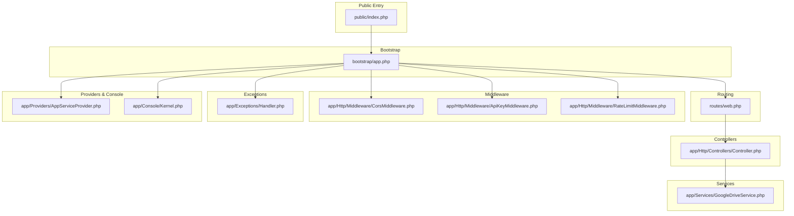
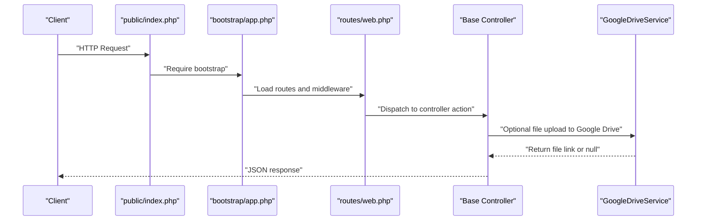
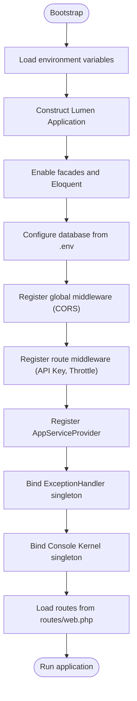
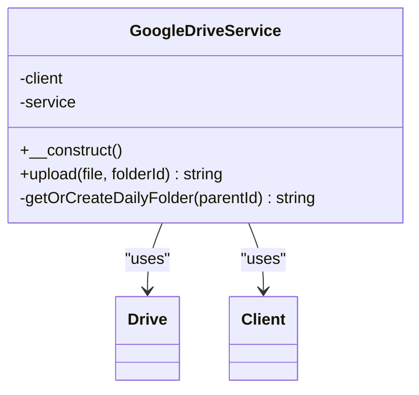
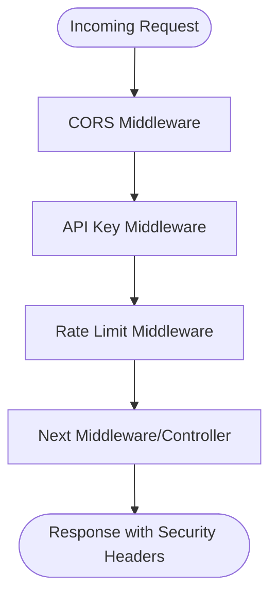
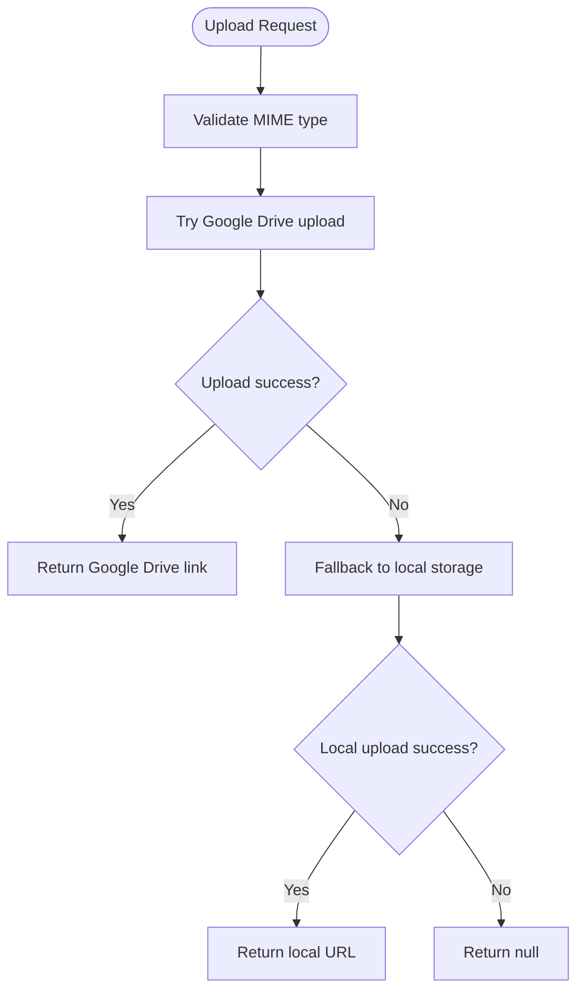
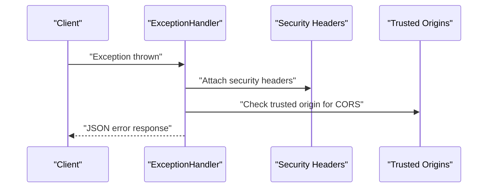
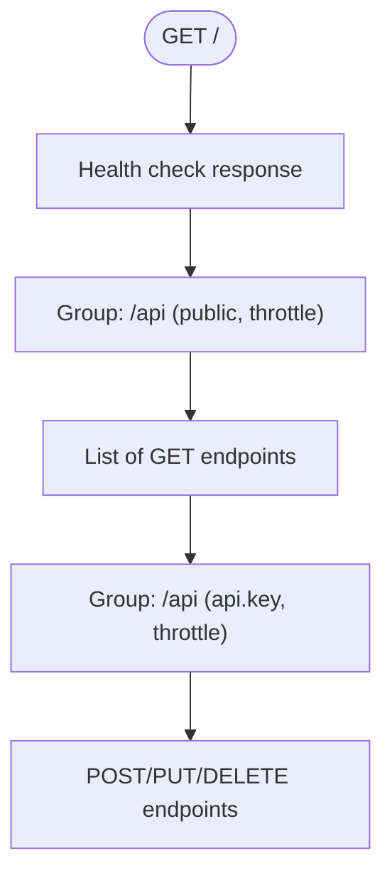
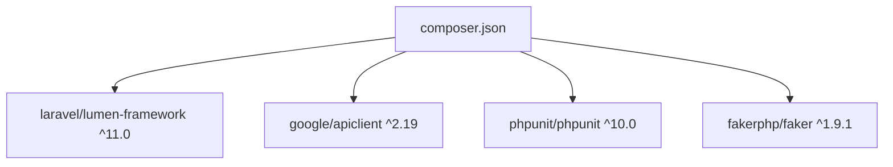

# Technology Stack and Dependencies

<cite>
**Referenced Files in This Document**
- [composer.json](file://composer.json)
- [bootstrap/app.php](file://bootstrap/app.php)
- [public/index.php](file://public/index.php)
- [routes/web.php](file://routes/web.php)
- [app/Services/GoogleDriveService.php](file://app/Services/GoogleDriveService.php)
- [app/Http/Middleware/ApiKeyMiddleware.php](file://app/Http/Middleware/ApiKeyMiddleware.php)
- [app/Http/Middleware/CorsMiddleware.php](file://app/Http/Middleware/CorsMiddleware.php)
- [app/Http/Middleware/RateLimitMiddleware.php](file://app/Http/Middleware/RateLimitMiddleware.php)
- [app/Exceptions/Handler.php](file://app/Exceptions/Handler.php)
- [app/Http/Controllers/Controller.php](file://app/Http/Controllers/Controller.php)
- [app/Console/Kernel.php](file://app/Console/Kernel.php)
- [app/Providers/AppServiceProvider.php](file://app/Providers/AppServiceProvider.php)
</cite>

## Table of Contents
1. [Introduction](#introduction)
2. [Project Structure](#project-structure)
3. [Core Components](#core-components)
4. [Architecture Overview](#architecture-overview)
5. [Detailed Component Analysis](#detailed-component-analysis)
6. [Dependency Analysis](#dependency-analysis)
7. [Performance Considerations](#performance-considerations)
8. [Troubleshooting Guide](#troubleshooting-guide)
9. [Conclusion](#conclusion)

## Introduction
This document describes the technology stack and dependencies that power the Lumen API backend. It focuses on the Laravel Lumen Framework ^11.0 as the microservice foundation, Google API Client ^2.19 for cloud storage integration, and supporting libraries including PHPUnit ^10.0 for testing and FakerPHP ^1.9.1 for development utilities. It also explains PHP version requirements, Composer dependency management, and package autoloading configuration, along with the roles of each dependency in the system architecture, such as how Google Drive API enables document management and how Laravel components provide routing, middleware, and service container functionality. Finally, it outlines installation prerequisites and compatibility requirements for deployment environments.

## Project Structure
The Lumen application follows a conventional structure with a clear separation of concerns:
- Bootstrap and entry point: The application boots via the bootstrap loader and runs through the public entry point.
- Routing: Routes are defined centrally and grouped with middleware for security and rate limiting.
- Controllers: Base controller provides shared utilities for input sanitization and file upload.
- Services: A dedicated service encapsulates Google Drive integration for document management.
- Middleware: Security middleware for CORS, API key validation, and rate limiting.
- Providers and Console: Service providers and console kernel for application lifecycle.
- Configuration: Environment-driven configuration for database and middleware registration.

**Diagram sources**
- [public/index.php:1-19](file://public/index.php#L1-L19)
- [bootstrap/app.php:1-55](file://bootstrap/app.php#L1-L55)
- [routes/web.php:1-165](file://routes/web.php#L1-L165)
- [app/Http/Controllers/Controller.php:1-97](file://app/Http/Controllers/Controller.php#L1-L97)
- [app/Services/GoogleDriveService.php:1-117](file://app/Services/GoogleDriveService.php#L1-L117)
- [app/Http/Middleware/CorsMiddleware.php:1-64](file://app/Http/Middleware/CorsMiddleware.php#L1-L64)
- [app/Http/Middleware/ApiKeyMiddleware.php:1-41](file://app/Http/Middleware/ApiKeyMiddleware.php#L1-L41)
- [app/Http/Middleware/RateLimitMiddleware.php:1-49](file://app/Http/Middleware/RateLimitMiddleware.php#L1-L49)
- [app/Exceptions/Handler.php:1-134](file://app/Exceptions/Handler.php#L1-L134)
- [app/Providers/AppServiceProvider.php:1-17](file://app/Providers/AppServiceProvider.php#L1-L17)
- [app/Console/Kernel.php:1-27](file://app/Console/Kernel.php#L1-L27)

**Section sources**
- [public/index.php:1-19](file://public/index.php#L1-L19)
- [bootstrap/app.php:1-55](file://bootstrap/app.php#L1-L55)
- [routes/web.php:1-165](file://routes/web.php#L1-L165)

## Core Components
This section documents the core technologies and their roles in the system.

- Laravel Lumen Framework ^11.0
  - Role: Microservice foundation providing routing, middleware, service container, and console capabilities.
  - Evidence: Application bootstrapping, route groups, middleware registration, and console kernel are configured in the bootstrap and routes files.

- Google API Client ^2.19
  - Role: Enables integration with Google Drive for document management, including upload, folder organization by date, and permission management.
  - Evidence: Dedicated service class initializes the Google client, authenticates via refresh token, and performs file uploads and folder creation.

- PHPUnit ^10.0
  - Role: Testing framework for unit and feature tests.
  - Evidence: Declared in dev dependencies for local and CI testing workflows.

- FakerPHP ^1.9.1
  - Role: Development utilities for generating fake data during testing and seeding.
  - Evidence: Declared in dev dependencies for test data generation.

- PHP Version Requirement
  - Requirement: PHP ^8.1 as defined in the project’s Composer configuration.
  - Evidence: PHP version constraint in the root composer manifest.

- Composer Dependency Management and Autoloading
  - Composer manages production and development dependencies, PSR-4 autoloading for application namespaces, and optimized autoload generation.
  - Evidence: Autoload configuration and scripts in the root composer manifest.

**Section sources**
- [composer.json:11-21](file://composer.json#L11-L21)
- [composer.json:22-33](file://composer.json#L22-L33)
- [composer.json:34-46](file://composer.json#L34-L46)
- [bootstrap/app.php:11-52](file://bootstrap/app.php#L11-L52)
- [app/Services/GoogleDriveService.php:14-22](file://app/Services/GoogleDriveService.php#L14-L22)

## Architecture Overview
The system architecture centers around Lumen’s lightweight MVC-like structure with explicit middleware enforcement for security and rate limiting. Requests enter via the public entry point, pass through global and route-specific middleware, reach controllers, and optionally use the Google Drive service for file operations. Responses are standardized and secured with consistent headers.

**Diagram sources**
- [public/index.php:15-18](file://public/index.php#L15-L18)
- [bootstrap/app.php:47-52](file://bootstrap/app.php#L47-L52)
- [routes/web.php:14-164](file://routes/web.php#L14-L164)
- [app/Http/Controllers/Controller.php:40-95](file://app/Http/Controllers/Controller.php#L40-L95)
- [app/Services/GoogleDriveService.php:38-82](file://app/Services/GoogleDriveService.php#L38-L82)

## Detailed Component Analysis

### Laravel Lumen Framework ^11.0
- Routing and Middleware Registration
  - Global middleware applies CORS headers to all requests.
  - Route-specific middleware enforces API key validation and rate limiting.
- Service Container and Console
  - Singleton bindings for exception handling and console kernel.
  - Provider registration for application-level services.
- Entry Point and Environment
  - Public index sets secure headers and forces HTTPS detection behind proxies.
  - Bootstrap loads environment variables and constructs the application instance.

**Diagram sources**
- [bootstrap/app.php:5-45](file://bootstrap/app.php#L5-L45)
- [public/index.php:7-13](file://public/index.php#L7-L13)

**Section sources**
- [bootstrap/app.php:11-52](file://bootstrap/app.php#L11-L52)
- [public/index.php:1-19](file://public/index.php#L1-L19)

### Google API Client ^2.19 and Google Drive Integration
- Authentication and Initialization
  - Uses client ID, secret, and refresh token from environment variables.
- File Upload and Folder Management
  - Creates daily subfolders under a root folder and uploads files with appropriate metadata.
  - Attempts to set public reader permissions for generated links.
- Fallback Behavior
  - Falls back to local storage if Google Drive upload fails.

**Diagram sources**
- [app/Services/GoogleDriveService.php:9-22](file://app/Services/GoogleDriveService.php#L9-L22)

**Section sources**
- [app/Services/GoogleDriveService.php:14-22](file://app/Services/GoogleDriveService.php#L14-L22)
- [app/Services/GoogleDriveService.php:38-82](file://app/Services/GoogleDriveService.php#L38-L82)
- [app/Services/GoogleDriveService.php:87-115](file://app/Services/GoogleDriveService.php#L87-L115)

### Security Middleware: CORS, API Key, and Rate Limiting
- CORS Middleware
  - Strict origin whitelisting, security headers, and preflight handling.
- API Key Middleware
  - Timing-safe comparison and randomized delays to mitigate timing attacks.
- Rate Limit Middleware
  - IP-based counters with configurable limits and decay windows.

**Diagram sources**
- [app/Http/Middleware/CorsMiddleware.php:14-62](file://app/Http/Middleware/CorsMiddleware.php#L14-L62)
- [app/Http/Middleware/ApiKeyMiddleware.php:14-39](file://app/Http/Middleware/ApiKeyMiddleware.php#L14-L39)
- [app/Http/Middleware/RateLimitMiddleware.php:15-47](file://app/Http/Middleware/RateLimitMiddleware.php#L15-L47)

**Section sources**
- [app/Http/Middleware/CorsMiddleware.php:14-62](file://app/Http/Middleware/CorsMiddleware.php#L14-L62)
- [app/Http/Middleware/ApiKeyMiddleware.php:14-39](file://app/Http/Middleware/ApiKeyMiddleware.php#L14-L39)
- [app/Http/Middleware/RateLimitMiddleware.php:15-47](file://app/Http/Middleware/RateLimitMiddleware.php#L15-L47)

### Base Controller Utilities
- Input Sanitization
  - Trims and strips HTML tags from string fields to prevent XSS.
- File Upload Pipeline
  - Validates MIME types using magic bytes, attempts Google Drive upload, and falls back to local storage with randomized filenames.

**Diagram sources**
- [app/Http/Controllers/Controller.php:40-95](file://app/Http/Controllers/Controller.php#L40-L95)

**Section sources**
- [app/Http/Controllers/Controller.php:18-29](file://app/Http/Controllers/Controller.php#L18-L29)
- [app/Http/Controllers/Controller.php:40-95](file://app/Http/Controllers/Controller.php#L40-L95)

### Exception Handling and Security Headers
- Standardized Error Responses
  - JSON responses with consistent security headers for validation failures, model not found, HTTP exceptions, and unhandled exceptions.
- Production Hardening
  - Suppresses stack traces in production while logging details internally.

**Diagram sources**
- [app/Exceptions/Handler.php:36-132](file://app/Exceptions/Handler.php#L36-L132)

**Section sources**
- [app/Exceptions/Handler.php:36-132](file://app/Exceptions/Handler.php#L36-L132)

### Routing and Route Groups
- Public Routes
  - Open endpoints under /api with rate limiting applied.
- Protected Routes
  - Require API key and rate limiting for write operations.
- Route Definitions
  - Centralized in routes/web.php with strict parameter constraints.

**Diagram sources**
- [routes/web.php:6-164](file://routes/web.php#L6-L164)

**Section sources**
- [routes/web.php:6-164](file://routes/web.php#L6-L164)

## Dependency Analysis
This section maps the primary dependencies and their relationships to application components.

**Diagram sources**
- [composer.json:11-21](file://composer.json#L11-L21)

**Section sources**
- [composer.json:11-21](file://composer.json#L11-L21)

## Performance Considerations
- Middleware Overhead
  - CORS, API key, and rate-limit checks occur on every request; ensure efficient configuration and minimal per-request work.
- Google Drive Uploads
  - Network-bound operation; consider asynchronous processing or queueing for large files to avoid blocking requests.
- Local Fallback
  - Local storage avoids network latency but requires disk space and proper cleanup policies.
- Caching Strategy
  - Rate limiting relies on cache; prefer Redis-backed cache in production for distributed deployments.

[No sources needed since this section provides general guidance]

## Troubleshooting Guide
- CORS Issues
  - Verify allowed origins in environment variables and ensure the origin matches exactly.
- API Key Unauthorized
  - Confirm API key presence and correctness; the middleware uses timing-safe comparison and introduces randomized delays on failure.
- Rate Limit Exceeded
  - Adjust middleware parameters or increase cache TTL; monitor Retry-After headers.
- Google Drive Upload Failures
  - Check credentials and refresh token; confirm folder permissions and quota limits; review logs for exceptions.
- Environment Variables
  - Ensure .env contains required keys for database, Google Drive, API key, and CORS origins.

**Section sources**
- [app/Http/Middleware/CorsMiddleware.php:16-30](file://app/Http/Middleware/CorsMiddleware.php#L16-L30)
- [app/Http/Middleware/ApiKeyMiddleware.php:17-25](file://app/Http/Middleware/ApiKeyMiddleware.php#L17-L25)
- [app/Http/Middleware/RateLimitMiddleware.php:22-28](file://app/Http/Middleware/RateLimitMiddleware.php#L22-L28)
- [app/Services/GoogleDriveService.php:17-19](file://app/Services/GoogleDriveService.php#L17-L19)
- [app/Exceptions/Handler.php:99-125](file://app/Exceptions/Handler.php#L99-L125)

## Conclusion
The Lumen API backend leverages Laravel Lumen ^11.0 as a fast, flexible microservice foundation, integrates Google Drive via google/apiclient ^2.19 for robust document management, and supports development and testing with PHPUnit ^10.0 and FakerPHP ^1.9.1. Composer manages dependencies and PSR-4 autoloading, while middleware ensures strong security posture through CORS, API key validation, and rate limiting. The base controller centralizes input sanitization and file upload logic, providing a consistent interface for controllers. For deployment, ensure PHP ^8.1, configure environment variables, and harden middleware and caching for production readiness.