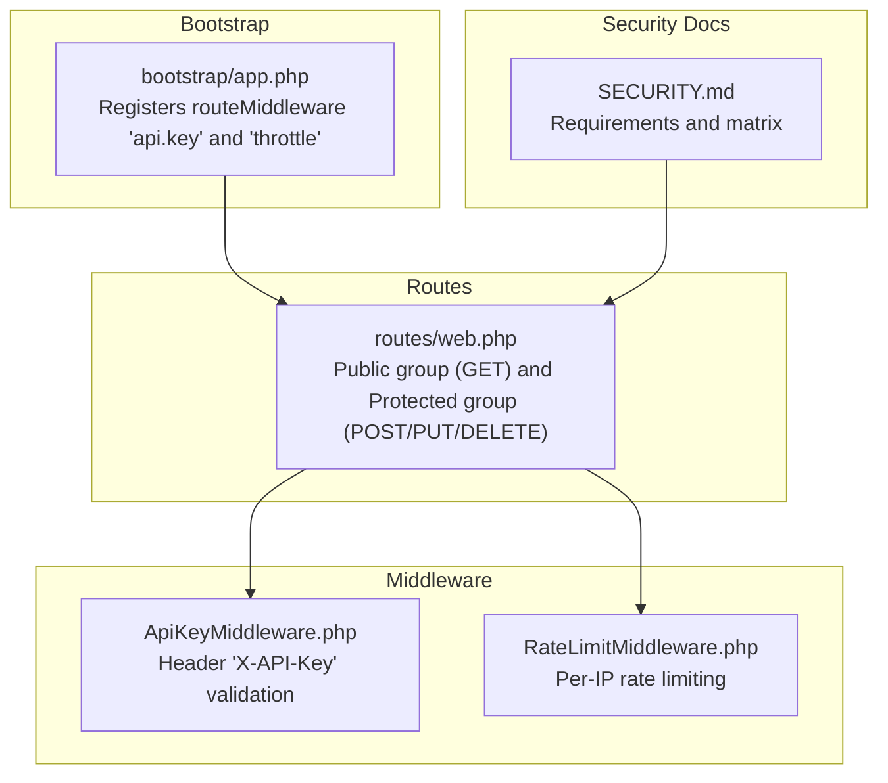
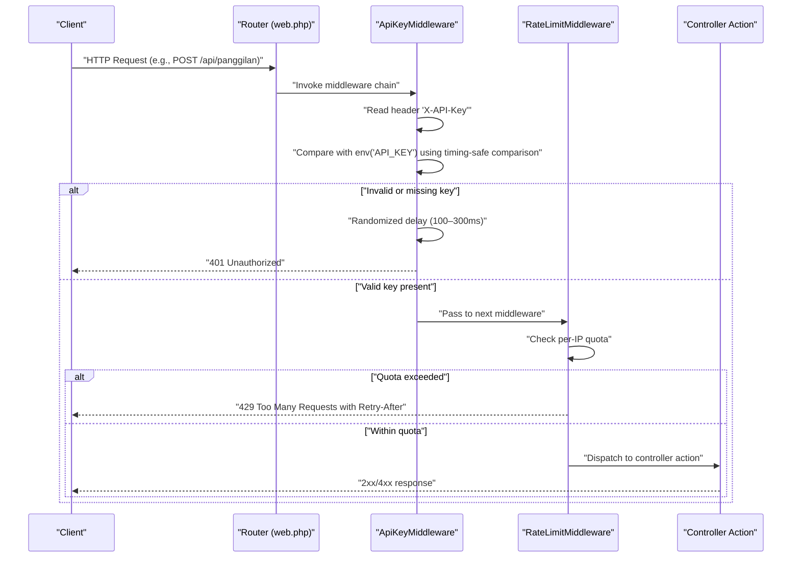
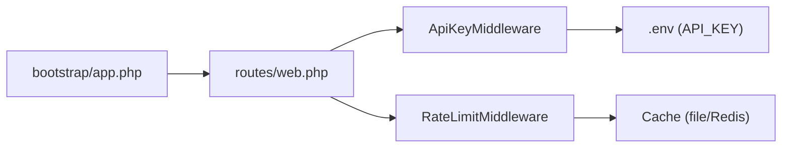
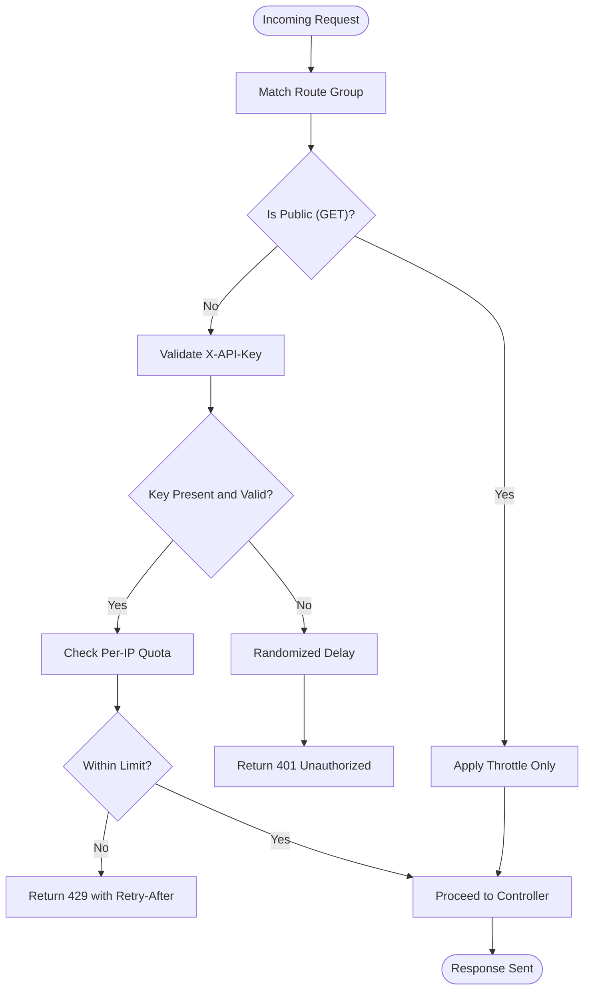

# Authentication and API Key System

<cite>
**Referenced Files in This Document**
- [KeyGenerateCommand.php](file://app/Console/Commands/KeyGenerateCommand.php)
- [ApiKeyMiddleware.php](file://app/Http/Middleware/ApiKeyMiddleware.php)
- [RateLimitMiddleware.php](file://app/Http/Middleware/RateLimitMiddleware.php)
- [app.php](file://bootstrap/app.php)
- [web.php](file://routes/web.php)
- [SECURITY.md](file://SECURITY.md)
- [Handler.php](file://app/Exceptions/Handler.php)
- [Controller.php](file://app/Http/Controllers/Controller.php)
- [PanggilanController.php](file://app/Http/Controllers/PanggilanController.php)
</cite>

## Table of Contents
1. [Introduction](#introduction)
2. [Project Structure](#project-structure)
3. [Core Components](#core-components)
4. [Architecture Overview](#architecture-overview)
5. [Detailed Component Analysis](#detailed-component-analysis)
6. [Dependency Analysis](#dependency-analysis)
7. [Performance Considerations](#performance-considerations)
8. [Troubleshooting Guide](#troubleshooting-guide)
9. [Conclusion](#conclusion)
10. [Appendices](#appendices)

## Introduction
This document explains the API key authentication system used to protect write operations across the API. It covers:
- Secure API key generation via the KeyGenerateCommand
- Timing-safe validation performed by ApiKeyMiddleware
- The end-to-end authentication flow from request initiation to verification
- Request header requirements and response handling
- Key rotation and revocation procedures
- Secure key storage best practices
- Practical examples and client-side implementation guidelines
- Common authentication failures, troubleshooting steps, and security monitoring recommendations

## Project Structure
The authentication system spans a small set of focused components:
- Console command for generating keys
- Middleware for API key validation and rate limiting
- Route groups that apply middleware selectively
- Application bootstrap that registers middleware aliases
- Security documentation and exception handler for consistent error responses

**Diagram sources**
- [app.php:27-30](file://bootstrap/app.php#L27-L30)
- [web.php:14-76](file://routes/web.php#L14-L76)
- [web.php:78-164](file://routes/web.php#L78-L164)
- [ApiKeyMiddleware.php:14-39](file://app/Http/Middleware/ApiKeyMiddleware.php#L14-L39)
- [RateLimitMiddleware.php:15-39](file://app/Http/Middleware/RateLimitMiddleware.php#L15-L39)
- [SECURITY.md:88-98](file://SECURITY.md#L88-L98)

**Section sources**
- [app.php:27-30](file://bootstrap/app.php#L27-L30)
- [web.php:14-76](file://routes/web.php#L14-L76)
- [web.php:78-164](file://routes/web.php#L78-L164)
- [SECURITY.md:88-98](file://SECURITY.md#L88-L98)

## Core Components
- KeyGenerateCommand: Generates a cryptographically strong API key and writes it to the environment configuration.
- ApiKeyMiddleware: Validates the presence and correctness of the API key header using timing-safe comparison and applies a randomized delay on failure.
- RateLimitMiddleware: Enforces per-IP request limits and adds rate-limit headers to responses.
- Route groups: Public endpoints (read-only) and protected endpoints (write operations) with middleware applied.
- Security documentation: Defines requirements, recommended key generation, and incident response.

**Section sources**
- [KeyGenerateCommand.php:23-50](file://app/Console/Commands/KeyGenerateCommand.php#L23-L50)
- [ApiKeyMiddleware.php:14-39](file://app/Http/Middleware/ApiKeyMiddleware.php#L14-L39)
- [RateLimitMiddleware.php:15-39](file://app/Http/Middleware/RateLimitMiddleware.php#L15-L39)
- [web.php:14-76](file://routes/web.php#L14-L76)
- [web.php:78-164](file://routes/web.php#L78-L164)
- [SECURITY.md:11-16](file://SECURITY.md#L11-L16)

## Architecture Overview
The authentication flow is layered:
- Global middleware sets up CORS and other global policies.
- Route groups apply middleware conditionally:
  - Public routes: throttle only
  - Protected routes: api.key followed by throttle
- On protected routes, ApiKeyMiddleware validates the X-API-Key header against the configured secret.
- RateLimitMiddleware enforces per-IP quotas and returns Retry-After headers when exceeded.

**Diagram sources**
- [web.php:78-164](file://routes/web.php#L78-L164)
- [ApiKeyMiddleware.php:16-36](file://app/Http/Middleware/ApiKeyMiddleware.php#L16-L36)
- [RateLimitMiddleware.php:15-39](file://app/Http/Middleware/RateLimitMiddleware.php#L15-L39)

## Detailed Component Analysis

### KeyGenerateCommand
Purpose:
- Generate a new cryptographically secure API key value and persist it to the environment configuration.

Implementation highlights:
- Uses a secure random generator to produce 32 random bytes.
- Encodes the bytes in base64 and prefixes with a marker to indicate the encoding scheme.
- Writes the key to the environment file, replacing an existing key or appending if not present.
- Supports an option to display the generated key without modifying files.

Cryptographic strength:
- The key is produced from a CSPRNG, ensuring unpredictability suitable for secrets.

Key storage best practices:
- Store the key in the environment configuration file.
- Restrict file permissions so only the web server user can read it.
- Do not commit secrets to version control; rely on deployment-time injection.

Practical example:
- To generate and display a key without writing to disk, use the appropriate command-line option.
- To write the key to the environment file, run the command without the display option.

**Section sources**
- [KeyGenerateCommand.php:23-50](file://app/Console/Commands/KeyGenerateCommand.php#L23-L50)

### ApiKeyMiddleware
Purpose:
- Validate the API key header on protected routes and reject unauthorized requests.

Validation logic:
- Reads the X-API-Key header from the incoming request.
- Compares the provided key with the configured secret using a timing-safe comparison to mitigate timing attacks.
- Returns a randomized delay before responding to failed attempts to deter brute-force enumeration.
- If the key is missing or invalid, responds with a 401 Unauthorized; if the environment variable is not set, responds with a 500 Server Configuration Error.

Request header requirements:
- Header name: X-API-Key
- Value: Must match the configured API key exactly.

Response handling:
- Successful validation allows the request to proceed to the next middleware/controller.
- Failure responses include a standardized JSON body with a message and appropriate HTTP status.

Timing-safe comparison:
- Uses a constant-time comparison to avoid leaking timing information that could be exploited in side-channel attacks.

Randomized delay:
- Delays failure responses by a random interval to hinder automated attack scripts.

**Section sources**
- [ApiKeyMiddleware.php:14-39](file://app/Http/Middleware/ApiKeyMiddleware.php#L14-L39)
- [SECURITY.md:11-16](file://SECURITY.md#L11-L16)

### RateLimitMiddleware
Purpose:
- Prevent abuse by enforcing per-IP request quotas.

Behavior:
- Computes a simple signature from the client IP address.
- Tracks request counts in cache for a decay window.
- Returns 429 Too Many Requests with a Retry-After header when the limit is exceeded.
- Adds X-RateLimit-Limit and X-RateLimit-Remaining headers to normal responses.

Identifier choice:
- Uses only the client IP to avoid bypass via User-Agent manipulation.

**Section sources**
- [RateLimitMiddleware.php:15-39](file://app/Http/Middleware/RateLimitMiddleware.php#L15-L39)

### Route Groups and Middleware Registration
- Public routes (read-only GET endpoints) are grouped under a throttle-only middleware.
- Protected routes (write operations) are grouped under both api.key and throttle middleware.
- The middleware alias api.key resolves to the ApiKeyMiddleware class.
- The throttle alias resolves to the RateLimitMiddleware class.

**Section sources**
- [web.php:14-76](file://routes/web.php#L14-L76)
- [web.php:78-164](file://routes/web.php#L78-L164)
- [app.php:27-30](file://bootstrap/app.php#L27-L30)

### Controller-Level Security Practices
- Input sanitization: Removes HTML tags and trims strings except for selected fields.
- Allowed-fields whitelisting prevents mass assignment.
- File upload validation checks MIME types based on content rather than extension.
- Fallback upload strategies (cloud and local) with logging for resilience.

These practices complement the authentication layer by reducing attack surface at the application level.

**Section sources**
- [Controller.php:18-29](file://app/Http/Controllers/Controller.php#L18-L29)
- [Controller.php:40-95](file://app/Http/Controllers/Controller.php#L40-L95)
- [PanggilanController.php:114-198](file://app/Http/Controllers/PanggilanController.php#L114-L198)

## Dependency Analysis
The authentication pipeline depends on:
- Route registration to attach middleware to protected endpoints.
- Middleware aliases to resolve middleware classes.
- Environment configuration for the API key secret.
- Cache backend for rate limiting counters.

**Diagram sources**
- [web.php:78-164](file://routes/web.php#L78-L164)
- [ApiKeyMiddleware.php:16-17](file://app/Http/Middleware/ApiKeyMiddleware.php#L16-L17)
- [RateLimitMiddleware.php:17-31](file://app/Http/Middleware/RateLimitMiddleware.php#L17-L31)
- [app.php:27-30](file://bootstrap/app.php#L27-L30)

**Section sources**
- [web.php:78-164](file://routes/web.php#L78-L164)
- [app.php:27-30](file://bootstrap/app.php#L27-L30)
- [ApiKeyMiddleware.php:16-17](file://app/Http/Middleware/ApiKeyMiddleware.php#L16-L17)
- [RateLimitMiddleware.php:17-31](file://app/Http/Middleware/RateLimitMiddleware.php#L17-L31)

## Performance Considerations
- Timing-safe comparison ensures constant-time verification regardless of input differences, preventing timing leaks without significant overhead.
- Randomized delays on failure reduce the effectiveness of automated attacks but add minor latency; tune the range based on acceptable user experience.
- Rate limiting reduces load spikes and protects downstream resources; adjust thresholds according to capacity and expected traffic patterns.
- Using a cache backend (e.g., Redis) for rate limiting improves scalability compared to file-based caches.

[No sources needed since this section provides general guidance]

## Troubleshooting Guide
Common authentication failures and resolutions:
- Missing or empty X-API-Key header:
  - Symptom: 401 Unauthorized
  - Resolution: Include the X-API-Key header with the correct value.
- Incorrect API key:
  - Symptom: 401 Unauthorized after a randomized delay
  - Resolution: Regenerate the key using the provided command and update the environment configuration.
- Server configuration error during key validation:
  - Symptom: 500 Server Configuration Error
  - Resolution: Ensure the API key is set in the environment configuration.
- Rate limit exceeded:
  - Symptom: 429 Too Many Requests with Retry-After header
  - Resolution: Wait for the indicated period or reduce request frequency.
- Unexpected errors in production:
  - Symptom: Generic 500 response without sensitive details
  - Resolution: Check server logs for the exception details; confirm APP_ENV and APP_DEBUG settings align with deployment policy.

Security monitoring recommendations:
- Monitor 401 and 429 responses for unusual spikes.
- Track repeated failed attempts by IP to detect brute-force activity.
- Review access logs for suspicious patterns and investigate incidents promptly.

**Section sources**
- [ApiKeyMiddleware.php:20-36](file://app/Http/Middleware/ApiKeyMiddleware.php#L20-L36)
- [RateLimitMiddleware.php:22-28](file://app/Http/Middleware/RateLimitMiddleware.php#L22-L28)
- [SECURITY.md:101-106](file://SECURITY.md#L101-L106)

## Conclusion
The API key authentication system combines a secure key generation mechanism, timing-safe validation, and rate limiting to protect write operations. By adhering to the documented requirements—such as using the X-API-Key header, rotating keys regularly, and storing secrets securely—the system maintains a strong security posture while remaining straightforward to operate and troubleshoot.

[No sources needed since this section summarizes without analyzing specific files]

## Appendices

### Authentication Flow Details

**Diagram sources**
- [web.php:14-76](file://routes/web.php#L14-L76)
- [web.php:78-164](file://routes/web.php#L78-L164)
- [ApiKeyMiddleware.php:16-36](file://app/Http/Middleware/ApiKeyMiddleware.php#L16-L36)
- [RateLimitMiddleware.php:15-39](file://app/Http/Middleware/RateLimitMiddleware.php#L15-L39)

### Key Rotation and Revocation Procedures
- Rotate the API key by regenerating it using the provided command and updating the environment configuration.
- Immediately revoke compromised keys by replacing them with new ones.
- After rotation, update all clients and infrastructure that use the old key.
- Monitor for continued access attempts using the old key to detect lingering exposure.

**Section sources**
- [KeyGenerateCommand.php:23-50](file://app/Console/Commands/KeyGenerateCommand.php#L23-L50)
- [SECURITY.md:103-106](file://SECURITY.md#L103-L106)

### Secure Key Storage Patterns
- Store the API key in the environment configuration file.
- Restrict file permissions to prevent unauthorized reads.
- Avoid committing secrets to version control; inject at deployment time.
- Use separate environments for development, staging, and production with distinct keys.

**Section sources**
- [SECURITY.md:54-63](file://SECURITY.md#L54-L63)

### Client-Side Implementation Guidelines
- Always send the X-API-Key header with write operations.
- Implement retry logic with exponential backoff for 429 responses.
- Log and monitor authentication failures; alert on sustained 401 spikes.
- Rotate keys periodically and update configurations across all clients.

**Section sources**
- [SECURITY.md:11-16](file://SECURITY.md#L11-L16)
- [SECURITY.md:101-106](file://SECURITY.md#L101-L106)

### Request Header Requirements and Response Handling
- Header: X-API-Key
- Protected methods: POST, PUT, DELETE on all resource endpoints
- Responses:
  - 401 Unauthorized on missing/invalid key
  - 429 Too Many Requests with Retry-After on rate limit exceeded
  - 500 Server Configuration Error if the key is not configured

**Section sources**
- [web.php:78-164](file://routes/web.php#L78-L164)
- [ApiKeyMiddleware.php:16-36](file://app/Http/Middleware/ApiKeyMiddleware.php#L16-L36)
- [RateLimitMiddleware.php:22-28](file://app/Http/Middleware/RateLimitMiddleware.php#L22-L28)
- [SECURITY.md:88-98](file://SECURITY.md#L88-L98)

### Endpoint Security Matrix Reference
- Public endpoints: GET only, throttled
- Protected endpoints: Require API key plus throttled

**Section sources**
- [SECURITY.md:88-98](file://SECURITY.md#L88-L98)