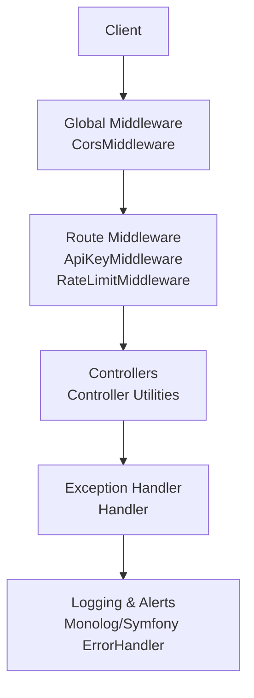
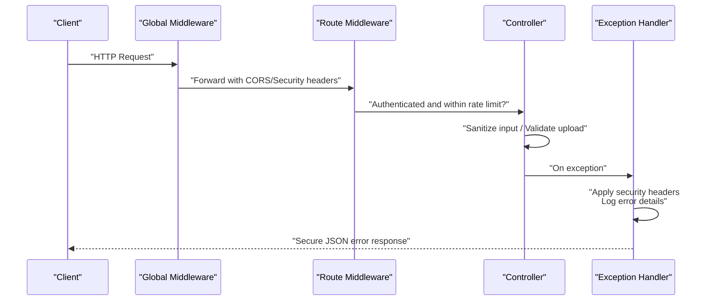
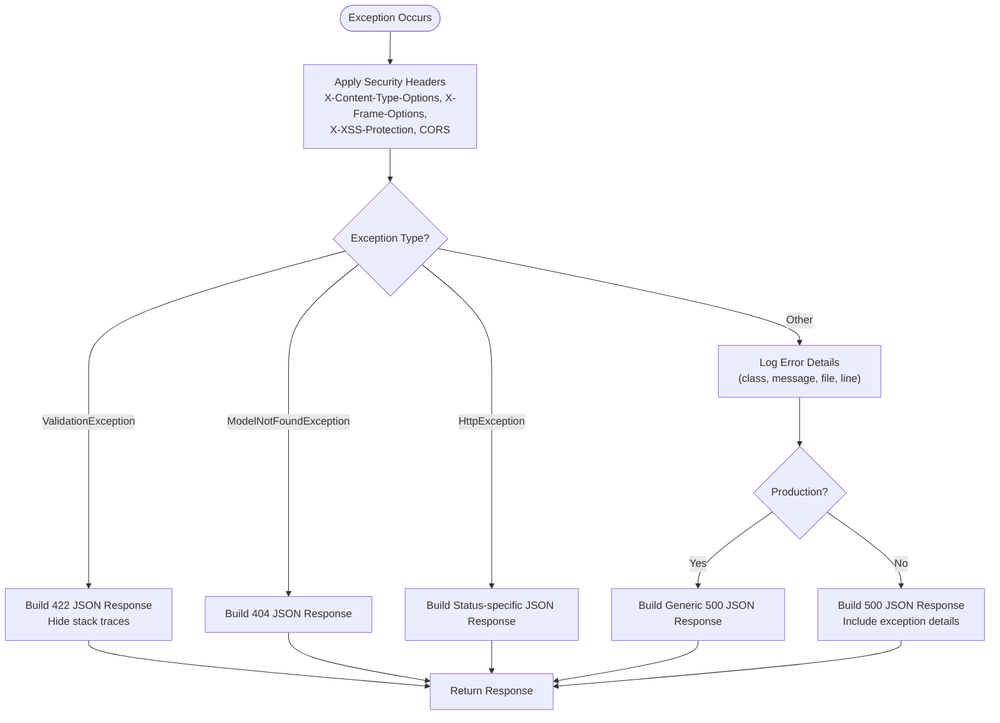
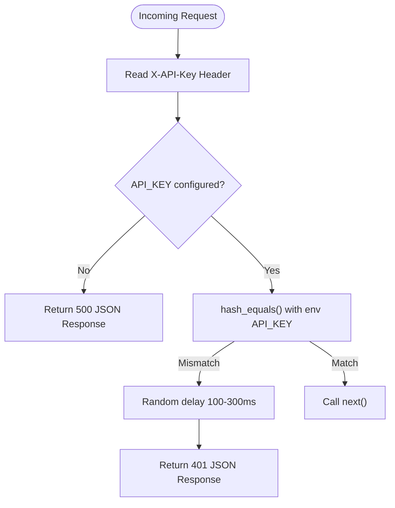
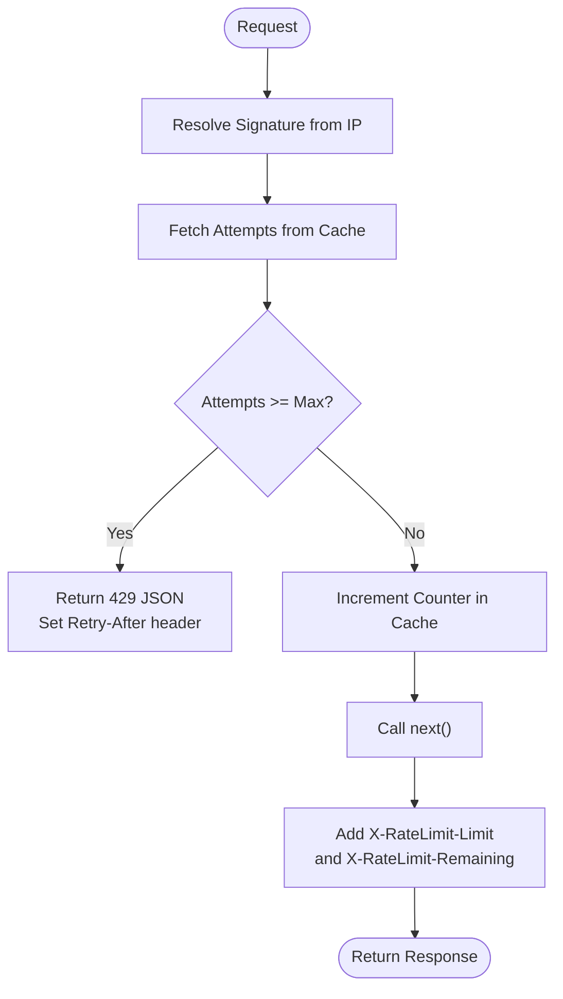
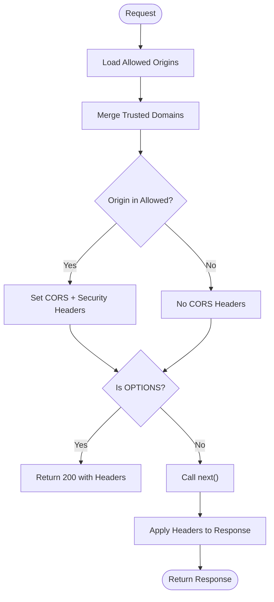
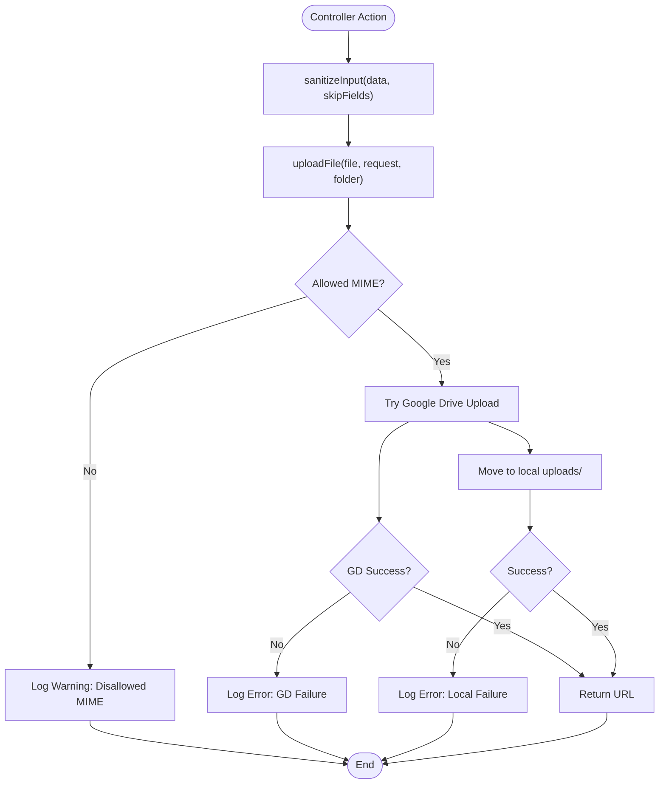
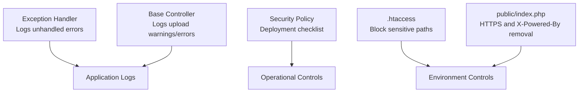
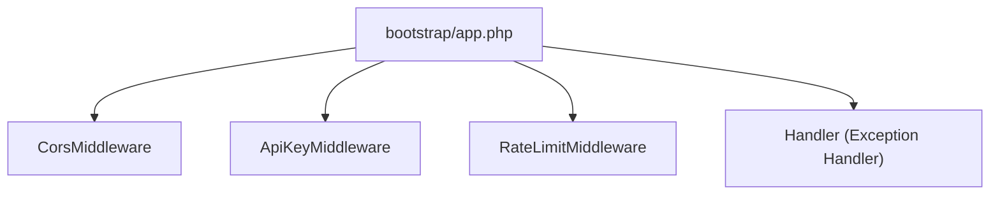

# Error Handling and Security Logging

<cite>
**Referenced Files in This Document**
- [Handler.php](file://app/Exceptions/Handler.php)
- [ApiKeyMiddleware.php](file://app/Http/Middleware/ApiKeyMiddleware.php)
- [RateLimitMiddleware.php](file://app/Http/Middleware/RateLimitMiddleware.php)
- [CorsMiddleware.php](file://app/Http/Middleware/CorsMiddleware.php)
- [Controller.php](file://app/Http/Controllers/Controller.php)
- [app.php](file://bootstrap/app.php)
- [SECURITY.md](file://SECURITY.md)
- [.htaccess](file://.htaccess)
- [index.php](file://public/index.php)
- [composer.json](file://composer.json)
- [composer.lock](file://composer.lock)
- [database.php](file://config/database.php)
</cite>

## Table of Contents
1. [Introduction](#introduction)
2. [Project Structure](#project-structure)
3. [Core Components](#core-components)
4. [Architecture Overview](#architecture-overview)
5. [Detailed Component Analysis](#detailed-component-analysis)
6. [Dependency Analysis](#dependency-analysis)
7. [Performance Considerations](#performance-considerations)
8. [Troubleshooting Guide](#troubleshooting-guide)
9. [Conclusion](#conclusion)
10. [Appendices](#appendices)

## Introduction
This document provides comprehensive documentation for the error handling and security logging systems of the API. It covers the Exception Handler implementation for secure error response generation, including error message sanitization to prevent information disclosure and stack trace protection. It also explains logging configuration for security events, failed authentication attempts, and rate limit violations, along with audit trail considerations for API key usage, request patterns, and security incidents. The document details error categorization, severity levels, and automated alerting mechanisms, and includes practical examples of secure error responses, log analysis techniques, and incident response procedures. Finally, it addresses security logging best practices, log retention policies, compliance considerations, monitoring approaches for detecting security threats, anomaly detection patterns, and forensic analysis capabilities.

## Project Structure
The security and error handling features are implemented across several layers:
- Global middleware pipeline for CORS and security headers
- Route-specific middleware for API key validation and rate limiting
- Centralized exception handler for secure error responses and logging
- Base controller utilities for input sanitization and file upload safety
- Environment and deployment configurations for production hardening
- Security policy and operational guidance

**Diagram sources**
- [CorsMiddleware.php:1-63](file://app/Http/Middleware/CorsMiddleware.php#L1-L63)
- [ApiKeyMiddleware.php:1-41](file://app/Http/Middleware/ApiKeyMiddleware.php#L1-L41)
- [RateLimitMiddleware.php:1-49](file://app/Http/Middleware/RateLimitMiddleware.php#L1-L49)
- [Controller.php:1-97](file://app/Http/Controllers/Controller.php#L1-L97)
- [Handler.php:1-134](file://app/Exceptions/Handler.php#L1-L134)

**Section sources**
- [app.php:21-39](file://bootstrap/app.php#L21-L39)
- [CorsMiddleware.php:14-62](file://app/Http/Middleware/CorsMiddleware.php#L14-L62)
- [ApiKeyMiddleware.php:14-39](file://app/Http/Middleware/ApiKeyMiddleware.php#L14-L39)
- [RateLimitMiddleware.php:15-39](file://app/Http/Middleware/RateLimitMiddleware.php#L15-L39)
- [Controller.php:18-95](file://app/Http/Controllers/Controller.php#L18-L95)
- [Handler.php:36-132](file://app/Exceptions/Handler.php#L36-L132)

## Core Components
- Exception Handler: Centralized error handling with security headers, sanitized responses, and selective logging.
- API Key Middleware: Authentication enforcement with timing-safe comparison and randomized delays to mitigate brute-force.
- Rate Limit Middleware: Simple sliding-window rate limiting with cache-backed counters and informative headers.
- CORS Middleware: Strict origin whitelisting with security headers and preflight handling.
- Base Controller Utilities: Input sanitization and secure file upload with MIME validation and randomized filenames.
- Security Policy and Deployment: Production hardening guidance, environment configuration, and access restrictions.

**Section sources**
- [Handler.php:12-30](file://app/Exceptions/Handler.php#L12-L30)
- [ApiKeyMiddleware.php:14-39](file://app/Http/Middleware/ApiKeyMiddleware.php#L14-L39)
- [RateLimitMiddleware.php:15-39](file://app/Http/Middleware/RateLimitMiddleware.php#L15-L39)
- [CorsMiddleware.php:14-62](file://app/Http/Middleware/CorsMiddleware.php#L14-L62)
- [Controller.php:18-95](file://app/Http/Controllers/Controller.php#L18-L95)
- [SECURITY.md:54-84](file://SECURITY.md#L54-L84)

## Architecture Overview
The system enforces security at every layer:
- Global middleware ensures CORS and security headers are applied consistently.
- Route middleware enforces API key authentication and rate limits.
- Controllers apply input sanitization and safe file handling.
- Exception Handler centralizes error responses, applies security headers, logs unhandled exceptions, and avoids information disclosure.

**Diagram sources**
- [CorsMiddleware.php:14-62](file://app/Http/Middleware/CorsMiddleware.php#L14-L62)
- [ApiKeyMiddleware.php:14-39](file://app/Http/Middleware/ApiKeyMiddleware.php#L14-L39)
- [RateLimitMiddleware.php:15-39](file://app/Http/Middleware/RateLimitMiddleware.php#L15-L39)
- [Controller.php:18-95](file://app/Http/Controllers/Controller.php#L18-L95)
- [Handler.php:36-132](file://app/Exceptions/Handler.php#L36-L132)

## Detailed Component Analysis

### Exception Handler
The Exception Handler provides secure error responses and controlled logging:
- Security headers are applied to all responses, including error responses, to protect clients.
- CORS headers are included for trusted origins to ensure cross-origin error responses are handled safely.
- Specialized handling for validation failures, resource not found, and HTTP exceptions with appropriate status codes.
- Unhandled exceptions are logged with contextual information (class, message, file, line) but client responses hide sensitive details in production.
- Development mode exposes exception details for debugging while production responses are generic.

**Diagram sources**
- [Handler.php:36-132](file://app/Exceptions/Handler.php#L36-L132)

**Section sources**
- [Handler.php:36-132](file://app/Exceptions/Handler.php#L36-L132)

### API Key Middleware
The API Key Middleware enforces authentication with:
- Timing-safe comparison to prevent timing attacks.
- Randomized delay on invalid keys to mitigate brute-force attempts.
- Immediate failure response with generic messaging.
- Validation of presence and correctness of the API key header.

**Diagram sources**
- [ApiKeyMiddleware.php:14-39](file://app/Http/Middleware/ApiKeyMiddleware.php#L14-L39)

**Section sources**
- [ApiKeyMiddleware.php:14-39](file://app/Http/Middleware/ApiKeyMiddleware.php#L14-L39)

### Rate Limit Middleware
The Rate Limit Middleware implements a simple sliding-window approach:
- Uses a cache key derived from the client IP to track attempts.
- Increments counters per request and sets expiration.
- Returns 429 with Retry-After header when limits are exceeded.
- Adds informative rate limit headers to successful responses.

**Diagram sources**
- [RateLimitMiddleware.php:15-39](file://app/Http/Middleware/RateLimitMiddleware.php#L15-L39)

**Section sources**
- [RateLimitMiddleware.php:15-39](file://app/Http/Middleware/RateLimitMiddleware.php#L15-L39)

### CORS Middleware
The CORS Middleware enforces strict origin whitelisting:
- Builds allowed origins from environment and trusted domains.
- Applies security headers on all responses.
- Allows only preflight and subsequent requests from whitelisted origins.
- Prevents wildcard origins in production.

**Diagram sources**
- [CorsMiddleware.php:14-62](file://app/Http/Middleware/CorsMiddleware.php#L14-L62)

**Section sources**
- [CorsMiddleware.php:14-62](file://app/Http/Middleware/CorsMiddleware.php#L14-L62)

### Base Controller Utilities
The base controller provides:
- Input sanitization to remove HTML tags and trim strings, with skip fields support.
- Secure file upload with MIME type validation based on magic bytes, Google Drive fallback, randomized filenames, and robust error logging.

**Diagram sources**
- [Controller.php:18-95](file://app/Http/Controllers/Controller.php#L18-L95)

**Section sources**
- [Controller.php:18-95](file://app/Http/Controllers/Controller.php#L18-L95)

### Security Logging Configuration and Best Practices
- Centralized logging via the framework’s logging facilities is used for unhandled exceptions and upload failures.
- Security headers are applied globally and during error responses to ensure consistent protection.
- Access restrictions are enforced at the web server level to prevent exposure of sensitive files and directories.
- Production hardening requires disabling debug mode, setting environment to production, configuring API key, and restricting CORS origins.

**Diagram sources**
- [Handler.php:102-107](file://app/Exceptions/Handler.php#L102-L107)
- [Controller.php:55-94](file://app/Http/Controllers/Controller.php#L55-L94)
- [SECURITY.md:54-84](file://SECURITY.md#L54-L84)
- [.htaccess:10-19](file://.htaccess#L10-L19)
- [index.php:7-13](file://public/index.php#L7-L13)

**Section sources**
- [Handler.php:102-107](file://app/Exceptions/Handler.php#L102-L107)
- [Controller.php:55-94](file://app/Http/Controllers/Controller.php#L55-L94)
- [SECURITY.md:54-84](file://SECURITY.md#L54-L84)
- [.htaccess:10-19](file://.htaccess#L10-L19)
- [index.php:7-13](file://public/index.php#L7-L13)

## Dependency Analysis
The application registers middleware and the exception handler in the bootstrap phase, ensuring global and route-specific protections are applied consistently.

**Diagram sources**
- [app.php:21-39](file://bootstrap/app.php#L21-L39)

**Section sources**
- [app.php:21-39](file://bootstrap/app.php#L21-L39)

## Performance Considerations
- Rate limiting uses cache-backed counters; ensure cache backend is tuned for high throughput to avoid latency spikes.
- API key validation uses constant-time comparison and randomized delays; keep cache warm to minimize misses.
- Exception logging should be aggregated and indexed for efficient querying; avoid excessive disk I/O by using buffered or asynchronous handlers where supported.
- Input sanitization and MIME validation add CPU overhead; consider batching and caching where appropriate.

## Troubleshooting Guide
Common issues and resolutions:
- Generic 500 responses in production: Verify logging for unhandled exceptions and review application logs for error entries.
- CORS errors on error responses: Confirm that the Origin is in the allowed list and that security headers are present.
- Rate limit 429 responses: Check Retry-After header and adjust client-side retry logic; verify cache connectivity.
- Unauthorized API requests: Ensure X-API-Key header is present and matches the configured API key; confirm environment configuration.
- Upload failures: Review logs for MIME type warnings or local/Google Drive errors; validate allowed MIME types and storage permissions.

**Section sources**
- [Handler.php:102-107](file://app/Exceptions/Handler.php#L102-L107)
- [CorsMiddleware.php:44-47](file://app/Http/Middleware/CorsMiddleware.php#L44-L47)
- [RateLimitMiddleware.php:22-28](file://app/Http/Middleware/RateLimitMiddleware.php#L22-L28)
- [ApiKeyMiddleware.php:28-36](file://app/Http/Middleware/ApiKeyMiddleware.php#L28-L36)
- [Controller.php:55-94](file://app/Http/Controllers/Controller.php#L55-L94)

## Conclusion
The API implements a layered security model with strict error handling, authentication, rate limiting, and CORS controls. The Exception Handler ensures secure, non-disclosing error responses and centralized logging. Middleware enforces authentication and rate limits, while the base controller adds input sanitization and secure file handling. Production hardening and access restrictions further strengthen the system. Together, these components provide a robust foundation for secure error handling and security logging.

## Appendices

### Secure Error Response Examples
- Validation failure: 422 JSON with a generic message and structured errors.
- Resource not found: 404 JSON with a generic message.
- HTTP exception: Status-specific JSON with a message.
- Unhandled exception (production): 500 JSON with a generic message; details logged internally.
- Unhandled exception (development): 500 JSON with exception details for debugging.

**Section sources**
- [Handler.php:58-95](file://app/Exceptions/Handler.php#L58-L95)
- [Handler.php:109-125](file://app/Exceptions/Handler.php#L109-L125)

### Log Analysis Techniques
- Filter by exception class and message to identify recurring issues.
- Correlate rate limit 429 responses with IP addresses to detect abuse.
- Monitor unauthorized API key attempts and apply IP-based blocks.
- Track MIME type rejections to identify suspicious uploads.

**Section sources**
- [Handler.php:102-107](file://app/Exceptions/Handler.php#L102-L107)
- [Controller.php:55-94](file://app/Http/Controllers/Controller.php#L55-L94)

### Incident Response Procedures
- Immediately rotate the API key upon suspicion of compromise.
- Review access logs for anomalous activity.
- Temporarily disable affected endpoints if necessary.
- Coordinate with hosting providers for further investigation.

**Section sources**
- [SECURITY.md:101-107](file://SECURITY.md#L101-L107)

### Security Logging Best Practices
- Avoid logging sensitive data; redact or exclude PII and secrets.
- Use structured logs with consistent fields for easy querying.
- Apply log retention policies aligned with compliance requirements.
- Ship logs to centralized systems for aggregation and alerting.

[No sources needed since this section provides general guidance]

### Monitoring and Forensic Analysis
- Monitor for spikes in 429 responses indicating potential abuse.
- Alert on repeated unauthorized attempts and unusual request patterns.
- Use correlation between authentication failures, rate limit hits, and error responses for threat detection.
- Maintain immutable logs for forensic analysis and compliance audits.

[No sources needed since this section provides general guidance]

### Compliance Considerations
- Ensure production environments disable debug mode and restrict CORS origins.
- Enforce strong API key generation and rotation policies.
- Apply least privilege and principle of minimal exposure in configuration and deployment.

**Section sources**
- [SECURITY.md:54-84](file://SECURITY.md#L54-L84)