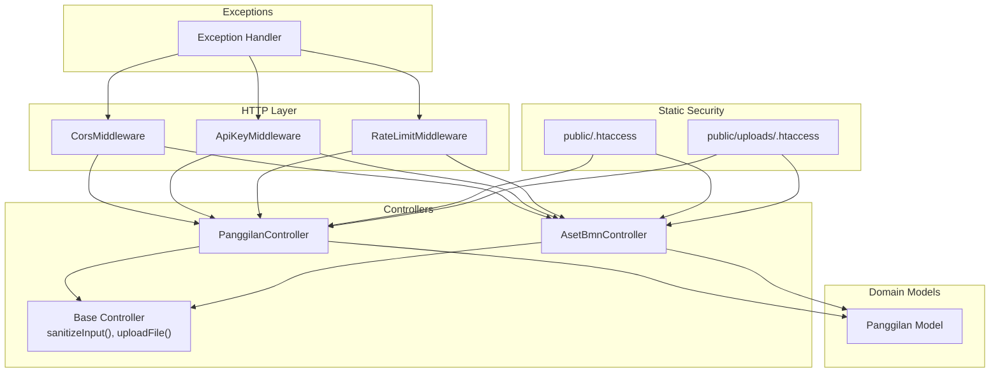
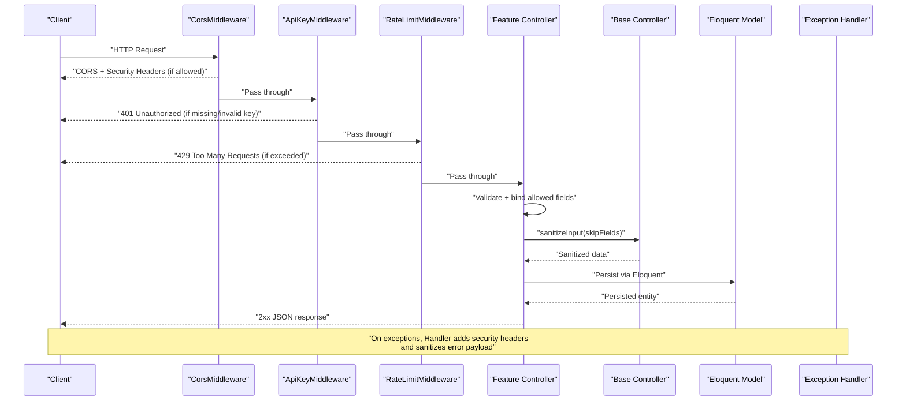
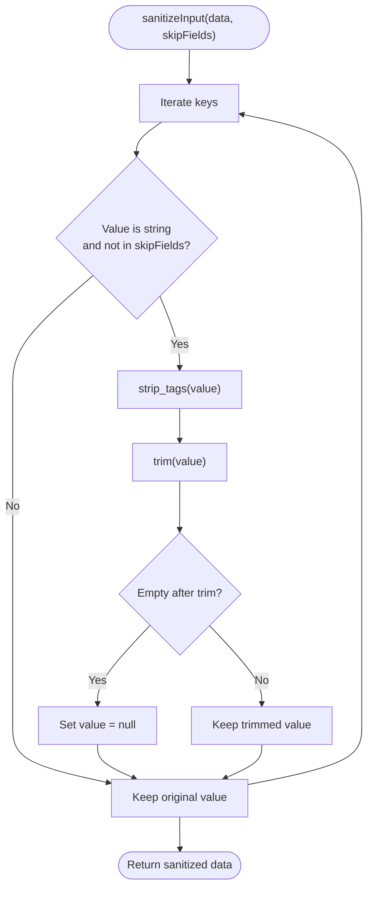
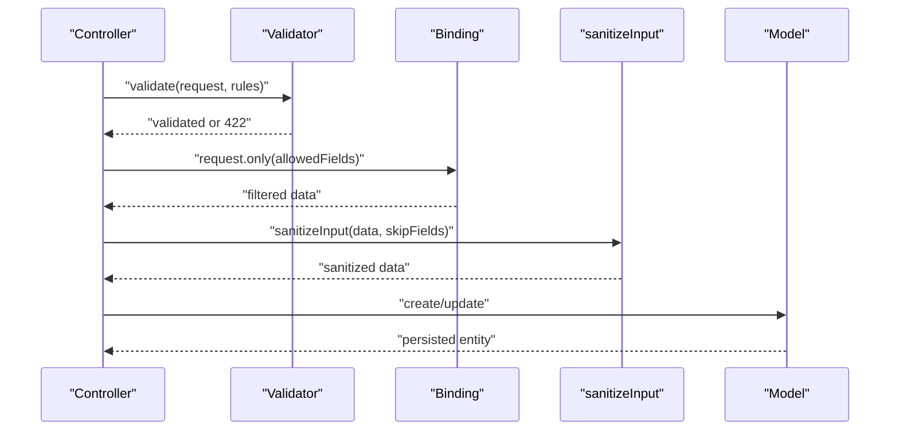
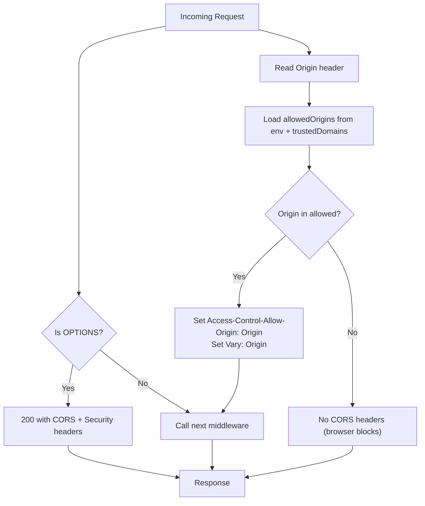
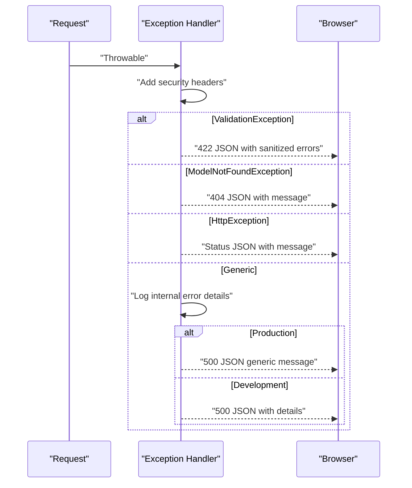
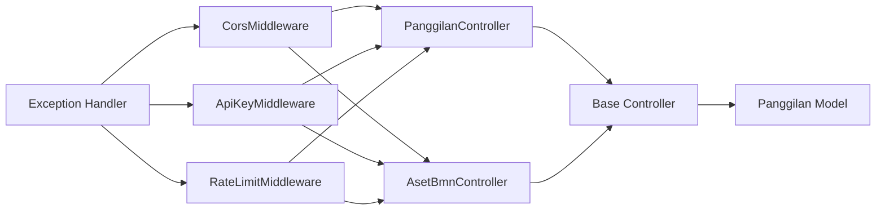

# Input Sanitization and XSS Prevention

<cite>
**Referenced Files in This Document**
- [Controller.php](file://app/Http/Controllers/Controller.php)
- [PanggilanController.php](file://app/Http/Controllers/PanggilanController.php)
- [AsetBmnController.php](file://app/Http/Controllers/AsetBmnController.php)
- [CorsMiddleware.php](file://app/Http/Middleware/CorsMiddleware.php)
- [ApiKeyMiddleware.php](file://app/Http/Middleware/ApiKeyMiddleware.php)
- [RateLimitMiddleware.php](file://app/Http/Middleware/RateLimitMiddleware.php)
- [Handler.php](file://app/Exceptions/Handler.php)
- [Panggilan.php](file://app/Models/Panggilan.php)
- [SECURITY.md](file://SECURITY.md)
- [public/.htaccess](file://public/.htaccess)
- [public/uploads/.htaccess](file://public/uploads/.htaccess)
</cite>

## Table of Contents
1. [Introduction](#introduction)
2. [Project Structure](#project-structure)
3. [Core Components](#core-components)
4. [Architecture Overview](#architecture-overview)
5. [Detailed Component Analysis](#detailed-component-analysis)
6. [Dependency Analysis](#dependency-analysis)
7. [Performance Considerations](#performance-considerations)
8. [Troubleshooting Guide](#troubleshooting-guide)
9. [Conclusion](#conclusion)

## Introduction
This document explains the input sanitization and XSS prevention mechanisms implemented in the API. It covers the base Controller’s sanitization routine, HTML entity stripping and trimming, input validation patterns, secure parameter binding, CORS middleware configuration for strict origins and preflight handling, and the Exception Handler’s error sanitization to prevent information leakage. Practical examples demonstrate sanitized input processing, XSS mitigation techniques, and secure response generation. Guidance is also included for detecting and mitigating common injection vulnerabilities and monitoring suspicious input patterns.

## Project Structure
Security-relevant components are organized by responsibility:
- Base Controller provides shared input sanitization and file upload utilities.
- Feature controllers apply strict validation, safe parameter extraction, and invoke the base sanitization.
- Middleware enforces CORS with strict origin whitelisting and handles preflight requests.
- Exception Handler ensures consistent security headers and sanitized error responses.
- Static security hardening is enforced via Apache .htaccess files.

**Diagram sources**
- [CorsMiddleware.php:14-62](file://app/Http/Middleware/CorsMiddleware.php#L14-L62)
- [ApiKeyMiddleware.php:14-39](file://app/Http/Middleware/ApiKeyMiddleware.php#L14-L39)
- [RateLimitMiddleware.php:15-39](file://app/Http/Middleware/RateLimitMiddleware.php#L15-L39)
- [Controller.php:18-95](file://app/Http/Controllers/Controller.php#L18-L95)
- [PanggilanController.php:115-198](file://app/Http/Controllers/PanggilanController.php#L115-L198)
- [AsetBmnController.php:71-105](file://app/Http/Controllers/AsetBmnController.php#L71-L105)
- [Panggilan.php:11-32](file://app/Models/Panggilan.php#L11-L32)
- [Handler.php:36-132](file://app/Exceptions/Handler.php#L36-L132)
- [public/.htaccess:37-45](file://public/.htaccess#L37-L45)
- [public/uploads/.htaccess:1-29](file://public/uploads/.htaccess#L1-L29)

**Section sources**
- [Controller.php:18-95](file://app/Http/Controllers/Controller.php#L18-L95)
- [PanggilanController.php:115-198](file://app/Http/Controllers/PanggilanController.php#L115-L198)
- [AsetBmnController.php:71-105](file://app/Http/Controllers/AsetBmnController.php#L71-L105)
- [CorsMiddleware.php:14-62](file://app/Http/Middleware/CorsMiddleware.php#L14-L62)
- [Handler.php:36-132](file://app/Exceptions/Handler.php#L36-L132)
- [public/.htaccess:37-45](file://public/.htaccess#L37-L45)
- [public/uploads/.htaccess:1-29](file://public/uploads/.htaccess#L1-L29)

## Core Components
- Base Controller sanitization:
  - Applies HTML tag stripping and trimming to all string fields, with configurable skip fields for exceptions (e.g., fields that intentionally contain HTML).
  - Returns null for empty-after-trim values to normalize inputs.
- Secure file upload:
  - Validates MIME type against a strict allowlist derived from actual content (not extension).
  - Falls back from cloud storage to local storage with randomized filenames and safe destination paths.
- Controller-level validation and binding:
  - Uses strict validation rules with length limits, numeric ranges, and regex patterns.
  - Extracts only allowed fields to prevent mass assignment.
  - Invokes base sanitization with skip lists for fields that must retain HTML or identifiers.
- CORS middleware:
  - Enforces a strict origin whitelist, environment-aware trusted domains, and denies unauthorized origins.
  - Sends security headers and handles preflight OPTIONS requests.
- Exception Handler:
  - Adds security headers to all responses, including error responses.
  - Whitelists CORS origins for error responses.
  - Sanitizes error messages in production to avoid information disclosure.

**Section sources**
- [Controller.php:18-29](file://app/Http/Controllers/Controller.php#L18-L29)
- [Controller.php:40-95](file://app/Http/Controllers/Controller.php#L40-L95)
- [PanggilanController.php:115-136](file://app/Http/Controllers/PanggilanController.php#L115-L136)
- [AsetBmnController.php:71-105](file://app/Http/Controllers/AsetBmnController.php#L71-L105)
- [CorsMiddleware.php:14-62](file://app/Http/Middleware/CorsMiddleware.php#L14-L62)
- [Handler.php:36-132](file://app/Exceptions/Handler.php#L36-L132)

## Architecture Overview
The request lifecycle integrates validation, sanitization, and security headers at multiple layers to minimize XSS and injection risks.

**Diagram sources**
- [CorsMiddleware.php:14-62](file://app/Http/Middleware/CorsMiddleware.php#L14-L62)
- [ApiKeyMiddleware.php:14-39](file://app/Http/Middleware/ApiKeyMiddleware.php#L14-L39)
- [RateLimitMiddleware.php:15-39](file://app/Http/Middleware/RateLimitMiddleware.php#L15-L39)
- [PanggilanController.php:115-198](file://app/Http/Controllers/PanggilanController.php#L115-L198)
- [Controller.php:18-29](file://app/Http/Controllers/Controller.php#L18-L29)
- [Panggilan.php:11-32](file://app/Models/Panggilan.php#L11-L32)
- [Handler.php:36-132](file://app/Exceptions/Handler.php#L36-L132)

## Detailed Component Analysis

### Base Controller: XSS Sanitization and Secure Upload
- Purpose:
  - Provide a centralized, reusable method to sanitize incoming string inputs.
  - Offer a secure file upload mechanism with MIME validation and fallback storage.
- Implementation highlights:
  - String-only trimming and HTML tag stripping with normalization to null for empty values.
  - Optional skip list to preserve HTML or identifiers where required.
  - MIME-type enforcement using real content detection, not filename extensions.
  - Randomized local filenames and controlled destination paths.
  - Structured logging for upload failures and fallback behavior.
- Security implications:
  - Reduces XSS risk by removing HTML tags from untrusted text inputs.
  - Mitigates malicious file execution via strict MIME allowlists and .htaccess restrictions.

**Diagram sources**
- [Controller.php:18-29](file://app/Http/Controllers/Controller.php#L18-L29)

**Section sources**
- [Controller.php:18-29](file://app/Http/Controllers/Controller.php#L18-L29)
- [Controller.php:40-95](file://app/Http/Controllers/Controller.php#L40-L95)

### Controller-Level Validation and Safe Parameter Binding
- Purpose:
  - Enforce strict validation rules and prevent mass assignment by whitelisting fields.
- Implementation highlights:
  - Validation rules include integer ranges, max lengths, regex for identifiers, optional date formats, and file constraints.
  - Allowed fields arrays define the whitelist for updates.
  - Only allowed fields are extracted from the request before persistence.
  - Specialized sanitization with skip lists for fields that must retain HTML or identifiers.
- Security implications:
  - Prevents injection via malformed or unexpected fields.
  - Limits XSS vectors by sanitizing free-text fields while preserving intended HTML in designated fields.

**Diagram sources**
- [PanggilanController.php:115-136](file://app/Http/Controllers/PanggilanController.php#L115-L136)
- [AsetBmnController.php:71-105](file://app/Http/Controllers/AsetBmnController.php#L71-L105)
- [Controller.php:18-29](file://app/Http/Controllers/Controller.php#L18-L29)
- [Panggilan.php:11-32](file://app/Models/Panggilan.php#L11-L32)

**Section sources**
- [PanggilanController.php:115-136](file://app/Http/Controllers/PanggilanController.php#L115-L136)
- [AsetBmnController.php:71-105](file://app/Http/Controllers/AsetBmnController.php#L71-L105)
- [Panggilan.php:11-32](file://app/Models/Panggilan.php#L11-L32)

### CORS Middleware: Origins, Credentials, Preflight
- Purpose:
  - Enforce strict origin whitelisting and deny unauthorized origins.
  - Provide security headers and handle preflight requests.
- Implementation highlights:
  - Reads allowed origins from environment and merges with trusted domains based on environment.
  - Allows only matching origins and sets Vary: Origin for correct caching behavior.
  - Sends Access-Control-Allow-Methods, Access-Control-Allow-Headers, and Access-Control-Max-Age for preflight.
  - Applies security headers (X-Content-Type-Options, X-Frame-Options, X-XSS-Protection) to all responses.
- Security implications:
  - Blocks cross-origin requests from untrusted domains.
  - Ensures preflight responses carry appropriate headers to enable legitimate cross-origin calls.

**Diagram sources**
- [CorsMiddleware.php:14-62](file://app/Http/Middleware/CorsMiddleware.php#L14-L62)

**Section sources**
- [CorsMiddleware.php:14-62](file://app/Http/Middleware/CorsMiddleware.php#L14-L62)

### Exception Handler: Error Sanitization and Security Headers
- Purpose:
  - Ensure consistent security headers on all responses, including error responses.
  - Sanitize error messages to avoid leaking sensitive information in production.
- Implementation highlights:
  - Adds X-Content-Type-Options, X-Frame-Options, X-XSS-Protection to all responses.
  - Whitelists CORS origins for error responses based on trusted domains.
  - For validation and model-not-found exceptions, returns structured JSON with sanitized messages.
  - For generic exceptions, logs internal details and returns a generic message in production; development mode exposes details.
- Security implications:
  - Prevents information leakage that could aid attackers.
  - Maintains security posture even when exceptions occur outside the normal middleware pipeline.

**Diagram sources**
- [Handler.php:36-132](file://app/Exceptions/Handler.php#L36-L132)

**Section sources**
- [Handler.php:36-132](file://app/Exceptions/Handler.php#L36-L132)

### Static Security Hardening (Apache .htaccess)
- Purpose:
  - Prevent execution of uploaded files and restrict access to sensitive assets.
- Implementation highlights:
  - Disables PHP execution in upload directories.
  - Blocks access to potentially dangerous file types.
  - Allows only safe file types (documents, images).
  - Forces Content-Disposition attachment and nosniff header for uploads.
  - Sets global security headers at the application root.
- Security implications:
  - Mitigates execution of malicious uploaded content.
  - Reduces exposure of sensitive files and improves content-type safety.

**Section sources**
- [public/.htaccess:37-45](file://public/.htaccess#L37-L45)
- [public/uploads/.htaccess:1-29](file://public/uploads/.htaccess#L1-L29)

## Dependency Analysis
- Controllers depend on:
  - Base Controller for sanitization and upload utilities.
  - Eloquent models for persistence with allowed fillable attributes.
- Middleware dependencies:
  - CORS middleware runs early to control cross-origin access.
  - API key middleware protects write operations.
  - Rate limit middleware guards resources.
- Exception Handler depends on:
  - Environment configuration for production vs development behavior.
  - Logging facilities for internal error tracking.

**Diagram sources**
- [PanggilanController.php:115-198](file://app/Http/Controllers/PanggilanController.php#L115-L198)
- [AsetBmnController.php:71-105](file://app/Http/Controllers/AsetBmnController.php#L71-L105)
- [Controller.php:18-95](file://app/Http/Controllers/Controller.php#L18-L95)
- [Panggilan.php:11-32](file://app/Models/Panggilan.php#L11-L32)
- [CorsMiddleware.php:14-62](file://app/Http/Middleware/CorsMiddleware.php#L14-L62)
- [ApiKeyMiddleware.php:14-39](file://app/Http/Middleware/ApiKeyMiddleware.php#L14-L39)
- [RateLimitMiddleware.php:15-39](file://app/Http/Middleware/RateLimitMiddleware.php#L15-L39)
- [Handler.php:36-132](file://app/Exceptions/Handler.php#L36-L132)

**Section sources**
- [PanggilanController.php:115-198](file://app/Http/Controllers/PanggilanController.php#L115-L198)
- [AsetBmnController.php:71-105](file://app/Http/Controllers/AsetBmnController.php#L71-L105)
- [Controller.php:18-95](file://app/Http/Controllers/Controller.php#L18-L95)
- [CorsMiddleware.php:14-62](file://app/Http/Middleware/CorsMiddleware.php#L14-L62)
- [ApiKeyMiddleware.php:14-39](file://app/Http/Middleware/ApiKeyMiddleware.php#L14-L39)
- [RateLimitMiddleware.php:15-39](file://app/Http/Middleware/RateLimitMiddleware.php#L15-L39)
- [Handler.php:36-132](file://app/Exceptions/Handler.php#L36-L132)

## Performance Considerations
- Validation and sanitization overhead is minimal compared to database and file operations.
- Rate limiting prevents abuse and reduces load spikes.
- Using allowed field lists avoids unnecessary processing of extraneous parameters.
- MIME validation occurs at upload time; consider async processing for large files to avoid blocking.

## Troubleshooting Guide
- XSS symptoms (scripts rendered):
  - Verify that free-text fields are passed through the base sanitization method.
  - Confirm that skip fields are intentionally excluded from sanitization.
- CORS failures:
  - Ensure the Origin header matches the configured allowed origins or trusted domains.
  - Check that preflight requests receive the appropriate Access-Control-Allow-* headers.
- Error message leakage:
  - Confirm APP_ENV and APP_DEBUG settings align with production requirements.
  - Review logs for internal exception details; confirm only generic messages are returned to clients.
- Upload failures:
  - Check MIME type detection and fallback behavior.
  - Verify directory permissions and randomized filename generation.

**Section sources**
- [Controller.php:18-29](file://app/Http/Controllers/Controller.php#L18-L29)
- [CorsMiddleware.php:14-62](file://app/Http/Middleware/CorsMiddleware.php#L14-L62)
- [Handler.php:97-132](file://app/Exceptions/Handler.php#L97-L132)
- [Controller.php:40-95](file://app/Http/Controllers/Controller.php#L40-L95)

## Conclusion
The API employs layered defenses against XSS and injection:
- Centralized input sanitization in the base Controller.
- Strict validation and safe parameter binding in feature controllers.
- CORS middleware enforcing strict origin whitelisting and preflight handling.
- Exception Handler ensuring sanitized error responses and consistent security headers.
- Static Apache hardening for uploads and application root.
Adhering to these patterns and configurations helps maintain a robust security posture while enabling reliable, secure API operations.