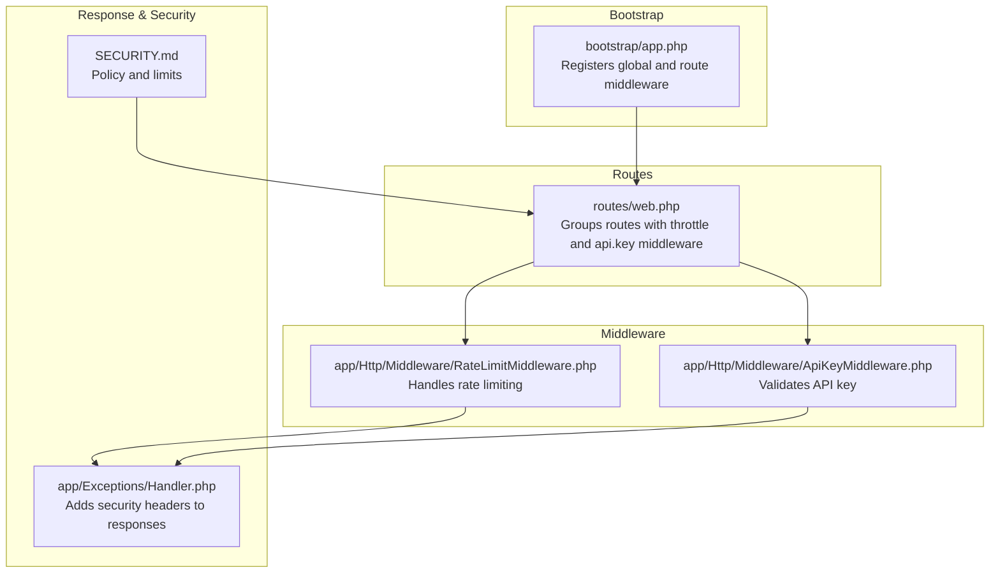
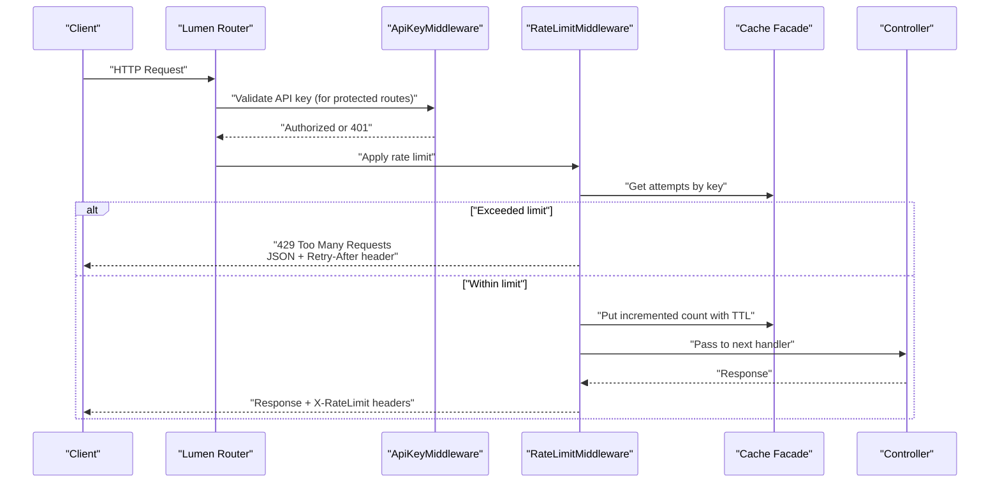
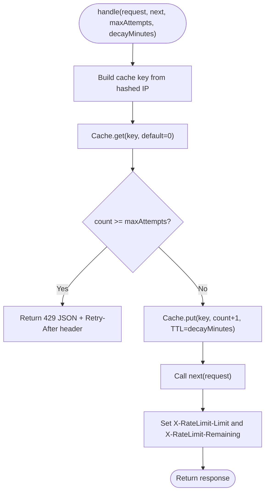
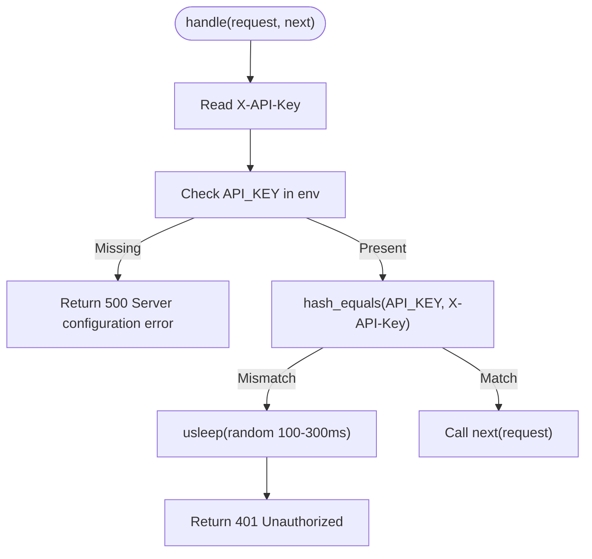
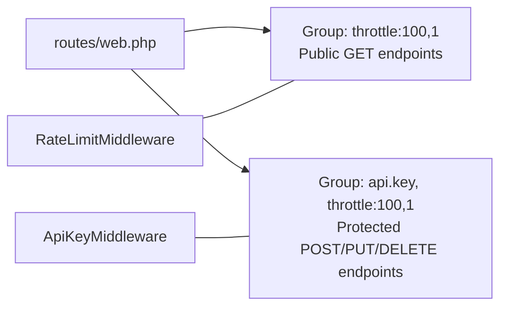
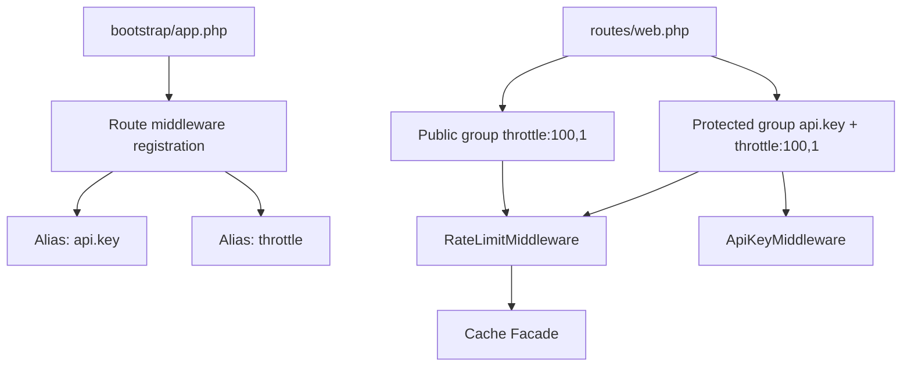

# Rate Limiting and Request Throttling

<cite>
**Referenced Files in This Document**
- [RateLimitMiddleware.php](file://app/Http/Middleware/RateLimitMiddleware.php)
- [ApiKeyMiddleware.php](file://app/Http/Middleware/ApiKeyMiddleware.php)
- [app.php](file://bootstrap/app.php)
- [web.php](file://routes/web.php)
- [Handler.php](file://app/Exceptions/Handler.php)
- [SECURITY.md](file://SECURITY.md)
</cite>

## Table of Contents
1. [Introduction](#introduction)
2. [Project Structure](#project-structure)
3. [Core Components](#core-components)
4. [Architecture Overview](#architecture-overview)
5. [Detailed Component Analysis](#detailed-component-analysis)
6. [Dependency Analysis](#dependency-analysis)
7. [Performance Considerations](#performance-considerations)
8. [Troubleshooting Guide](#troubleshooting-guide)
9. [Conclusion](#conclusion)
10. [Appendices](#appendices)

## Introduction
This document explains the rate limiting and request throttling system implemented in the API. It covers how the RateLimitMiddleware tracks requests using the Cache facade, how cache keys are generated, and how expiration policies are applied. It also documents the 100 requests per minute limit configuration, Retry-After header responses, and cache-based request counting. The integration with API key middleware for per-key scenarios and global rate limiting is explained. Guidance is included on cache configuration, memory management, scaling, client handling of throttled responses, monitoring approaches, performance optimizations, cache invalidation strategies, and troubleshooting.

## Project Structure
The rate limiting system spans middleware registration, route grouping with middleware, and response handling. The following diagram maps the relevant files and their roles.

**Diagram sources**
- [app.php:21-30](file://bootstrap/app.php#L21-L30)
- [web.php:13-76](file://routes/web.php#L13-L76)
- [web.php:78-164](file://routes/web.php#L78-L164)
- [RateLimitMiddleware.php:15-39](file://app/Http/Middleware/RateLimitMiddleware.php#L15-L39)
- [ApiKeyMiddleware.php:14-39](file://app/Http/Middleware/ApiKeyMiddleware.php#L14-L39)
- [Handler.php:36-132](file://app/Exceptions/Handler.php#L36-L132)
- [SECURITY.md:17-22](file://SECURITY.md#L17-L22)

**Section sources**
- [app.php:21-30](file://bootstrap/app.php#L21-L30)
- [web.php:13-76](file://routes/web.php#L13-L76)
- [web.php:78-164](file://routes/web.php#L78-L164)
- [SECURITY.md:17-22](file://SECURITY.md#L17-L22)

## Core Components
- RateLimitMiddleware: Implements per-IP request counting using the Cache facade, enforces a configurable limit and decay window, and returns a 429 response with Retry-After when exceeded. It also adds X-RateLimit-* headers to downstream responses.
- ApiKeyMiddleware: Validates the presence and correctness of the API key header using a timing-safe comparison and returns 401 Unauthorized when invalid.
- Route groups: Public endpoints are protected with throttle:100,1. Protected write endpoints are protected with both api.key and throttle:100,1.
- Response security: The exception handler ensures security headers are present on error responses.

Key behaviors:
- Cache key generation: Uses a hashed IP address to uniquely identify clients.
- Expiration policy: Each increment sets a TTL equal to the decay window.
- Retry-After: Provided both in JSON payload and as a Retry-After header.
- Headers: X-RateLimit-Limit and X-RateLimit-Remaining are set on successful responses.

**Section sources**
- [RateLimitMiddleware.php:15-39](file://app/Http/Middleware/RateLimitMiddleware.php#L15-L39)
- [RateLimitMiddleware.php:41-47](file://app/Http/Middleware/RateLimitMiddleware.php#L41-L47)
- [web.php:13-76](file://routes/web.php#L13-L76)
- [web.php:78-164](file://routes/web.php#L78-L164)
- [Handler.php:36-132](file://app/Exceptions/Handler.php#L36-L132)

## Architecture Overview
The rate limiting architecture integrates middleware with routing and caching. The sequence below shows how a request flows through the system.

**Diagram sources**
- [web.php:13-76](file://routes/web.php#L13-L76)
- [web.php:78-164](file://routes/web.php#L78-L164)
- [ApiKeyMiddleware.php:14-39](file://app/Http/Middleware/ApiKeyMiddleware.php#L14-L39)
- [RateLimitMiddleware.php:15-39](file://app/Http/Middleware/RateLimitMiddleware.php#L15-L39)

## Detailed Component Analysis

### RateLimitMiddleware
- Purpose: Enforce a sliding-window-like rate limit per client IP.
- Key generation: Hashes the client IP to form a cache key.
- Counting: Retrieves current attempts from cache; increments and re-applies TTL.
- Enforcement: Returns 429 with a JSON body containing a retry-after value and a Retry-After header when the threshold is reached.
- Headers: Adds X-RateLimit-Limit and X-RateLimit-Remaining to the response.

**Diagram sources**
- [RateLimitMiddleware.php:15-39](file://app/Http/Middleware/RateLimitMiddleware.php#L15-L39)

**Section sources**
- [RateLimitMiddleware.php:15-39](file://app/Http/Middleware/RateLimitMiddleware.php#L15-L39)
- [RateLimitMiddleware.php:41-47](file://app/Http/Middleware/RateLimitMiddleware.php#L41-L47)

### ApiKeyMiddleware
- Purpose: Authenticate requests for protected endpoints.
- Validation: Reads X-API-Key header and compares against the configured API key using a timing-safe comparison.
- Failure handling: Returns 401 Unauthorized and introduces a small randomized delay to mitigate brute-force attempts.

**Diagram sources**
- [ApiKeyMiddleware.php:14-39](file://app/Http/Middleware/ApiKeyMiddleware.php#L14-L39)

**Section sources**
- [ApiKeyMiddleware.php:14-39](file://app/Http/Middleware/ApiKeyMiddleware.php#L14-L39)

### Route Grouping and Middleware Application
- Public read-only endpoints: Grouped under throttle:100,1.
- Protected write endpoints: Grouped under both api.key and throttle:100,1.
- The throttle parameter format is throttle:maxAttempts,decayMinutes.

**Diagram sources**
- [web.php:13-76](file://routes/web.php#L13-L76)
- [web.php:78-164](file://routes/web.php#L78-L164)
- [app.php:27-30](file://bootstrap/app.php#L27-L30)

**Section sources**
- [web.php:13-76](file://routes/web.php#L13-L76)
- [web.php:78-164](file://routes/web.php#L78-L164)
- [app.php:27-30](file://bootstrap/app.php#L27-L30)

### Response Security Headers
- The exception handler ensures security headers are attached to all error responses, including CORS-related headers when appropriate.

**Section sources**
- [Handler.php:36-132](file://app/Exceptions/Handler.php#L36-L132)

## Dependency Analysis
- Middleware registration: Both ApiKeyMiddleware and RateLimitMiddleware are registered in the bootstrap file and mapped to route middleware aliases.
- Route dependencies: Public routes depend on throttle only; protected routes depend on both api.key and throttle.
- Cache dependency: RateLimitMiddleware depends on the Cache facade for counters and TTL management.

**Diagram sources**
- [app.php:27-30](file://bootstrap/app.php#L27-L30)
- [web.php:13-76](file://routes/web.php#L13-L76)
- [web.php:78-164](file://routes/web.php#L78-L164)
- [RateLimitMiddleware.php:15-39](file://app/Http/Middleware/RateLimitMiddleware.php#L15-L39)

**Section sources**
- [app.php:27-30](file://bootstrap/app.php#L27-L30)
- [web.php:13-76](file://routes/web.php#L13-L76)
- [web.php:78-164](file://routes/web.php#L78-L164)
- [RateLimitMiddleware.php:15-39](file://app/Http/Middleware/RateLimitMiddleware.php#L15-L39)

## Performance Considerations
- Cache backend selection:
  - The middleware comments indicate a fallback to file cache when Redis is unavailable. For high-traffic environments, prefer Redis or Memcached to avoid filesystem contention and improve throughput.
- Memory management:
  - Each client IP maintains a cache entry with a TTL equal to the decay window. Monitor memory usage and configure cache eviction policies accordingly.
- Scaling:
  - Use a shared cache backend (Redis/Memcached) across instances to ensure consistent rate limits.
  - Consider sharding by key prefixes or using distributed counters if centralized cache becomes a bottleneck.
- Latency:
  - Minimize cache round-trips by batching counters when feasible and avoiding excessive logging during throttling events.
- CPU overhead:
  - SHA-1 hashing of IPs is lightweight; the primary cost is cache operations.

[No sources needed since this section provides general guidance]

## Troubleshooting Guide
Common issues and resolutions:
- Unexpected 429 responses:
  - Verify the client IP is not being rate limited by checking cache entries for the hashed IP key and their TTLs.
  - Confirm the throttle parameter matches expectations (e.g., throttle:100,1).
- Missing Retry-After:
  - Ensure the middleware executes and returns the 429 response with Retry-After header.
- API key failures:
  - Confirm the X-API-Key header is present and matches the configured API key using a timing-safe comparison.
  - Check for randomized delays introduced on invalid attempts.
- Security headers missing:
  - Ensure the exception handler is registered and active so that security headers are attached to error responses.

Monitoring approaches:
- Log rate limit events (exceeding thresholds) for alerting and analysis.
- Track X-RateLimit-Remaining to detect clients approaching limits.
- Observe Retry-After usage on clients to validate compliance.

**Section sources**
- [RateLimitMiddleware.php:22-28](file://app/Http/Middleware/RateLimitMiddleware.php#L22-L28)
- [RateLimitMiddleware.php:35-38](file://app/Http/Middleware/RateLimitMiddleware.php#L35-L38)
- [ApiKeyMiddleware.php:19-36](file://app/Http/Middleware/ApiKeyMiddleware.php#L19-L36)
- [Handler.php:36-132](file://app/Exceptions/Handler.php#L36-L132)

## Conclusion
The rate limiting system provides robust protection against abuse and DDoS by enforcing per-IP limits with cache-backed counters. Public endpoints are protected with a 100 requests per minute limit, while protected endpoints combine API key validation with the same limit. The implementation leverages the Cache facade for simplicity and scalability when paired with a distributed cache backend. Proper configuration, monitoring, and client-side handling of Retry-After and rate limit headers ensure reliable operation under load.

[No sources needed since this section summarizes without analyzing specific files]

## Appendices

### Practical Examples of Rate Limiting Behavior
- Public GET endpoints:
  - Example: A client making repeated GET requests to /api/panggilan will be counted toward a 100 requests per minute limit per IP.
  - On exceeding the limit, the server responds with 429, a JSON body containing a retry-after value, and a Retry-After header.
- Protected POST/PUT/DELETE endpoints:
  - Example: A client must include a valid X-API-Key header and stay within the 100 requests per minute limit per IP.
  - On failure, the server responds with 401 Unauthorized (and a small randomized delay) or 429 Too Many Requests depending on the stage.

**Section sources**
- [web.php:13-76](file://routes/web.php#L13-L76)
- [web.php:78-164](file://routes/web.php#L78-L164)
- [SECURITY.md:17-22](file://SECURITY.md#L17-L22)

### Client-Side Handling of Throttled Responses
- Read Retry-After:
  - Use the Retry-After header value (in seconds) to delay subsequent requests.
- Respect X-RateLimit-Remaining:
  - Adjust client-side request pacing based on remaining quota.
- Backoff strategy:
  - Implement exponential backoff when encountering 429 responses.

[No sources needed since this section provides general guidance]

### Cache Configuration Requirements and Scaling Implications
- Backend recommendation:
  - Use Redis or Memcached for shared, low-latency counters across instances.
- File cache caveats:
  - Suitable for development or single-instance deployments; expect contention and reduced throughput under load.
- Memory and TTL:
  - Configure cache TTL equal to the decay window and monitor memory footprint.
- Horizontal scaling:
  - Ensure all instances point to the same cache cluster to maintain consistent rate limits.

[No sources needed since this section provides general guidance]

### Cache Invalidation Strategies
- Natural expiration:
  - Rely on TTL to expire counters after the decay window.
- Manual invalidation:
  - Optionally clear a client’s key upon successful authentication or reset after prolonged inactivity.

[No sources needed since this section provides general guidance]