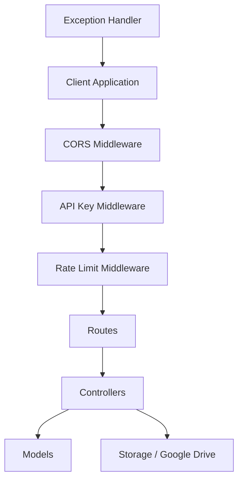
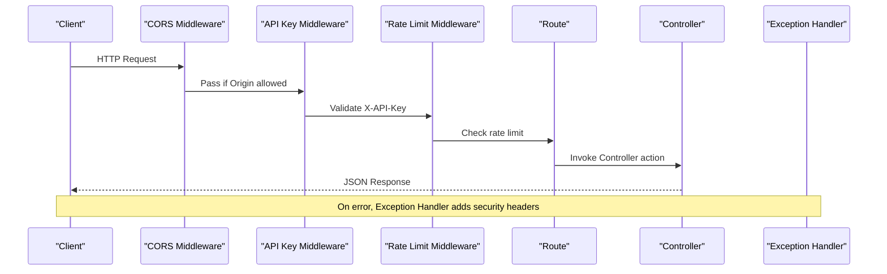
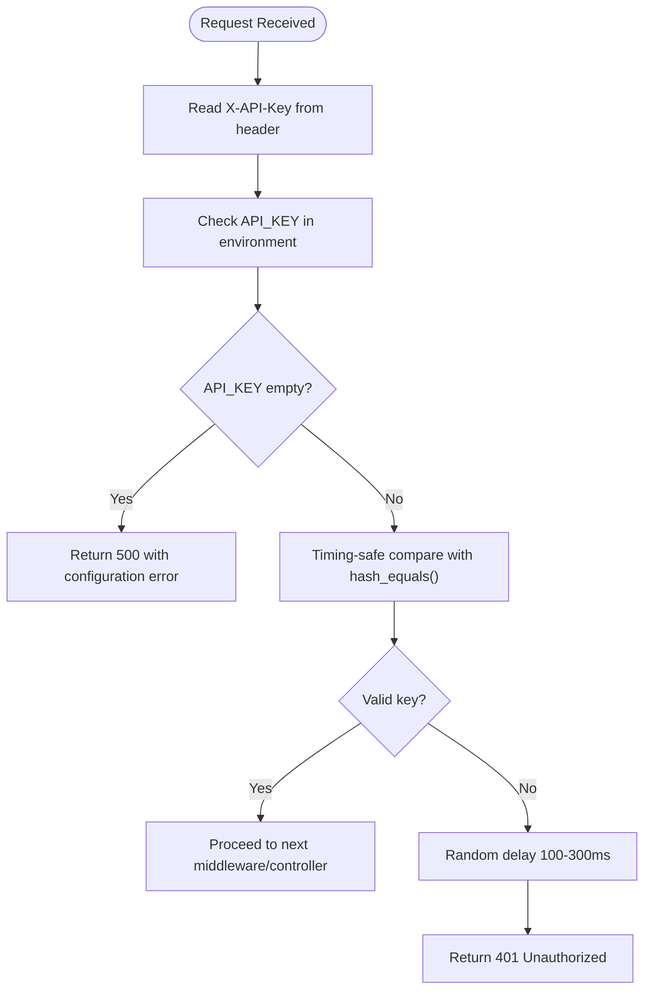
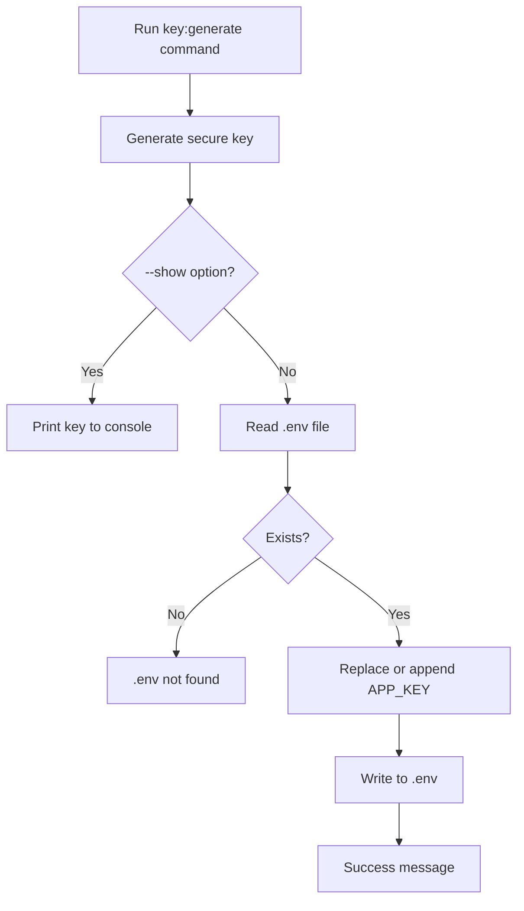
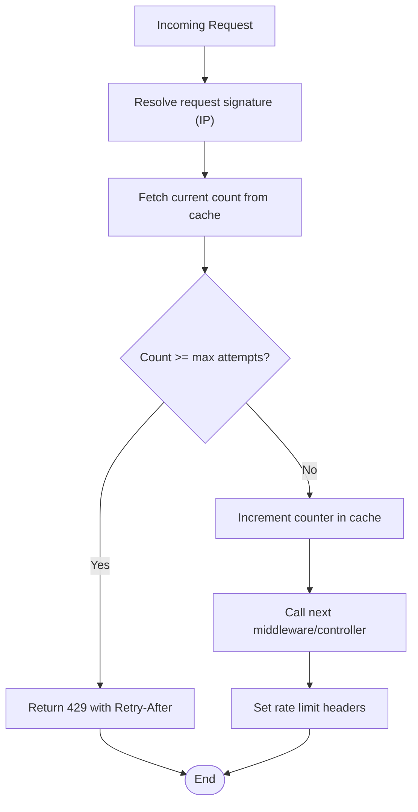
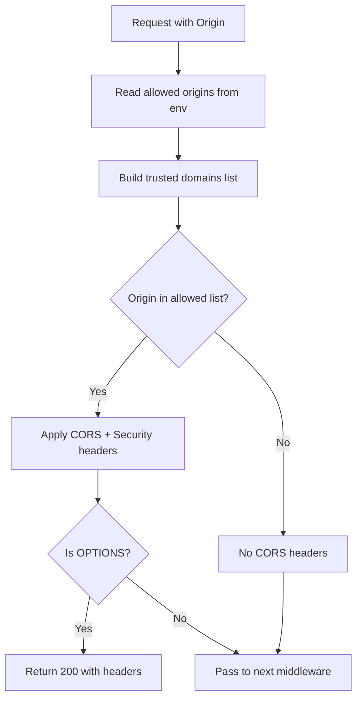
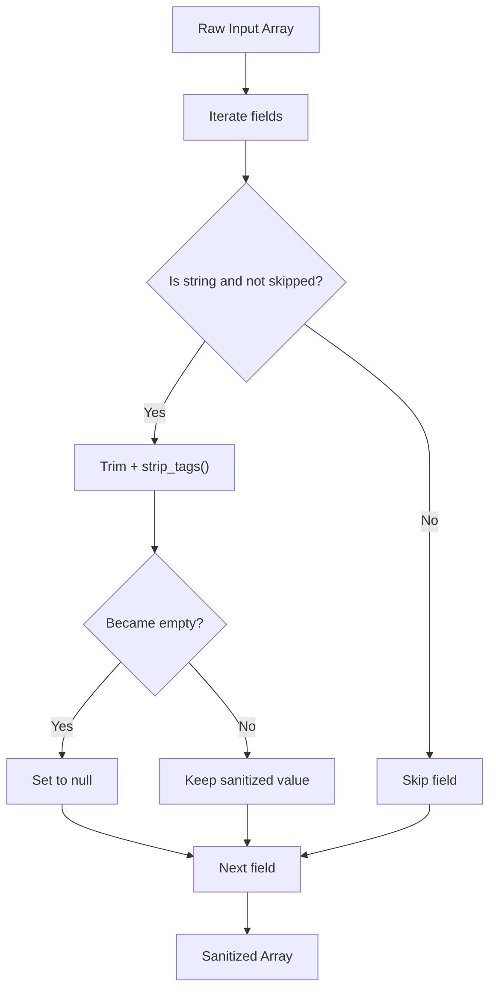
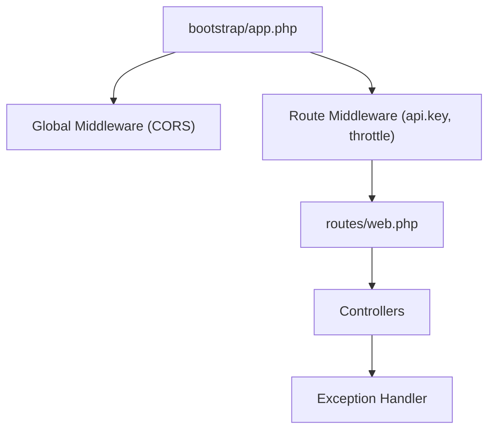

# Security Implementation

<cite>
**Referenced Files in This Document**
- [KeyGenerateCommand.php](file://app/Console/Commands/KeyGenerateCommand.php)
- [ApiKeyMiddleware.php](file://app/Http/Middleware/ApiKeyMiddleware.php)
- [RateLimitMiddleware.php](file://app/Http/Middleware/RateLimitMiddleware.php)
- [CorsMiddleware.php](file://app/Http/Middleware/CorsMiddleware.php)
- [Handler.php](file://app/Exceptions/Handler.php)
- [app.php](file://bootstrap/app.php)
- [Controller.php](file://app/Http/Controllers/Controller.php)
- [PanggilanController.php](file://app/Http/Controllers/PanggilanController.php)
- [LhkpnController.php](file://app/Http/Controllers/LhkpnController.php)
- [GoogleDriveService.php](file://app/Services/GoogleDriveService.php)
- [web.php](file://routes/web.php)
- [SECURITY.md](file://SECURITY.md)
- [composer.json](file://composer.json)
</cite>

## Table of Contents
1. [Introduction](#introduction)
2. [Project Structure](#project-structure)
3. [Core Components](#core-components)
4. [Architecture Overview](#architecture-overview)
5. [Detailed Component Analysis](#detailed-component-analysis)
6. [Dependency Analysis](#dependency-analysis)
7. [Performance Considerations](#performance-considerations)
8. [Troubleshooting Guide](#troubleshooting-guide)
9. [Conclusion](#conclusion)
10. [Appendices](#appendices)

## Introduction
This document provides comprehensive security documentation for the Lumen API backend. It covers authentication via API keys, authorization enforcement, rate limiting, CORS configuration, security headers, input sanitization, error handling, exception management, and security logging. It also includes practical examples of secure API consumption, common vulnerability mitigations, best practices for production deployment, performance considerations for security measures, and monitoring approaches for suspicious activities.

## Project Structure
The security implementation is distributed across several layers:
- Global middleware pipeline for CORS and error response headers
- Route-specific middleware for API key validation and rate limiting
- Base controller with input sanitization and file upload safeguards
- Exception handler ensuring consistent security headers on all responses
- Artisan command for secure application key generation
- Route definitions grouping public and protected endpoints with appropriate middleware

**Diagram sources**
- [app.php:21-30](file://bootstrap/app.php#L21-L30)
- [CorsMiddleware.php:14-62](file://app/Http/Middleware/CorsMiddleware.php#L14-L62)
- [ApiKeyMiddleware.php:14-39](file://app/Http/Middleware/ApiKeyMiddleware.php#L14-L39)
- [RateLimitMiddleware.php:15-39](file://app/Http/Middleware/RateLimitMiddleware.php#L15-L39)
- [web.php:13-164](file://routes/web.php#L13-L164)

**Section sources**
- [app.php:21-30](file://bootstrap/app.php#L21-L30)
- [web.php:13-164](file://routes/web.php#L13-L164)

## Core Components
- API Key Authentication: Enforced via a dedicated middleware that validates the X-API-Key header using timing-safe comparison and introduces randomized delays on failures.
- Rate Limiting: Implemented using the Cache facade to track attempts per IP address with configurable limits and Retry-After headers.
- CORS Security: Strict origin whitelisting with security headers and preflight handling.
- Input Sanitization: Base controller sanitizes string inputs to mitigate XSS risks.
- Exception Management: Centralized handler ensures consistent security headers and controlled error exposure.
- Secure Key Generation: Artisan command generates cryptographically secure keys and updates environment configuration safely.

**Section sources**
- [ApiKeyMiddleware.php:14-39](file://app/Http/Middleware/ApiKeyMiddleware.php#L14-L39)
- [RateLimitMiddleware.php:15-39](file://app/Http/Middleware/RateLimitMiddleware.php#L15-L39)
- [CorsMiddleware.php:14-62](file://app/Http/Middleware/CorsMiddleware.php#L14-L62)
- [Controller.php:18-29](file://app/Http/Controllers/Controller.php#L18-L29)
- [Handler.php:36-132](file://app/Exceptions/Handler.php#L36-L132)
- [KeyGenerateCommand.php:23-50](file://app/Console/Commands/KeyGenerateCommand.php#L23-L50)

## Architecture Overview
The security architecture enforces a layered defense:
- Global CORS middleware applies strict origin policies and security headers to all responses.
- Route groups apply API key and rate limiting middleware selectively to protected endpoints.
- Controllers implement input validation and sanitization, and secure file upload handling.
- Exception handler guarantees security headers on error responses and controlled error disclosure.

**Diagram sources**
- [CorsMiddleware.php:14-62](file://app/Http/Middleware/CorsMiddleware.php#L14-L62)
- [ApiKeyMiddleware.php:14-39](file://app/Http/Middleware/ApiKeyMiddleware.php#L14-L39)
- [RateLimitMiddleware.php:15-39](file://app/Http/Middleware/RateLimitMiddleware.php#L15-L39)
- [web.php:13-164](file://routes/web.php#L13-L164)
- [Handler.php:36-132](file://app/Exceptions/Handler.php#L36-L132)

## Detailed Component Analysis

### API Key Authentication System
- Header requirement: X-API-Key header is mandatory for protected routes.
- Configuration: API key is loaded from environment variable and validated against request header.
- Timing-safe comparison: Uses a constant-time comparison to prevent timing attacks.
- Brute-force mitigation: Introduces a randomized delay on invalid key attempts.
- Failure handling: Returns unauthorized response with JSON body and appropriate status code.

**Diagram sources**
- [ApiKeyMiddleware.php:14-39](file://app/Http/Middleware/ApiKeyMiddleware.php#L14-L39)

**Section sources**
- [ApiKeyMiddleware.php:14-39](file://app/Http/Middleware/ApiKeyMiddleware.php#L14-L39)
- [web.php:78-84](file://routes/web.php#L78-L84)

### Secure Key Generation (Artisan Command)
- Generates a cryptographically secure key using a secure random number generator.
- Writes the key to the environment file, replacing existing entries or appending if missing.
- Supports a read-only mode to display the generated key without modifying files.

**Diagram sources**
- [KeyGenerateCommand.php:23-50](file://app/Console/Commands/KeyGenerateCommand.php#L23-L50)

**Section sources**
- [KeyGenerateCommand.php:23-50](file://app/Console/Commands/KeyGenerateCommand.php#L23-L50)

### Rate Limiting Implementation
- Tracks request counts per IP address using cache with a configurable decay window.
- Returns 429 Too Many Requests with Retry-After header when limits are exceeded.
- Adds rate limit headers to responses for client awareness.
- Uses a stable identifier derived from the client IP to avoid bypass via User-Agent.

**Diagram sources**
- [RateLimitMiddleware.php:15-39](file://app/Http/Middleware/RateLimitMiddleware.php#L15-L39)

**Section sources**
- [RateLimitMiddleware.php:15-39](file://app/Http/Middleware/RateLimitMiddleware.php#L15-L39)
- [web.php:14](file://routes/web.php#L14)

### CORS Middleware Configuration
- Strict origin whitelisting: Only origins configured in environment and trusted domains are allowed.
- Security headers: Applies X-Content-Type-Options, X-Frame-Options, and X-XSS-Protection.
- Preflight handling: Properly handles OPTIONS preflight requests.
- Vary header: Ensures correct caching behavior for different origins.

**Diagram sources**
- [CorsMiddleware.php:14-62](file://app/Http/Middleware/CorsMiddleware.php#L14-L62)

**Section sources**
- [CorsMiddleware.php:14-62](file://app/Http/Middleware/CorsMiddleware.php#L14-L62)

### Security Headers Implementation
- Consistent headers: X-Content-Type-Options, X-Frame-Options, X-XSS-Protection applied to all responses.
- Origin-aware CORS: Access-Control-Allow-Origin and Vary headers included when applicable.
- Error responses: Security headers are ensured even on exceptions to prevent header omission.

**Section sources**
- [Handler.php:36-132](file://app/Exceptions/Handler.php#L36-L132)

### Input Sanitization Patterns
- Base controller sanitizes string inputs by trimming and removing HTML tags, with skip lists for fields requiring raw content.
- Controllers apply validation rules and sanitize inputs prior to persistence.
- File uploads enforce MIME-type checks based on actual content to prevent executable file injection.

**Diagram sources**
- [Controller.php:18-29](file://app/Http/Controllers/Controller.php#L18-L29)

**Section sources**
- [Controller.php:18-29](file://app/Http/Controllers/Controller.php#L18-L29)
- [PanggilanController.php:117-136](file://app/Http/Controllers/PanggilanController.php#L117-L136)
- [LhkpnController.php:55-89](file://app/Http/Controllers/LhkpnController.php#L55-L89)

### Error Handling and Security Logging
- Controlled error exposure: Production hides internal exception details; development exposes them.
- Security headers on errors: Ensures consistent headers even when exceptions bypass middleware.
- Structured logging: Logs unhandled exceptions with contextual information for internal debugging.

**Section sources**
- [Handler.php:36-132](file://app/Exceptions/Handler.php#L36-L132)

### Practical Examples of Secure API Consumption
- Public endpoints: Accessible without API key; rate-limited to 100 requests per minute per IP.
- Protected endpoints: Require X-API-Key header; rate-limited to 100 requests per minute per IP.
- File uploads: Validate MIME types and sanitize filenames; fallback to local storage if cloud service fails.

**Section sources**
- [web.php:13-164](file://routes/web.php#L13-L164)
- [PanggilanController.php:115-198](file://app/Http/Controllers/PanggilanController.php#L115-L198)
- [LhkpnController.php:55-136](file://app/Http/Controllers/LhkpnController.php#L55-L136)

### Common Security Vulnerabilities and Mitigations
- Timing attacks: Prevented by timing-safe comparison in API key validation.
- Brute force: Mitigated by randomized delays on invalid key attempts.
- XSS: Prevented by input sanitization and security headers.
- CSRF: Not applicable for stateless APIs; ensure tokens are not required for read-only endpoints.
- Insecure direct object references: Prevented by input validation and route constraints.
- Insecure file uploads: Mitigated by MIME-type validation and random filename generation.

**Section sources**
- [ApiKeyMiddleware.php:27-30](file://app/Http/Middleware/ApiKeyMiddleware.php#L27-L30)
- [Controller.php:18-29](file://app/Http/Controllers/Controller.php#L18-L29)
- [PanggilanController.php:138-189](file://app/Http/Controllers/PanggilanController.php#L138-L189)

### Best Practices for Production Deployment
- Environment configuration: Disable debug mode, set production environment, configure strict CORS origins, and use a strong API key.
- Infrastructure: Enable HTTPS, restrict file permissions, and ensure secrets are not exposed.
- Monitoring: Track rate limit hits, unauthorized access attempts, and upload rejections.

**Section sources**
- [SECURITY.md:54-84](file://SECURITY.md#L54-L84)

## Dependency Analysis
The security middleware and handlers are registered globally and per-route, ensuring consistent enforcement across the application.

**Diagram sources**
- [app.php:21-30](file://bootstrap/app.php#L21-L30)
- [web.php:13-164](file://routes/web.php#L13-L164)
- [Handler.php:36-132](file://app/Exceptions/Handler.php#L36-L132)

**Section sources**
- [app.php:21-30](file://bootstrap/app.php#L21-L30)
- [web.php:13-164](file://routes/web.php#L13-L164)

## Performance Considerations
- Cache-backed rate limiting: Efficient for moderate traffic; consider external cache (e.g., Redis) for high-scale deployments.
- Timing-safe comparisons: Minimal CPU overhead; negligible impact on latency.
- Randomized delays: Reduce brute-force attempts but add minor variability to response times.
- File uploads: Cloud storage reduces server load; local fallback maintains availability.
- Security headers: Negligible overhead; applied consistently to all responses.

[No sources needed since this section provides general guidance]

## Troubleshooting Guide
- API key errors: Verify environment configuration and ensure the X-API-Key header matches the configured value.
- Rate limit exceeded: Check Retry-After header and reduce request frequency; review cache configuration.
- CORS blocked: Confirm the requesting origin is in the allowed list and environment variables are set correctly.
- Unexpected errors: Review logs for structured error entries; ensure exception handler is registered.

**Section sources**
- [ApiKeyMiddleware.php:14-39](file://app/Http/Middleware/ApiKeyMiddleware.php#L14-L39)
- [RateLimitMiddleware.php:22-28](file://app/Http/Middleware/RateLimitMiddleware.php#L22-L28)
- [CorsMiddleware.php:42-49](file://app/Http/Middleware/CorsMiddleware.php#L42-L49)
- [Handler.php:101-107](file://app/Exceptions/Handler.php#L101-L107)

## Conclusion
The Lumen API backend implements a robust, layered security model with API key authentication, strict rate limiting, CORS whitelisting, input sanitization, and consistent security headers. The centralized exception handler ensures secure error responses, while the artisan command supports secure key generation. Adhering to production best practices and monitoring logs will further strengthen the system’s resilience against common threats.

[No sources needed since this section summarizes without analyzing specific files]

## Appendices

### Endpoint Security Matrix
- Public endpoints: Read-only, throttled at 100 requests per minute per IP.
- Protected endpoints: Require API key, throttled at 100 requests per minute per IP.

**Section sources**
- [SECURITY.md:88-98](file://SECURITY.md#L88-L98)
- [web.php:13-164](file://routes/web.php#L13-L164)

### Security Logging Fields
- Unhandled exceptions: Exception class, message, file, and line number are logged for internal debugging.

**Section sources**
- [Handler.php:101-107](file://app/Exceptions/Handler.php#L101-L107)

### File Upload Security Controls
- MIME-type validation based on actual content.
- Randomized filenames to prevent enumeration.
- Fallback to local storage if cloud upload fails.

**Section sources**
- [Controller.php:40-95](file://app/Http/Controllers/Controller.php#L40-L95)
- [PanggilanController.php:138-189](file://app/Http/Controllers/PanggilanController.php#L138-L189)
- [GoogleDriveService.php:38-82](file://app/Services/GoogleDriveService.php#L38-L82)